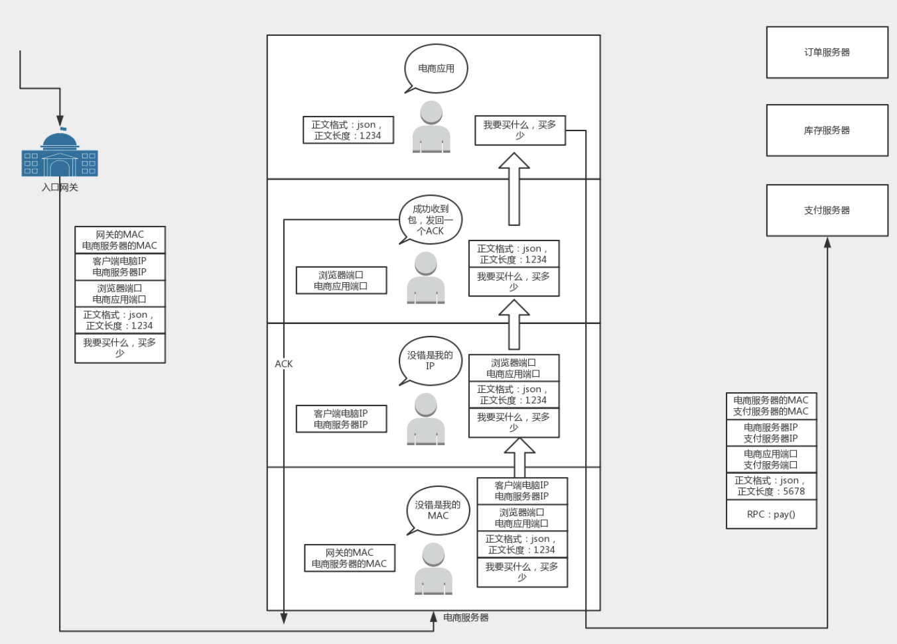

## 通信協議綜述

## #  第1講| 為什麼要學習網絡協議？

### |> 協議三要素

程式碼是一種協議，是人類和計算機溝通的協議，只有通過這種協議，計算機才知道我們想讓它做什麼。

當然，這種協議還是更接近人類語言，機器不能直接讀懂，需要進行翻譯，翻譯的工作教給編譯器，也就是compile。這個過程比較複雜，其中的編譯原理非常複雜，這裡不進行詳述。


計算機語言作為程序員控制一台計算機工作的協議，具備了協議的三要素。

- **語法**，“**如何講**”，就是這一段內容要符合一定的規則和格式。例如，括號要成對，結束要使用分號等。
- **語義**，“**講什麼**”，就是這一段內容要代表某種意義。例如數字減去數字是有意義的，數字減去文本一般來說就沒有意義。
- **順序**，“**先說啥**”，就是先做啥，後做啥。例如，可以先加上某個數值，然後再減去某個數值。

只教給一台機器做什麼是不夠的，你需要學會教給一大片機器做什麼。這就需要網絡協議。只有通過網絡協議，才能使一大片機器互相協作、共同完成一件事。

一個簡單的例子：

當你想要買一個商品，常規的做法就是打開瀏覽器，輸入購物網站的地址。瀏覽器就會給你顯示一個繽紛多彩的頁面。

它之所以能夠顯示繽紛多彩的頁面，是因為它收到了一段來自HTTP 協議的“東西”。格式就像下面這樣：

```
HTTP/1.1 200 OK
Date: Tue, 27 Mar 2018 16:50:26 GMT
Content-Type: text/html;charset=UTF-8
Content-Language: zh-CN
<!DOCTYPE html>
<html>
<head>
<base href="https://pages.kaola.com/" />
<meta charset="utf-8"/> <title> title </title>
```

這符合協議的三要素嗎？

- 首先，符合語法，也就是說，只有按照上面那個格式來，瀏覽器才認。例如，上來是狀態，然後是首部，然後是內容。
- 第二，符合語義，就是要按照約定的意思來。例如，狀態200，表述的意思是網頁成功返回。如果不成功，就是我們常見的“404”。
- 第三，符合順序，你一點瀏覽器，就是發送出一個HTTP 請求，然後才有上面那一串HTTP 返回的東西。 

瀏覽器顯然按照協議商定好的做了，最後一個五彩繽紛的頁面就出現在你面前了。

### |> 網路購物

我們常用的網絡協議有哪些？

> 應用層（是什麼、啥樣式）

1. 先在瀏覽器裡面輸入一個URL`https://www.kaola.com`。瀏覽器只知道名字是“ `www.kaola.com`”，但是不知道具體的地點 ---> 打開地址簿去查找。

   - 可以使用一般的地址簿協議`DNS`去查找，
   - 還可以使用另一種更加精準的地址簿查找協議`HTTPDNS`。

   最終都會得到這個地址：106.114.138.24。這個是IP地址，是網路世界的“門牌號”。

2. 知道了目標地址，瀏覽器就開始打包它的請求。

   - 對於普通的瀏覽請求，會使用HTTP協議；

   - 但是對於購物的請求，往往需要進行加密傳輸，因而會使用HTTPS協議。

   無論是什麼協議，裡面都會寫明“你要買什麼和買多少”。

   

   

   DNS、HTTP、HTTPS所在的層我們稱為`應用層`。

   經過應用層封裝後，瀏覽器會將應用層的包交給下一層去完成，通過socket編程來實現。下一層是傳輸層。

>傳輸層（怎處理）

3. 傳輸層有兩種協議，

   - 一種是無連接的協議UDP（發短信），

   - 一種是面向連接的協議TCP（打電話）。支付 --> 使用TCP協議。

     所謂的面向連接就是，TCP會保證這個包能夠到達目的地。如果不能到達，就會重新發送，直至到達。

     TCP協議裡面會有兩個端口，

     - 一個是瀏覽器監聽的端口，
     - 一個是電商的服務器監聽的端口。

     操作系統往往通過端口來判斷，它得到的包應該給哪個進程。

     傳輸層封裝完畢後，瀏覽器會將包交給操作系統的網絡層。

     

> 網絡層（交給誰）

4. 網絡層的協議是IP協議。

   - 在IP協議裡面會有源IP地址（即瀏覽器所在機器的IP地址）

   - 和目標IP地址（也即電商網站所在服務器的IP地址）。

     

   操作系統既然知道了目標IP地址，就開始想如何根據這個門牌號找到目標機器。

   - 如果目標IP地址是要離開本地去遠方：

     - 去外地就要去網關。而操作系統啟動的時候，就會被DHCP 協議配置IP 地址，以及默認的網關的IP 地址192.168.1.1。
     - 操作系統發送信息時將包含目標IP地址的ARP請求廣播到網絡上的所有主機，並接收返回消息，以此確定目標的物理MAC地址。

     

> MAC層（先去哪）

5. 於是操作系統將IP包交給了下一層，也就是MAC層。網卡再將包發出去。由於`這個包裡面是有MAC地址的，因而它能夠到達網關`。

6. 網關收到包之後，會根據自己的知識，判斷下一步應該怎麼走。

   - 網關是一個路由器，
   - 到某個IP 地址應該怎麼走，叫作路由表。

   1. 同一個局域網（國家）內部，都可以使用本地的地址MAC 進行通信。

   2. 一旦跨越城關，就需要拿出IP頭（通關文牒）來，裡面寫著就是源IP地址，欲往目標IP地址。 --->  詢問到哪裡應該怎麼走 ---> 路由協議，常用的有OSPF和BGP。
      - 每個城關都知道下一個城關怎麼走；
      - 最後一個城關知道這個網絡包要去的**目的地**（目標IP）。廣播詢問目標IP ，目標服務器就會回復一個MAC 地址。網絡包過關後，通過這個MAC 地址就能找到目標服務器。

7. 目標服務器發現MAC 地址對上了，取下MAC 頭來，發送給操作系統的網絡層。 發現IP 也對上了，就取下IP 頭。IP 頭里會寫上一層封裝的是TCP 協議，然後將其交給傳輸層，即TCP 層。

8. 在這TCP 層裡，對於收到的每個包，都會有一個回復的包說明收到了。

   - 這個回復的包僅僅是TCP 層的一個說明，即收到之後的回复。這個回復會原路返回。
   - 如果過一段時間還是沒到，發送端的TCP 層會重新發送這個包，還是上面的過程，直到有一天收到平安到達的回復。
   - 這個重試絕非你的瀏覽器重新將下單這個動作重新請求一次。
     - 對於瀏覽器來講，就發送了一次下單請求，TCP 層不斷自己悶頭重試。
     - 除非TCP 這一層出了問題，例如連接斷了，才輪到瀏覽器的應用層重新發送下單請求。

9. 當網絡包平安到達TCP層之後，TCP頭中有目標端口號，通過這個端口號，可以找到電商網站的進程正在監聽這個端口號，假設一個Tomcat，將這個包發給電商網站。

   

   

   電商網站的進程得到HTTP請求的內容，知道了要買東西，買多少。

   - 接待請求的這個Tomcat只是個接待員，負責統籌處理這個請求。
   - 例如，這個接待員要告訴專門管理訂單的進程，登記要買某個商品，買多少，要告訴管理庫存的進程，庫存要減少多少，要告訴支付的進程，應該付多少錢，等等。
   - 告訴相關的進程 ---> 通過RPC 調用，即遠程過程調用的方式來實現。
     - 遠程過程調用就是當告訴管理訂單進程的時候，接待員不用關心中間的網絡互連問題，會由RPC 框架統一處理。
     - RPC 框架有很多種，有基於HTTP 協議放在HTTP 的報文裡面的，有直接封裝在TCP 報文裡面的。

10. 當接待員發現相應的部門都處理完畢，就回復一個HTTPS 的包，告知下單成功。這個HTTPS 的包，會像來的時候一樣，經過千難萬險到達你的個人電腦，最終進入瀏覽器，顯示支付成功。


### |> 有IP地址為什麼還需要MAC地址？

[【网络协议】笔记一 | 为什么要学习网络协议？](https://blog.csdn.net/m0_37323771/article/details/81168498)

**IP地址可以變動，而MAC地址是唯一的。**
**IP是個人地址，MAC是個人身份證，地址可以變更，但身份證不行。**
**到達了個人地址還需要確認身份證，才能證明找的是本人。**

當網絡包到達一個城關的時候，可以通過路由表得到下一個城關的IP 地址，直接通過IP 地址找就可以了，為什麼還要通過本地的MAC 地址呢？

1. 局域網內IP地址是動態分配的，假如我是192.168.2.100，如果我下線了，可能IP就分配給了另一台電腦。IP和設備並不總是對應的，這對通信就產生了問題，但是MAC地址不同，MAC地址和設備是一一對應且全球唯一的。所以局域網使用MAC地址通信沒有問題。
2. 歷史遺留問題：早期的以太網只有交換機，沒有路由器，以太網內通過MAC地址通信。後來才有了互聯網，為了兼容原本的模式，採用了IP+MAC地址通信的方式。為啥不推到了重來呢？看看IPv6的處境你就知道了。所以是先有MAC地址後有的IP，IP的提出主要還是因為MAC地址本身的缺陷，這個問題換成有了MAC為何還要IP地址也很有意思。
3. 第一：MAC地址本身的缺陷：因為MAC地址是硬件提供商寫在網卡中的，MAC地址雖然唯一但是不能表明用戶在整個互聯網中的位置，除非維護一個超級大MAC地址對應表，那尋址效率肯定爆炸。但是IP地址解決了這個問題，因為IP地址是網絡提供商給你的，所以你在哪裡整個網絡都是知道的。
   第二：安全問題：獲取MAC地址是通過ARP協議來完成的，如果只用MAC地址通信，那麼廣播風暴是個難題。
4. 猜想：如果哪天每人一個固定的IPv6地址，那麼MAC地址+IPv4的模式是不是可以被替換了？
5. 其實手機通過數據上網就是一個通過類似mac尋址的一個網絡。在移動網絡中是允許你移動的，這是由於基站會記錄你的位置信息。並且核心網與公網的通信是通過ip來實現的，而在手機和基站間的通信是通過類似mac的一個唯一碼實現的。並且移動網絡整體建設成本比互聯網的成本高很多，消費也高很多。

> 為什麼mac地址是全世界唯一的？

**網卡MAC碼是由全球惟一的一個固定組織來分配的，未經認證和授權的廠家無權生產網卡**。
每塊網卡都有一個固定的卡號，並且任何正規廠家生產的網卡上都直接標明了卡號，一般為一組12位的16進制數。其中前6位代表網卡的生產廠商。後面的位數是設備號。當然在操作系統級別改Mac地址又是一種說法。

## #  第2講| 網絡分層的真實含義是什麼？

### |> 網絡為什麼要分層？

網絡為什麼要分層 ---> 因為是個複雜的程序都要分層，這是程序設計的要求, 涉及到架構和設計模式的問題，分層是各個模塊業務邏輯的職責劃分。

比如，複雜的電商還會分數據庫層、緩存層、Compose 層、Controller 層和接入層，每一層專注做本層的事情。

### |> 程序是如何工作的？

> 客戶端和服務器就像沒有天橋的雙子樓，要從A座的24層到達B座24層就得先下樓梯再上樓梯


**發送請求**：**封包**

1. 點擊網頁，發起HTTP請求,瀏覽器使用端口號發送。
2. 添加TCP頭，記錄下源端口號。瀏覽器給出目的端口號，一般為80端口。
3. 添加IP頭，記錄下源IP地址和目標IP地址。
4. 添加MAC 的頭，記錄下源MAC 地址和目標的MAC地址。目標MAC地址如果不知道，需要通過一定的協議處理過程（玄奘西行），找到MAC地址。不能空著。
5. 網口發出。

**接受請求**：**拆包**

1. 經過網口，首先先看看要不要請進來，處理一把。

2. 摘掉二層的頭，判斷mac地址是否是自己，不是則不接收。

3. 摘掉三層的頭，判斷IP地址是否是自己的，不是則轉發。

4. 判斷地址是TCP還是UDP進行不同的邏輯處理。

   - 假設這個地址是TCP的，則會調用process_tcp(buffer)。

     這時候，Buffer裡面沒有三層的頭，就需要查看四層的頭，看這是一個發起，還是一個應答，又或者是一個正常的數據包，然後分別由不同的邏輯進行處理。

     - 如果是發起或者應答，接下來可能要發送一個回覆包；
     - 如果是一個正常的數據包，就需要交給上層了。判斷哪個應用處理，在四層的頭里面有端口號，不同的應用監聽不同的端口號。如果發現瀏覽器應用在監聽這個端口，那你發給瀏覽器就行了。至於瀏覽器怎麼處理，和你沒有關係。

5. 瀏覽器解析HTML，顯示頁面。

### |> 揭秘層與層之間的關係

> IP層和MAC層所有機制都要運行一遍，封包下樓、拆包上樓

- **TCP發送每一個消息，都會帶著IP層和MAC層了。**

  因為，TCP每發送一個消息，IP層和MAC層的所有機制都要運行一遍。

- **記住**：只要是在網絡上跑的包，都是完整的。可以有下層沒上層，絕對不可能有上層沒下層。

  所以，對TCP協議來說，三次握手也好，重試也好，只要想發出去包，就要有IP層和MAC層，不然是發不出去的。

  所以如果一個HTTP 協議的包跑在網絡上，它一定是完整的。無論這個包經過哪些設備，它都是完整的。

  所謂的二層設備、三層設備，都是這些設備上跑的程序不同而已。一個HTTP 協議的包經過一個二層設備，二層設備收進去的是整個網絡包。這裡面HTTP、TCP、 IP、 MAC 都有。什麼叫二層設備呀，就是只把MAC 頭摘下來，看看到底是丟棄、轉發，還是自己留著。那什麼叫三層設備呢？就是把MAC頭摘下來之後，再把IP 頭摘下來，看看到底是丟棄、轉發，還是自己留著。

**如同跨越沒有天橋的雙子樓，從A棟的4樓跑去B棟的4樓都需要經過下樓、上樓的步驟，把4樓以下的樓層跑一次。**

- 網絡程序分層處理，下樓封包、上樓拆包
- MAC地址對上就上樓，IP地址不對就從樓中丟出去
- 樓層（TCP）與對面樓層之間不能飛躍而過，該怎麼走就怎麼走


## #  第3講| 怎麼查看IP地址？

通常Windows是`ipconfig`，linux是`ifconfig`，而linux還可以使用`ip addr`查看

例如運行`ip addr`

```
root@test:~# ip addr
1: lo: &lt;LOOPBACK,UP,LOWER_UP&gt; mtu 65536 qdisc noqueue state UNKNOWN group default 
    link/loopback 00:00:00:00:00:00 brd 00:00:00:00:00:00
    inet 127.0.0.1/8 scope host lo
       valid_lft forever preferred_lft forever
    inet6 ::1/128 scope host 
       valid_lft forever preferred_lft forever
2: eth0: &lt;BROADCAST,MULTICAST,UP,LOWER_UP&gt; mtu 1500 qdisc pfifo_fast state UP group default qlen 1000
    link/ether fa:16:3e:c7:79:75 brd ff:ff:ff:ff:ff:ff
    inet 10.100.122.2/24 brd 10.100.122.255 scope global eth0
       valid_lft forever preferred_lft forever
    inet6 fe80::f816:3eff:fec7:7975/64 scope link 
       valid_lft forever preferred_lft forever12345678910111213
```

這個命令顯示了這台機器上所有的網卡。大部分的網卡都會有一個IP地址，但這不是必須的。

### |> IP地址

**IP地址是一個網卡在網絡世界的通訊地址，相當於我們現實世界的門牌號碼。**
既然是門牌號碼，就不能一樣起衝突，否則那快遞就找不到地方了。

> IP4

如上輸出的結果，`10.100.122.2`就是一個IP地址。這個地址被點分隔為四個部分，每個部分8個bit，所以IP地址總共是32位，總數量42 9496 7296（即2 32 2^{32}23 2, 42億）個。但其實根本不夠用，

> IP6

於是就有了**IPv6**地址，也就是上面輸出結果裡面`inet6 fe80::f816:3eff:fec7:7975/64`，總共有128位，一般採用32個十六進制數，例如: `2001:0db8:85a3:0000:1319:8a2e:0373:7344`，可以想像總共有1 6 32 16^{32}1 63 2個。

IPv6地址由兩個邏輯部分組成：一個64位的網路前綴和一個64位的主機地址，主機地址通常根據物理地址生成，叫做`EUI-64`(或者64-位擴展唯一標識)。

### |> IP4地址分類


**網絡號**：用於識別主機所在的網絡；**主機號**：用於識別該網絡中的主機。

- **A類**，保留給政府機構

- **B類**，分配給中等規模的公司

- **C類**，分配給任何需要的人

- **D類**，用於組播

  使用這一類地址，屬於某個組的機器都能收到。這有點類似在公司裡面大家都加入了一個郵件組。發送郵件，加入這個組的都能收到。組播地址在後面講述`VXLAN`協議的時候會提到。

- **E類**，用於實驗，各類可容納的地址數目不同

在網絡地址中，至少在當時設計的時候，對於A、B、 C 類主要分兩部分，前面一部分是網絡號，後面一部分是主機號。網絡號＝同社區，主機號＝不同棟。

下面這個表格，詳細地展示了A、B、C三類地址所能包含的主機的數量

| 類別 | IP地址範圍                | 最大主機數 | 私有IP地址範圍              |
| ---- | ------------------------- | ---------- | --------------------------- |
| A    | 0.0.0.0-127.255.255.255   | 1 677 7214 | 10.0.0.0-10.255.255.255     |
| B    | 128.0.0.0-191.255.255.255 | 6 5534     | 172.16.0.0-172.31.255.255   |
| C    | 192.0.0.0-223.255.255.255 | 254        | 192.168.0.0-192.168.255.255 |

這裡拿C類地址說明，C類地址主機號是8位，也就2的8次方應該是256個主機，但能連卻只有254，這是因為還有一個是廣播地址，一個是路由地址，所以少了2個！比如192.168.0.255用於192.168.0.段的廣播了，而192.168.0.0分配成你的路由器地址了，所以機子少了2個。

而B類地址能包含的最大主機數量又太多了。6萬多台機器放在一個網絡下面，一般的企業基本達不到這個規模，閒著的地址就是浪費。

1. IP地址分為五大類，但C類的主機太少，而B類的太多，彌補IP設計者分類錯誤 ---> 於是就有了CIDR重構規則，以解決地址耗盡

2. 低估了未來網絡的發展，32位地址不夠用。---> 於是有了現在IPv6（128位） 

### |> CIDR(Classless Inter Domain Routing，無類型域間選路)

**特點**

- CIDR主要是為了更有效分配和管理IPv4地址，消除傳統的A，B，C地址和劃分子網的概念，CIDR使IP地址又回到無分類的兩級編碼，將32位的IP地址一分為二，前面是`網絡號`，後面是`主機號`。
  - 例子：10.100.122.2/24，這個IP地址中有一個斜杠，斜杠後面有個數字24。這種地址表示形式，就是CIDR。後面24的意思是，32位中，前24位是網絡號，後8位是主機號。
- CIDR把網絡前綴都相同的連續IP地址組成一個“CIDR地址塊”，即強化路由聚合。----->（構成超網：CIDR聚合多個子網地址合成一個超網地址以減少核心路由器運載，使能夠更自由的分配主機數)

在使用CIDR中，在查找路由表時可能會得到不止一個匹配結果，這時應當從匹配結構中選擇具有最長網絡前綴的路由，因為網絡前綴越長，其地址塊就越小，因而路由就越具體。

伴隨著CIDR存在的，

- 一個是**廣播地址**，`10.100.122.255`。如果發送這個地址，所有`10.100.122`網絡裡面的機器都可以收到 ( 所有以10.100.122…開頭的機器都能收到 )。
- 另一個是**網路遮罩(子網掩碼)**255.255.255.0。
  - Ａ類的默認網路遮罩255.0.0.0　
    Ｂ類的默認網路遮罩255.255.0.0　
    Ｃ類的默認網路遮罩255.255.255.0　

>子網掩碼是為了區分網絡位和主機位，上面我們說到過，一個ip地址是由 **網絡部分** 和 **主機部分。**正如一個人的名字由姓與名組成。
>
>那麼我們可以把IP位址比作一個人的名字，那么子網掩碼就像是一份名單，可以快速的知道那些人同姓，那些人不同姓，把同姓的人分在一組，讓他們之前可以互相交流。

將網路遮罩和IP地址按位計算AND，就可得到網絡號。

- 將子網掩碼和IP地址進行AND計算。前面三個255，轉成二進制都是1。1和任何數值取AND，都是原來數值，因而前三個數不變，為10.100.122。後面一個0，轉換成二進制是0，0和任何數值取AND，都是0，因而最後一個數變為0，合起來就是`10.100.122.0`。這就是**網絡號**。

**IP地址和子網掩碼都轉換為二進製做邏輯與運算的結果為本網段的網絡號，是區分不同網段的方法**。

例：
192.168.1.1（11000000.10101000.00000001.00000001）
255.255.255.0（11111111.11111111.11111111.00000000）
兩個做與運算：
11000000.10101000.00000001.00000000（192.168.1.0）
即192.168.1.0為本網段的網絡號

### |> 無類別區隔路由CIDR技術 依需求善用有限IP位址

[無類別區隔路由CIDR技術 依需求善用有限IP位址](https://www.netadmin.com.tw/netadmin/zh-tw/technology/0B9B631F987A45439061B6629F63DD07)

> IP4位址的相關知識

````
172.16.0.0
````

- 這是由32個位元、每8個位元用一個十進位的數字來表示，所以一共有4個數字。
- 一般來說，會依據位元組（8個位元）的個數來區隔成不同類型（Class）的網 路，不同類型的網路可以容納不同數量的IP位址 數目。
- 例如，若使用8個位元來變化，以便於容納IP位址的話，就可以容納28個IP位址，也就是256個。若使用兩個位元組（就是16個位元）來做變化，就可以容納216個，也就是65,536個IP位址。以這樣的基礎的定址與路由，都稱之為Classful，也就是以類別為基礎的方式。

> 網路遮罩和IP位址表示方式

一般的寫法就如下面所示：

```
- 32個位元、每8個位元用一個十進位的數字來表示，所以一共有4個數字 + /網路遮罩的資訊
172.16.0.0/16

1. 網路位址是172.16.0.0
2. 後面的16則表示「網路遮罩的二進位表示法中，最後16個數字為0」(一個子網路環境)
```

將網路遮罩用二進位來表示，就相當於以下的表示方式：

```
11111111.11111111.00000000.00000000
```

最後16個都是0，若把這樣的網路遮罩轉換成十進位，也就是說，網路遮罩將為`255.255.0.0`。

> 網路位址（Network Address）、主機位址（Host Address）與廣播位址

以剛剛的子網路為例：

```
172.16.0.0/16
```

假設有一個IP位址172.16.32.4是位於這個子網路內，

- 則網路位址為172.16.0.0，

- 而主機位址即為172.16.32.4，

- 而廣播位址就是把後面主機位址的部分，在二進位的表示法中都為1，

  如果把172.16.0.0轉成二進位表示，則如下列所示：

  ```
  10101100.00010000.00000000.00000000
  ```

  因為知道遮罩數目為16，所以從後面數過來16個數字都是屬於主機位址可以分配的部分，因此這個網路的廣播位址就只要把這些主機位址可分配的部分都設定為1即可，也就是：

  ```
  10101100.00010000.11111111.11111111
  ```

  轉成十進位就是172.16.255.255。可以從這裡發現到，

  - 這個廣播位址是不能被拿來當成主機位址，
  - 當然網路位址也不能拿來當作主機位址，
  - 所以一個子網路中到底可以用多少個IP位址來當作主機位址呢？

> 子網路中所能使用的IP數量

<mark>網路遮罩用途 ---> 它能表示這個網路或子網路內可以使用的IP位址有多少。</mark>

> 將網路遮罩和IP地址進行AND計算
>
> 例：
> 192.168.1.1（11000000.10101000.00000001.00000001）
> 255.255.255.0（11111111.11111111.11111111.00000000）
> 兩個做與運算：
> 11000000.10101000.00000001.00000000（192.168.1.0）
> 即192.168.1.0為本網段的網絡號

從上面這個例子來看，由於網路遮罩是255.255.0.0，所以從二進位來看，它就是（不能變動的部分：前面16個1）：

```
11111111.11111111.00000000.00000000
```

這代表在分配IP位址時，

- 前面16個數字不能變動，而前面不能變動的就是使用網路位址的部分。
- 只有後面16個數字可以變動，

現在來看網路位址，在上面的範例中，網路位址是172.16.0.0，轉成二進位就是：

```
10101100.00010000.00000000.00000000
```

而能夠分配的IP位址為：

```
10101100.00010000.00000000.00000001
10101100.00010000.00000000.00000010
10101100.00010000.00000000.00000011
10101100.00010000.00000000.00000100
10101100.00010000.00000000.00000101
10101100.00010000.00000000.00000111
...
10101100.00010000.11111111.11111110
```

- 轉成十進位的話，就代表可使用的IP位址範圍為172.16.0.1到172.16.255.254。

  所以這個子網路中可以使用的IP數量為  2<sup>16</sup>-2，也就是 216-2=65534 個IP位址。減去兩個的部分分別是`172.16.0.0`與`172.16.255.255`這兩個IP位址，為什麼這兩個要減去呢？

  - 因為172.16.0.0已經被拿來使用成這個子網路的網路位址，
  - 而172.16.255.255是廣播位址，不能被拿來分配成一般IP位址使用。

#### CIDR重點1：多變長度子網路遮罩

一般而言，在切割子網路時，子網路遮罩都是切成類似255.255.255.0或255.255.0.0這樣的數字。

- 不過，這樣切割的話，雖然很容易使用，但可能會造成IP的浪費，因為不見得每個子網路中的IP使用量都是相同的。
- 就拿上面的範例來說，可以看到上面的子網路可以分配出65,534個IP位址，這也太多了吧？就算使用255.255.255.0這樣的網路遮罩，那子網路中的IP位址個數也有254個，也是不少。
- 假設有一個公司要為行政部門分配出20個IP位址，而要為開發部門分配出100個IP位址，則此時變成會使用到兩個子網路，而每個子網路的網路遮罩都是255.255.255.0，也就是每個子網路都可以分配254個IP位址。這樣的話，就已經浪費掉(254-20)+(254-100)個IP位址。如果大家都這樣使用，那還得了？就因為如此，才有多變長度子網路遮罩的出現。

`多變長度子網路遮罩（Variable-Length Subnet Mask，VLSM）是用來讓不同長度、不同類別（Class）的子網路能在同一個網路內存在並且運作`。所以，也就是說多變長度子網路遮罩能夠讓網路內的IP位址分配更加彈性化，也可以讓可用的IP位址個數增加。

##### 計算多變長度子網路遮罩的方式

舉例來說明如何計算多變長度子網路遮罩，可能會比較容易了解。假設有一個子網路是：

```
172.16.32.0/20
```

而現在想分割一個子網路是可以容納10台機器所使用，也就是要能夠分配10個IP位址。而由一開始對網路遮罩的介紹，應該就能夠算出172.16.32.0/20總共可以分配出的IP位址個數為：

```
2^(32-20)-2 = 4094
```

如果直接把172.16.32.0/20這個子網路拿來給這10個IP位址使用，實在是太浪費，因為只會用10個IP位址，其他4,084個IP位址都沒有使用到。

若是使用多變長度子網路遮罩，則能夠把172.16.32.0/20子網路分割成172.16.32.0/28，如此一來，將得到下列這些子網路：

```
10101100.00010000.00000000.00000000
176			.			 16.0000 0000.0000 0000

176.16.0010 0000.0000 0000 = 172.16.32.0/28
176.16.0010 0000.0001 0000 = 172.16.32.16/28
176.16.0010 0000.0010 0000 = 172.16.32.32/28
176.16.0010 0000.0011 0000 = 172.16.32.48/28
------------------- 網路遮罩 28 = 8+8+8+2
--------- 網路遮罩 20 = 8+8+2

這裡把位址的最後兩個數字用二進位表示，這樣比較容易計算
172.16 的部分算是網路位址
172.16.00 10 這些部分算是子網路的部分
172.16.0010 0000.0001 就已經結合了多變長度子網路遮罩，
---.--.---- ----.---- 0000 至於最後四個位元，則是用來分配IP位址給主機用。
```

所以，這樣分配之後，172.16.32.0/20一共可以分成256個多變長度子網路，256的計算方式如下：

```
2^(28-20) = 256
```

而每一個多變長度子網路皆可分配14個IP位址，其計算方式如下：

```
2^4 - 2 = 14
```

剛好符合原本的需求：「分割子網路來分配10個IP位址」。這樣分割之後，只會浪費4個IP位址，與原本會浪費四千多個IP位址比較起來，真的是差太多了。

##### IP位址分配的應用範例

現在，用另一個例子說明多變長度子網路遮罩如何讓網路管理人員更有效地規劃IP位址。假設現在分配到的網段是：

```
172.16.32.0/20
```

- 打算分配給四個不同的部門，每個部門都有自己的網段，
- 且每個部門的IP位址個數要55個。
- 每個部門必須有一個路由器負責連接到公司要連到外部WAN網路的路由器上，這之間的IP位址也必須在規劃之中。

首先，大略思考一下可能的網路架構圖應該是如何。因為要分配四個網段，而每個網段會有一個路由器必須連接到公司要連到外部WAN網路的路由器上（這是當然的，不然這些部門的機器就無法連出網路），因此網路架構圖應該如圖1所示。


而各網段的IP位址都還沒有填上去，這就是現在要做的工作。在這裡，所要規劃的IP位址部分包含：

````
部門 1,2,3,4  以及路由器 A,B,C,D 和路由器 S 之間的連線
````

由於知道每個部門都要規劃55個IP位址，所以下一個步驟就是決定多變長度子網路遮罩要用多少。表1整理出常用之不同的遮罩長度與所能分配的IP位址個數一覽表，可以直接查找。

**表1 不同的遮罩長度與所能分配的IP位址個數**

|              |                        |
| :----------: | :--------------------: |
| 網路遮罩長度 | 所能分配的 IP 地址個數 |
|      30      |           2            |
|      29      |           6            |
|      28      |           14           |
|      27      |           30           |
|      26      |           62           |
|      25      |          126           |
|      24      |          254           |

從這裡可以看出，網路遮罩長度不能超過30個，因為至少要保留網路位址及廣播位址，而還要能夠分配IP位址的話，網路遮罩最多只能到30個位數。由於打算能夠分配55個IP位址，所以由上面這個表格可以看出，至少必須使用26個位元當作網路遮罩。

由於所分配到的網段是：

```
172.16.32.0/20
						 |
前面20位屬於網路位址
```

所以轉換成二進位後即為：

```
屬於網路位址的部分 |
		 172.16.0010  0000.00000000/20

# 這裡稍微偷懶一下，只把後面的32.0轉換成二進位
```

屬於網路位址的部分，在這裡規劃時無法變更。而剛剛也計算出來所要使用的網路遮罩個數是26，所以可以把所能獲得的第一個網段分配給部門1，也就是：

```
屬於網路位址的部分 |
		 172.16.0010  0000.00000000/26 = 172.16.32.0/26
```

那第二段要怎麼計算呢？由於知道剛剛分配的遮罩數目是26，因此重新看一下剛剛所分配的子網路遮罩

```
10101100.00010000.00100000.00000000 = 172.16.32.0
176			.			 16.00100000.00000000 = 172.16.32.0

172.16.0010 0000.00 000000/26 = 172.16.32.0/26
***********					原本的子網路部分 20
						+++++++ VLSM的子網路部分 26-20=6
------------------- 屬於172.16.32.0/26網段的子網路（Subnet）
```

現在由於要計算下一個網段的位址，所以能動的是標示底線 (172.16.32.0/26網段的子網路) 的部分，因此

```
下一個要給部門2的子網路應該是：
172.16.0010	0000.01 000000/26 = 172.16.32.64/26
-------------------

而要給部門3的子網路是：
172.16.0010	0000.10 000000/26 = 172.16.32.128/26
------------------- 

同理，最後要給部門4的子網路則是：
172.16.0010 0000.11 000000/26 = 172.16.32.192/26
-------------------
```

現在，把這些已經分配好的子網路填到剛剛的網路架構圖中。


接下來，將要分配路由器A、B、C、D以及路由器S之間的IP位址。剛剛分配完四個部分後，172.16.32.0/24都不能使用了。所以，接下來可分配的第一組子網路可以是：

```
172.16.0010  0001.00000000 = 172.16.33.0


172.16.0010  0000.00000000 = 172.16.32.0/24
-----------------
```

再來，看看遮罩數目應該要多少。假設要先分配給路由器A和路由器S之間，則因為只需要分配兩個IP位址，一個給路由器A朝向路由器S的介面，另一個IP位址則分配給路由器S朝向路由器A的介面。

因此，至少要使用的遮罩是30，所以可以得知要分配的子網路是：

```
172.16.0010  0001.00000000/30 = 172.16.33.0/30
------------------------


同樣地，路由器B和路由器S之間的子網路就是下一段子網路位址：
172.16.0010  0001.00000100/30 = 172.16.33.4/30
------------------------

而路由器C和路由器S之間的子網路就是下一段子網路位址：
172.16.0010  0001.00001000/30 = 172.16.33.8/30
------------------------

路由器D和路由器S之間的子網路就是下一段子網路位址：
172.16.0010  0001.00001100/30 = 172.16.33.12/30
------------------------
```

現在，把這些子網路資訊加到剛剛的網路架構圖中，就完成了整個IP位址分配，如圖3所示。


#### CIDR重點2：路由匯總Route Summarization

路由匯總就是Route Summarization，又稱為Route Aggregation或是Super-netting。主要目的就是在於將多筆路由資訊匯總而成比較簡單的單筆路由資訊。

如果用實際生活的範例來解釋的話，可以這樣思考：

- 把信件想成是網路封包，地址就是IP位址，
- 路由當然就是各個郵差如何去運送這些信件的方式。

為了達到很好的效率，因此產生現在這樣的地址設計。

舉例來說，台北市分成各個區，有大安區、中正區、信義區等等，所以當郵差還沒有看到詳細的地址之前，可以先根據大區域先分類，然後再由各個區域的郵差去細部運送。同樣地，當其他縣市郵局看到是送往台北市的信件，也不用看細部的地址甚至於區域，直接先送往台北市負責的郵局（假設有一個台北市郵局先處理全部送往台北市的所有信件），這樣的設計會變得很有效率。路由匯總的設計原理跟這範例是類似的。

接著來看看這個例子，也許大家會比較容易了解路由匯總的用途和好處在哪裡。


- 在這個網路架構圖中，路由器X連接著兩個子網路，分別是172.16.32.0/24和172.16.128.0/24，
- 如果沒有路由匯總，則路由器X必須把這兩個子網路 中的路由資訊全部傳送給路由器Y，
- 如此一來，一旦這兩個子網路中有任何的改變，則路由器X都必須傳送相對應的路由資訊給路由器Y，這樣不僅增加太多網路負擔，要維護這些資料也是相當麻煩的事情。

如果再仔細看一下這個網路架構圖，

- 可以發現對於路由器Y而言，相當於「路由器X知道如何送到172.16.0.0/16這樣的網路區段」。
- 所以，以後一旦路由器Y收到相當於傳送給172.16.0.0/16這樣的目的地，就可以直接把這樣的封包傳送給路由器X，因為它知道怎麼傳送。
- 把172.16.32.0/24和172.16.128.0/24這兩個子網路路由資訊結合成一筆172.16.0.0/16的路由，就是路由匯總的功能。

Classless的路由協定（像是RIPv2、OSPF、IS-IS以及EIGRP路由協定等等）都有支援路由匯總，當然也支援VLSM，而Classful的路由協定（例如RIPv1和IGRP路由協定）則沒有支援路由匯總，因為已經自動做了相對應的匯總動作。

路由匯總的詳細資訊與運作方式，都被定義在RFC 1518之中（An Architecture for IP Address Allocation with CIDR），可前往查看並研讀。

##### 路由匯總的計算方式

了解路由匯總的目的與運作方式之後，應該就已經大略明白如何計算路由匯總的資料。不過，下面還是用例子來說明一下。假設有個路由器收到以下這些子網路的路由資訊更新：

```
172.16.168.0/24
172.16.169.0/24
172.16.170.0/24
172.16.171.0/24
172.16.172.0/24
172.16.173.0/24
172.16.174.0/24
172.16.175.0/24
...
```

那麼路由匯總之後的資料應該是如何呢？首先把這些資料轉成二進位：

```
172.16.168.0/24 = 10101100.00010000.10101 000.00000000
172.16.169.0/24 = 10101100.00010000.10101 001.00000000
172.16.170.0/24 = 10101100.00010000.10101 010.00000000
172.16.171.0/24 = 10101100.00010000.10101 011.00000000
172.16.172.0/24 = 10101100.00010000.10101 100.00000000
172.16.173.0/24 = 10101100.00010000.10101 101.00000000
172.16.174.0/24 = 10101100.00010000.10101 110.00000000
172.16.175.0/24 = 10101100.00010000.10101 111.00000000
```

轉換之後，很容易就可以發現，前面粗體字部分在這八個子網路當中都是一樣的，所以這些相同的部分就是路由匯總之後的結果，也就是：

```
10101100.00010000.10101 000.00000000 = 172.16.168.0
----------------------- 前面部分在這八個子網路當中都是一樣的，所以這些相同的部分就是路由匯總之後的結果

因為相同的部分有21個數字，所以遮罩就是21。因此，最後路由匯總的結果就是：
172.16.168.0/21
```

##### 多變長度子網路遮罩的路由匯總

以下面的網路架構圖為例，為大家說明多變長度子網路遮罩的路由匯總又是如何計算的。


- 假設路由器E、F以及路由器H會把路由資訊傳送給路由器G，
- 然後路由器G會把路由資訊傳送給路由器Z，
- 這裡可以發現，路由器E所連接的子網路遮罩是26，而路由器F和路由器H所連接的子網路遮罩是20，因此這個網路架構是多變長度子網路遮罩。

底下來看看如何在這個多變長度子網路遮罩的環境中做到路由匯總。

```
首先，匯總路由器E所連接的子網路:

172.16.32.64/26 = 10101100.00010000.00100000.01 000000
								  -----------------------------
								 
172.16.32.128/26 = 10101100.00010000.00100000.10 000000
								   -----------------------------
								 
可以發現匯總起來的結果是：
10101100.00010000.00100000.00000000 = 172.16.32.0/24
---------------------------
```

所以，路由器E傳送給路由器G的路由匯總資料是172.16.32.0/24。因此，路由器G會收到的路由資料有：

```
路由器G會收到的路由資料有：

172.16.128.0/20 = 10101100.00010000.1000 0000.00000000
								  ----------------------
								  
172.16.32.0/24  = 10101100.00010000.00100000.00000000
								  --------------------------
								  
172.16.64.0/20  = 10101100.00010000.0100 0000.00000000
								  ----------------------
								 
								 
即使這三筆路由資料各使用不同的子網路遮罩，但從上面的二進位表示法中可以很清楚地發現，相同之處只有最前面的部分，如下所示：
                  10101100.00010000
                  -----------------
而後面都完全不同，所以這三筆路由資料經過路由匯總之後的結果應該是：
10101100.00010000.00000000.00000000 = 172.16.0.0/16
-----------------
```

看到這裡，想必大家應該都已經完全明白在多變長度子網路遮罩的環境中如何做到路由匯總了。

> 設計路由匯總所必須考慮的因素

從這些介紹可以發現路由匯總有以下這些好處：

\1. 有效地減少路由更新的頻率
\2. 減少不必要的網路流量
\3. 減少路由表所佔據的記憶體使用量

但是，在使用路由匯總的同時，以下這些因素也是網路管理人員所必須考量的：

\1. 所有不同的IP位址都必須擁有一定程度的相同之 位元。這裡所指的相同的位元，當然都必須是從左邊考量過來，也就是所謂的Highest Order Bits。
\2. 路由的決定必須取決於整個完整的位址，也就是整 個32位元的位址。
\3. 路由協定必須傳送子網路遮罩的長度資訊。

CIDR的優勢所在

由上面的例子與各種技術的說明，可以看出CIDR的能力與使用的方法，因此以下可以歸納出幾個CIDR的優點：

**1. 更有效地使用IP位址**
從上面的範例就可以看出來，分割子網路時，所可能浪費的IP位址數量可藉由多變長度子網路遮罩而大量地減少。

**2. 可達到更好的路由匯總功能**
多變長度子網路遮罩讓IP分配更有階層式架構的感覺，但又不受限於原本的類別分割方式。舉剛剛的例子來說，原本子網路的部分為172.16.32.0/20，但是透過多變長度子網路遮罩，可以再次分成172.16.32.0/28、172.16.32.32/28等等的子網路。

因此，多變長度子網路等於是從原本的子網路再次切割出來，而這種情況在路由表格中可以達到更好的路由匯總功能（Route Summarization）。

**3. 能有效減少其他路由器的路由更新次數**
如果路由匯總功能被使用在大型或是比較複雜的網路架構中，則在某個子網路底下的某網路連結有狀況上的改變，也不會影響其他網段的路由器。

舉例來說，假設在172.16.32.0/28中有個網路連線不穩定，連線時好時壞，則因為有使用路由匯總功能，所以對其他網段的路由器而言，根本不用考慮到如此詳盡的資料，也就是說，其他路由器並不需要做相對頻繁的路由資料更新動作。

結語

其實簡單來說，CIDR綜合了以上提到的技術，這些都是從RFC 1518和1519等文件開始記錄這些改進後的設計。這裡整理出幾個CIDR的宗旨：

\1. 網路遮罩可以指定任意長度，也就是採用多變長度 子網路遮罩的技術。
\2. 利用路由匯總的方式，使得網路路由程序簡單化， 不需要分級。
\3. 打破原本類別的規範，可以依據真正的需求來規劃 IP位址分配。

到這裡為止，相信各位已經明白所謂的CIDR（Classless Inter-Domain Routing）是如何運作的，包含這項技術的設計緣由、設計方式以及運作原理等等，希望能夠讓大家了解如何更有效地規劃企業的網路。

### |> 公有IP 地址和私有IP 地址

- IP地址由IANA（Internet地址分配機構）管理和分配，任何一個IP地址要能夠在Internet上使用就必須由IANA分配，IANA分配的能夠在Internet上正常使用的IP地址稱之為公共IP地址；

- IANA保留了一部份IP地址沒有分配給任何機構和個人，這部份IP地址不能在Internet上使用，此類IP地址就稱之為私有IP地址。為什麼私有IP地址不能在Internet上使用呢？因為Internet上沒有私有IP地址的路由。


我們繼續看上面的表格。

- 表格最右列是私有IP地址段。平時我們看到的數據中心裡，辦公室、家里或學校的IP地址，一般都是私有IP地址段。因為這些地址允許組織內部的IT人員自己管理、自己分配，而且可以重複。因此，你學校的某個私有IP地址段和我學校的可以是一樣的。
- 公有IP地址有個組織統一分配，你需要去買。如果你搭建一個網站，給你學校的人使用，讓你們學校的IT人員給你一個IP地址就行。但是假如你要做一個類似1111這樣的網站，就需要有公有IP地址， 這樣全世界的人才能訪問。
- 表格中的192.168.0.x是最常用的私有IP地址。你家裡有Wi-Fi，對應就會有一個IP地址。一般你家里地上網設備不會超過256個，所以/24基本就夠了。
- 192.168.0是網絡號，後面是主機號。
  - 而整個網絡裡面的第一個地址192.168.0.1,往往就是你這個私有網絡的`出口地址`。例如，你家裡的電腦連接Wi-Fi，Wi-Fi路由器的地址就是192.168.0.1,
  - 而192.168.0.255就是`廣播地址`。一旦發送這個地址，整個192.168.0網絡裡面的所有機器都能收到。

#### 如何得出網絡號、掩碼、廣播地址？

舉例：一個容易''犯錯”的CIDR
我們來看16.158.165.91/22這個CIDR。求一下這個網絡的第一個地址、子網掩碼(網路遮罩)和廣播地址。

CIDR 10.100.122.2/24，後面24 的意思是，32 位中，前24 位是網絡號，後8 位是主機號；32位子網掩碼前24位是1，後8位是0。

第一個地址是`16.158.<101001><00>.1`，即`16.158.164.1`。子網掩碼是`255.255.<111111> <00>.0`,即`255.255.252.0`。廣播地址為`16.158.<101001><11>.255`,即`16.158.167.255`。

- 由子網掩碼和IP地址的進行二進制“與”運算，算出網絡地址；

- 網絡地址二進制後連續的0棟變成1就是廣播地址；

- 網絡地址+1就是第一個主機二進制地址，廣播低價-1即為最後一個主機地址

- **可用主機的數量=2^二進制位數的主機-2**

- 減2是因為主機不包括網絡地址和廣播地址。

- 子網數=2^（實際網絡號位數– 地址類型網絡號位數）

  主機數=2^主機號

  為什麼子網掩碼必須由連續的1 和0 組成？

  因為**繼承的連續性**，證明這個子網是這個網段的，不認錯爸
  知乎回答：https://www.zhihu.com/question/285680797

### |> 繼續了解ip addr


在IP地址的後面有個**scope**，scope表示一個範圍，它是ip地址的屬性

- 對於eth0這張網卡來講，是**global**，說明這張網卡是可以對外的，可以接收來自各個地方的包。

- 對於**lo**來講，是**host**，說明這張網卡僅僅可以供本機相互通信。

  lo全稱是loopback，又稱**環回接口**，往往會被分配到127.0.0.1這個地址。這個地址用於本機通信，經過內核處理後直接返回，不會在任何網絡中出現。

### |> MAC地址

MAC地址（英語：Media Access Control Address），

- 直譯為媒體存取控制位址，也稱為局域網地址（LAN Address），MAC位址，以太網地址（Ethernet Address）或物理地址（Physical Address），

- 它是一個用來確認網絡設備位置的位址。

  在OSI模型中，第三層網絡層負責IP地址，第二層數據鏈路層則負責MAC位址。 MAC地址用於在網絡中唯一標示一個網卡，一台設備若有一或多個網卡，則每個網卡都需要並會有一個唯一的MAC地址。

MAC地址也叫物理地址、硬件地址，由網絡設備製造商生產時燒錄在網卡(Network lnterface Card) 的 EPROM (一種閃存芯片，通常可以通過程序擦寫)。 IP地址與MAC地址在計算機裡都是以二進製表示的，

- IP地址是32位的，

- 而MAC地址則是48位的。

  MAC地址的長度為48位(6個字節)，通常表示為12個16進制數，如：`00-16-EA-AE-3C-40`就是一個MAC地址，

  - 其中前6位16進制數00-16-EA 代表網絡硬件製造商的編號，它由IEEE(電氣與電子工程師協會)分配，
  - 而後6位16進制數AE-3C-40 代表該製造商所製造的某個網絡產品(如網卡)的系列號。只要不更改自己的MAC地址，MAC地址在世界是惟一的。形像地說，MAC地址就如同身份證上的身份證號碼，具有唯一性。

在IP地址的上一行是link/ether `fa:16:3e:c7:79:75`brd ff:ff:ff:ff:ff:ff ,這個被稱為MAC地址，是一個網卡的物理地址，用`十六進制`，`6個byte`表示。

一個網絡包要從一個地方傳到另一個地方，除了要有確定的地址，還需要有定位功能。而有門牌號碼屬性的IP地址，才是有遠程定位功能的。

`MAC地址更像是身份證，是一個唯一的標識。`它的唯一性設計是為了組網的時候，不同的網卡放在一個網絡裡面的時候，可以不用擔心衝突。從硬件角度，保證不同的網卡有不同的標識。

MAC地址是`有一定定位功能的，只不過範圍非常有限`。

MAC地址的通信範圍比較小，局限在一個子網裡面。例如，從`192.168.0.2/24`訪問`192.168.0.3/24 `是可以用MAC 地址的。一旦跨子網，即從`192.168.0.2/24 `到`192.168.1.2/24`，MAC 地址就不行了，需要IP地址起作用了。

---> **IP是地址，有定位功能；Mac就是身份證，唯一識別**。

### |> 網絡設備的狀態標識

解析完了MAC地址，我們再來看`<BROADCAST,MULTICAST,UP,LOWER_UP>`是做什麼的？這個叫作`net_device flags`，網絡設備的**狀態標識**。

- UP 表示網卡處於啟動的狀態
- BROADCAST 表示這個網卡有廣播地址，可以發送廣播包
- MULTICAST 表示網卡可以發送多播包
- LOWER_UP 表示L1 是啟動的，也即網線插著呢

### |> MTU（Maximum Transmission Unit，最大傳輸單元）

`mtu1500` 是指什麼意思呢？是哪一層的概念呢？

- 最大傳輸單元MTU 為1500，這是以太網的默認值。

網絡包是層層封裝的。

- MTU是二層MAC層的概念。
- MAC層有MAC的頭，以太網規定連MAC頭帶正文合起來，不允許超過1500個字節。正文裡面有IP的頭、TCP的頭、HTTP的頭。如果放不下，就需要**分片來傳輸**。

### |> qdisc（queueing discipline，排隊規則）

`qdisc pfifo_fast`是什麼意思呢？**qdisc**全稱是**queueing discipline**，中文叫**排隊規則**。內核如果需要通過某個網絡接口發送數據包，它都需要按照為這個接口配置的qdisc（排隊規則）把數據包加入隊列。

- 最簡單的qdisc是**pfifo**，它不對進入的數據包做任何的處理，數據包採用先入先出的方式通過隊列。

- **pfifo_fast**稍微複雜一些，它的隊列包括三個波段（band）。在每個波段裡面，使用**先進先出規則**。

  三個波段（band）的優先級也不相同。

  - band 0 的優先級最高，band 2 的最低。
  - 如果band 0 裡面有數據包，系統就不會處理band 1 裡面的數據包，band 1 和band 2 之間也是一樣。
  - 數據包是按照服務類型（**Type of Service，TOS**）被分配多三個波段（band）裡面的。TOS是IP頭里面的一個字段，代表了當前的包是高優先級的，還是低優先級的。。

## #  第4講| DHCP與PXE：IP是怎麼來的，又是怎麼沒的？

如果需要和其他機器通訊，我們就需要一個通訊地址，我們需要給網卡配置這麼一個地址。

### |> 如何配置IP 地址？

可以使用ifconfig，也可以使用ip addr。設置好了以後，用這兩個命令，將網卡up 一下，就可以開始工作了。

使用net-tools：

```
$ sudo ifconfig eth1 10.0.0.1/24 
$ sudo ifconfig eth1 up
```

使用iproute2：

```
$ sudo ip addr add 10.0.0.1/24 dev eth1 
$ sudo ip link set up eth1
```

之前說過，有了目標ip地址，還需要目標MAC地址，而最終的目標MAC地址需要經過一個個網關才可以尋得，而當前需要尋得的是當前局域網中的網關的MAC地址。

- 目標MAC地址 = 當前MAC地址 --> 同一個網段中，獲取目標IP的mac地址

  Linux會判斷這個目標ip地址和自己的其中一個網卡是否同一個網段，才會發送ARP請求，獲取網關的MAC地址，然後將包發出去。

- 目標MAC地址 != 當前MAC地址 --> 跨網段的調用

  Linux默認的邏輯是，如果這是一個跨網段的調用，它便不會直接將包發送到網絡上，而是企圖將包發送到網關。

  如果你配置了網關的話，Linux會獲取網關的MAC地址，然後將包發出去。
  
  = 從源IP網關獲取所在網關mac --> 然後又替換為目標IP所在網段網關的mac  = 最後是目標IP的mac地址

如果沒有配置網關，包就發包出去。網關要和當前的網絡至少一個網卡是同一個網段的

所以配置ip地址之前需要知道系統中網卡的網段，或者向管理員申請分配一段正確的ip地址。

真正配置的時候，一定不是直接用命令配置的，而是放在一個配置文件裡面。
不同系統的配置文件格式不同，但是無非就是**CIDR**、**子網掩碼**、**廣播地址**和**網關地址**。

### |> 動態主機配置協議（DHCP）

> 手動配置麻煩？還有一種是自動分配配置。
>
> - DHCP 協議主要是用來給客戶租用IP 地址，和房產中介很像，要商談、簽約、續租，廣播還不能“搶單”
> - DHCP 協議能給客戶推薦“裝修隊”PXE，能夠安裝操作系統

自動配置的協議，也就是稱動態主機配置協議（Dynamic Host Configuration Protocol），簡稱DHCP。如同租客與房產中介商談、簽約、續租，廣播還不能“搶單”。

網絡管理員只需要備註一段共享ip地址，每一台新接入的機器都通過DHCP吸引，來這個共享的IP地址裡申請，然後自動配置好就可以了，下線自動歸還。

如果是數據中心裡面的服務器，IP一旦配置好，基本不會變，這就相當於買房自己裝修。DHCP的方式就相當於租房。你不用裝修，都是幫你配置好的。你暫時用一下，用完退租就可以了。

通信都是廣播包的形式：


#### - 解析DHCP的工作方式

1, DHCP Discover 

- 當一台機器新加入一個網絡的時候，只知道自己的MAC地址。怎麼辦？先吼一句，我來啦，有人嗎？這一步，我們稱為`DHCP Discover`。

- 新來的機器使用IP地址0.0.0.0發送了一個廣播包，目的IP地址為255.255.255.255。廣播包封裝在UDP裡面，UDP封裝在BOOTP裡面。其實DHCP是BOOTP的增強版，但是如果你去抓包的話，很可能看到的名稱還是`BOOTP`協議。

- 在這個廣播包裡面，新人大聲喊：我是新來的( `Boot request`)，我的MAC地址是這個，我還沒有IP，誰能給租給我個IP地址！

租客叫一聲：我是XXX（MAC地址）要租房（IP地址）


2, DHCP Offer

- 如果一個網絡管理員在網絡裡面配置了`DHCP Server`的話，他就相當於這些IP的管理員。他立刻能知道來了一個"新人”。
- 當一台機器帶著自己的MAC地址加入一個網絡的時候，MAC是它唯一的身份，如果連這個都重複了，就沒辦法配置了。
- 只有MAC唯一，IP管理員才能知道這是一個新人，需要租給它一個IP地址，這個過程我們稱為`DHCP Offer`。同時，DHCP Server為此客戶保留為它提供的IP地址，從而不會為其他DHCP客戶分配此IP地址。

許多房產中介立馬帶著資料（提供的IP地址）趕過來回應


3, DHCP Request

- DHCP Server仍然使用廣播地址作為目的地址，因為，此時請求分配IP的新人還沒有自己的IP。
- DHCP Server 分配了一個可用的IP給新人，服務器還發送了子網掩碼、網關和IP地址租用期等信息。
- 如果有多個DHCP Server，這台新機器會收到多個IP地址。
- 新機器會選擇其中一個DHCP Offer，一般是最先到達的那個，並且會向網絡發送一個`DHCP Request`廣播數據包，包中包含客戶端的MAC地址、接受的租約中的IP地址、提供此租約的DHCP服務器地址等，並告訴所有DHCP Server它將接受哪一台服務器提供的IP地址，告訴其他DHCP服務器，謝謝你們的接納，並請求撤銷它們提供的IP地址，以便提供給下一個IP租用請求者。

租客選擇一位回覆最快最熱情的房產中介，並告訴其他房產中介自己已經選擇了那位房產中介，多謝其他房產中介並讓他們拿回各自的資料給下一位租客


4, DHCP ACK

- 此時，由於還沒有得到DHCP Server的最後確認，客戶端仍然使用0.0.0.0為源IP地址、 255.255.255.255為目標地址進行廣播。在BOOTP裡面，接受某個DHCP Server的分配的IP。

- 當DHCP Server接收到客戶機的DHCP request之後，會廣播返回給客戶機一個`DHCP ACK`消息包，表明已經接受客戶機的選擇，並將這一IP地址的合法租用信息和其他的配置信息都放入該廣播包，發給客戶機，歡迎它加入網絡大家庭。
- 最終租約達成的時候，還是需要廣播一下，讓大家都知道。

房產中介拿簽訂合同過來給租客確認進住


#### - IP地址的收回和續租

既然是租房子，就是有租期的。租期到了，管理員就要將IP收回。

如果不用的話，收回就收回了。就像你租房子一樣，如果還要續租的話，不能到了時間再續租，而是要提前一段時間給房東說。DHCP也是這樣。

- 客戶機會在租期過去50%的時候，直接向為其提供IP地址的DHCP Server發送DHCP request消息包。
- 客戶機接收到該服務器回應的DHCP ACK消息包，會根據包中所提供的新的租期以及其他已經更新的TCP/IP參數，更新自己的配置。這樣，IP租用更新就完成了。(房產中介回復更新確認租房信息，租客根據回復安排之後的一切)

網絡管理員不僅能自動分配IP地址，還能幫你自動安裝操作系統！

####  - 預啟動執行環境（PXE）

> 如果新來的，房子是空的(沒有操作系統)，怎麼辦？
>
> **PXE**， Pre-boot Execution Environment.
> “裝修隊”PXE，幫你安裝操作系統。

例如數據中心要給幾百台空的機器自動安裝操作系統就需要PXE了。

PXE（預引導執行環境，預啟動執行環境）是由英特爾公司開發的最新技術，

- 在客戶端/服務器的網絡模式下，支持工作站通過網絡從遠程服務器下載映像，並通過網絡啟動操作系統來支持，  ---> 可以將光盤裡面要安裝的操作系統放在一個服務器上，讓客戶端去下載。

  - 這個過程和操作系統啟動的過程有點像。
  - 首先，啟動BIOS。這是一個特別小的小系統，只能幹特別小的一件事情。其實就是讀取硬盤的MBR啟動扇區，將GRUB啟動起來；然後將權力交給GRUB,GRUB加載內核、加載作為根文件系統的initramfs文件；然後將權力交給內核；最後內核啟動，初始化整個操作系統。
  - 安裝操作系統的過程，只能插在BIOS啟動之後了。因為沒安裝系統之前，連啟動扇區都沒有。因而這個過程叫做`預啟動執行環境`( `Pre-boot Execution Environment`)，簡稱`PXE`。

- 在啟動過程中，終端要求服務器分配IP地址，再用TFTP（簡單文件傳輸協議）或MTFTP（簡單文件傳輸協議）協議下載一個啟動到本機內存中執行，由這個啟動完成完成終端 （客戶端）基本軟件設置，從而引導預先安裝在服務器中的終端操作系統。

  - PXE協議分為客戶端和服務器端，由於還沒有操作系統，只能先把客戶端放在BIOS裡面。當計算機啟動時，BIOS把PXE客戶端調入內存裡面，就可以連接到服務端做一些操作了。

    - 首先，PXE客戶端自己也需要有個IP地址。因為PXE的客戶端啟動起來，就可以發送一個DHCP的請求，讓DHCP Server給它分配一個地址。

    - PXE客戶端有了自己的地址，那它怎麼知道PXE服務器在哪裡呢？對於其他的協議，都好辦，要麼人告訴他。例如，告訴瀏覽器要訪問的IP地址，或者在配置中告訴它；例如，微服務之間的相互調用。

    - 但是PXE客戶端啟動的時候，啥都沒有。好在DHCP Server除了分配IP地址以外，還可以做一些其他的事情。這裡有一個DHCP Server的一個樣例配置：

      ```
      ddns-update-style interim;
      ignore client-updates;
      allow booting;
      allow bootp;
      subnet 192.168.1.0 netmask 255.255.255.0
      {
      option routers 192.168.1.1;
      option subnet-mask 255.255.255.0;
      option time-offset -18000;
      default-lease-time 21600;
      max-lease-time 43200;
      range dynamic-bootp 192.168.1.240 192.168.1.250;
      filename "pxelinux.0";
      next-server 192.168.1.180;
      }
      ```

      按照上面的原理，默認的DHCP Server是需要配置的，無非是我們配置IP的時候所需要的IP地址段、 子網掩碼、網關地址、租期等。如果想使用PXE，則需要配置next-server，指向PXE服務器的地址， 另外要配置初始啟動文件filename。

      這樣PXE客戶端啟動之後，發送DHCP請求之後，除了能得到一個IP地址，還可以知道PXE服務器在哪裡，也可以知道如何從PXE服務器上下載某個文件，去初始化操作系統。

- PXE可以引導多種操作系統，例如：Windows95 / 98/2000 / windows2003 / windows2008 / winXP / win7 / win8，linux系列系統等 。

PXE最直接的表現是，在網絡環境下工作站可以省去硬盤，但又不是通常所說的無盤站的概念，因為使用該技術的PC在網絡方式下的運行速度要比有盤PC快3倍以上。當然使用PXE的PC也不是傳統意義上的TERMINAL終端，因為使用了PXE的PC並不消耗服務器的CPU，RAM等資源，故服務器的硬件要求極低。

##### PXE啟動原理

PXE協議分為客戶端和服務器端，由於還沒有操作系統，只能先把客戶端放在BIOS裡面。當計算機引導時，BIOS把PXE Client調入內存中執行，然後由PXE Client將放置在遠端的文件通過網絡下載到本地運行

1. 啟動PXE客戶端。

   通過DHCP協議告訴DHCP Server，我剛來，啥都沒有。DHCP Server便租給它一個IP地址，同時也給它PXE服務器的地址、啟動文件`pxelinux.0`。

2. PXE客戶端知道要去PXE服務器下載這個文件後，就可以初始化機器。於是便開始下載，
   
- 下載的時候使用的是TFTP協議。所以PXE服務器上，還需要有一個TFTP服務器。PXE客戶端向TFTP 服務器請求下載這個文件，TFTP服務器將這個文件傳給它。
  
3. PXE客戶端收到這個文件後，就開始執行這個文件。這個文件會指示PXE客戶端，向TFTP服務器請求計算機的配置信息`pxelinux.cfg`。TFTP服務器會給PXE客戶端一個配置文件，裡面會說內核在哪裡、initramfs在哪裡。PXE客戶端會請求這些文件。

4. 最後，啟動Linux內核。一旦啟動了操作系統，以後就啥都好辦了。

解析PXE的工作過程


這裡有些像裝修隊：**新房啥也沒有裝修，然後找裝修公司（DHCP Server）安排一隻裝修隊（TFTP Server）學習，想弄啥就跟裝修隊說。**

### |> 小結

- DHCP協議主要是用來給客戶租用IP地址，和房產中介很像，要商談、簽約、續租，廣播還不能"搶單”；
- DHCP協議能給客戶推薦“裝修隊” PXE，能夠安裝操作系統，這個在雲計算領域大有用處。

最後，學完了這一節，給你留兩個思考題吧。

1. PXE協議可以用來安裝操作系統，但是如果每次重啟都安裝操作系統，就會很麻煩。你知道如何使得第一次安裝操作系統，後面就正常啟動嗎？
2. 現在上網很簡單了，買個家用路由器，連上WFI，給DHCP分配一個IP地址，就可以上網了。那你是否用過更原始的方法自己組過簡單的網呢？說來聽聽。


