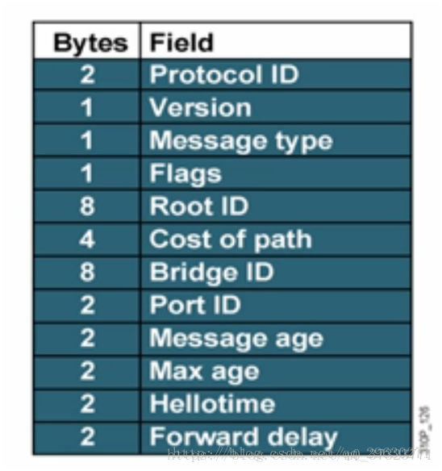
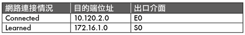

# 物理層, 鏈路層(MAC頭), 網絡層(IP頭)的協議

## # 第5講| 從物理層到MAC層（數據鏈路層）：如何在宿舍裡自己組網玩聯機遊戲？

- 物理層與鏈路層
-  鏈路層與MAC層
- HUB與交換機

### |> 第一層（物理層）

> --> 機器之間達成連接

兩台電腦插網線互通，通信的前提兩台電腦配好**IP地址**、**子網掩碼**和**默認網關**。要想兩台電腦能夠通信，這三項必須配置成為一個網絡。兩台電腦之間的網絡包，包含MAC層（IP層要封裝了MAC層才能將包放入物理層）。

到此為止，兩台電腦已經構成了一個最小的局域網，也即LAN這樣兩台機器構成了局域網（**LAN**）

但有第三台機器協議連接的時候就需要 HUB （也就是**集線器**。這種設備有多個口，可以將宿舍裡的多台電腦連接起來，現在基本被淘汰，使用交換機）。

這種設備有多個口，可以將宿舍裡的多台電腦連接起來。但是，和交換機不同，集線器沒有大腦，它完全在物理層工作。它會將自己收到的每一個字節，都複製到其他端口上去。這是第一層物理層聯通的方案。

### |> 第二層（數據鏈路層）

> ---> 管理包的接收

 Hub採取的是廣播的模式，如果每一台電腦發出的包，宿舍的每個電腦都能收到，那就麻煩了。這就需要解決幾個問題：

- 數據鏈路層分為上層LLC（**邏輯鏈路控制**），和下層的MAC（**介質訪問控制**）
- MAC主要負責控制與連接物理層的物理介質。
- 在發送數據的時候MAC協議可以事先判斷是否可以發送數據，如果可以發送將給數據加上一些控制信息，最終將數據以及控制信息以規定的格式發送到物理層
- 在接收數據的時候，MAC協議首先判斷輸入的信息並是否發生傳輸錯誤，如果沒有錯誤，則去掉控制信息發送至LLC（邏輯鏈路控制）層

HUB採取的是廣播的模式，廣播數據包，但要解決幾個問題：

> 這幾個問題，都是第二層，數據鏈路層，也即MAC層要解決的問題。

- 這個包是發給誰的？誰應該接收？
- 大家都在發，會不會產生混亂？有沒有誰先發、誰後發的規則？
- 如果發送的時候出現了錯誤，怎麼辦？

#### 1. 鏈路層地址網絡包格式解決: 發給誰，誰接收？

- 這裡用到一個物理地址，叫做**鏈路層地址**，但是因為第二層主要解決**媒體接入控制**的問題，所以它常被稱為**MAC地址**

- 靠數據包中目標MAC地址，然後就是雙子樓的模式（筆記二）

  解決第一個問題就牽扯到第二層的網絡包格式。

  對於以太網，第二層的最開始，就是目標的MAC地址和源的MAC地址。

  

- 接下來是類型，大部分的類型是IP數據包，然後IP裡面包含TCP、UDP，以及HTTP等，這都是裡層封裝的事情。

- 有了這個目標MAC地址，數據包在鏈路上廣播，MAC的網卡才能發現，這個包是給它的。 MAC的網卡把包收進來，然後打開IP包，發現IP地址也是自己的，再打開TCP包，發現端口是自己，也就是80，而nginx就是監聽80。

- 於是將請求提交給nginx，nginx返回一個網頁。然後將網頁需要發回請求的機器。然後層層封裝，最後到MAC層。因為來的時候有源MAC地址，返回的時候，源MAC就變成了目標MAC，再返給請求的機器。

#####  ARP協議解決：不知道目標機器MAC地址

> ARP協議 ---> 在局域網中，已知IP地址，求目標MAC地址。


- 在一個局域網裡面，當知道了IP地址，不知道MAC地址，就需要使用**ARP協議**在廣播中“吼”，因為是在局域網中，所以能得到目標IP的回复。

  

- 發送一個廣播包，誰是這個IP誰來回答。具體詢問和回答的報文就像下面這樣:

  

- 為了避免每次都用ARP請求，機器本地也會進行**ARP緩存**

- IP隨時會改變，所以ARP的MAC地址緩存過一段時間就會過期

  

#### 2. 多路訪問算法解決媒體訪問控制問題：誰先發、誰後發？

MAC的全稱是**Medium Access Control**，即**媒體訪問控制**，控制往媒體上發數據的時候，誰先發、誰後發的問題，制定多路訪問規則來控制訪問，防止發生混亂。解決了媒體接入控制的問題，MAC的問題也就解決好了。`這裡和 MAC地址 (Media Access Control Address ) 無關`。

這個問題中的規則，學名叫多路訪問。有很多算法可以解決這個問題。就像車管所管束馬路上跑的車，能想的辦法都想過了。

比如接下來這三種方式：

- 方式一：分多個車道。每個車一個車道，你走你的，我走我的。這在計算機網絡裡叫作信道劃分；
- 方式二：今天單號出行，明天雙號出行，輪著來。這在計算機網絡裡叫作輪流協議；
- 方式三：不管三七二十一，有事兒先出門，發現特堵，就回去。錯過高峰再出。我們叫作隨機接入協議。著名的以太網，用的就是這個方式。

#### 3. 如果發送的時候出現了錯誤，怎麼辦？

使用**CRC**，也就是**循環冗餘檢測**。通過**XOR異或的算法**，來計算整個包是否在發送的過程中出現了錯誤

### |> 局域網

> Hub

在局域網中，用HUB連接起來，因為Hub是廣播的，不管某個接口是否需要，所有的Bit都會被發送出去，然後讓主機來判斷是不是需要。這種組網的方法，一旦機器數目多了，產生衝突的概率就提高了，如果這個區域裡有衝突，所有電腦都受影響。而且把不需要的包轉發過去純屬浪費。

> 網路交換器

- 能知道目標MAC地址是否就是連接某個口的電腦的MAC地址

  ---> 一個能把MAC頭拿下來，檢查一下目標MAC地址，然後根據策略轉發的設備 

  ---> 是個**二層設備**，我們稱為**交換機**。

交換機交換機會學習來知道每個口電腦的MAC地址：

- 一台MAC1電腦將一個包發送給另一台MAC2電腦，當這個包到達交換機的時候，一開始交換機也不知道MAC2的電腦在哪個口，所以它只能將包轉發給出了來的那個口之外的其他所有的口。
- 但是這個時候，交換機會會記住MAC1是來自一個明確的口。以後有包的目的地址是MAC1的，直接發送到這個口就可以了。

然後這樣重複一段時間，就有了整個網絡的結構，這時基本不用廣播，全部可以準確轉發了

每個機器IP地址改變時，所在的口業會改變，因而交換機上的學習結果，稱為**轉發表**，是有一個過期時間。

有了交換機，一般來說，你接個幾十台、上百台機器打遊戲，沒問題。


#### 額外知識

> 交換機和HUB有什麼區別？

- **交換機可以分割衝突域而HUB不可以分割衝突域，這是他們最本質的區別**
  hub連N台電腦，他們共享在一個區域裡，如果這個區域裡有衝突，所有電腦都受影響。
  交換機連n台電腦，每個交換機端口是一個獨立的區域，即使有衝突，衝突也局限在相對應的交換機端口，不影響其他電腦
- **HUB是廣播數據包，交換機是隔離數據包**

鏈接：https://zhidao.baidu.com/question/175872130001476004.html

> 路由器與交換機有什麼區別？

**1、工作層次不同**

- 交換機主要工作在數據鏈路層，也就是七層模型的第二層，
- 而路由器工作在網絡層。

**2、數據轉發所依據的對象不同**

- 交換機是利用物理地址（MAC地址）來確定轉發數據的目的地址。
- 而路由器是通過IP位址來確定數據轉發的地址。MAC地址是網卡自帶，由網卡生產商來分配，固化到網卡中的，一般來說是不可更改的。而IP位址是有網絡管理員或系統自動分配的。

**3、交換機只能分割衝突域**

- 交換機所有埠屬於同一個廣播域，交換機可以分割衝突域，每個埠都是一個衝突域。
- 而路由器默認不轉發廣播報文的，也就相當於路由器每個埠都是一個廣播域。

**4、路由器提供PPPOE撥號、防火牆等功能**

交換機不具備撥號功能。而路由器功能較交換機強大。

> 如果一個局域網裡面有多個交換機，ARP 廣播的模式會出現什麼問題呢？

**ARP廣播時，交換機會將一個端口收到的包轉發到其它所有的端口上。**

比如數據包經過交換機A到達交換機B，交換機B又將包複製為多份廣播出去。

如果整個局域網存在一個環路，使得數據包又重新回到了最開始的交換機A，這個包又會被A再次復制多份廣播出去。

如此循環，數據包會不停得轉發，而且越來越多，最終佔滿帶寬，或者使解析協議的硬件過載，行成廣播風暴。

> 在二層中我們講了ARP協議，即已知IP地址求MAC ；還有一種RARP協議，即已知MAC求IP 的，你知道它可以用來幹什麼嗎？

[**ARP 與 RARP 協定**](http://www.tsnien.idv.tw/Network_WebBook/chap13/13-4%20ARP%20%E8%88%87%20RARP%20%E9%80%9A%E8%A8%8A%E5%8D%94%E5%AE%9A.html)

當某部主機欲依照 IP 位址發送資料給另一主機時，它該如何得知對方的 MAC 位址（如 Ethernet 位址）？一般主機知道自己的 MAC 位址，又該如何去得到自己的 IP 位址？

在 TCP/IP 通訊協定裡有兩個協定來解決上述的問題，

- 一為『**位址解析協定**』（Address Resolution Protocol, ARP）；

  ARP 是用來查問欲傳送之目地主機的MAC位址，也就是說，由已知的 IP 位址查問其相對應的網路實體位址

- 另一為『反向位址解析協定』（Reverse Address Resolution Protocol, RARP）。

  而 RARP 是由已知的網路實體位址（MAC 位址）查詢其相對應的 IP 位

  -  一般主機電腦上的 IP 位址設定有靜態設定和動態設定兩種方法。

    - 靜態設定是於主機電腦上直接用人工設定 IP 位址，設定後如沒有再用人工修改，則 IP 位址永遠不變；
    - 動態設定並未設定 IP 位址，每當主機啟動時，再由網路上某部伺服器給予 IP 位址，因此，每次啟動時得到的 IP 位址不一定相同。

    如果主機電腦採用動態指定 IP 位址模式，啟動就必須利用『**反向位址解析協定**』（Reverse Address Resolution Protocol, RARP），向網路上的伺服器（如 DHCP Server）要求給于一個 IP 位址。

    RARP 的動作是，主機電腦用自己硬體位址（MAC 位址）向伺服器詢問自己的 IP 位址，

### |> 小結

總結一下：

1. 物理層是連接，鏈路層是管理

2. MAC層是鏈路層的子層

3. MAC層是用來解決多路訪問的堵車問題

1. ARP是通過吼的方式來尋找目標MAC地址的，吼完之後記住一段時間，這個叫作緩存；
2. 交換機是有MAC地址學習能力的，學完了它就知道誰在哪兒了，不用廣播了。

## # 第6講| 交換機與VLAN：辦公室太複雜，我要回學校

- STP協議解決交換機環路問題
- 理解STR協議
- 使用VLAN解決廣播域衝突

宿舍使用一台交換機就完全沒有問題了，但要是寫字樓辦公室的可以就需要多台交換機了。多台交換機連接起來，就形成稍微複雜的拓撲結構

### |> 拓撲結構的形成


兩台交換機的情形。

兩台交換機連接著三個局域網，每個局域網上都有多台機器。

- 機器1只知道機器4的IP地址，還需要機器4的MAC地址，才能訪問機器4，把包送到機器4
- 機器1發起廣播，但是這不是找它的，沒機器2的事
- 交換機A收到，轉發給除了來源處的其他網口
- 機器3收到，也沒機器3的事
- 交換機B連著局域網LAN2 (機器3)，所以交換機B能也收到，也繼續廣播
- 機器4和機器5收到，機器4響應MAC地址
- ARP請求成功

**機器的鏈路層能夠學習，交換機也能夠學習**

- 機器1當經過一次交換機A，那麼交換機A以後都知道機器1是在左邊局域網LAN1 ---->  拓撲信息

- 當機器2要訪問機器1的時候，機器2並不知道機器1的MAC地址，所以機器2會發起一個ARP請求。

  - 這個廣播消息會到達機器1,也同時會到達交換機A。

  - 這個時候交換機A已經知道機器1是不可能在右邊的網口的，所以這個廣播信息就不會廣播到 LAN2 和 LAN3。

- 當機器3要訪問機器1的時候，也需要發起一個廣播的ARP請求。

  - 這個時候交換機A和交換機B都能夠收到這個廣播請求。
  - 交換機A知道機器1是在左邊這個網口的 ---> 把廣播消息轉發到 LAN1。

  - 同時，交換機B收到這個廣播消息之後，由於它知道機器1是不在右邊這個網口的，所以不會將消息廣播到 LAN3。

### |> 解決常見的環路問題

機器多了，多台交換機就有可能連接著兩個相同的LAN，就回形成環路


- 機器1需要訪問機器2
- 機器1並不知道機器2的MAC地址，所以它需要發起一個ARP的廣播。
- 交換機A此時還沒有學習，並不知道機器2是在LAN1還是LAN2於是，廣播到LAN2
- LAN2存在著這個廣播包，於是交換機B從右邊接受到LAN2過來的廣播包，廣播到LAN1
- LAN1的這個廣播消息，又會到達交換機A左邊的這個接口。交換機A此時還是不知道機器2在哪，於是再次廣播到LAN2
- 不斷重複3、4步驟


1. 機器1的廣播包到達交換機A和交換機B的時候，本來兩個交換機都學會了機器1是在 LAN1 的，

2. 但是當交換機A將包廣播到 LAN2 之後，交換機B右邊的網口收到了來自交換機A的廣播包。根據學習機制，交換機B又學會了，機器1是從右邊這個網口來的，把剛才學習的那一條清理掉。

   同理，交換機A右邊的網口，也能收到交換機B轉發過來的廣播包，同樣也誤會了，於是也學會了，機器1從右邊的網口來，不是從左邊的網口來。

3. 然而當廣播包從左邊的 LAN1 廣播的時候，兩個交換機再次刷新，原來機器1是在左邊的，過一會兒，又發現不對，是在右邊的，過一會，又發現不對，是在左邊的。

4. 這還是一個包轉來轉去，每台機器都會發廣播包，交換機轉發也會復制廣播包，當廣播包越來越多的時候，按共享道路的算法，也就是路會越來越堵，最後走不動。 ----> 產生了死循環的環路問題 ----> 於是應用了STP協議


### |> 理解STP協議

> 解決交換機環路問題

在數據結構中，有一個方法叫作**最小生成樹**。有環的我們常稱為圖。將圖中的環破了，就生成了樹。在計算機網絡中，生成樹的算法叫作**STP**，全稱**Spanning Tree Protocol**。

應用了STP協議的辦公室交換機結構圖


**概念**：

- Root Bridge-根交換機，是某棵樹的老大
- Designate Bridges-指定交換機（子交換機），對於樹來說，就是一棵樹的樹枝。所謂"指定”的意思是，拜誰做老大，其他交換機通過這個交換機到達根交換機，也就相當於拜他做了老大。這裡註意是樹枝，不是葉子，因為葉子往往是主機。
- Bridge Protocol Data Units（BPDU）-網橋協議數據單位元，可以比喻為"相互比較實力”的協議。當兩個交換機碰見的時候，也就是相連的時候，就需要互相比。
- Priority Vector – 優先級向量。可以比喻為實力（值越小越強）。實力＝一組ID數目`[Root Bridge ID, Root Path Cost, Bridge ID, and Port ID]`
  - 比實力 : 先看Root Bridge ID。拿出老大的ID看看，發現一樣；再比Root Path Cost，也即我距離我的老大的距離；最後比Bridge ID，拿自己的本事比。

#### BPDU介紹

1. BPDU是交換機之間發送的用於構建無環路拓撲的消息稱為網橋協議數據單元
2. BPDU是二層報文
3. BPDU中包括用於計算生成樹的參數信息



- Root Bridge ID （BID）—本交換機認為的根交換機ID
- Root Path Cost —本交換機認為的根交換機路徑開銷
- Bridge ID —本交換機的ID
- Port ID—發送該BPDU的端口ID

**也就是說BPDU代表兩交換機連接的連接與開銷**

### |> STR協議過程

每個網橋都被分配了一個ID。這個ID裡有管理員分配的優先級

既然都是老大，互相都連著網線，就互相發送BPDU來比功夫。贏的接著當老大，輸的就只好做小弟了。當老大的還會繼續發BPDU，而輸的人就沒有機會了。它們只有在收到老大發的BPDU的時候，轉發一下，表示服從命令。

數字表示優先級。像這個圖，5和6碰見了，6的優先級低，所以乖乖做小弟。於是一個小邦派形成，5是老大，6是小弟。其他諸如1-7、2-8、3-4這樣的小幫派，也誕生了。小的幫派，接著合併。


老大遇老大：

- 當5碰到了1，數字小的當老大

同幫派相遇：

- 老大遇小弟＝環 ---> 假如1和6相遇。6原來就在1的門下，只不過6的上司是5, 5的上司是1。1發現，6距離我才只有2，比從5這裡過來的5(=4+1)近多了，那6就直接匯報給我吧。於是，5和6分別匯報給1。
- 小弟相遇 ---> 這個時候就要比較誰和老大的關係近，當然近的當大哥。剛才5和6同時匯報給1了，後來5和6再比較功夫的時候發現，5你直接匯報給1距離是4,如果5匯報給6再匯報給1,距離只有2 + 1=3，所以5乾脆拜6為上司。

老大與其他幫派小弟相遇

- 2和7相遇，雖然7是小弟，2是老大。就個人武功而言，2比7強，但是7的老大是1比2牛，所以沒辦法，2要拜入7的幫派，並且連同自己的小弟都一起拜入。

不同門小弟相遇

- 各自拿老大比較，輸了的拜入贏的幫派，並且逐漸將與自己連接的兄弟棄暗投明。

最終，生成一棵樹，

**哪個數字最小就是根交換機**
**其他交換機哪條通往根交換機最短的路就是交換機轉發廣播包的路徑**
最終轉發路徑如下


原本1-5-6是一個環，確定好最短通信路徑，這個環通信就不成環了

- 5要是需要轉發到1就，5->6->1
- 1要是需要轉發到5就，1->6>5

### |> 解決廣播問題和安全問題

> 機器多了，交換機多了，就需要劃分廣播域來更方便管理了, 一般使用虛擬隔離

兩種劃分方法

1. 物理隔離：

   配置單的獨交換機，單獨的子網，通過路由器向其他廣播域溝通

2. 虛擬隔離：
   VLAN，虛擬局域網。使用VLAN，一個交換機上會連屬於多個局域網的機器，


> 虛擬隔離：交換機怎麼區分哪個機器屬於哪個局域網呢？

端口會根據所屬VLAN ID在廣播包二層頭中加一個TAG再轉發出去。

Tag裡面有一個端口VLAN ID，—共12位，可以劃分4096個VLAN（2 ^12 = 4096 ）。用以確定那個相同VLAN ID端口接受。（不夠，目前云計算廠商裡面絕對不止4096個用戶。當然每個用戶需要一個VLAN）

如果交換機是支持VLAN的，可以設置交換機每個端口所屬的VLAN，交換機會把廣播包的二層頭取下來，識別VLAN ID，廣播包的轉發只在相同的端口VLAN ID中進行。這樣只有相同VLAN的包，才會互相轉發，不同VLAN的包，是看不到的。這樣廣播問題和安全問題就都能夠解決了。

而且對於交換機來講，每個VLAN的口都是可以重新設置的。

交換機之間通過叫做Trunk口來進行連接，用來轉發屬於任何VLAN的口。
這裡介紹的是一般複雜的的場景，還有云計算其他的另說。

### |> 小結

- 當交換機的數目越來越多的時候，會遭遇**環路問題**，讓網絡包迷路造成[廣播風暴](https://baike.baidu.com/item/广播风暴/3574878?fr=aladdin)，這就需要使用STP協議，將有環路的圖變成沒有環路的樹，從而解決環路問題。
- 交換機數目多會面臨隔離問題，可以通過VLAN 形成虛擬局域網，從而解決廣播問題和安全問題。

#### == **二層設備和三層設備** ==

[一文看懂二層網絡和三層網絡](https://www.sohu.com/a/297996753_100169323) 

- 我們這裡提到的二層、三層是按照邏輯拓撲結構進行的分類，並不是ISO七層模型中的數據鏈路層和網絡層，而是指核心層、匯聚層和接入層。

- 這三層都部署的就是三層網絡結構，二層網絡結構沒有匯聚層。

二層設備

- 只有核心層和接入層的二層網絡結構模式運行簡便，交換機根據MAC地址表進行數據包的轉發。

- 有則轉發，無則泛洪，即將數據包廣播發送到所有端口，如果目的終端收到給出回應，那麼交換機就可以將該MAC地址添加到地址表中，這是交換機對MAC地址進行建立的過程。

- 但這樣頻繁的對未知的MAC目標的數據包進行廣播，在大規模的網絡架構中形成的網絡風暴是非常龐大的，這也很大程度上限制了二層網絡規模的擴大，因此二層網絡的組網能力非常有限，所以一般只是用來搭建小局域網。

三層設備

- 與二層網絡不同的是，三層網絡結構可以組件大型的網絡。
- 核心層是整個網絡的支撐脊樑和數據傳輸通道，重要性不言而喻。
- 因此在整個三層網絡結構中，核心層的設備要求是最高的，必須配備高性能的數據冗餘轉接設備和防止負載過剩的均衡負載的設備，以降低各核心層交換機所承載的數據量。
- 匯聚層是連接網絡的核心層和各個接入層的應用層，在兩層之間承擔“媒介傳輸”的作用。
- 匯聚層應該具備以下功能：實施安全功能（劃分VLAN和配置ACL）、工作組整體接入功能、虛擬網絡過濾功能。因此，匯聚層設備應採用三層交換機。
- 接入層的面向對像是終端客戶，為終端客戶提供接入功能。


二層網絡僅僅通過MAC尋址即可實現通訊，但僅僅是同一個衝突域內；三層網絡則需要通過IP路由實現跨網段的通訊，可以跨多個衝突域。

三層交換機在一定程度上可以替代路由器，但是應該清醒地認識到三層交換機出現最重要的目的是加快大型局域網內部的數據交換。

它所具備的路由功能也多是圍繞這一目的而展開的，所以他的路由功能沒有同一檔次的專業路由器強，在安全、協議支持等方面還有很多欠缺，並不能完全取代路由器工作。

在實際應用過程中，典型的做法是：處於同一個局域網中的各個子網的互聯以及局域網中VLAN間的路由，用三層交換機來代替路由器，而只有局域網與公網互聯之間要實現跨地域的網絡訪問時，才通過專業路由器


#### == 二層和三層環路 ==

[二層和三層環路有什麼特點和區別？](https://my.oschina.net/u/4374260/blog/3230568)

環路的原因：

- 二層環路是由於物理拓扑出現環路，如3台交換機三角形連接。
- 三層環路一般物理拓撲有環路，並且設置之間路由表形成互指。

二層交換機工作行為？

- 收到的數據幀查看2層頭部，根據目的Mac地址轉發，目的Mac分廣播、組播、單播。

三層設備的工作行為

- 收到數據包查看三層目的IP，根據目的IP地址轉發，分為廣播，組播，單播。

二層環路

- 廣播風暴和數據幀複製，MAC地址震盪；假設交換機收到廣播幀或者組播幀或者未知單播幀，會採用泛洪形式處理，數據幀在轉發時產生了拷貝複制，數據幀無休止被轉發，如此往復，最終導致整個網絡帶寬資源被耗盡，設備負載過大，網絡癱瘓不可用。

三層環路

- 數據包會在設備之間有限的互相轉發，因為在三層IP頭部存在TTL字段，所以報文不會無休止轉發。

防環機制

- 二層防環
  STP、SMART-LINK等技術，或使用LACP鏈路捆綁和設備堆疊等技術，使得物理拓撲上沒有環路。

- 三層防環
  只要依靠路由協議自身的防環機制。

總結：

- 二層環路較易產生，需要運行破壞機制，經過計算阻塞某些端口實現預防，且由於二層設備的處理行為導致了後果特別嚴重。

- 三層環路不容易產生，由於三層設備的處理行為和TTL機制，所以後果並不十分嚴重，且每種路由協議都有比較完整的防環機制，三層環路比較容易發生在特殊的場景下，如雙點雙向路由發布。

補充：

- TTL:Time to live，在IP報文中，TTL字段佔8個bit，所以最大255，設備接收到報文都需要減1，減到0則丟棄報文，並向報文的源IP發送ICMP消息type為1，code為0的錯誤消息。

> 額外知識

STP協議有什麼缺點？

1. **拓撲收斂慢**，當網絡拓撲發生改變的時候，生成樹協議需要50-52秒的時間才能完成拓撲收斂，數越大需要的時間越長，這期間就是網絡中斷。
2. **不能提供負載均衡的功能**。當網絡中出現環路的時候，生成樹協議簡單的將環路進行Block，這樣該鏈路就不能進行數據包的轉發，浪費網絡資源。

## # 第7講| ICMP與ping(網路層)：投石問路的偵察兵

[搞懂ICMP協定及工具 抵擋「死亡之Ping」攻擊](https://www.netadmin.com.tw/netadmin/zh-tw/technology/111381F2995A4AB48672E965F63133AE)

ICMP網路協定簡介

ICMP是Internet Control Message Protocol的縮寫，這個網路協定運用在網路七層協定中的第三層。該協定的最主要目的，是用來解析網路封包或是分析路由的情況，大多是透過所傳回來的錯誤訊息進行分析，而網路管理人員則利用這個協定的工具來了解狀況，進而使用其他措施解決所遇到的問題。

ICMP協定是基於IP協定之上運作的，不過主要不是用於點與點之間的傳輸，但有兩個工具卻是用於點與點之間，透過ICMP協定來分析網路狀況，它們就是ping與traceroute，下面會為各位說明。

ICMP協定被定義在RFC 792文件之中。其中重要的一點是，ICMP會使用TTL的概念，TTL的全名是Time To Live，其值代表還有多少「生存時間」，其實就是還可以被轉發處理多少次。

每個路由器在轉發ICMP封包時，都會把IP Header的TTL的值減1，如果TTL的值已經到0，就代表TTL已經到期，接著就會傳送錯誤訊息給原本發送的網路設備。Traceroute工具就是使用TTL的方式來達到網路檢測。

不過，ping則是透過ICMP的echo request以及echo reply來完成檢測。ICMPv6則是ICMP協定在IPv6的版本，其詳細的內容被定義在RFC 4443的文件內，這裡就不再多加介紹。

**表1 ping指令輸出結果中各種符號所代表的意義**


ping的運作原理是向目的端設備發送一個ICMP echo@要求封包，並且等待目的端回傳封包。1983年的時候，首先由Mike Muuss編寫了這樣一個程式，用於測試IP網路的問題。取名為ping是因為這個工具的用途很類似於潛水艇的主動聲納技術很相近，於是Mike就將這個程式取名為ping。

由於ping的普及性，其實很多人都會以ping當成動詞來代表ping這個動作。例如「ping看看那台伺服器」，以代表是否有可能從目前這個設備傳送網路封包到那台伺服器。

而一般來說，對方若發現被找，則可能會回應pong，這是因為ping與pong，像是乒乓球一樣來回拍打的聲音。

若看到有時間time=xx ms，就是代表成已功發送過去，這裡看得出來是用64個bytes做傳送測試，對方反應時間為11至13毫秒之間。

如果失敗的話，則會看到類似下面timeout的訊息


### |> ICMP協議的格式

> ping是如何工作的

ping是基於ICMP協議工作的。ICMP全稱`Internet Control Message Protocol`，就是互聯網控制報文協議。這裡面的關鍵詞是"控制”，那具體是怎麼控制的呢？

網絡包在異常複雜的網絡環境中傳輸時，常常會遇到各種各樣的問題。當遇到問題的時候，總不能"死個不明不白”，要傳出消息來，報告情況，這樣才可以調整傳輸策略。

ICMP報文是封裝在IP包裡面的。因為傳輸指令的時候，需要源地址和目標地址。它本身非常簡單。因為作為偵查兵，要輕裝上陣，不能攜帶大量的包袱。


ICMP報文有很多的類型，不同的類型有不同的代碼。最常用的類型是主動請求為8,主動請求的應答為0。

### |> 查詢報文類型

> 主動查看敵情，對應ICMP的查詢報文類型。

例如，常用的ping就是查詢報文，是一種主動請求，並且獲得主動應答的ICMP協議。所以，ping發的包也是符合ICMP協議格式的，只不過它在後面增加了自己的格式。

對ping的主動請求，進行網絡抓包，稱為`ICMP ECHO REQUEST`。同理主動請求的回复，稱為`ICMP ECHO REPLY`。比起原生的ICMP，這裡面多了兩個字段，

- 一個是`標示符`。這個很好理解，你派出去兩隊偵查兵，一隊是偵查戰況的，一隊是去查找水源的，要有個標識才能區分。
- 另一個是`序號`，你派出去的偵查兵，都要編個號。如果派出去10個，回來10個，就說明前方戰況不錯；如果派出去10個，回來2個，說明情況可能不妙。

在選項數據中，ping還會存放發送請求的時間值，來計算往返時間，說明路程的長短。

### |> 差錯報文類型

> 異常情況發起的，偵查兵來報告發生了不好的事情，對應ICMP的差錯報文類型。

ICMP差錯報文的例子：終點不可達為3, 源抑制為4, 超時為11, 重定向為5。

1. 第一種是終點不可達 = 沒有送到

   具體的原因在代碼中表示就是，

   - 網絡不可達代碼為0，找不到地方

   - 主機不可達代碼為1，找到地方沒這個人

   - 協議不可達代碼為2，找到地方，找到人，口號沒對上，人家abc，我說123

   - 端口不可達代碼為3，找到地方，找到人，對了口號，事兒沒對上，我去送糧草，人家說他們在等救兵。

   - 需要進行分片但設置了不分片位代碼為4。走到一半，山路狹窄，想換小車，但是您的將令，嚴禁換小車，就沒辦法送到了。
     

2. 第二種是源站抑制 = 放慢發送速度

   也就是讓源站放慢發送速度。糧草送的太多了吃不完。

3. 第三種是時間超時 

   也就是超過網絡包的生存時間還是沒到。送糧草的人，自己把糧草吃完了，還沒找到地方，已經餓死啦。

4. 第四種是路由重定向

   也就是讓下次發給另一個路由器。上次送糧草的人本來只要走一站地鐵，非得從五環繞，下次別這樣了啊。

差錯報文的結構相對複雜一些。除了前面還是IP，`ICMP的前8字節`不變，後面則跟上出錯的那個`IP包 的IP頭`和`IP正文的前8个字節`。

而且這類偵查兵特別恪盡職守，不但自己返回來報信，還把一部分遺物也帶回來。

- 怎麼死的（可以查看ICMP的前8字節）
- 這是張將軍的遺物，是他的劍（IP數據包的頭及正文前8字節）。

### |> ping：查詢報文類型的使用

> ping的發送和接收過程。
>
> ping這個程序是使用了ICMP裡面的ECHO REQUEST 和ECHO REPLY 類型的。


> 最簡單的，同一個局域網裡面的情況

假定主機A的IP地址是192.168.1.1,主機B的IP地址是192.168.1.2，它們都在同一個子網。那當你在主機A上運行" `ping 192.168.1.2`”後，會發生什麼呢？

1. ping命令執行的時候，源主機首先會構建一個ICMP請求數據包, ICMP數據包內包含多個字段。最重要的是兩個，
   - 第一個是類型字段，對於請求數據包而言該字段為8; 
   - 另外一個是順序號，主要用於區分連續ping的時候發出的多個數據包。每發出一個請求數據包，順序號會自動加1。為了能夠計算往返時間RTT，它會在報文的數據部分插入發送時間。

2. ICMP協議接著將這個數據包連同地址192.168.1.2 一起交給IP層。IP層將以192.168.1.2作為目的地址，本機IP地址作為源地址，加上一些其他控制信息，構建一個IP數據包。

3. 接下來，需要加入MAC頭。

   - 如果在本節ARP映射表中查找出IP地址192.168.1.2所對應的MAC地址，則可以直接使用；
   - 如果沒有，則需要發送ARP協議查詢MAC地址，

   獲得MAC地址後，由數據鏈路層構建一個數據幀，目的地址是IP層傳過來的MAC地址，源地址則是本機的MAC地址；還要附加上一些控制信息，依據以太網的介質訪問規則，將它們傳送出去。

4. 主機B收到這個數據幀後，
   - 先檢查它的目的MAC地址，並和本機的MAC地址對比，如符合，則接收，否則就丟棄。
   - 接收後檢查該數據幀，將IP數據包從幀中提取出來，交給本機的IP層。同樣，IP層檢查後，將有用的信息提取後交給ICMP協議。

5. 主機B會構建一個ICMP應答包，應答數據包的類型字段為0, 順序號為接收到的請求數據包中的順序號，然後再發送出去給主機A。
   - 在規定的時候間內，源主機如果沒有接到ICMP的應答包，則說明目標主機不可達；
   - 如果接收到了ICMP 應答包，則說明目標主機可達。此時，源主機會檢查，用當前時刻減去該數據包最初從源主機上發出的時刻，就是ICMP數據包的時間延遲。

> 如果跨網段的話，還會涉及網關的轉發、路由器的轉發等等。

但是對於ICMP的頭來講，是沒什麼影響的。會影響的是根據目標IP地址，選擇路由的下一條，還有每經過一個路由器到達一個新的局域網，需要換MAC頭里面的MAC地址。

> 當遇到網絡不通的問題

如果在自己的可控範圍之內，當遇到網絡不通的問題的時候，除了直接ping目標的IP地址之外，還應該有一個清晰的網絡拓撲圖。並且從理論上來講，應該要清楚地知道一個網絡包從源地址到目標地址都需要經過哪些設備，然後逐個ping中間的這些設備或者機器。如果可能的話，在這些關鍵點，通過`tcpdump -i eth0 icmp`，查看包有沒有到達某個點，回复的包到達了哪個點，可以更加容易推斷出錯的位置。

經常會遇到一個問題，如果不在我們的控制範圍內，很多中間設備都是禁止ping的，但是ping不通不代表網絡不通。這個時候就要使用`telnet`，通過其他協議來測試網絡是否通。


### |> Traceroute：差錯報文類型的使用

不是只有真正遇到錯誤的時候，才能收到呢 ---> 有一個程序Traceroute， 是個"大騙子”。它會使用ICMP的規則，故意製造一些能夠產生錯誤的場景。

> Traceroute的第一個作用就是故意設置特殊的TTL，來**追踪去往目的地時沿途經過的路由器**。

Traceroute的參數指向某個目的IP地址，它會發送一個UDP的數據包。將TTL設置參數，其值代表還有多少「生存時間」，其實就是還可以被轉發處理多少次，超過生存時間時死亡，，返回一個ICMP包，也就是網絡差錯包，類型是時間超時。

這個工具利用TTL來完成檢測。每次經過一個路由器，就把TTL的值減1，直到為0，這個時候會傳送ICMP TTL給原本發送的網路設備。

- 將TTL設置為1，如果中間的路由器不止一個，當然碰到第一個就"犧牲”。於是，返回一個ICMP包，也就是網絡差錯包，類型是時間超時。

  那大軍前行就帶一頓飯，試一試走多遠會被餓死，然後找個哨探回來報告，那就知道大軍只帶一頓飯能走多遠了。

- 接下來，將TTL設置為2。第一關過了，第二關就"犧牲”了，那我就知道第二關有多遠。
- 如此反复， 直到到達目的主機。這樣，Traceroute就拿到了所有的路由器IP。當然，有的路由器壓根不會回這個ICMP。這也是Traceroute 一個公網的地址，看不到中間路由的原因。

怎麼知道UDP有沒有到達目的主機？

- Traceroute程序會發送一份UDP數據報給目的主機，但它會選擇一個不可能的值作為UDP端口號（大於30000）。
  - 因為UDP是無連接的。也就是說這人一派出去，你就得不到任何音信。你無法區別到底是半路走丟了，還是真的抵達了，只有讓人家打出來，你才會得到消息。
- 當該數據報到達時，將使目的主機的UDP模塊產生一份"端口不可達”錯誤ICMP報文。
- 如果數據報沒有到達，則可能是超時。

> Traceroute還有一個作用是故意設置不分片，從而**確定路徑的MTU**。

- 首先是發送分組，並設置"不分片”標誌。
- 發送的第一個分組的長度正好與出口MTU相等。如果中間遇到窄的關口會被卡住，會發送ICMP網絡差錯包，類型為"需要進行分片但設置了不分片位”。
- 每次收到ICMP"不能分片”差錯時就減小分組的長度，直到到達目標主機。

### |> 小結

- ICMP相當於網絡世界的偵察兵。兩種類型的ICMP報文，
  - 一種是主動探查的查詢報文，
  - 一種異常報告的差錯報文；
- ping使用查詢報文，Traceroute使用差錯報文。

> 兩個思考題吧。

1. 當發送的報文出問題的時候，會發送一個ICMP的差錯報文來報告錯誤，但是如果ICMP的差錯報文也出問題了呢？
2. 這一節只說了一個局域網互相ping 的情況。如果跨路由器、跨網關的過程會是什麼樣的呢？

## # 第8講| 出網關(網路層)

> 網關
>
> 網關實質上是一個網絡通向其他網絡的IP位址，網關在網段內的可用 **ip中選一個** ，不過，一般用的是 **第1個和最後一個** 。
>
> 在沒有**路由器**的情況下，不同的兩個網絡之間是**不能**進行TCP/IP通信的，即使是兩個網絡連接在同一台交換機(或集線器)上，TCP/IP協議也會根據子網掩碼(255.255.255.0)判定兩個網絡中的主機處在不同的網絡里。而要實現這兩個網絡之間的通信，則 **必須通過網關** 。
>
> 如果網絡A中的主機發現 數據包的目的主機 不在 本地網絡中，就把數據包轉發給它 自己的網關 ，再由網關轉發給網絡B的網關，網絡B的網關再轉發給網絡B的某個主機。網絡B向網絡A轉發數據包的過程。
>
> 所以說，只有設置好網關的**IP位址**，TCP/IP協議才能實現不同網絡之間的相互通信。
>
> DNS
>
> DNS是域名解析伺服器（Domain Name System），是把網址(域名)變成IP位址的伺服器。
>
> 

交換器（Switch）也可以把封包轉發到目的地，但是不要把路由與之前所介紹過的交換器技術混在一起，路由器是運作於網路協定的第三層，而交換器則運作於網路協定的第二層，它們所分析的根據和運作的方式截然不同。  


### |> 路由協定

[明辨路由協定的種類、分類和特性 路由技術分析從零開始](https://www.netadmin.com.tw/netadmin/zh-tw/technology/1E1083DE4FAA4AC8839AE8ABA8400EEE)

>路由（Routing）是決定網路封包要如何送往外部網路到達目的地的過程。而Cisco路由器（Router）會取得達到路由所必須的資訊，並加以維護，而為了取得並維護這樣的路由資訊，必須使用路由協定。路由協定非常複雜，種類也多，為了管理Cisco路由器來達到企業內部的網路路由，第一步必須了解路由協定的種類與詳細運作過程。  

路由器（路由器）最主要的工作就是決定要將網路封包送往何處，而為了要達到這樣的目的，路由器至少必須做到以下這些事情：  

\1. 知道目的端的位址在哪裡。
\2. 標示出來源端的位址，並把它學習起來。
\3. 尋找這個封包可能要送往的路徑有哪些。
\4. 從可能的路徑中選出最佳路徑。
\5. 維護並更新這些路由所需的資料。


一般網路架構中，免不了一定會有許多台路由器設備，如上圖所示。

為了讓圖中的10.120.2.0與172.16.1.0能找到路徑互相傳遞資料封包，中間的路由器設備就必須互相「分享」所學習到的資料，加上可以得知本地端路由器設備所直接連接到的終端設備，就可以形成一個表格，稱為Routing Table。 Routing Table收集並整理出所有路由所需的資訊。假設路由器A與10.120.2.0這台電腦直接連接，而172.16.1.0若曾經傳送封包經過路由器A，則路由器A會知道172.16.1.0這台電腦位於路由器A右邊的介面，假設路由器A右邊的介面為S0，左邊為E0，則路由器A的Routing Table如下所示：



在路由器A中，會把從其他路由器傳過來的路由資訊記錄在自己的Routing Table中。針對那些直接連接於路由器A的電腦，路由器A已經可以確認每一台電腦可以透過哪些介面到達，因此路由器A會把所有直接連接到路由器A的電腦與介面的對應關係輸入到Routing Table中，換句話說，那些沒有直接連接到路由器A的電腦與介面的對應關係，一定要透過別台路由器設備來學習而得知，或是由管理人員手動輸入。

#### 路由器決定發送封包的方式

路由器設備會根據Routing Table的資料來決定如何轉發資料封包，剛才提到有兩種方式可以得知其他電腦與這台路由器設備介面的對應關係，

- 第一種方式是由管理人員手動輸入，這種方式也稱為靜態路由（Static Route）。

- 而另一種方式是透過其他路由器設備來學習，學習的方式是透過路由協定（Routing Protocol）來交換資訊。Routing Protocol也是學習路由器設備相關知識最重要的一環，不同的Routing Protocol有不同的使用時機，其運作方式也不盡相同，這種經過學習而建立出來的路由資訊，就稱為動態路由（Dynamic Route）。

**靜態路由**

靜態路由（Static Route）必須由管理人員手動輸入，好處是速度很快，不須要經過學習，但是缺點就是網路拓樸若有任何的改變，管理人員必須更新這些資料到路由器設備中，比較麻煩且耗費人力，也必須具備很好的維護能力才行。這種方式比較適合幾乎不會有變動的網路拓樸。

**動態路由**

動態路由（Dynamic Route）就不須要手動輸入，較屬於Worry-Free的類型，一切的工作都交給路由器設備之間去協調，互相交換並學習這些資料，管理人員只要做Routing Protocol的設定即可。這種方式比較耗費系統資源，速度也稍微慢一些，因為系統需要時間去做學習的動作，也需要一點時間才能把Routing Table建立得比較完整。不過，好處是一旦網路架構有任何的改變，網路管理人員不須要做太多事情來管理並且維護Routing Table。

### |> 怎麼在宿舍上網？

學校給每個宿舍的網口分配了一個IP地址。這個IP是校園網的IP，完全由網管部門控制。宿舍網的IP地址多為192.168.1.x。校園網的IP地址，假設是10.10.XX。

要在宿舍上網，有兩個辦法：

- 第一個辦法，買一個網卡。這個時候，你們宿舍長的電腦裡就有兩張網卡。一張網卡的線插到你們宿舍的交換機上，另一張網卡的線插到校園網的網口。而且，這張新的網卡的IP地址要按照學校網管部門分配的配置，不然上不了網。這種情況下，如果你們宿舍的人要上網，就需要一直開著宿舍長的電腦。

  ---> 在你的宿舍裡面，網關就是你宿舍長的電腦。

- 第二個辦法，家庭路由器。家庭路由器會有內網網口和外網網口。把外網網口的線插到校園網的網口上，將這個外網網口配置成和網管部的一樣。內網網口連上你們宿舍的所有的電腦。這種情況下，如果你們宿舍的人要上網，就需要一直開著路由器。

  ---> 路由器有多個網口或者網卡

這兩種方法其實是一樣的。只不過第一種方式，讓你的宿舍長的電腦，變成一個有多個口的路由器而已。而你買的家庭路由器，裡面也跑著程序，和你宿舍長電腦裡的功能一樣，只不過是一個嵌入式的系統。

當你的宿舍長能夠上網之後，接下來，就是其他人的電腦怎麼上網的問題。這就需要配置你們的網卡。當然DHCP是可以默認配置的。在進行網卡配置的時候，除了IP地址，還需要配置一個Gateway的東西，這個就是網關。

### |> 了解MAC頭和IP頭的細節

- 一旦配置了IP地址和網關，往往就能夠指定目標地址進行訪問了。
- 由於在跨網關訪問的時候，牽扯到MAC地址和IP地址的變化，這裡有必要詳細描述一下MAC頭和IP頭的細節。


IP封包的組成部份，以及各部件的長度(事實上，真正的封包是由連續的位元依序排列在一起的，之所以分行，完全是因為排版的關係):[IPv4](https://ithelp.ithome.com.tw/articles/10207980)

- 在MAC頭里面，先是目標MAC地址，然後是源MAC地址，然後有一個協議類型，用來說明里面是IP協議。

- IP頭里面的版本號，目前主流的還是IPv4,服務類型TOS在第三節講ip addr命令的時候講過，TTL (Time To Live，其值代表還有多少「生存時間」，其實就是還可以被轉發處理多少))。

  >Type of Service
  >服務類型 (TOS)。這裡指的是IP封包在傳送過程中要求的服務類型，其中一共由8個bit組成，每組bit組合分別代表不同的意思:
  >內容為『RRRDTRUU』:
  >RRR：Routine。設定IP順序，預設為0，否則，數值越高越優先
  >D：若為0表示一般延遲(delay)，若為1表示為低延遲；
  >T：Throughput。若為0表示為一般傳輸量 (throughput)，若為1表示為高傳輸量。
  >R：Reliability。若為 0 表示為一般可靠度(reliability)，若為 1 表示高可靠度。
  >UU：Not Used。保留尚未被使用。
  >
  >服務類型（TOS）(8 bit)字段包括一個3 bit的優先權子字段（取值可以從000-111所有值），4 bit的TO S子字段和1 bit未用位但必須置0。 4 bit的TO S分別代表：最小時延、最大吞吐量、最高可靠性和最小費用。 4 bit中只能置其中1 bit。只有4bit的tos最後一位（默認必須為0）可以修改為不可識別字段。
  >
  >TOS常用來做QOS，用於在數據傳輸過程中的質量保證。說通俗一點，路窄、車多，所以對車標出優先級，有些車先走，有些車後走，有些車不讓走。路由器跟交警一樣，指揮交通，如何操作，取決事先確定的策略。對於終端而言（比如電腦），已經收到報文，所以就不會關心這個字段。

- 另外，還有8位標識協議。這裡到了下一層的協議，也就是，是TCP還是UDP。最重要的就是源IP和目標IP。先是源IP地址，然後是目標IP地址。

### |> 訪問另一個IP地址

在任何一台機器上，當要訪問另一個IP地址的時候，都會先利用CIDR和子網掩碼判斷，這個目標IP地址，和當前機器的IP 地址，是否在同一個網段。

- 如果是同一個網段，例如，你訪問你旁邊的兄弟的電腦，那就沒網關什麼事情，直接將源地址和目標地址放入IP頭中，然後通過ARP獲得MAC地址，將源MAC和目的MAC放入MAC頭中，發出去就可以了。

- 如果不是同一網段，例如，你要訪問你們校園網裡面的BBS，這就需要發往默認網關Gateway。Gateway的地址一定是和源IP地址是一個網段的。往往不是第一個，就是第二個。例如192.168.1.0/24 這個網段, Gateway 往往會是192.168.1.1/24 或者192.168.1.2/24。

**如何發往默認網關呢？**

網關和源IP地址是一個網段的,這個過程就和發往同一個網段的其他機器是一樣的：

- 將源地址和目標IP地址放入IP頭中，通過ARP獲得網關的MAC地址，將源MAC和網關的MAC放入MAC頭中，發送出去。網關所在的端口，例如192.168.1.1/24將網絡包收進來，然後接下來怎麼做，就完全看網關的了。

網關往往是一個路由器，是一三層轉發的設備。

- 三層設備 ---> 就是把MAC頭和IP頭都取下來，然後根據裡面的內容，看看接下來把包往哪裡轉發的設備。

- 一個路由器往往有多個網口，如果是一台服務器做這個事情，則就有多個網卡，其中一個網卡是和源IP同網段的。

把網關就叫作路由器。其實不完全準確，而另一種比喻更加恰當：

- 路由器是一台設備，它有五個網口或者網卡，相當於有五隻手，分別連著五個局域網。每隻手的IP地址都和局域網的IP地址相同的網段，每隻手都是它握住的那個局域網的網關。

- 任何一個想發往其他局域網的包，都會到達其中一隻手，被拿進來，拿下MAC頭和IP頭，看看，根據自己的路由算法，選擇另一隻手，加上IP頭和MAC頭，然後扔出去。

### |> 靜態路由

> 這個時候，問題來了，該選擇哪一隻手？IP頭和MAC頭加什麼內容，哪些變、哪些不變呢？這個問題比較複雜，大致可以分為兩類，一個是靜態路由，一個是動態路由。動態路由下一節我們詳細地講。這—節我們先說靜態路由。

該選擇哪一隻手？

- 靜態路由，其實就是在路由器上，配置一條一條規則。這些規則包括：想訪問BBS站（它肯定有個網段），從2號口出去，下一跳是IP2;想訪問教學視頻站（它也有個自己的網段），從3號口出去，下一跳是IP3,然後保存在路由器裡。

- 每當要選擇從哪隻手拋出去的時候，就一條一條的匹配規則，找到符合的規則，就按規則中設置的那樣，從某個口拋出去，找下一跳IPX。

**IP頭和MAC頭哪些變、哪些不變？**

對於IP頭和MAC頭哪些變、哪些不變的問題，可以分兩種類型。稱為"歐洲十國遊”型和"玄奘西行”型。

之前說過，MAC地址是一個局域網內才有效的地址。因而，MAC地址只要過網關，就必定會改變，因為已經換了局域網。兩者主要的區別在於IP地址是否改變。不改變IP地址的網關，我們稱為`轉發網關`；改變IP地址的網關，我們稱為`NAT網關`。

### |> 轉發網關 ---> IP地址在局域網之間不會衝突

"歐洲十國遊" 


服務器A要訪問服務器B。

1. 首先，服務器A會思考，192.168.4.101和我不是一個網段的，因而需要先發給網關。

   - 網關已經靜態配置好了，是192.168.1.1。

   - 利用發送ARP獲取網關的MAC地址，

   - 然後發送包。包的內容是這樣的：
     - 源MAC：服務器A的MAC
     - 目標MAC：192.168.1.1 這個網口的MAC（路由器A）
     - 源IP:192.168.1.101
     - 目標IP:192.168.4.101

2. 包到達192.168.1.1 這個網口，發現MAC 一致，將包收進來，開始思考往哪裡轉發。
   - 在路由器A中配置了靜態路由之後，要想訪問192.168.4.0/24，要從192.168.56.1這個口出去，下一跳為192.168.56.2。
   - 於是，路由器A思考的時候，匹配上了這條路由，要從192.168.56.1這個口發出去，發給192.168.56.2, 
   - 路由器A發送ARP獲取192.168.56.2的MAC地址，
   - 然後發送包。包的內容是這樣的：
     - 源MAC：192.168.56.1 的MAC 地址（路由器A）
     - 目標MAC：192.168.56.2 的MAC 地址（路由器B）
     - 源IP：192.168.1.101（unchanged）
     - 目標IP：192.168.4.101 （unchanged）

3. 包到達192.168.56.2這個網口，發現MAC 一致，將包收進來，開始思考往哪裡轉發。
   - 在路由器B中配置了靜態路由，要想訪問192.168.4.0/24，要從192.168.4.1這個口出去，沒有下一跳了。因為我右手這個網卡，就是這個網段的，我是最後一跳了。
   - 於是，路由器B思考的時候，匹配上了這條路由，要從192.168.4.1這個口發出去，發給192.168.4.101。
   - 路由器B發送ARP獲取192.168.4.101的MAC地址，
   - 然後發送包。包的內容是這樣的：
     - 源MAC：192.168.4.1 的MAC 地址（路由器B）
     - 目標MAC：192.168.4.101 的MAC 地址（服務器B）
     - 源IP:192.168.1.101
     - 目標IP:192.168.4.101

4. 包到達服務器B，MAC地址匹配，將包收進來。

通過這個過程可以看出，每到一個新的局域網，MAC都是要變的，但是IP地址都不變。在IP頭里面，不會保存任何網關的IP地址。所謂的下一跳是，某個IP要將這個IP地址轉換為MAC放入MAC頭。

之所以將這種模式比喻稱為歐洲十國遊，是因為在整個過程中，IP頭里面的地址都是不變的。IP地址在三個局域網都可見，在三個局域網之間的網段都不會衝突。在三個網段之間傳輸包，IP頭不改變。這就像在歐洲各國之間旅遊，一個簽證就能搞定。

#### NAT網關 ---> IP段衝突了

**''玄奘西行"型**


這裡遇見的第一個問題是，局域網之間沒有商量過，各定各的網段，因而IP段衝突了。最左面大唐的地址是192.168.1.101,最右面印度的地址也是192.168.1.101，如果單從IP地址上看，簡直是自己訪問自己，其實是大唐的192.168.1.101要訪問印度的192.168.1.101。

怎麼解決這個問題呢？既然局域網之間沒有商量過，那到國際上，也即中間的局域網裡面，就需要使用另外的地址。就像出國，不能用自己的身份證，而要改用護照一樣，玄奘西遊也要拿著專門取經的通關文牒，而不能用自己國家的身份證。

1. 首先，目標服務器B在國際上要有一個國際的身份，我們給它一個192.168.56.2。

   ---> 在網關B記下，國際身份192.168.56.2    對應   國內身份192.168.1.101。凡是要訪問192.168.56.2，都轉成192.168.1.101。

2. 於是，源服務器A要訪問目標服務器B,要指定的目標地址為192.168.56.2。這是它的國際身份。
   - 服務器A想，192.168.56.2和我不是一個網段的，因而需要發給網關，
   - 網關已經靜態配置好了，是192.168.1.1, 
   - 發送ARP獲取網關的MAC地址，
   - 然後發送包。包的內容是這樣的：
     - 源MAC：服務器A的MAC
     - 目標MAC：192.168.1.1這個網口的MAC
     - 源IP:192.168.1.101（源服務器A國內身份）
     - 目標IP:192.168.56.2（服務器B國際上的身份）
       

3. 包到達192.168.1.1這個網口，發現MAC 一致，將包收進來，開始思考往哪裡轉發。
   - 在路由器A中配置了靜態路由：要想訪問192.168.56.2/24，要從192.168.56.1這個口出去，沒有下一跳了，因為我右手這個網卡，就是這個網段的，我是最後一跳了。
   - 於是，路由器A思考的時候，匹配上了這條路由，要從192.168.56.1這個口發出去，發給192.168.56.2。
   - 路由器A發送ARP獲取192.168.56.2的MAC地址。
   - 當網絡包發送到中間的局域網的時候，服務器A也需要有個國際身份，因而在國際上，源IP地址也不能用192.168.1.101，需要改成192.168.56.1。發送包的內容是這樣的：
     - 源MAC：192.168.56.1 的MAC 地址（路由器A）
     - 目標MAC：192.168.56.2 的MAC 地址（路由器B）
     - 源IP：192.168.56.1（服務器A國際上的身份）
     - 目標IP：192.168.56.2（服務器B國際上的身份）


4. 包到達192.168.56.2這個網口，發現MAC 一致，將包收進來，開始思考往哪裡轉發。
   - 路由器B是一個NAT網關，它上面配置了，要訪問國際身份192.168.56.2對應國內身份192.168.1.101，於是改為訪問192.168.1.101。
   - 在路由器B中配置了靜態路由：要想訪問192.168.1.0/24，要從192.168.1.1這個口出去，沒有下一跳了，因為我右手這個網卡，就是這個網段的，我是最後一跳了。
   - 於是，路由器B思考的時候，匹配上了這條路由，要從192.168.1.1這個口發出去，發給192.168.1.101。
   - 由器B發送ARP獲取192.168.1.101的MAC地址，然後發送包。內容是這樣的：
     - 源MAC：192.168.1.1 的MAC地址（路由器B）
     - 目標MAC：192.168.1.101 的MAC地址（服務器B）
     - 源IP：192.168.56.1（服務器A國際上的身份）
     - 目標IP:192.168.1.101（源服務器B國內身份）


5. 包到達服務器B,MAC地址匹配，將包收進來。

從服務器B接收的包可以看出，源IP為服務器A的國際身份，因而發送返回包的時候，也發給這個國際身份，由路由器A做NAT，轉換為國內身份。

從這個過程可以看出，IP地址也會變。這個過程用英文說就是`Network Address Translation`，簡稱`NAT`。

第二種方式經常見，現在大家都有家用路由器，家裡的網段都是192.168.1.x，所以你肯定訪問不了你鄰居家的這個私網的IP地址的。所以，當我們家裡的包發出去的時候，都被家用路由器NAT成為了運營商的地址了。

很多辦公室訪問外網的時候，也是被NAT過的，因為不可能辦公室裡面的IP也是公網可見的，公網地址實在是太貴了，所以一般就是整個辦公室共用一個到兩個出口IP地址。可以通過https://www.whatismyip.com/查看自己的出口IP地址。

### |> 小結

好了，這一節內容差不多了，我來總結一下：

- 如果離開本局域網，就需要經過網關，網關是路由器的一個網口；
- 路由器是一個三層設備，裡面有如何尋找下一跳的規則；
- 經過路由器之後MAC頭要變，如果IP不變，相當於不換護照的歐洲旅遊，如果IP變，相當於換護照的玄奘西行。

> 兩個思考題吧。

1. 當在你家裡要訪問163網站的時候，你的包需要NAT成為公網IP，返回的包又要NAT成你的私有IP，返回包怎麼知道這是你的請求呢？它怎麼就這麼智能的NAT成了你的IP而非別人的IP呢?
2. 對於路由規則，這一節講述了靜態路由，需要手動配置，如果要自動配置，你覺得應該怎麼辦呢？

## # 第9講| 路由協議(網路層)：出網關問路

上一節描述的是一個相對簡單的情形。出了網關之後，只有一條路可以走。

但是，網絡世界複雜得多，一旦出了網關，會面臨著很多路由器，有很多條道路可以選。如何選擇一個更快速的道路？

### |> 如何配置路由？

路由器就是一台網絡設備，它有多張網卡。當一個入口的網絡包送到路由器時，它會根據一個本地的轉發信息庫，來決定如何正確地轉發流量。這個轉發信息庫通常被稱為`路由表`。

—張路由表中會有多條路由規則。每一條規則至少包含這三項信息。

- 目的網絡：這個包想去哪兒？（去哪）
- 出口設備：將包從哪個口扔出去？（走哪）
- 下一跳網關：下一個路由器的地址。（路過哪）

通過`route`命令和`ip route`命令都可以進行查詢或者配置。

- 例如，設置`ip route add 10.176.48.0/20 via 10.173.32.1 dev eth0`，就說明要去10.176.48.0/20這個目標網絡，要從eth0端口出去，經過10.173.32.1。

上一節的例子中，網關上的路由策略就是按照這三項配置信息進行配置的。這種配置方式的一個核心思想是：根據目的IP地址來配置路由。

### |> 配置策略路由 --> 靜態的路由

在真實的複雜的網絡環境中，除了可以根據目的ip地址配置路由外，還可以根據多個參數來配置路由，這就稱為`策略路由`。

可以配置多個路由表，可以根據源IP地址、入口設備、TOS等選擇路由表，然後在路由表中查找路由。這樣可以使得來自不同來源的包走不同的路由。

例如，設置：

```shell
ip rule add from 192.168.1.0/24 table 10	
# 表示從192.168.1.10/24這個網段來的，使用table 10 中的路由表

ip rule add from 192.168.2.0/24 table 20
# 從192.168.2.0/24網段來的， 使用table20 的路由表。
```

在一條路由規則中，也可以走多條路徑。例如，在下面的路由規則中：

```shell
ip route add default scope global nexthop via 100.100.100.1 weight 1 nexthop via 200.200.200.1 weight 2
# 下一跳有兩個地方，分別是100.100.100.1和200.200.200.1,權重分別為1比2。
```

在什麼情況下會用到如此復雜的配置呢？例子 :

- 房東家裡拉了兩根網線。這兩根網線分別屬於兩個運行商。一個帶寬大一些，一個帶寬小一些。這個時候，得買個高級點的路由器，可以接兩個外網的。

- 家裡的網絡，是普通的家用網段192.168.1.X/24。家裡有兩個租戶，分別把線連到路由器上。IP地址為192.168.1.101/24 和192.168.1.102/24，網關都是192.168.1.1/24，網關在路由器上。

- 家裡的網段是私有網段，出去的包需要NAT成公網的IP地址，因而路由器是一個NAT路由器。

  兩個運營商都要為這個網關配置一個公網的IP地址。如果你去查看你們家路由器裡的網段，基本就是圖中畫的樣子。 

  

- 運行商裡面也有一個IP地址，在運營商網絡裡面的網關。不同的運營商方法不一樣，有的是/32的，也即一個一對一連接。
  - 例如，運營商1給路由器分配的地址是183.134.189.34/32，而運營商網絡裡面的網關是183.134.188.1/32。
  - 運營商2給路由器分配的地址是60.190.27.190/30，運營商網絡裡面的網關是60.190.27.189/30。

- 根據這個網絡拓撲圖，可以將路由配置成這樣：

  ```shell
  $ ip route list table main
  60.190.27.189/30 dev eth3 proto kernel scope link src 60.190.27.190
  183.134.188.1 dev eth2 proto kernel scope link src 183.134.189.34
  192.168.1.0/24 dev eth1 proto kernel scope link src 192.168.1.1
  127.0.0.0/8 dev lo scope link
  default via 183.134.188.1 dev eth2
  ```

  當路由這樣配置的時候，就告訴這個路由器如下的規則:

  - 如果去運營商二，就走eth3；
  - 如果去運營商一，就走eth2；
  - 如果訪問內網，就走eth1;
  - 如果所有的規則都匹配不上，默認走運營商一，也即走快的網絡。

- 但是問題來了，租戶A網路用量小，不想多付錢使用帶寬大（網速快），

  解決：

  添加一個Table，名字叫chao

  ```shell
  #	echo 200 chao >> /etc/iproute2/rt_tables
  ```

  添加一條規則：

  ```shell
  # ip rule add from 192.168.1.101 table chao
  # ip rule ls
  0: from all lookup local
  32765: from 10.0.0.10 lookup chao
  32766: from all lookup main
  32767: from all lookup default
  ```

  設定規則為：從192.168.1.101來的包都查看個chao這個新的路由表。

  在chao路由表中添加規則：

  ```shell
  #	ip route add default via 60.190.27.189 dev eth3 table chao
  #	ip route flush cache
  ```

  默認的路由走慢的，誰讓你不付錢。

靜態的路由，一般來說網絡環境簡單的時候，自己設定還是可以的。但是有時候網絡環境複雜並且多變，如果總是用靜態路由，一旦網絡結構發生變化，讓網絡管理員手工修改路由太複雜了，因而需要動態路由算法。

### |> 動態路由算法

使用動態路由路由器，可以根據路由協議算法生成動態路由表，隨網絡運行狀況的變化而變化。

路由算法：

需要解決兩大問題，

- 一個是在每個國家內部（局網域內部）如何找到正確的路，去換通關文牒、吃飯、休息；
- 一個是在國家之間（局網域之間），野外行走的時候，如何找到正確的路、水源的問題。 

無論是一個國家內部，還是國家之間，都可以將復雜的路徑，抽象圖的數據結構。路肯定想走得路越少越好，道路越短越好，因而這就轉化成為如何在圖中找到最短路徑的問題。

計算機網絡與數據結構：知道求最短路徑常用的有兩種方法，一種是Bellman-Ford算法，一種是Dijkstra算法。在計算機網絡中基本也是用這兩種方法計算的。

#### 1.距離向量路由算法

第一大類的算法稱為`距離向量路由`( `distance vector routing`)。它是`基于Bellman-Ford算法`的。

- 這種算法的基本思路是，每個路由器都保存一個路由表，包含多行，每行對應網絡中的一個路由器，
- 每一行包含兩部分信息，
  - 一個是要到目標路由器，從哪條線出去，
  - 另一個是到目標路由器的距離。

由此可以看出，每個路由器都是知道全局信息的。那這個信息如何更新呢？

- 每個路由器都知道自己和鄰居之間的距離，每過幾秒，每個路由器都將自己所知的到達所有的路由器的距離告知鄰居，每個路由器也能從鄰居那裡得到相似的信息。

- 每個路由器根據新收集的信息，計算和其他路由器的距離，比如自己的一個鄰居距離目標路由器的距離是M,而和自己距離鄰居是X，則自己距離目標路由器是X+M。

這個算法比較簡單，但是還是有問題。

- **第一個問題就是好消息傳得快，壞消息傳得慢**。

  - 如果有個路由器加入了這個網絡，它的鄰居就能很快發現它，然後將消息廣播出去。要不了多久，整個網絡就都知道了。

  - 但是一旦一個路由器掛了，掛的消息是沒有廣播的。當每個路由器發現原來的道路到不了這個路由器的時候，感覺不到它已經掛了，而是試圖通過其他的路徑訪問，直到試過了所有的路徑，才發現這個路由器是真的掛了。

    再舉個例子。

    

    

    這個道理有點像有人走丟了，總要問一圈，或者是超過一定的時間，大家才會認為這個人的確走丟了。如果這個人其實只是去見了一個誰都不認識的網友去了，當這個人回來的時候，只要他隨便見到其中的一個親戚，這個親戚就會告知他的家長。

- 這種算法的**第二個問題是，每次發送的時候，要發送整個全局路由表**。
  
  - 最早的路由協議RIP就是這個算法。它`適用於小型網絡（小於15跳）`。當網絡規模都小的時候，沒有問題。現在一個數據中心內部路由器數目就很多，因而不適用了。

所以上面的兩個問題，限制了距離矢量路由的網絡規模。

#### 2.鏈路狀態路由算法

第二大類算法是`鏈路狀態路由 (link state routing)`，`基于Dijkstra算法`。

這種算法的基本思路是：

- 當一個路由器啟動的時候，首先是發現鄰居，向鄰居say hello,鄰居都回复。
- 然後計算和鄰居的距離，發送一個echo, 要求馬上返回，除以二就是距離。
- 然後將自己和鄰居之間的鏈路狀態包廣播出去，發送到整個網絡的每個路由器。這樣每個路由器都能夠收到它和鄰居之間的關係的信息。
- 因而，每個路由器都能在自己本地構建一個完整的圖，然後針對這個圖使用Dijkstra算法，找到兩點之間的最短路徑。

不像距離距離矢量路由協議那樣，更新時發送整個路由表。鏈路狀態路由協議**只廣播更新的或改變的網絡拓撲**，這使得**更新信息更小，節省了帶寬和CPU利用率**。而且一旦一個路由器掛了，它的鄰居都會廣播這個消息，可以使得**壞消息迅速收斂**。

### |> 動態路由協議

#### 1.基於鏈路狀態路由算法的OSPF ---> 內網的路由協議

`OSPF（Open Shortest Path First，開放式最短路徑優先）`是一個基於鏈路狀態路由協議，廣泛應用在數據中心中的協議。由於主要用在數據中心內部，用於路由決策，因而稱為`內部網關協議 （Interior Gateway Protocol，簡稱IGP）`。

內部網關協議的重點就是找到最短的路徑。在一個組織內部，路徑最短往往最優。當然有時候OSPF可以發現多個最短的路徑，可以在這多個路徑中進行負載均衡，這常常被稱為`等價路由`。


這一點非常重要。有了等價路由，到一個地方去可以有相同的兩個路線，可以分攤流量，還可以當一條路不通的時候，走另外一條路。

數據中心的網絡，一般應用的接入層會有負載均衡LVS。它可以和OSPF一起，實現高吞吐量的接入層設計。

有了內網的路由協議，在一個國家內可以想怎麼走怎麼走了，兩條路選一條也行。

#### 2.基於距離向量路由算法的BGP ---> 外網的路由協議

[EBGP vs IBGP](https://zhuanlan.zhihu.com/p/31766603)

但是外網的路由協議，也即國家之間的，又有所不同。我們稱為`邊界閘道通訊協定/外網的路由協議(Border Gateway Protocol，簡稱 BGP)`。

BGP是一個核心的去中心化自治路由協議。它通過維護IP路由表或‘首碼’表來實現自治系統（AS）之間的可達性，屬於向量路由協議。

- 在一個國家內部，有路當然選近的走。

- 但是國家之間，不光遠近的問題，還有對外國人的政策的問題。

對於網絡包同樣，每個數據中心都設置自己的Policy。例如，哪些外部的IP可以讓內部知曉，哪些內部的IP可以讓外部知曉，哪些可以通過，哪些不能通過。這就好比，雖然從我家裡到目的地最近，但是不能誰都能從我家走

在網絡世界，這一個個國家成為`自治系统AS(Autonomous System)`。自治系統分幾種類型。

- Stub AS :對外只有一個連接。這類AS不會傳輸其他AS的包。例如，個人或者小公司的網絡。
- Multihomed AS:可能有多個連接連到其他的AS，但是大多拒絕幫其他的AS傳輸包。例如一些大公司的網絡。
- Transit AS：有多個連接連到其他的AS，並且可以幫助其他的AS傳輸包。例如主幹網。

每個自治系統都有邊界路由器，通過它和外面的世界建立聯繫。


BGP又分為兩類，**eBGP**和**iBGP**。

- 自治系統間，邊界路由器之間使用eBGP廣播路由。
- 內部網絡也需要訪問其他的自治系統。通過運行iBGP，使得內部的路由器能夠找到到達外網目的地的最好的邊界路由器。

BGP協議使用的算法是`路徑向量路由協議(path-vector protocol)`。它是距離向量路由協議的升級版。

距離向量路由算法缺點在BGP 裡面是如何規避的：

- 收斂慢：

  在BGP裡面，除了下一跳hop之外，還包括了自治系統AS的路徑，從而可以避免壞消息傳的慢的問題，也即上面所描述的，B知道C原來能夠到達A，是因為通過自己，一旦自己都到達不了A了，就不用假設C還能到達A 了。

- 發送整個全局路由表：

  在路徑中將一個自治系統看成一個整體，不區分自治系統內部的路由器，這樣自治系統的數目是非常有限的。只要不計算細到具體哪一站，就算是發送全局信息，也沒問題的。

### |> 小結

- 路由分靜態路由和動態路由，靜態路由可以配置複雜的策略路由，控制轉發策略；
- 動態路由主流算法有兩種，距離向量算法和鏈路狀態算法。基於兩種算法產生兩種協議，BGP協議和OSPF協議。

兩個思考題：

1. 路由協議要在路由器之間交換信息，這些信息的交換還需要走路由嗎？不是死鎖了嗎？
2. 路由器之間信息的交換使用什麼協議呢？報文格式是什麼樣呢？