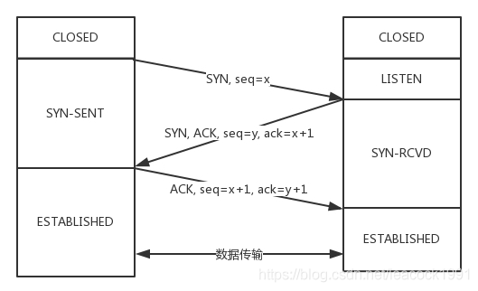
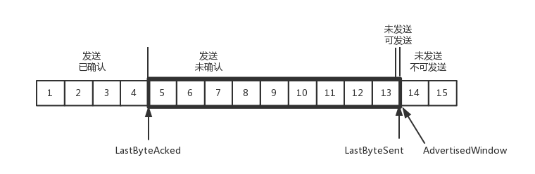
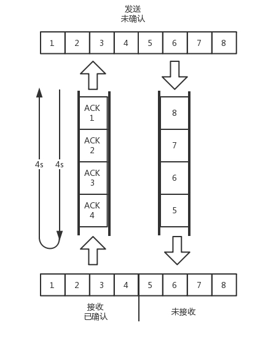

# 傳輸層的協議

## # 第10講| UDP協議

傳輸層裡比較重要的兩個協議，一個是TCP，一個是UDP。

### |> TCP 和UDP 有哪些區別？

一般面試的時候問這兩個協議的區別，大部分人會回答，TCP 是面向連接的，UDP 是面向無連接的。

什麼叫面向連接 : 

- **所謂的建立連接，是為了在客戶端和服務端維護連接，而建立一定的數據結構來維護雙方交互的狀態， 用這樣的數據結構來保證所謂的面向連接的特性。**
  - **TCP提供可靠交付**。通過TCP連接傳輸的數據，無差錯、不丟失、不重複、並且按序到達。
  - IP包是沒有任何可靠性保證的，一旦發出去，都只能隨它去。而**UDP繼承了IP包的特性，不保證不丟失，不保證按順序到達**。

面向字節流 : 

- **TCP是面向字節流的**。發送的時候發的是一個流，沒頭沒尾。之所以變成了流，是TCP自己的狀態維護做的事情。
- IP包不是一個流，而是一個個的IP包。而**UDP繼承了IP的特性，基於數據報的，一個一個地發，一個一個地收**。

擁塞控制 :

- **TCP是可以有擁塞控制**的。它意識到包丟棄了或者網絡的環境不好了，就會根據情況調整自己的行為，看看是不是發快了，要不要發慢點。

  --->  因而TCP是一個有狀態服務，能精確地記著發送了沒有，接收到沒有，發送到哪個了，應該接收哪個了，錯一點都不行。

- **UDP就不會，應用讓我發，我就發，管它洪水滔天**。

  --->  UDP則是無狀態服務，發出去就發出去了。

  - 如果MAC層定義了本地局域網的傳輸行為，IP層定義了整個網絡端到端的傳輸行為，
  - 這兩層基本定義了這樣的基因：網絡傳輸是以包為單位的，二層叫幀，網絡層叫包，傳輸層叫段。籠統地稱為包。
  - 包單獨傳輸，自行選路，在不同的設備封裝解封裝，不保證到達。基於這個基因，UDP完全繼承了這些特性。

### |> UDP包頭是什麼樣的？

[為什麼 UDP 頭只有 8 個字節](https://draveness.me/whys-the-design-udp-minimum-header/)

當發送的UDP包到達目標機器後，發現MAC地址匹配，於是就取下來，將剩下的包傳給處理IP層的代碼。把IP頭取下來，發現目標IP匹配，接下來這裡面的數據包是給誰呢？

接收包的那台機器怎知道是 UDP 還是 TCP

- 在IP頭里面有個8位協議，這裡會存放，數據裡面到底是TCP還是UDP，當然這裡是UDP。於是，如果我們知道UDP頭的格式，就能從數據裡面，將它解析出來。

數據解析出來以後給誰處理？

- 處理完傳輸層的事情，內核的事情基本就完成了，裡面的數據應該交給應用程序自己去處理，可是一台機器上跑著這麼多的應用程序，應該給誰呢？

- 無論應用程序寫的使用TCP傳數據，還是UDP傳數據，都要監聽一個端口（有源端口號和目標端口號，因為是兩端通信）。正是這個端口，用來區分應用程序，因此端口不能衝突呢。根據 TCP 、UDP 包頭裡面的端口號，將數據交給相應的應用程序。

UDP包頭


### |> UDP的三大特點

第一，溝通簡單，

- 不需要大量的數據結構、處理邏輯、包頭字段。前提是它相信網絡通路默認就是很容易送達的，不容易被丟棄的。

第二，輕信他人。

- 它不會建立連接，雖然有端口號，但是監聽在這個地方，誰都可以傳給他數據，他也可以傳給任何人數據，甚至可以同時傳給多個人數據。

第三，愣頭青，做事不懂權變。

- 不會根據網絡的情況進行發包的擁塞控制，無論網絡丟包丟成啥樣了，它該怎麼發還怎麼發。

### |>UDP的三大使用場景

**第一，需要資源少，在網絡情況比較好的內網，或者對於丟包不敏感的應用**。

- 的DHCP就是基於UDP協議的。一般的獲取IP地址都是內網請求，而且一次獲取不到IP又沒事，過一會兒還有機會。
- PXE可以在啟動的時候自動安裝操作系統，操作系統鏡像的下載使用的TFTP，這個也是基於UDP協議的。在還沒有操作系統的時候，客戶端擁有的資源很少，不適合維護一個複雜的狀態機，而是因為是內網，一般也沒啥問題。

**第二，不需要一對一溝通，建立連接，而是可以廣播的應用**。

- UDP的不面向連接的功能，可以使得可以承載廣播或者多播的協議。DHCP就是一種廣播的形式，就是基於UDP協議的。

- IP地址的D類地址，也即組播地址，使用這個地址，可以將包組播給一批機器。當一台機器上的某個進程想監聽某個組播地址的時候，需要發送IGMP包，所在網絡的路由器就能收到這個包，知道有個機器上有個進程在監聽這個組播地址。當路由器收到這個組播地址的時候，會將包轉發給這台機器，這樣就實現了跨路由器的組播。

- 雲中網絡部分，有一個協議VXLAN，也是需要用到組播，也是基於UDP協議的。

**第三，需要處理速度快，時延低，可以容忍少數丟包，但是要求即便網絡擁塞，也毫不退縮，一往無前的時候**。

- UDP簡單、處理速度快，不像TCP那樣，各種重傳、保證順序，會有時延。而TCP在網絡不好出現丟包的時候，擁塞控制策略會主動的退縮，降低發送速度，用戶本來就卡，擁塞控制策略下更卡了。

- 當前很多應用都是要求低時延的，它們不想用TCP如此復雜的機制，而是想根據自己的場景，實現自己的可靠和連接保證。

  例如，

  - 如果應用自己覺得，有的包丟了就丟了，沒必要重傳了，就可以算了，
  - 有的比較重要，則應用自己重傳，而不依賴於TCP。
  - 有的前面的包沒到，後面的包到了，那就先給客戶展示後面的，沒必要非得等到齊了
  - 如果網絡不好，丟了包，那更要盡快傳啊，速度不能降下來啊，要擠占帶寬，搶在客戶失去耐心之前到達。

- 如果你實現的應用需要有自己的連接策略，可靠保證，時延要求，使用UDP，然後在應用層實現這些是再好不過了。

### |> 基於UDP的的五個例子

**一：網頁或者APP的訪問**

- 原來訪問網頁和手機APP都是基於HTTP協議的。
  - HTTP協議是基於TCP的，建立連接都需要多次交互，對於時延比較大的移動互聯網來講，建立一次連接需要的時間會比較長，而且是移動過程中，TCP可能還會斷了重連，也是很耗時的。
  - 目前的HTTP協議，往往採取多個數據通道共享一個連接的情況，這樣本來為了加快傳輸速度，但是TCP的嚴格順序策略使得哪怕共享通道，前一個不來，後一個和前一個即便沒關係，也要等著，時延也會加大。

- 而`QUIC （全稱Quick UDP Internet Connections，快速UDP互聯網連接）`是Google提出的一種基於UDP改進的通信協議，其目的是降低網絡通信的延遲，提供更好的用戶互動體驗。
  - QUIC在應用層上，會自己實現快速連接建立、減少重傳時延，自適應擁塞控制。

**二：流媒體的協議**

[RTMP、HTTP-FLV、HLS，你了解常見的三大直播協議嗎](https://www.upyun.com/tech/article/352/RTMP%E3%80%81HTTP-FLV%E3%80%81HLS%EF%BC%8C%E4%BD%A0%E4%BA%86%E8%A7%A3%E5%B8%B8%E8%A7%81%E7%9A%84%E4%B8%89%E5%A4%A7%E7%9B%B4%E6%92%AD%E5%8D%8F%E8%AE%AE%E5%90%97.html)

> **常見的直播協議**
>
> **RTMP，全稱Real Time Messaging Protocol，即實時消息傳送協議**。Adobe公司為Flash播放器和服務器之間音視頻數據傳輸開發的私有協議。工作在TCP之上的明文協議，默認使用端口1935。協議中的基本數據單元成為消息（Message），傳輸的過程中消息會被拆分為更小的消息塊（Chunk）單元。最後將分割後的消息塊通過TCP協議傳輸，接收端再反解接收的消息塊恢復成流媒體數據。
>
> - 優點：
>   - RTMP 是專為流媒體開發的協議，同時它Adobe Flash 支持好，基本上所有的編碼器（攝像頭之類）都支持RTMP 輸出。
>   - Windows 的瀏覽器基本上都支持Flash。
>   - 適合長時間播放
>   - 延遲相對較低，一般延時在1-3s 之間，一般的視頻會議，互動式直播，完全是夠用的。
>
> - 不足的地方。
>   - 一方面是它是基於TCP 傳輸，非公共端口，可能會被防火牆阻攔
>   - RTMP 為Adobe 私有協議，很多設備無法播放，特別是在iOS 端，需要使用第三方解碼器才能播放。（在 PC 瀏覽器上需要開啟 Flash 才能播放，RTMP 無法在手機的瀏覽器上播放）
>   - Adobe 將於2020年停止支援 Flash

- 現在直播比較火，直播協議多使用`RTMP`，而這個RTMP協議也是基於TCP的。

- RTMP對TCP的優化：

  - TCP的嚴格順序傳輸 : 

    要保證前一個收到了，下一個才能確認，如果前一個收不到，下一個就算包已經收到了，在緩存裡面，也需要等著。

    - 對於直播來講，這顯然是不合適的，如果老的視頻幀是沒來就等著，卡頓了，新的也看不了，那就會丟失客戶，所以直播，實時性比較比較重要，寧可丟包，也不要卡頓的。

  - 丟包 : 

    視頻的連續幀裡面，有的幀重要，有的不重要，如果必須要丟包，隔幾個幀丟一個，其實看視頻的人不會感知，但是如果連續丟幀，就會感知了，因而在網絡不好的情況下，應用希望選擇性的丟幀。

  - 擁塞控制 :

    還有就是當網絡不好的時候，TCP協議會主動降低發送速度，這對本來當時就卡的看視頻來講是要命的，應該應用層馬上重傳，而不是主動讓步。因而，很多直播應用，都基於UDP實現了自己的視頻傳輸協議。

**三：實時遊戲**

- 遊戲有一個特點，就是實時性比較高。快一秒你幹掉別人，慢一秒你被別人爆頭，所以很多職業玩家會買非常專業的鼠標和鍵盤，爭分奪秒。
  - 實時遊戲中客戶端和服務端要建立長連接，來保證實時傳輸。
  - 但是遊戲玩家很多，服務器卻不多。
    - TCP連接 --> 需要在內核維護一些數據結構，因而一台機器能夠支撐的TCP連接數目是有限的，
    - UDP連接 --> 由於UDP是沒有連接的，在異步IO機制引入之前，常常是應對海量客戶端連接的策略。

- TCP的強順序問題：

  對戰的遊戲，對網絡的要求很簡單，玩家通過客戶端發送給服務器鼠標和鍵盤行走的位置，服務器會處理每個用戶發送過來的所有場景，處理完再返回給客戶端，客戶端解析響應，渲染最新的場景展示給玩家。不需要保證前一個收到了，下一個才能確認，只要最新的。

- 數據包丟失：

  如果出現一個數據包丟失，所有事情都需要停下來等待這個數據包重發。客戶端會出現等待接收數據， 然而玩家並不關心過期的數據，激戰中卡1秒，等能動了都已經死了。

- 擁塞控制 :

  遊戲對實時要求較為嚴格的情況下，採用自定義的可靠UDP協議，自定義重傳策略，能夠把丟包產生的延遲降到最低，盡量減少網絡問題對遊戲性造成的影響。

**四：IoT物聯網**

- 物聯網領域終端資源少，很可能只是個內存非常小的嵌入式系統，而維護TCP協議代價太大；
- 物聯網對實時性要求也很高，而TCP還是因為上面的那些原因導致時延大。
  - Google旗下的Nest建立Thread Group，推出了物聯網通信協議Thread，就是基於UDP協議的。

**五：移動通信領域**

- 在4G網絡裡，移動流量上網的數據面對的協議GTP-U是基於UDP的。
  - 因為移動網絡協議比較複雜，而GTP協議本身就包含複雜的手機上線下線的通信協議。
  - 如果基於TCP，TCP的機制就顯得非常多餘。

### |>小結

- 如果將TCP比作成熟的社會人，UDP則是頭腦簡單的小朋友。TCP複雜，UDP簡單；TCP維護連接, UDP誰都相信；TCP會堅持知進退；UDP愣頭青一個，勇往直前；
- UDP雖然簡單，但它有簡單的用法。它可以用在環境簡單、需要多播、應用層自己控制傳輸的地方。例如DHCP、VXLAN、QUIC 等。

> 兩個思考題

1. 都說TCP是面向連接的，在計算機看來，怎麼樣才算一個連接呢？
2. 你知道TCP的連接是如何建立，又是如何關閉的嗎？

## # 第11講| TCP協議（上）：因性惡而復雜，先惡後善反輕鬆

[圖文詳解互聯網根基之HTTP](https://www.cnblogs.com/sunsky303/p/10628927.html)

- 在任意時刻計算機都可以有幾條 TCP 連接處於打開狀態。

-  TCP 是通過端口號來保持 所有這些連接持續不斷地運行。IP 地址可以將你連接到正確的計算機， 而端口號則可以將你連接到正確的應用程序上去。 
- TCP 連接是通過 4 個值來識別的：` < 源 IP 地址、源端口號、目的 IP 地址、目的端口號 >` 這 4 個值一起唯一地定義了一條連接。
- 兩條不同的 TCP 連接不能擁有 4 個完全相同 的地址組件值（但不同連接的部分組件可以擁有相同的值）。


### |> TCP包頭格式


- **源端口號**和**目標端口號**是不可少的
  - 這一點和UDP是一樣的。如果沒有這兩個端口號。數據就不知道應該發給哪個應用。

- 接下來是**包的序號 **---> 編號是為了解決亂序問題。

- 是**確認序號** **---> 解决不丢包的問題
  - 發出去的包應該有簽收確認的回覆，如果沒有收到就應該重新發送，直到送達。

TCP是靠譜的協議，但是這不能說明它面臨的網絡環境好。

- 從IP層面來講，如果網絡狀況的確那麼差， 是沒有任何可靠性保證的，而作為IP的上一層TCP也無能為力，唯一能做的就是更加努力，不斷重傳，通過各種算法保證。
- 也就是說，對於TCP來講，IP層你丟不丟包，我管不著，但是我在我的層面上，會努力保證可靠性，盡力不失約。

- 一些**狀態位**。
  - SYN是發起一個連接，ACK是回复，RST是重新連接，FIN是結束連接等。TCP是面向連接的，因而雙方要維護連接的狀態，這些帶狀態位的包的發送，會引起雙方的狀態變更。
  - 就像人與人之間的信任會經過多次交互才能建立。

- **窗口大小**。

  - TCP要做流量控制，

    通信雙方各聲明一個窗口，標識自己當前能夠的處理能力，別發送的太快，撐死我，也別發的太慢，餓死我。

  - TCP還會做擁塞控制，

    對於真正的通路堵車不堵車，它無能為力，唯一能做的就是控制自己，也即控制發送的速度。不能改變世界，就改變自己嘛。

通過對TCP頭的解析，我們知道要掌握TCP協議，重點應該關注以下幾個問題：

- 順序問題，穩重不亂；
- 丟包問題，承諾靠譜；
- 連接維護，有始有終；
- 流量控制，把握分寸；
- 擁塞控制，知進知退。

### |> TCP的三次握手

> 建立一個連接

所有的問題，首先都要先建立一個連接，先來看連接維護問題。

TCP的連接建立，我們常常稱為三次握手。也常稱為"請求-> 應答-> 應答之應答”的三個回合。

- A：您好，我是A。
- B：您好A，我是B。
- A：您好B。

假設這個通路是非常不可靠的，

- 請求 :

  A要發起一個連接，當發了第一個請求杳無音信的時候，會有很多的可能性，

  - 比如第一個請求包丟了，
  - 沒有丟，但是繞了彎路，超時了，
  - 還有B沒有響應，不想和我連接。

  A不能確認結果，於是再發，再發。終於，有一個請求包到了B，但是請求包到了B的這個事情，目前A還是不知道的，A還有可能再發。

  

- 應答 :

  B收到了請求包，就知道了A的存在，並且知道A要和它建立連接。

  - 如果B不樂意建立連接，則A會重試一陣後放棄，連接建立失敗；
  - 如果B是樂意建立連接的，則會發送應答包給A。

  對於B來說，這個應答包也是一入網絡深似海，不知道能不能到達A。這個時候B自然不能認為連接是建立好了，因為應答包仍然會丟，會繞彎路，或者A已經掛了都有可能。

  - 這個時候B還能碰到一個詭異的現象，就是A和B原來建立了連接，做了簡單通信後，結束了連接。但A建立連接的時候，請求包重複發了幾次，有的請求包繞了一大圈又回來了，B會認為這也是一個正常的的請求的話，因此在一次建立了連接，可以想像，這個連接不會進行下去，也沒有個終結的時候，純屬單相思了。

    ---> 因而兩次握手肯定不行。

  B發送的應答可能會發送多次，但是只要一次到達A，A就認為連接已經建立了，因為對於A來講，他的消息有去有回。

  

- 應答之應答 :

  A會給B發送應答之應答，而B也在等這個消息，才能確認連接的建立，只有等到了這個消息，對於B來講，才算它的消息有去有回。

  - A發給B的應答之應答也會丟，也會繞路，甚至B掛了。
  - 按理來說，還應該有個應答之應答之應答，這樣下去就沒底了。所以四次握手是可以的，四十次都可以，關鍵四百次也不能保證就真的可靠了。只要雙方的消息都有去有回，就基本可以了。

  好在大部分情況下，A和B建立了連接之後，A會馬上發送數據的，一旦A發送數據，就能立即得知發生的問題並解決

  - 如A發給B的應答丟了，當A後續發送的數據到達的時候，B可以認為這個連接已經建立
  - 如B壓根就掛了，A發送的數據，會報錯，說B不可達，A就知道B出事情了。

  當然你可以說A比較壞，就是不發數據，建立連接後空著。

  - 程序設計的時候，可以要求開啟keepalive機制，即使沒有真實的數據包，也有探活包。
  - 服務端B的程序設計者，對於A這種長時間不發包的客戶端，可以主動關閉，從而空出資源來給其他客戶端使用。

> TCP包的序號的問題

三次握手除了雙方建立連接外，主要還是為了溝通一件事情，就是TCP包的序號的問題。

- A要告訴B，我這面發起的包的序號起始是從哪個號開始的，B同樣也要告訴A，B發起的包的序號起始是從哪個號開始的。為什麼序號不能都從1開始呢？因為這樣往往會出現衝突。
  - 例如，A連上B之後，發送了1、2、3三個包，但是發送3的時候，中間丟了，或者繞路了，於是重新發送，後來A掉線了，重新連上B後，序號又從1開始，然後發送2, 但是壓根沒想發送3,但是上次繞路的那個3又回來了，發給了B，B自然認為，這就是下一個包，於是發生了錯誤。
  - 因而，每個連接都要有不同的序號。這個序號的起始序號是隨著時間變化的，可以看成一個32位的計數器，每4ms加一，如果計算一下，如果到重複，需要4個多小時，那個繞路的包早就死翹翹了，因為我們都知道IP包頭里面有個TTL，也即生存時間。

> 狀態機

雙方終於建立了信任，建立了連接。為了維護這個連接，雙方都要維護一個狀態機，在連接建立的過程中，雙方的狀態變化時序圖就像這樣。



- 一開始，客戶端和服務端都處於CLOSED狀態。
  - 先是服務端主動監聽某個端口，處於LISTEN狀態。
  - 然後客戶端主動發起連接SYN，之後處於SYN-SENT狀態。
  - 服務端收到發起的連接，返回SYN，並且ACK客戶端的SYN，之後處於SYN-RCVD狀態。
  - 客戶端收到服務端發送的SYN和ACK之後，發送ACK的ACK，之後處於ESTABLISHED狀態，因為它一發一收成功了。
  - 服務端收到ACK的ACK之後，處於ESTABLISHED狀態，因為它也一發一收了。

### |> TCP四次揮手

> 和平分手

接下來說一說"拜拜”，好說好散。這常被稱為四次揮手。

**半關閉的狀態 : **

- A：B啊，我不想玩了。

- B：哦，你不想玩了啊，我知道了。
  - 這個時候，還只是A不想玩了，也即A不會再發送數據，但是B不能在ACK的時候直接關閉，因為很有可能A是發完了最後的數據就準備不玩了，但是B還沒做完自己的事情，還是可以發送數據的，所以稱為**半關閉的狀態**。

**關閉連接 : **

這個時候A可以選擇不再接收數據了，也可以選擇最後再接收一段數據，等待B也主動關閉。

- B：A啊，好吧，我也不玩了，拜拜。
- A：好的，拜拜。

這樣整個連接就關閉了。但是這個過程有沒有異常情況呢？當然有，上面是和平分手的場面。

>異常情況

**半關閉的狀態 : **

- A開始說"不玩了”，B說"知道了”，這個回合，不會有問題的，因為在此之前，雙方還處於合作的狀態，如果A說"不玩了”，沒有收到回复，則A會重新發送"不玩了”。
- 但是這個回合結束之後， 就有可能出現異常情況了，因為已經有一方率先撕破臉。
  - 一種情況是，A說完"不玩了”之後，A直接跑路，會有問題，因為B還沒有發起結束，而如果A跑路，B就算發起結束，也得不到回答，B就不知道該怎麼辦了。
  - 另一種情況是，A說完"不玩了”之後，B直接跑路，會有問題的，因為A不知道B是還有事情要處理，還是過一會兒會發送結束。

解決 : 

那怎麼解決這些問題呢？TCP協議專門設計了幾個狀態來處理這些問題。我們來看斷開連接的時候的狀態時序圖。 


斷開的時候，

- 當A說"不玩了”，就進入FIN WAIT 1的狀態，
- B收到"A不玩”的消息後，發送知道了，就進入CLOSE_WAIT的狀態。

- A收到"說知道了”，就進入FIN_WAIT_2的狀態，
  - 如果這個時候B直接跑路，則A將永遠在這個狀態。
    - TCP協議裡面並沒有對這個狀態的處理，但是Linux有，可以調整tcp_fin_timeout 這個參數，設置一個超時時間。
  - 如果B沒有跑路，發送了"B也不玩了”的請求到達A時，A發送"知道B也不玩了”的ACK後，從FIN WAIT 2狀態結束，
    - 按說A可以跑路了，但是最後的這個ACK萬一B收不到呢？則B會重新發一個"B不玩了”，這個時候A已經跑路了的話，B就再也收不到ACK 了，因而TCP協議要求A最後等待一段時間TIME WAIT，這個時間要足夠長，長到如果B沒收到ACK的話，"B說不玩了”會重發的, A會重新發一個ACK並且足夠時間到達B。
    - A直接跑路還有一個問題是，A的端口就直接空出來了，但是B不知道，B原來發過的很多包很可能還在路上，如果A的端口被一個新的應用佔用了，這個新的應用會收到上個連接中B發過來的包，雖然序列號是重新生成的，但是這裡要上一個雙保險，防止產生混亂，因而也需要等足夠長的時間，等到原來B發送的所有的包都死翹翹，再空出端口來。
- TCP協議要求A最後等待一段時間TIME WAIT
  - 等待的時間設為2MSL，`MSL是Maximum Segment Lifetime，報文最大生存時间`，它是任何報文在網絡上存在的最長時間，超過這個時間報文將被丟棄。因為TCP報文基於是IP協議的，而IP頭中有一個TTL域，是IP數據報可以經過的最大路由數，每經過一個處理他的路由器此值就減1,當此值為0則數據報將被丟棄，同時發送ICMP報文通知源主機。協議規定MSL為2分鐘，實際應用中常用的是30秒，1分鐘和2分鐘等。
  - 還有一個異常情況就是，B超過了2MSL的時間，依然沒有收到它發的FIN的ACK,怎麼辦呢？按照TCP的原理，B當然還會重發FIN，這個時候A再收到這個包之後，A就表示，我已經在這裡等了這麼長時間了，已經仁至義盡了，之後的我就都不認了，於是就直接發送RST，B就知道A早就跑了。

### |> TCP狀態機

將連接建立和連接斷開的兩個時序狀態圖綜合起來，就是這個著名的TCP的狀態機。學習的時候比較建議將這個狀態機和時序狀態機對照著看。


- 圖中加黑加粗的部分，是上面說到的主要流程，
  - 其中阿拉伯數字的序號，是連接過程中的順序，
  - 而大寫中文數字的序號，是連接斷開過程中的順序。
- 加粗的實線是客戶端A的狀態變遷，
- 加粗的虛線是服務端B的狀態變遷。

### |> 小結

- TCP包頭很複雜，但是主要關註五個問題，順序問題，丟包問題，連接維護，流量控制，擁塞控制;
- 連接的建立是經過三次握手，斷開的時候四次揮手，一定要掌握狀態圖。

> 兩個思考題。

1. TCP的連接有這麼多的狀態，你知道如何在系統中查看某個連接的狀態嗎？
2. 這一節僅僅講了連接維護問題，其實為了維護連接的狀態，還有其他的數據結構來處理其他的四個問題，那你知道是什麼嗎？

## # 第12講| TCP協議（下）：西行必定多妖孽，恆心智慧消磨難

出了網關，那就是在公網上傳輸數據，公網往往是不可靠的，因而需要很多的機制去保證傳輸的可靠性，即各種重傳的策略，還有大量的算法。

如何靠譜？

- 客戶端每發送的一個包，服務器端都應該有個回复，如果服務器端超過一定的時間沒有回复，客戶端就會重新發送這個包，直到有回复。
  - 這個發送應答的過程像兩個人直接打電話，你一句，我一句。但是這種方式的缺點是效率比較低。如果一方在電話那頭處理的時間比較長，這一頭就要乾等著，雙方都沒辦法干其他事情。
- 先將事情記錄下來，辦完一件回復一件。在他辦事情的過程中，你還可以同時交代新的事情，這樣雙方就並行了。
  - 每交代下屬一個事情，雙方的本子都要記錄一下。
  - 當你的下屬做完一件事情，就回复你，做完了，你就在你的本子上將這個事情劃去。同時你的本子上每件事情都有時限，如果超過了時限下屬還沒有回复，你就要主動重新交代一下

- 既然多件事情可以一起處理，那就需要給每個事情編個號，防止弄錯了。
  - 看任務的時候，看JIRA的ID，而不是每次都要描述一下具體的事情。
  - 在大部分情況下，對於事情的處理是按照順序來的，先來的先處理，這就給應答和匯報工作帶來了方便。

### |> 如何實現一個靠譜的協議？

TCP協議使用的也是同樣的模式。

- 為了保證順序性，

  每一個包都有一個ID。在建立連接的時候，會商定起始的ID是什麼，然後按照ID一個個發送。

- 為了保證不丟包，

  對於發送的包都要進行應答，但是這個應答也不是一個一個來的，而是會應答某個之前的ID，表示都收到了，這種模式稱為`累計確認`或者`累計應答`( `cumulative acknowledgment`)。

- 為了記錄所有發送的包和接收的包，

  TCP也需要發送端和接收端分別都有緩存來保存這些記錄。發送端的緩存裡是按照包的ID一個個排列，根據處理的情況分成四個部分。

  - 第一部分：發送了並且已經確認的。交代下屬並且已經做完的，應該劃掉的。
  - 第二部分：發送了並且尚未確認的。交代下屬但是還沒做完的，需要等待做完的回復之後，才能劃掉。
  - 第三部分：沒有發送，但是已經等待發送的。還沒有交代給下屬，但是馬上就要交代的。
  - 第四部分：沒有發送，並且暫時還不會發送的。還沒有交代給下屬，而且暫時還不會交代給下屬的。

  為什麼要區分第三部分和第四部分呢？

  - 流量控制 --->  一個員工能夠同時處理多少事情呢？
  - 在TCP裡，接收端會給發送端報一個窗口的大小，叫Advertised window。這個窗口的大小應該等於上面的第二部分加上第三部分，就是已經交代了沒做完的加上馬上要交代的。超過這個窗口的，接收端做不過來，就不能發送了。

於是，`發送端`需要保持下面的數據結構。


- LastByteAcked :第一部分和第二部分的分界線
- LastByteSent：第二部分和第三部分的分界線
- LastByteAcked + AdvertisedWindow :第三部分和第四部分的分界線


對於`接收端`來講，它的緩存裡記錄的內容要簡單一些。

- 第一部分：接受並且確認過的。也就是我領導交代給我，並且我做完的。
- 第二部分：還沒接收，但是馬上就能接收的。也即是我自己的能夠接受的最大工作量。
- 第三部分：還沒接收，也沒法接收的。也即超過工作量的部分，實在做不完。

對應的數據結構就像這樣。


- MaxRcvBuffer :最大緩存的量；
- LastByteRead 之後是已經接收了，但是還沒被應用層讀取的；
- NextByteExpected 是第一部分和第二部分的分界線。

第二部分的窗口有多大呢？

- NextByteExpected 和 LastByteRead的差其實是還沒被應用層讀取的部分佔用掉的MaxRcvBuffer的量，我們定義為A。
- AdvertisedWindow 其實是MaxRcvBuffer 減去A。
- 也就是：`AdvertisedWindow = MaxRcvBuffer - ((NextByteExpected - 1) - LastByteRead)`。

那第二部分和第三部分的分界線在哪裡呢？

- NextByteExpected 加AdvertisedWindow 就是第二部分和第三部分的分界線，其實也就是LastByteRead 加上MaxRcvBuffer。

- 其中第二部分裡面，由於街受到的包可能不是順序的，會出現空擋，只有和第一部分連續的，可以馬上進行回复，中間空著的部分需要等待，哪怕後面的已經來了。

### |> 順序問題與丟包問題

接下來結合一個例子來看。


- 還是剛才的圖，在`發送端`來看，1、2、3已經發送並確認；4、5、6、7、8、9都是發送了還沒確認； 10、11、12是還沒發出的；13、14、15是接收方沒有空間，不准備發的。


- 在`接收端`來看，1、2、3、4、5是已經完成ACK，但是沒讀取的；6、7是等待接收的；8、9是已經接收，但是沒有ACK的。

發送端和接收端當前的狀態如下：

- 1、2、3沒有問題，雙方達成了一致。
- 4、5接收方說ACK 了，但是發送方還沒收到，有可能丟了，有可能在路上。
- 6、7、8、9肯定都發了，但是8、9已經到了，但是6、7沒到，出現了亂序，緩存著但是沒辦法ACK。

根據這個例子，我們可以知道，順序問題和丟包問題都有可能發生，所以我們先來看確認與重發的機制。

假設4的確認到了，不幸的是，5的ACK丟了，6、7的數據包丟了，這該怎麼辦呢？

- —種方法就是**超時重試**，也即對每一個發送了，但是沒有ACK的包，都有設一個定時器，超過了一定的時間，就重新嘗試。
  - 但是這個超時的時間如何評估呢？這個時間不宜過短，時間必須大於往返時間RTT，否則會引起不必要的重傳。也不宜過長，這樣超時時間變長，訪問就變慢了。
  - 估計往返時間，需要TCP通過採樣RTT的時間，然後進行加權平均，算出一個值，而且這個值還是要不斷變化的，因為網絡狀況不斷的變化。除了採樣RTT，還要採樣RTT的波動範圍，計算出一個估計的超時時間。由於重傳時間是不斷變化的，我們稱為**自適應重傳算法(Adaptive Retransmission Algorithm)**。
  - 如果過一段時間，5、6、7都超時了，就會重新發送。接收方發現5原來接收過，於是丟棄5；6收到了，發送ACK，要求下一個是7, 7不幸又丟了。當7再次超時的時候，有**需要重傳的時候，TCP的策略是超時間隔加倍。每當遇到一次超時重傳的時候，都會將下一次超時時間間隔設為先前值的兩倍。兩次超時，就說明網絡環境差，不宜頻繁反復發送**。

超時觸發重傳存在的問題是，超時周期可能相對較長。那是不是可以有更快的方式呢？

- 有一個可以**快速重傳**的機制，當接收方收到一個序號大於下一個所期望的報文段時，就檢測到了數據流中的一個間格，於是**發送三個冗餘的ACK**，客戶端收到後，就在定時器過期之前，重傳丟失的報文段。
  - 例如，接收方發現6、8、9都已經接收了，就是7沒來，那肯定是丟了，於是發送三個6的ACK，要求下一個是7。客戶端收到3個，就會發現7的確又丟了，不等超時，馬上重發。

- 還有一種方式稱為**Selective Acknowledgment (SACK)**。這種方式需要在**TCP頭**里加一個SACK的東西，可以將**緩存的地圖**發送給發送方。例如可以發送ACK6、SACK8、SACK9，有了地圖，發送方一下子就能看出來是7丟了。

### |> 流量控制問題

> 滑動窗口rwnd 的大小

在對於包的確認中，同時會攜帶一個窗口的大小。

先假設窗口不變的情況，窗口始終為9。4的確認來的時候，會右移一個，這個時候第13個包也可以發送了。


這個時候，假設發送端發送過猛，會將第三部分的10、11、12、13全部發送完畢，之後就停止發送了，未發送可發送部分為0。




當對於包5的確認到達的時候，在客戶端相當於窗口再滑動了一格，這個時候，才可以有更多的包可以發送了，例如第14個包才可以發送。


如果接收方實在處理的太慢，導致緩存中沒有空間了，可以通過確認信息修改窗口的大小，甚至可以設置為0,則發送方將暫時停止發送。

> 極端情況

假設一個極端情況，接收端的應用一直不讀取緩存中的數據，當數據包6確認後，窗口大小就不能再是9了，就要縮小一個變為8。


這個新的窗口8通過6的確認消息到達發送端的時候，你會發現窗口沒有平行右移，而是僅僅左面的邊右移了，窗口的大小從9改成了8。


如果接收端還是一直不處理數據，則隨著確認的包越來越多，窗口越來越小，直到為0。 


當這個窗口通過包14的確認到達發送端的時候，發送端的窗口也調整為0，停止發送。


如果這樣的話，發送方會定時發送窗口探測數據包，看是否有機會調整窗口的大小。當接收方比較慢的時候，要防止低能窗口綜合徵，別空出一個字節來就趕快告訴發送方，然後馬上又填滿了，可以當窗口太小的時候，不更新窗口，直到達到一定大小，或者緩衝區一半為空，才更新窗口。

這就是我們常說的流量控制。

### |> 擁塞控制問題

擁塞控制的問題，也是通過窗口的大小來控制的，

- 前面的滑動窗口rwnd 是怕發送方把接收方緩存塞滿，
- 而擁塞窗口cwnd，是怕把網絡塞滿。

這裡有一個公式`LastByteSent - LastByteAcked <= min {cwnd, rwnd}`，是擁塞窗口和滑動窗口共同控制發送的速度。

那發送方怎麼判斷網絡是不是滿呢？

- 這其實是個挺難的事情，因為對於TCP協議來講，他壓根不知道整個網絡路徑都會經歷什麼，對他來講就是一個黑盒。TCP發送包常被比喻為往一個水管裡面灌水，而TCP的擁塞控制就是在不堵塞，不丟包的情況下，盡量發揮帶寬。
  - 水管有粗細，網絡有帶寬，也即每秒鐘能夠發送多少數據；
  - 水管有長度，端到端有時延。
  - 在理想狀態下，水管裡面水的量=水管粗細x水管長度。對於到網絡上，通道的容量=帶寬x往返延遲。

- 如果我們設置發送窗口，使得發送但未確認的包為為通道的容量，就能夠撐滿整個管道。 



- 如圖所示，假設往返時間為8s，去4s,回4s，每秒發送一個包，每個包1024byte。已經過去了8s，則8個包都發出去了，
  - 其中前4個包已經到達接收端，但是ACK還沒有返回，不能算發送成功。
  - 5-8後四個包還在路上，還沒被接收。
  - 這個時候，整個管道正好撐滿，在發送端，已發送未確認的為8個包，正好等於帶寬，也即每秒發送1個包，乘以來回時間8s。

如果我們在網絡塞滿基礎上再調大窗口，使得單位時間內更多的包可以發送，會出現什麼現象呢？

- 丟包：

  原來發送一個包，從一端到達另一端，假設一共經過四個設備，每個設備處理一個包時間耗費1s，所以到達另一端需要耗費4s，

  - 如果發送的更加快速，則單位時間內，會有更多的包到達這些中間設備，這些設備還是只能每秒處理一個包的話，多出來的包就會被丟棄的，也是我們不想看到的。

- 重傳：

  這個四個設備本來每秒處理一個包，但是在這些設備上加緩存，處理不過來的在隊列裡面排著，這樣包就不會丟失，

  - 但是缺點是會增加時延，這個緩存的包，4s肯定到達不了接收端了，如果時延達到一定程度，就會超時重傳，也是我們不想看到的。

於是**TCP的擁塞控制主要來避免兩種現象，包丟失和超時重傳**。

- 一旦出現了包丟失和超時重傳就說明，發送速度太快了，要慢一點。
- 但是一開始怎麼知道速度多快呢，怎麼知道應該把窗口調整到多大？通過漏斗往瓶子裡灌水，要一開始慢慢的倒，然後發現總能夠倒進去，就可以越倒越快。這叫作`慢啟動`。
  - 一條TCP連接開始，cwnd設置為一個報文段，一次只能發送一個；
  - 當收到這一個確認的時候，cwnd 加一，於是一次能夠發送兩個；
  - 當這兩個的確認到來的時候，每個確認cwnd加一，兩個確認cwnd加二，於是一次能夠發送四個；
  - 當這四個的確認到來的時候，每個確認cwnd加一，四個確認cwnd加四，於是一次能夠發送八個。可以看出這是`指數性的增長`。
- 漲到什麼時候是個頭呢？有一個值ssthresh為65535個字節，當超過這個值的時候，就要小心一點了，不能倒這麼快了，可能快滿了，再慢下來。
  
- 每收到一個確認後，cwnd增加1/cwnd，我們接著上面的過程來，一次發送八個，當八個確認到來的時候，每個確認增加1/8,八個確認一共cwnd增加1,於是一次能夠發送九個，變成了`線性增長`。
  
- 但是線性增長還是增長，還是越來越多，直到有一天，水滿則溢，出現了擁塞，這時候一般就會一下子降低倒水的速度，等待溢出的水慢慢滲下去。

  - 擁塞的一種表現形式是丟包，需要超時重傳，

  - 重新開始慢啟動

    - 這個時候，將sshresh設為cwnd/2，將cwnd設為1， 重新開始慢啟動。
    - 這真是一旦超時重傳，馬上回到解放前。但是這種方式太激進了，將一個高速的傳輸速度一下子停了下來，會造成網絡卡頓。

  - 快速重傳算法。

    - 當接收端發現丟了一個中間包的時候，發送三次前一個包的ACK，於是發送端就會快速的重傳，不必等待超時再重傳。
    - TCP認為這種情況不嚴重，因為大部分沒丟，只丟了一小部分，cwnd減半為cwnd/2，然後sshthresh = cwnd，當三個包返回的時候，cwnd = sshthresh + 3,
    - 也就是沒有一夜回到解放前，而是還在比較高的值，呈線性增長。

    


正是這種知進退，使得時延很重要的情況下，反而降低了速度。但是如果你仔細想一下，TCP的擁塞控制主要來避免的兩個現象都是有問題的。

- 第一個問題是丟包並不代表著通道滿了，也可能是管子本來就漏水。例如公網上帶寬不滿也會丟包，這個時候就認為擁塞了，退縮了，其實是不對的。

- 第二個問題是TCP的擁塞控制要等到將中間設備都填充滿了，才發生丟包，從而降低速度，這時候已經晚了。其實TCP只要填滿管道就可以了，不應該接著填，直到連緩存也填滿。

為了優化這兩個問題，後來有了TCP **BBR擁塞算法**。它企圖找到一個平衡點，就是通過不斷的加快發送速度，將管道填滿，但是不要填滿中間設備的緩存，因為這樣時延會增加，在這個平衡點可以很好的達到高帶寬和低時延的平衡。


### |> 小結

- 順序問題、丟包問題、流量控制都是通過滑動窗口來解決的，這其實就相當於你領導和你的工作備忘錄，佈置過的工作要有編號，幹完了有反饋，活不能派太多，也不能太少；
- 擁塞控制是通過擁塞窗口來解決的，相當於往管道裡面倒水，快了容易溢出，慢了浪費帶寬，要摸著石頭過河，找到最優值。

> 兩個思考題：

1. TCP的BBR聽起來很牛，你知道他是如何達到這個最優點的嘛？
2. 學會了UDP和TCP，你知道如何基於這兩種協議寫程序嗎？這樣的程序會有什麼坑呢？

## # 第13講| 套接字Socket：Talk is cheap, show me the code

[106.網路分層模型及SOCKET/TCP/UDP/HTTP區別和聯絡](https://www.itread01.com/content/1547994258.html)


>什麼是Socket？
>
>- Socket又稱之為“套接字”，是系統提供的用於網路通訊的方法。它的實質並不是一種協議，沒有規定計算機應當怎麼樣傳遞訊息，只是給程式設計師提供了一個傳送訊息的介面，程式設計師使用這個介面提供的方法，傳送與接收訊息。
>- Socket描述了一個IP、埠對。它簡化了程式設計師的操作，知道對方的IP以及PORT就可以給對方傳送訊息，再由伺服器端來處理髮送的這些訊息。所以，Socket一定包含了通訊的雙發，即客戶端（Client）與服務端（server）。
>
>Socket是對TCP/IP協議的封裝，Socket本身並不是協議，而是一個呼叫介面（API），通過Socket，我們才能使用TCP/IP協議。

基於TCP和UDP協議的Socket編程。

在講TCP和UDP協議的時候，我們分客戶端和服務端，在寫程序的時候，也同樣這樣分。

Socket這個名字很有意思，翻譯成作插口或者插槽。可以想像為弄一根網線，一頭插在客戶端，一頭插在服務端，然後進行通信。所以在通信之前，雙方都要建立一個Socket。

在建立Socket的時候，應該設置什麼參數呢？Socket編程進行的是端到端的通信，往往意識不到中間經過多少局域網，多少路由器，因而能夠設置的參數，也只能是端到端協議之上`網絡層和傳輸層`的。

在網絡層,Socket函數需要指定到底是IPv4還是IPv6,分別對應設置為AF_INET和AF_INET6。另外，還要指定到底是TCP還是UDP。還記得咱們前面講過的，

- TCP協議是基於數據流的，所以設置為SOCK_STREAM，
- 而UDP是基於數據報的，因而設置為SOCK_DGRAM。

### |> 基於TCP協議的Socket程序函數調用過程

> 基於TCP協議的Socket程序函數調用過程

兩端創建了Socket之後，接下來的過程中，TCP和UDP稍有不同，我們先來看TCP。

1. TCP的`服務端`要先監聽一個端口，一般是先調用bind函數，給這個Socket賦予一個IP地址和端口。

   - 為什麼需要端口呢？當一個網絡包來的時候，內核要通過TCP頭里面的這個端口，來辨別對應的本地通訊進程(應用程序)，並把包給他。

     不同的進程端口號不同，因此在通訊前必須要分配一個沒有被訪問的端口號。

   - 為什麼要IP地址呢？有時候，一台機器會有多個網卡，也就會有多個IP地址，你可以選擇監聽所有的網卡，也可以選擇監聽一個網卡，這樣，只有發給這個網卡的包，才會給你。

2. 當`服務端`有了IP和端口號，就可以調用listen函數進行監聽。在TCP的狀態圖裡面，有一個listen狀態，當調用這個函數之後，服務端就進入了這個狀態，這個時候客戶端就可以發起連接了。
   - 在內核中，為每個Socket維護兩個隊列。
     - 一個是已經建立了連接的隊列，這時候連接三次握手已經完畢，處於established狀態；
     - 一個是還沒有完全建立連接的隊列，這個時候三次握手還沒完成，處於syn_rcvd 的狀態。
3. 接下來，`服務端`調用accept函數，拿出一個已經完成的連接進行處理。如果還沒有完成，就要等著。
4. 在服務端等待的時候，`客戶端`可以通過connect函數發起連接。
   - 先在參數中指明要連接的IP地址和端口號，然後開始發起三次握手。
   - 內核會給客戶端分配一個臨時的端口。
   - 一旦握手成功，服務端的accept 就會返回另一個Socket。
   - 這是一個經常考的知識點，就是監聽的Socket和真正用來傳數據的Socket是兩個，一個叫作監聽Socket，一個叫作已連接Socket。
5. 連接建立成功之後，雙方開始通過read和write函數來讀寫數據，就像往一個文件流裡面寫東西一樣。

這個圖就是基於TCP協議的Socket程序函數調用過程。

 


> 數據結構

- TCP的Socket就是一個文件流。
  - 因為，Socket在Linux中就是以文件的形式存在的。
  - 除此之外，還存在文件描述符。寫入和讀出，也是通過文件描述符。

- 在內核中，Socket是一個文件，

  - 那對應就有文件描述符。

  - 每一個進程都有一個數據結構task struct， 裡面指向一個文件描述符數組，來列出這個進程打開的所有文件的文件描述符。文件描述符是一個整數，是這個數組的下標。

    - 這個數組中的內容是一個指針，指向內核中所有打開的文件的列表。
    - 既然是一個文件，就會有一個inode，只不過Socket對應的inode不像真正的文件系統一樣，保存在硬盤上的，而是在內存中的。
    - 在這個inode中，指向了Socket在內核中的Socket結構。
      - 在這個結構裡面，主要的是兩個隊列，一個是發送隊列，一個是接收隊列。
      - 在這兩個隊列裡面保存的是一個緩存sk_buff。這個緩存裡面能夠看到完整的包的結構。看到這個，是不是能和前面講過的收發包的場景聯繫起來了？

    整個數據結構圖

    


### |> 基於UDP協議的Socket程序函數調用過程

UDP過程有些不一樣。

- UDP是沒有連接的，所以不需要三次握手，也就不需要調用listen 和connect，
- 但是，UDP的的交互仍然需要IP和端口號，因而也需要bind。

UDP是沒有維護連接狀態的，因而不需要每對連接建立一組Socket, 而是只要有一個Socket, 就能夠和多個客戶端通信。也正是因為沒有連接狀態，每次通信的時候，都調用sendto 和recvfrom，都可以傳入IP地址和端口。

這個圖的內容就是基於UDP協議的Socket程序函數調用過程。


### |> 服務器如何接更多的項目？

會了這幾個基本的Socket函數之後，你就可以輕鬆地寫一個網絡交互的程序了。就像上面的過程一樣， 在建立連接後，進行一個while循環。客戶端發了收，服務端收了發。

- 如果使用這種方法，基本上只能一對一溝通。如果你是一個服務器，同時只能服務一個客戶，肯定是不行的。

> 最大連接數 client最大tcp連接數

[服務器最大TCP連接數及調優匯總](https://www.itread01.com/content/1545153618.html)

**啟動線程數**：

- 啟動線程數=【任務執行時間/（任務執行時間-IO等待時間）】*CPU內核數

- 最佳啟動線程數和CPU內核數量成正比，和IO阻塞時間成反比。
  - 如果任務都是CPU計算型任務，那麽線程數最多不超過CPU內核數，因為啟動再多線程，CPU也來不及調度；
  - 相反如果是任務需要等待磁盤操作，網絡響應，那麽多啟動線程有助於提高任務並發度，提高系統吞吐能力，改善系統性能。

**單機最大**tcp連接數

先來算一下理論值，也就是最大連接數，系統會用一個四元組來標識一個TCP連接。

```
{local ip, local port,remote ip,remote port}
```

- client最大tcp連接數
  - client每次發起tcp連接請求時，除非綁定端口，通常會讓系統選取一個空閑的本地端口（local port），該端口是獨占的，不能和其他tcp連接共享。
  - tcp端口的數據類型是unsigned short，因此本地端口個數最大只有65536，端口0有特殊含義，不能使用，這樣可用端口最多只有65535，所以在全部作為client端的情況下，最大tcp連接數為65535，這些連接可以連到不同的server ip。

- server最大tcp連接數
  - server通常固定在某個本地端口上監聽，等待client的連接請求。
  - 不考慮地址重用（unix的SO_REUSEADDR選項）的情況下，即使server端有多個ip，本地監聽端口也是獨占的，因此server端tcp連接4元組中只有remote ip（也就是client ip）和remote port（客戶端port）是可變的，因此，`最大tcp連接為客戶端ip數×客戶端port數`，
  - 對IPV4，不考慮ip地址分類等因素，客戶端的IP數最多為2的32次方，
    - 最大tcp連接數約為2的32次方（ip數）×2的16次方（port數），也就是server端單機最大tcp連接數約為2的48次方。

- 實際的tcp連接數
  - 上面給出的是理論上的單機最大連接數，在實際環境中，服務端最大並發TCP連接數遠不能達到理論上限。
    - 首先主要是文件描述符限制，按照上面的原理，Socket都是文件，所以首先要通過ulimit配置文件描述符的數目；
    - 另一個限制是內存，按上面的數據結構，每個TCP連接都要佔用一定內存，操作系統是有限的。在unix/linux下默認2.6內核配置下，經過試驗，**每個socket占用內存在15~20k之間**。
    - 另外1024以下的端口通常為保留端口。
  - 對server端，通過增加內存、修改最大文件描述符個數等參數，單機最大並發TCP連接數超過10萬 是沒問題的，在實際應用中，對大規模網絡應用，還需要考慮C10K 問題。

>提高實際的tcp連接數

在資源有限的情況下，要想接更多的項目，就需要降低每個項目消耗的資源數目。

**方式一：將項目外包給其他公司（多進程方式）**

- 這就相當於你是一個代理，在那裡監聽來的請求。一旦建立了一個連接，就會有一個已連接Socket，這時候你可以創建一個子進程，然後將基於已連接Socket的交互交給這個新的子進程來做。
- 就像來了一個新的項目，但是項目不一定是你自己做，可以再註冊一家子公司，招點人，然後把項目轉包給這家子公司做，以後對接就交給這家子公司了，你又可以去接新的項目了。

這裡有一個問題是，如何創建子公司，並如何將項目移交給子公司呢？

- 在Linux下，創建子進程使用fork函數。通過名字可以看出，這是在父進程的基礎上完全拷貝一個子進程。
- 在Linux內核中，會復製文件描述符的列表，也會復制內存空間，還會復制一條記錄當前執行到了哪一行程序的進程。複製的時候在調用fork，複製完畢之後，父進程和子進程都會記錄當前剛剛執行完fork。
- 這兩個進程剛複製完的時候，幾乎一模一樣，只是根據fork的返回值來區分到底是父進程，還是子進程。如果返回值是0，則是子進程；如果返回值是其他的整數，就是父進程。

進程複製過程。 


- 因為複制了文件描述符列表，而文件描述符都是指向整個內核統一的打開文件列表的，因而父進程剛才因為accept創建的已連接Socket也是一個文件描述符，同樣也會被子進程獲得。
- 接下來，子進程就可以通過這個已連接Socket和客戶端進行互通了，當通信完畢之後，就可以退出進程，那父進程如何知道子進程幹完了項目，要退出呢？還記得fork返回的時候，如果是整數就是父進程嗎？這個整數就是子進程的ID，父進程可以通過這個ID查看子進程是否完成項目，是否需要退出。

**方式二：將項目轉包給獨立的項目組（多線程方式）**

上面這種方式你應該也能發現問題，如果每次接一個項目，都申請一個新公司，然後乾完了，就註銷掉這個公司，實在是太麻煩了。畢竟一個新公司要有新公司的資產，有新的辦公家具，每次都買了再賣，不划算。

於是你應該想到了，我們可以使用線程。相比於進程來講，這樣要輕量級的多。如果創建進程相當於成立新公司，購買新辦公家具，而創建線程，就相當於在同一個公司成立項目組。一個項目做完了，那這個項目組就可以解散，組成另外的項目組，辦公家具可以共用。

- 在Linux下，通過pthread_create創建一個線程，也是調用do_fork。不同的是，雖然新的線程在task列表會新創建一項，但是很多資源，例如文件描述符列表、進程空間，還是共享的，只不過多了一個引用而已。 


- 新的線程也可以通過已連接Socket處理請求，從而達到並發處理的目的。

上面基於進程或者線程模型的，其實還是有問題的。

- 新到來一個TCP連接，就需要分配一個進程或者線程。一台機器無法創建很多進程或者線程。有個C10K，它的意思是一台機器要維護1萬個連接，就要創建1萬個進程或者線程，那麼操作系統是無法承受的。如果維持1億用戶在線需要10萬台服務器，成本也太高了。

其實C10K問題就是，你接項目接的太多了，如果每個項目都成立單獨的項目組，就要招聘10萬人， 你肯定養不起，那怎麼辦呢？

**方式三：一個項目組支撐多個項目（IO多路復用，一個線程維護多個Socket）**

當然，一個項目組可以看多個項目了。這個時候，每個項目組都應該有個項目進度牆，將自己組看的項目列在那裡，然後每天通過項目牆看每個項目的進度，一旦某個項目有了進展，就派人去盯一下。

- 由於Socket是文件描述符，因而某個線程盯的所有的Socket，都放在一個文件描述符集合fd_set中， 這就是項目進度牆，然後調用select函數來監聽文件描述符集合是否有變化。一旦有變化，就會依次查看每個文件描述符。
- 那些發生變化的文件描述符在fd_set對應的位都設為1， 表示Socket可讀或者可寫，從而可以進行讀寫操作，然後再調用select，接著盯著下一輪的變化。。

**方式四：一個項目組支撐多個項目（IO多路復用，從''派人盯著"到''有事通知"）**
上面select函數還是有問題的，因為每次Socket所在的文件描述符集合中有Socket發生變化的時候，都需要通過輪詢的方式，也就是需要將全部項目都過一遍的方式來查看進度，這大大影響了一個項目組能夠支撐的最大的項目數量。因而使用select，能夠同時盯的項目數量由FD_SETSIZE限制。

如果改成事件通知的方式，情況就會好很多，項目組不需要通過輪詢挨個盯著這些項目，而是當項目進度發生變化的時候，主動通知項目組，然後項目組再根據項目進展情況做相應的操作。

- 能完成這件事情的函數叫epoll，它在內核中的實現不是通過輪詢的方式，而是通過註冊callback函數的方式，當某個文件描述符發送變化的時候，就會主動通知。


- 如圖所示，假設進程打開了Socket m, n, x等多個文件描述符，現在需要通過epoll來監聽是否這些Socket都有事件發生。
- 其中epoll_create創建一個epoll對象，也是一個文件，也對應一個文件描述符，同樣也對應著打開文件列表中的一項。
- 在這項裡面有一個紅黑樹，在紅黑樹里，要保存這個epoll要監聽的所有Socket。
  - 當epoll_ctl添加一個Socket的時候，其實是加入這個紅黑樹，同時紅黑樹里面的節點指向一個結構， 將這個結構掛在被監聽的Socket的事件列表中。
  - 當一個Socket來了一個事件的時候，可以從這個列表中得到epoll對象，並調用call back通知它。

這種通知方式使得監聽的Socket數據增加的時候，效率不會大幅度降低，能夠同時監聽的Socket的數目也非常的多了。上限就為系統定義的、進程打開的最大文件描述符個數。因而，epoll被稱為解決C10K問題的利器。

### |> 小結

- 需要記住TCP和UDP的Socket的編程中，客戶端和服務端都需要調用哪些函數；
- 寫一個能夠支撐大量連接的高並發的服務端不容易，需要多進程、多線程，而epoll機制能解決C10K問題。

> 兩個思考題：

1. epoll是Linux上的函數，那你知道Windows上對應的機制是什麼嗎？如果想實現一個跨平台的程序，你知道應該怎麼辦嗎？
2. 自己寫Socket還是挺複雜的，寫個HTTP的應用可能簡單一些。那你知道HTTP的工作機制嗎？