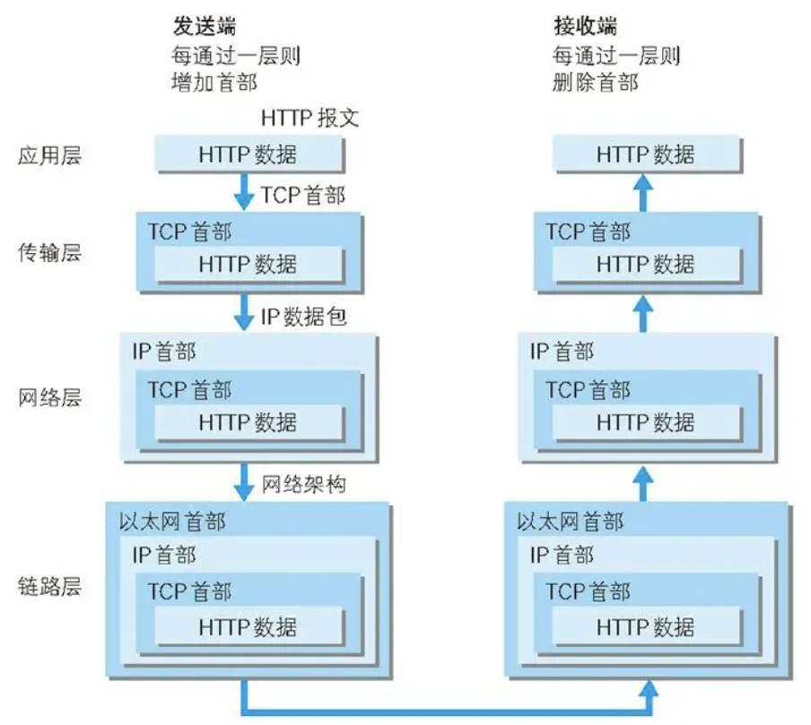
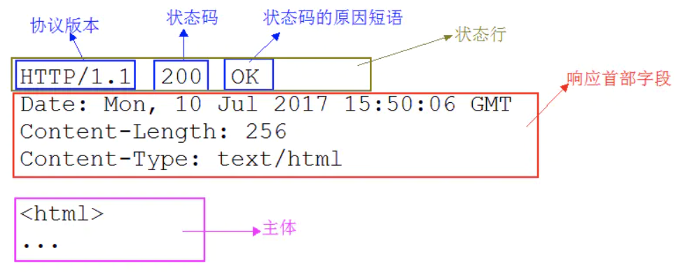
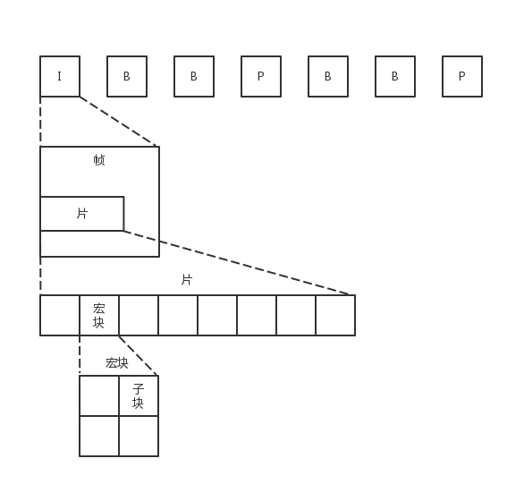
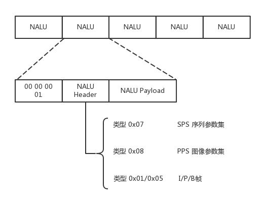
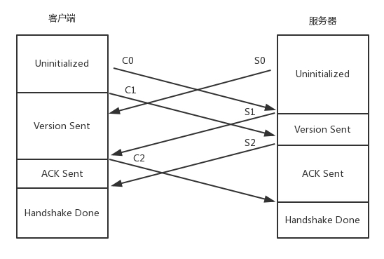
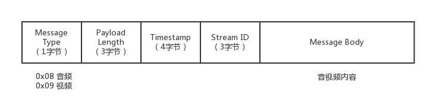
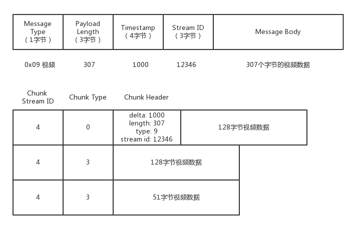
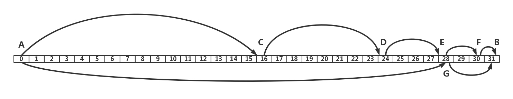

# 應用層的協議

## # 第14講| HTTP協議

[圖文詳解互聯網根基之HTTP](https://www.cnblogs.com/sunsky303/p/10628927.html)

1. 支持客戶/服務器模式。支持基本認證和安全認證。 

2. 簡單快速：客戶向服務器請求服務時，只需傳送請求方法和路徑。請求方法常用的有GET、HEAD、POST。每種方法規定了客戶與服務器聯繫的類型不同。由於HTTP協議簡單，使得HTTP服務器的程序規模小，因而通信速度很快。 

3. 靈活：HTTP允許傳輸任意類型的數據對象。正在傳輸的類型由Content-Type加以標記。

4. 高效：

   - HTTP 0.9和1.0使用非持續連接：限制每次連接只處理一個請求，服務器處理完客戶的請求，並收到客戶的應答後，即斷開連接。

   - HTTP 1.1使用持續連接：持久連接（HTTP Persistent Connections，也稱為 HTTP keep-alive 或 HTTP connection reuse）的方法。

     - 只要任意一端沒有明確提出斷開連接，則保持 TCP 連接狀態。 一個連接可以傳送多個對象，可以節省傳輸時間。 
     - Keep-Alive不會永久保持連接，它有一個最大空閒的保持時間，即鏈接空閒無操作時到達一定時間會自動斷開，可以在不同的服務器軟件（如Nginx/Apache）中設定這個時間。如果鏈接有活動，那麼鏈接的保持時間會被延長（相當於給會話續租）。

     - 持久連接使得多數請求以管線化（pipelining）方式發送成為可能。從前發送請求後需等待並收到響應，才能發送下一個請求。管線化技術 出現後，不用等待響應亦可直接發送下一個請求。

5. 無狀態：HTTP協議是無狀態協議（Stateless Protocol）。無狀態是指協議對於事務處理沒有記憶能力。意味著如果後續處理需要前面的信息，則它必須重傳，這樣可能導致每次連接傳送的數據量增大。

   - 由於Web服務器要面對很多瀏覽器的並發訪問，為了提高Web服務器對並發訪問的處理能力，在設計HTTP協議時規定Web服務器發送HTTP應答報文和文檔時，不保存發出請求的Web瀏覽器進程的任何狀態信息。

   - 引入 了 Cookie 技術。 Cookie 技術通過在請求和響應報文中`寫入 Cookie 信息來控制客戶端的狀態`。 Cookie 會根據從服務器端發送的響應報文內的一個叫做 Set-Cookie 的 首部字段信息，通知客戶端保存 Cookie。當下次客戶端再往該服務器發送請求時，客戶端會自動在請求報文中攜帶Cookie 值後發送出去。


[一篇文章带你详解 HTTP 协议（网络协议篇一）](https://www.jianshu.com/p/6e9e4156ece3)

看新聞，先登錄[http://www.163.com](http://www.163.com/)

- 是個URL，叫作統一資源定位符。之所以叫統一，是因為它是有格式的。
- HTTP稱為協議，`www.163.com`是一個域名，表示互聯網上的一個位置。有的URL會有更詳細的位置標識，例如http://www.163.com/index.html。正是因為這個東西是統一的，所以當你把這樣一個字符串輸入到瀏覽器的框裡的時候，瀏覽器才知道如何進行統一處理。

### |> HTTP請求的準備

1. 瀏覽器會將`www.163.com`這個域名發送給DNS服務器，讓它解析為IP地址。

2. HTTP是基於TCP協議的，必須要先建立TCP連接了，怎麼建立 ---> 三次握手嗎？

3. 目前使用的HTTP協議大部分都是1.1。在1.1的協議裡面，默認是開啟了Keep-Alive的，這樣建立的TCP連接，就可以在多次請求中復用。
   - TCP的三次握手和四次揮手，還是挺費勁的。如果好不容易建立了連接，然後就做了一點兒事情就結束了，有點兒浪費人力和物力。

>HTTP Method的歷史：

1. HTTP 0.9 這個版本只有`GET`方法
2. HTTP 1.0 這個版本有`GET` `HEAD` `POST`這三個方法
3. HTTP 1.1 這個版本是當前版本，包含`GET` `HEAD` `POST` `OPTIONS` `PUT` `DELETE` `TRACE` `CONNECT`這8個方法

### |> HTTP請求的構建

建立了連接以後，瀏覽器就要發送HTTP的請求。

請求的格式就像這樣。


HTTP的報文大概分為三大部分。第一部分是請求行，第二部分是請求的首部，第三部分才是請求的正文實體。

**第一部分：請求行**

- 在請求行中，URL就是`http://www.163.com`，版本為HTTP 1.1。方法有幾種類型。

- 對於訪問網頁來講，最常用的類型就是**GET**。

  - 傳送的資料會以 Query String 的方式加在 url 上
    - GET提交的数据会放在URL之后，以?分割URL和傳輸數據，參數之間以&相連，如EditPosts.aspx?name=test1&id=123456。因為只是要獲取資訊、沒有 request body。
  - GET提交的數據大小有限制，最多只能有1024字節（因為瀏覽器對URL的長度有限制）
  - GET方法不應當被用於產生“副作用”的操作中，即應滿足等冪性（使用相同參數調用一次或者多次，其造成的後果是一樣的）
  - GET就是去服務器獲取一些資源。對於訪問網頁來講，要獲取的資源往往是一個頁面。其實也有很多其他的格式，比如說返回一個JSON字符串，到底要返回什麼，是由服務器端的實現決定的。
  - 例如，在雲計算中，如果我們的服務器端要提供一個基於HTTP協議的API，獲取所有云主機的列表， 這就會使用GET方法得到，返回的可能是一個JSON字符串。字符串裡面是一個列表，列表裡面是一項的雲主機的信息。

- 另外一種類型叫做**POST**。

  - 獲取「指定的」資訊，放在 request body（Form data）裡面

  - 它需要主動告訴服務端一些信息，而非獲取。一般會放在正文裡面。正文可以有各種各樣的格式。常見的格式也是JSON。
  - 例如網購，客戶端就需要把"我是誰？我要支付多少？我要買啥？”告訴服務器，這就需要通過POST方法。
  - 再如，在雲計算裡，如果我們的服務器端，要提供一個基於HTTP協議的創建雲主機的API，也會用到POST方法。這個時候往往需要將"我要創建多大的雲主機？多少CPU多少內存？多大硬盤？”這些信息放在JSON字符串裡面，通過POST的方法告訴服務器端。

- 還有一種類型叫**PUT**，

  - 從客戶端向服務器傳送的數據取代指定的文檔的內容。取代掉整個 request

  - 就是向指定資源位置上傳最新內容。但是，HTTP的服務器往往是不允許上傳文件的，所以PUT和POST就都變成了要傳給服務器東西的方法。
  - 在實際使用過程中，這兩者還會有稍許的區別。
    - POST往往是用來創建一個資源的，
    - 而PUT往往是用來修改一個資源的。
  - 例如，雲主機已經創建好了，我想對這個雲主機打一個標籤，說明這個雲主機是生產環境的，另外一個雲主機是測試環境的。那怎麼修改這個標籤呢？往往就是用PUT方法。

- 再有一種常見的就是DELETE。這個顧名思義就是用來刪除資源的。
  
  - 請求服務器刪除Request-URI所標識的資源
  
  - 例如，我們要刪除一個雲主機，就會調用DELETE方法。
  
- Patch：修改部分 request。

- Head：只要獲取 request 的 header，不要 body。該方法常用於測試超鏈接的有效性，是否可以訪問，以及最近是否更新。

- Option：可以了解 server 提供哪些溝通方法。

告知服務器意圖的 HTTP 方法


**第二部分：首部字段**

- 請求行下面就是我們的首部字段。首部是key value，通過冒號分隔。這裡面，往往保存了一些非常重要的字段。
  - 例如，**Accept-Charset**，表示客戶端可以接受的字符集。防止傳過來的是另外的字符集，從而導致出現亂碼。
  - 再如，**Content-Type**是指正文的格式。例如，我們進行POST的請求，如果正文是JSON，那麼我們就應該將這個值設置為JSON。

- 這裡需要重點說一下的就是緩存。為啥要使用緩存呢？那是因為一個非常大的頁面有很多東西。

  - 例如，瀏覽一個商品的詳情，裡面有這個商品的價格、庫存、展示圖片、使用手冊等等。商品的展示圖片會保持較長時間不變，而庫存會根據用戶購買的情況經常改變。如果圖片非常大，而庫存數非常小，如果每次要更新數據的時候都要刷新整個頁面，對於服務器的壓力就會很大。

  - 對於這種高並發場景下的系統，在真正的業務邏輯之前，都需要有個接入層，將這些靜態資源的請求攔在最外面。

  - 這個架構的圖就像這樣。 

     

  - Nginx層如何處理HTTP協議呢？

    - 對於靜態資源，有Vanish緩存層。當緩存過期的時候，才會訪問真正的Tomcat應用集群。

- 在HTTP頭里面，**Cache-control**是用來控制緩存的。當客戶端發送的請求中包含max-age指令時，如果判定緩存層中，資源的緩存時間數值比指定時間的數值小，那麼客戶端可以接受緩存的資源；當指定max-age值為0，那麼緩存層通常需要將請求轉發給應用集群。
- 另外，**If-Modified-Since**也是一個關於緩存的。也就是說，如果服務器的資源在某個時間之後更新了，那麼客戶端就應該下載最新的資源；如果沒有更新，服務端會返回"304 Not Modified”的響應，那客戶端就不用下載了，也會節省帶寬。

到此為止，我們僅僅是拼湊起了HTTP請求的報文格式，接下來，瀏覽器會把HTTP請求交給下一層傳輸層  --->  用Socket，只不過用的瀏覽器裡，這些程序不需要你自己寫， 有人已經幫你寫好了。

### |> HTTP請求的發送

[從傳紙條輕鬆學習基本網路概念](https://hulitw.medium.com/learning-tcp-ip-http-via-sending-letter-5d3299203660)




> 下樓封包（送貨）

傳輸層（TCP）

- HTTP協議是基於TCP協議的，所以它使用面向連接的方式發送請求，通過stream二進制流的方式傳給對方。到了TCP層，它會把二進制流變成一個的報文段發送給服務器。
  - 在發送給每個報文段的時候，都需要對方有一個回應ACK，來保證報文可靠地到達了對方。如果沒有回應，那麼TCP這一層會進行重新傳輸，直到可以到達。同一個包有可能被傳了好多次，但是HTTP這一層不需要知道這一點，因為是TCP這一層在埋頭苦幹。

網路層（IP層）

- TCP層發送每一個報文的時候，都需要加上自己的地址（即源地址）和它想要去的地方（即目標地址），將這兩個信息放到IP頭里面，交給IP層進行傳輸。
  - IP層需要查看目標地址和自己是否是在同一個局域網。如果是，就發送ARP協議來請求這個目標地址對應的MAC地址，然後將源MAC和目標MAC放入MAC頭，發送出去即可；
  - 如果不在同一個局域網， 就需要發送到網關，還需要發送ARP協議，來獲取網關的MAC地址，然後將源MAC和網關MAC 放入MAC頭，發送出去。

- 網關收到包發現MAC符合，取出目標IP地址，根據路由協議找到下一跳的路由器，獲取下一跳路由器的MAC地址，將包發給下一跳路由器。

數據鏈路層（MAC地址）

- 這樣路由器一跳一跳終於到達目標的局域網。這個時候，最後一跳的路由器能夠發現，目標地址就在自己的某一個出口的局域網上。於是，在這個局域網上發送ARP，獲得這個目標地址的MAC地址，將包發出去。

> 上樓拆包（收貨）

數據鏈路層

- 目標的機器發現MAC地址符合，就將包收起來；

網路層

- 發現IP地址符合，根據IP頭中協議項，知道自己上一層是TCP協議，

傳輸層

- 於是解析TCP的頭，裡面有序列號，需要看一看這個序列包是不是我要的，如果是就放入緩存中然後返回一個ACK，如果不是就丟棄。

應用層

- TCP頭里面還有端口號，HTTP的服務器正在監聽這個端口號。於是，目標機器自然知道是HTTP服務器這個進程想要這個包，於是將包發給HTTP服務器。
- HTTP服務器的進程看到，原來這個請求是要訪問一個網頁，於是就把這個網頁發給客戶端。

### |> HTTP返回的構建

HTTP的返回報文也是有一定格式的。這也是基於HTTP 1.1的。




**狀態碼**會反應HTTP請求的結果。

- **1xx ：稍等**

  - 1xx   informational：HTTP 1.0 1.1尚未支援，預留之後使用

  - 100 Continue：Server 成功接收、但 Client 還要進行一些處理。

  **2xx：成功**

  - 200 OK：成功
  - 204 No Content：成功但沒有回傳的內容（當你發出 Delete 的 request）

  **3xx：重新導向，用戶端瀏覽器必須採取更多動作才能完成要求。**

  - 301 Moved Permanently：資源「永久」移到其他位置，再下一次發出 request 時，瀏覽器直接到新位置。
  - 302 Found（Moved Temporarily）：資源「暫時」移到其他位置。
  - 304 Not Modified：東西跟之前長一樣，可以從快取拿就好。

  **4xx：Client 端錯誤**

  - 400 Bad Request：請求語法錯誤、或資源太大…等等。
  - 401 Unauthorized：未認證，可能需要登入或 Token。
  - 403 Forbidden：沒有權限。
  - 404 Not Found：找不到資源。

  **5xx：Service 端錯誤**

  - 500 Internal Server Error：伺服器出錯，搶票時很可能發生。
  - 501 Not Implemented
  - 502 Bad Gateway：通常是伺服器的某個服務沒有正確執行。

接下來是返回首部的key value

- 這裡面，**Retry-After**表示，告訴客戶端應該在多長時間以後再次嘗試一下。"503錯誤”是說"服務暫時不再和這個值配合使用”。
- 在返回的頭部裡面也會有**Content-Type**，表示返回的是HTML，還是JSON。


構造好了返回的HTTP報文，接下來就是把這個報文發送出去。---> 交給Socket去發送， --->  交給TCP層，讓TCP層將返回的HTML，也分成一個個小的段，並且保證每個段都可靠到達。

- 這些段加上TCP頭後會交給IP層，然後把剛才的發送過程反向走一遍。雖然兩次不一定走相同的路徑，但是邏輯過程是一樣的，一直到達客戶端。

- 客戶端發現MAC地址符合、IP地址符合，於是就會交給TCP層。根據序列號看是不是自己要的報文段，如果是，則會根據TCP頭中的端口號，發給相應的進程。這個進程就是瀏覽器，瀏覽器作為客戶端也在監聽某個端口。

- 當瀏覽器拿到了HTTP的報文。發現返回"200”，一切正常，於是就從正文中將HTML拿出來。

HTML是一個標準的網頁格式。瀏覽器只要根據這個格式，展示出一個絢麗多彩的網頁。

這就是一個正常的HTTP請求和返回的完整過程。

### |> HTTP 2.0

當然HTTP協議也在不斷地進化過程中，在HTTP1.1基礎上便有了HTTP 2.0。

HTTP 1.1

- HTTP 1.1在應用層以純文本的形式進行通信。每次通信都要帶完整的HTTP的頭，而且不考慮 pipeline 模式的話，每次的過程總是像上面描述的那樣一去一回。這樣在實時性、並發性上都存在問題。

HTTP 2.0

- 為了解決這些問題，HTTP 2.0會對HTTP的頭進行一定的壓縮，將原來每次都要攜帶的大量key value 在兩端建立一個索引表，對相同的頭只發送索引表中的索引。
- 另外，HTTP 2.0協議將一個TCP的連接中，切分成多個流，每個流都有自己的 ID，而且流可以是客戶端發往服務端，也可以是服務端發往客戶端。它其實只是一個虛擬的通道。流是有優先級的。
- HTTP 2.0還將所有的傳輸信息分割為更小的消息和幀，並對它們採用二進制格式編碼。常見的幀有Header幀，用於傳輸Header內容，並且會開啟一個新的流。再就是Data幀，用來傳輸正文實體。多個Data幀屬於同一個流。
- 通過這兩種機制，HTTP 2.0的客戶端可以將多個請求分到不同的流中，然後將請求內容拆成幀，進行二進制傳輸。這些幀可以打散亂序發送，然後根據每個幀首部的流標識符重新組裝，並且可以根據優先級，決定優先處理哪個流的數據。

**我們來舉一個例子。**

假設我們的一個頁面要發送三個獨立的請求，一個獲取css，一個獲取js，—個獲取圖片jpg。如果使用HTTP 1.1就是串行的，但是如果使用HTTP 2.0，就可以在一個連接裡，客戶端和服務端都可以同時發送多個請求或回應，而且不用按照順序一對一對應。


HTTP 2.0其實是將三個請求變成三個流，將數據分成幀，亂序發送到一個TCP連接中。


HTTP 2.0成功解決了HTTP 1.1的隊首阻塞問題，同時，也不需要通過HTTP 1.x的pipeline機制用多條TCP連接來實現並行請求與響應；減少了TCP連接數對服務器性能的影響，同時將頁面的多個數據css、js、jpg等通過一個數據鏈接進行傳輸，能夠加快頁面組件的傳輸速度。

### |> QUIC協議的

[HTTP/3 傳輸協議 - QUIC 原理簡介](https://medium.com/@chester.yw.chu/http-3-%E5%82%B3%E8%BC%B8%E5%8D%94%E8%AD%B0-quic-%E7%B0%A1%E4%BB%8B-5f8806d6c8cd)

HTTP 2.0雖然大大增加了並發性，但還是有問題的。因為HTTP 2.0也是基於TCP協議的，TCP協議在處理包時是有嚴格順序的。

當其中一個數據包遇到問題，TCP連接需要等待這個包完成重傳之後才能繼續進行。雖然HTTP 2.0通過多個stream，使得邏輯上一個TCP連接上的並行內容，進行多路數據的傳輸，然而這中間並沒有關聯的數據。一前一後，前面stream 2的幀沒有收到，後面stream 1的幀也會因此阻塞。

於是，就又到了從TCP切換到UDP。這就是Google的QUIC協議。

**機制一：自定義連接機制**

- 一條TCP連接是由四元組標識的，分別是源IP、源端口、目的IP、目的端口
  - 一旦一個元素發生變化時，就需要斷開重連，重新連接。在移動互聯情況下，當手機信號不穩定或者在WIFI和移動網絡切換時，都會導致重連，從而進行再次的三次握手，導致一定的時延。

- 但是基於UDP，就可以在QUIC自己的邏輯裡面維護連接的機制，不再以四元組標識，而是以一個64位的隨機數作為ID來標識，而且UDP是無連接的，所以當IP或者端口變化的時候，只要ID不變，就不需要重新建立連接。

**機制二：自定義重傳機制**

- TCP為了保證可靠性，通過發送端為每一個封包標記一個編號  (sequence number)， 和接收端在收到封包時，就會回傳一個帶有對應編號的 ACK 封包給發送端，來解決順序問題和丟包問題。---> 存在不准確的問題
  - 當發送端在超過一定時間 (Retransmiting Timeout, RTO) 之後還沒有收到回傳的 ACK，就會認為封包已經丟失，啟動重新傳送的機制，複用與原來相同的編號重新發送一次封包---> 自適應重傳算法 , 通過採樣往返時間RTT不斷調整的。
  - 這樣的機制會有什麼問題 ---> 假設發送端總共對同一個封包發送了兩次 (初始 + 重傳)，使用的都是同一個 sequence number：編號N。
    - 之後發送端在拿到編號N封包的回傳 ACK 時，將無法判斷這個帶有編號N的ACK，是接收端在收到初始封包後回傳的ACK (較長RTT)，還是接收端在收到重傳封包後回傳的ACK (較短RTT)，這就是TCP重傳歧異問題 (TCP retransmission ambiguity problem)。
    - ACK 是屬於初始封包還是重傳封包如果判斷錯誤，會造成 TCP 演算法對連線通道內實際 RTT (Round Trip Time) 取樣和預測的誤差，影響後續壅塞控制 (congestion controll) 演算法的判斷。RTT 如果被不真實的放大， RTO 就會隨著 RTT 的增加呈現指數型成長，嚴重拉長封包重傳的反應時間。

- QUIC將原本由 sequence number 一手包辦的封包傳輸順序和封包資料位置(offset)的資訊，拆分成由 unique packet number 和 Stream Offset 兩個數字分別記錄 ---> 降低封包重傳的反應時間。

  - QUIC序列號（unique packet number），是遞增的。任何一個序列號的包只發送一次，下次就要加一了。
  
- 例如，發送一個包，序號是100，發現沒有返回；再次發送的時候，序號就是101了；如果返回的ACK 100，就是對第一個包的響應。如果返回ACK 101就是對第二個包的響應，RTT計算相對準確。
  
- 怎麼知道包100和包101發送的是同樣的內容？
  
  QUIC定義了一個offset（封包資料位置）概念。QUIC既然是面向連接的，也就像TCP一樣，是一個數據流，發送的數據在這個數據流裡面有個偏移量offset，可以通過offset查看數據發送到了哪裡，這樣只要這個offset的包沒有來，就要重發；如果來了，按照offset拼接，還是能夠拼成一個流。
  
    

有了自定義的連接和重傳機制，就可以解決上面HTTP 2.0的`多路復用問題`。

**機制三：無阻塞的多路復用**

- 當 TCP 連線傳輸的一個封包遺失時，在發送端主動發現並且重新傳送前，整個連線的傳輸都會被卡住，這就是TCP 的 Head of Line Blocking (HOL Blocking) 問題。
- 同HTTP 2.0 一樣，同一條QUIC連接上可以創建多個stream，來發送多個HTTP請求。

- 同HTTP 2.0 一樣，同一條QUIC連接上可以創建多個stream，來發送多個HTTP請求。但 QUIC 是基於UDP的，一個連接上的多個stream之間沒有依賴。

  - 所以當某一個 Stream 中的封包遺失時，只有這一個 Stream 的傳輸會受到影響，其他 Stream 可以完全不受影響的繼續進行資料傳輸，避免 HOL Blocking。
  - QUIC 的 Stream Multiplexing 具有以下幾點特性：

  1. 每個 Stream 可以用來傳輸少量的數據，或是最多 2⁶⁴ bytes 的數據
  2. 每個 Stream 有一個自己的 Stream ID，為了避免衝突，由客戶端發起的 Stream，ID 為奇數，由服務端發起的 Stream，ID 則為偶數。
  3. 直接用一個新的 Stream ID 傳送數據就會開啟一個新的 Stream，關閉一個 Stream 時則需要將 Stream Frame 裡面的 FIN bit 設定為 true。Stream 如果被關閉後，遺失的封包將不會被重傳。
  4. 每一個 Stream 要傳輸的資料都是封裝在一個或者是多個 Stream Frame 中傳輸。
  5. QUIC 連線中傳輸的 QUIC 封包，可以同時攜帶多個 Stream Frames。每一個 Stream Frame 可能都分別來自不同 Stream。

**機制四：自定義流量控制**

- TCP的流量控制是通過滑動窗口協議。

  - 在TCP協議中，接收端的窗口的起始點是下一個要接收並且ACK的包，即便後來的包都到了，放在緩存裡面，窗口也不能右移，因為TCP的ACK機制是基於序列號的累計應答，一旦ACK 了一個系列號，就說明前面的都到了，所以只要前面的沒到，後面的到了也不能ACK，就會導致後面的到了，也有可能超時重傳，浪費帶寬。 --->  HOL Blocking

- QUIC 為了避免這個潛在的 HOL Blocking，採用了連線層 (connection flow control) 和 Stream 層的 (stream flow control) 流量控制，限制單一 Stream 可以佔用的最大 buffer size。QUIC的窗口是適應自己的多路復用機制的，不但在一個連接上控制窗口，還在一個連接中的每個steam控制窗口。

  - **Stream Flow Control**

    QUIC的ACK是基於offset的，每個offset的包來了，進了緩存，就可以應答，應答後就不會重發，而窗口的起始位置為當前收到的最大offset，從這個offset到當前的stream所能容納的最大緩存，是真正的窗口大小。

    接收端可以依據自己記憶體的大小和服務的繁忙程度做出適切的設定，通過設定 window update，來告訴服務器端它可以接受的字節數。

    造成 gaps 的原因可能有兩個，一個是因為傳輸速率的不同，造成封包抵達接收端的先後順序不同。另一個則是封包在傳輸的過程中丟失了，必須等待發送端重傳。

    

    

    

  - **Connection Flow Control**

    整個連接的窗口，需要對於所有的stream的窗口做一個統計

    連線層的流量控制採用的是一模一樣的機制，但在 byte consumed 和 highest received byte offset 的計算則是將所有 Stream 的數據加總。

    

    


### |> 小結

- HTTP協議雖然很常用，也很複雜，重點記住GET、POST、PUT、DELETE這幾個方法，以及重要的首部字段；
- HTTP 2.0 通過頭壓縮、分幀、二進制編碼、多路復用等技術提升性能；
- QUIC協議通過基於UDP自定義的類似TCP的連接、重試、多路復用、流量控制技術，進一步提升性能。

> 兩個思考題

1. QUIC是一個精巧的協議，所以它肯定不止今天我提到的四種機制，你知道它還有哪些嗎？
2. 這一節主要講瞭如何基於HTTP瀏覽網頁，如果要傳輸比較敏感的銀行卡信息，該怎麼辦呢？

## # 第15講| HTTPS協議

[一文看懂HTTPS、證書機構（CA）、證書、數字簽名、私鑰、公鑰](https://blog.csdn.net/zuixinjiang1124/article/details/106238539?utm_medium=distribute.pc_relevant.none-task-blog-BlogCommendFromMachineLearnPai2-2.control&depth_1-utm_source=distribute.pc_relevant.none-task-blog-BlogCommendFromMachineLearnPai2-2.control)

> 在信息安全性問題中，我們常常要做到三點才能保證信息的安全：
>
> 1. 信息的保密性（加密算法）
>
>    信息的保密性我們可以使用對稱加密和非對稱加密來完成，使用對稱加密來完成，速度相對非對稱加密很快，但是存在一個安全問題，密鑰如何傳遞？由此通用的方法是使用非對稱加密+對稱加密來完成。客戶端使用公鑰對對稱加密的密鑰進行加密，然後傳遞給服務端，服務端使用私鑰進行解密確認密鑰，開始傳輸數據。
>
> 2. 信息的完整性（數字簽名）
>
>    信息傳輸的途中，我們的信息很有可能被第三方劫持篡改，所以我們需要保證信息的完整性，通用方法是使用散列算法如SHA1，MD5將傳輸內容hash一次獲得hash值，即摘要。客戶端使用服務端的公鑰對摘要和信息內容進行加密，然後傳輸給服務端，服務端使用私鑰進行解密獲得原始內容和摘要值，這時服務端使用相同的hash算法對原始內容進行hash，然後與摘要值比對，如果一致，說明信息是完整的。
>
>    
>
> 3. 身份識別（數字證書）
>
>    在信息傳輸的過程中，我們通常需要驗證信息的發送方的身份，這時我們轉化一下思路就可以完成，把發送端的公鑰發送給接收端，發送端通過把自己的內容使用私鑰加密然後發送給接收端，接收端只能用發送端的公鑰解密，自然就驗證了發送端的身份。
>
>    數字證書
>
>    在傳輸的過程中，客戶端如何獲得服務器端的公鑰呢？如果一開始服務端發送的公鑰到客戶端的過程中有可能被第三方劫持，然後第三方自己偽造一對密鑰，將公鑰發送給客戶端，當服務器發送數據給客戶端的時候，中間人將信息進行劫持，用一開始劫持的公鑰進行解密後，然後使用自己的私鑰將數據加密發送給客戶端，而客戶端收到後使用公鑰解密，反過來亦是如此，整個過程中間人是透明的，但信息洩露卻不得而知
>
>    為了防止這種情況，數字證書就出現了，它其實就是基於上上面所說的私鑰加密數據，公鑰解密來驗證其身份。

用HTTP 協議，看個新聞還沒有問題，但是換到更加嚴肅的場景中，就存在很多的安全風險。例如，你要下單做一次支付，如果還是使用普通的HTTP 協議，那你很可能會被黑客盯上。

你發送一個請求，說我要點個外賣，但是這個網絡包被截獲了，於是在服務器回复你之前，黑客先假裝自己就是外賣網站，然後給你回復一個假的消息說：“好啊好啊，來來來，銀行卡號、密碼拿來。” 如果這時候你真把銀行卡密碼發給它，那你就真的上套了。

那怎麼解決這個問題呢？當然一般的思路就是加密。加密分為兩種方式一種是對稱加密，一種是非對稱加密。

- 在`對稱加密算法`中，加密和解密使用的密鑰是相同的。也就是說，加密和解密使用的是同一個密鑰。
  - 因此，對稱加密算法要保證安全性的話，密鑰要做好保密。只能讓使用的人知道，不能對外公開。

- 在`非對稱加密算法`中，加密使用的密鑰和解密使用的密鑰是不相同的。一把是作為公開的公鑰，另一把是作為誰都不能給的私鑰。
  - 公鑰加密的信息，只有私鑰才能解密。私鑰加密的信息，只有公鑰才能解密。

因為對稱加密算法相比非對稱加密算法來說，效率要高得多，性能也好，所以交互的場景下多用對稱加密。

### |> 對稱加密

假設你和外賣網站約定了一個密鑰，你發送請求的時候用這個密鑰進行加密，外賣網站用同樣的密鑰進行解密。這樣就算中間的黑客截獲了你的請求，但是它沒有密鑰，還是破解不了。

這看起來很完美，但是中間有個問題，

- 你們兩個怎麼來約定這個密鑰呢？
  - 如果這個密鑰在互聯網上傳輸，也是很有可能讓黑客截獲的。黑客一旦截獲這個秘鑰，它可以佯作不知，靜靜地等著你們兩個交互。這時候你們之間互通的任何消息，它都能截獲並且查看，就等你把銀行卡賬號和密碼發出來。

- 怎麼把密碼本給對方呢？
  - 比如，你和外賣網站偷偷約定時間地點，它給你一個紙條，上面寫著你們兩個的密鑰，然後說以後就用這個密鑰在互聯網上定外賣了。當然你們接頭的時候，也會先約定一個口號，什麼"芝麻開門”之類的，口號對上了，才能把紙條給它。
  - 但是，"芝麻開門”同樣也是對稱加密密鑰，同樣存在如何把"芝麻開門”約定成口號的問題。在互聯網應用中，客戶太多，這樣一對一接頭是不行的。

### |> 非對稱加密

所以，只要是對稱加密，就會永遠在這個死循環裡出不來，這個時候，就需要非對稱加密介入進來。

- 非對稱加密的私鑰放在外賣網站這裡，不會在互聯網上傳輸，這樣就能保證這個秘鑰的私密性。但是， 對應私鑰的公鑰，是可以在互聯網上隨意傳播的，只要外賣網站把這個公鑰給你，你們就可以接頭互通了
  - 比如說你用公鑰加密，說"我要定外賣”，黑客在中間就算截獲了這個報文，因為它沒有私鑰也是解不開的，所以這個報文可以順利到達外賣網站，外賣網站用私鑰把這個報文解出來，然後回复，"那給我銀行卡和支付密碼吧”。

- 這裡還是有問題的。回复的這句話，是外賣網站拿私鑰加密的，互聯網上人人都可以把它打開（非對稱私鑰加密的信息，只有公鑰才能解密。），當然包括黑客。

  - 那外賣網站可以拿公鑰加密嗎？當然不能，因為它自己的私鑰只有它自己知道， 誰也解不開（點外賣的用戶無法解密該訊息＝無法得知外賣網站回覆的內容）。

  - 另外，這個過程還有一個問題，黑客也可以模擬發送"我要定外賣”這個過程的，因為它也有外賣網站的公鑰。

- 為了解決這個問題，一對公鑰私鑰是不夠的，客戶端也需要有自己的公鑰和私鑰，並且客戶端要把自己的公鑰，給外賣網站。
  - 這樣，客戶端給外賣網站發送的時候，用外賣網站的公鑰加密。而外賣網站給客戶端發送消息的時候， 使用客戶端的公鑰。
  - 這樣就算有黑客企圖模擬客戶端獲取一些信息，或者半路截獲回复信息，但是由於它沒有私鑰，這些信息它還是打不開。

### |> 數字證書

> OpenSSL 本質就是一個工具集，按照主流的密碼學標準實現了常用的加密算法，證書的生成、簽名、驗籤等功能。

[使用 openssl 生成證書（含openssl詳解）](https://www.itread01.com/content/1547089571.html)

[如何使用 OpenSSL 建立開發測試用途的自簽憑證 (Self-Signed Certificate)](https://blog.miniasp.com/post/2019/02/25/Creating-Self-signed-Certificate-using-OpenSSL)

[密碼學基礎（四）：OpenSSL命令詳解](https://juejin.cn/post/6844903989469773832)

不對稱加密也會有同樣的問題，如何將不對稱加密的公鑰給對方呢？

- 一種是放在一個公網的地址上，讓對方下載；
- 另一種就是在建立連接的時候，傳給對方。

這兩種方法有相同的問題，那就是，作為一個普通網民，你怎麼鑑別別人給你的公鑰是對的。會不會有人冒充外賣網站，發給你一個它的公鑰。接下來，你和它所有的互通，看起來都是沒有任何問題的。畢竟每個人都可以創建自己的公鑰和私鑰。


> 1.1)、RSA演算法生成key的示例
>  openssl genrsa -des3 -out privkey.pem 2048
>
> genrsa:指定了生成了演算法使用RSA
> -desc:表示生成的key是有密碼保護的(注:如果是將生成的key與server的證書一起使用,最好不需要密碼,就是不要這個引數,否則其它人就會在請求的時候每次都要求輸入密碼)
> -out:後面的引數表示生成的key的輸入檔案
> 2048:表示的是生成key的大小,單為位元組(bits)
> 1.2)、DSA演算法生成key的示例
> 根據DSA演算法生成Key需要兩步:
> 1.2.1)、第一步是生成用於生成Key的引數:
>  openssl dsaparam -out dsaparam.pem 2048
> 1.2.2)、根據生成的引數生成Key:
> openssl gendsa -des3 -out privkey.pem dsaparam.pem

例如，自己搭建了一個網站cliu8site，可以通過這個命令先創建私鑰。

```
openssl genrsa -out cliu8siteprivate.key 1024
```

然後，再根據這個私鑰，創建對應的公鑰。

```
openssl rsa -in cliu8siteprivate.key -pubout -outcliu8sitepublic.pem
```

這個時候就需要權威部門的介入了，就像每個人都可以打印自己的簡歷，說自己是誰，但是有公安局蓋章的，就只有戶口本，這個才能證明你是你。這個由權威部門頒發的稱為證書(Certificate)。

證書裡面有什麼呢？

- 當然應該有公鑰，這是最重要的；
- 還有證書的所有者；
- 另外還有證書的發布機構和證書的有效期。

這個證書是怎麼生成的呢？會不會有人假冒權威機構頒發證書呢？

- 生成證書需要發起一個證書請求，然後將這個請求發給一個權威機構去認證，這個權威機構我們稱為CA( Certifcate Authority)。所謂的CA，通俗來說就是擔保人，互聯網上所有身份的擔保人。

- 證書請求可以通過這個命令生成。

  ```
  openssl req -key cliu8siteprivate.key -new -out cliu8sitecertificate.req
  ```

  

- 將這個請求發給權威機構，權威機構會給這個證書卡一個章，我們稱為簽名算法。問題又來了，那怎麼簽名才能保證是真的權威機構簽名的呢？當然只有用只掌握在權威機構手裡的東西簽名了才行，這就是 CA 的私鑰。

  比如說Google需要向用戶證明自己是Google，那麼Google就需要找到一家靠譜的CA，請工作人員核對各項手續和身份證明，然後為Google簽發一張數字證書（Certificate）。

  在證書上,記載著Google的所有身份信息，和一個CA簽下的數字簽名（Signature）。

  而CA的私鑰（Private Key），是用來簽名的一段二進制數據，通俗來說就是CA手裡的那根簽字筆。

  一旦這根簽字筆外洩出去，那麼攻擊者就能夠隨心所欲地簽發任何證書，偽裝成Google、微軟、中國銀行等任何一家公司/機構，直接顛覆整個互聯網的信用體系。用戶將無法分辨網線對面到底是銀行還是黑客，只能任人宰割，這可以說是不亞於“互聯網崩潰”級別的大地震。（當然，前提是這些公司沒有啟用HPKP協議，但是這個話題有些超綱了。）

- 簽名算法大概是這樣工作的：

  - 一般是對信息做一個Hash計算，得到一個Hash值，這個過程是不可逆的，也就是說無法通過Hash值得出原來的信息內容。在把信息發送出去時，把這個Hash值加密後， 作為一個簽名和信息一起發出去。

  - 權威機構給證書籤名的命令是這樣的。

    ```
    openssl x509 -req -in cliu8sitecertificate.req -CA cacertificate.pem -CAkey caprivate.key -out cliu8sitecerti
    ```

    這個命令會返回Signature ok，而cliu8sitecertificate.pem 就是簽過名的證書。CA用自己的私鑰給外賣網站的公鑰簽名，就相當於給外賣網站背書，形成了外賣網站的證書。

- 查看這個證書的內容。

  ```
  openssl x509 -in cliu8sitecertificate.pem -noout -text
  ```

  - 這裡面有個Issuer，也即證書是誰頒發的；
  - Subject，就是證書頒發給誰；
  - Validity是證書期限；
  - Public-key是公鑰內容；
  - Signature Algorithm是簽名算法。

  一個證書中含有三個部分:"證書內容，散列算法，加密密文"，證書內容會被散列算法hash計算出hash值，然後使用CA機構提供的私鑰進行RSA加密。

  

  這下好了，你不會從外賣網站上得到一個公鑰，而是會得到一個證書，這個證書有個發布機構CA，你只要得到這個發布機構CA的公鑰，去解密外賣網站證書的簽名，如果解密成功了，Hash也對的上，就說明這個外賣網站的公鑰沒有問題。

  

- 又有新問題了。要想驗證證書，需要CA的公鑰，問題是，你怎麼確定CA的公鑰就是對的呢？

  [CA機構是如何保護自己私鑰的？](https://blog.csdn.net/wowotuo/article/details/89341810)

  - 所以，CA的公鑰也需要更牛的CA給它簽名，然後形成CA的證書。要想知道某個CA的證書是否可靠，要看CA的上級證書的公鑰，能不能解開這個CA的簽名。這樣層層上去，直到全球皆知的幾個著名大CA，稱為root CA，做最後的背書。通過這種層層授信背書的方式，從而保證了非對稱加密模式的正常運轉。
  - 除此之外，還有一種證書，稱為Self-Signed Certificate，就是自己給自己簽名。這個給人一種"我就是我，你愛信不信”的感覺。這裡就不多說了。

### |> HTTPS的工作模式


[圖文詳解互聯網根基之HTTP](https://www.cnblogs.com/sunsky303/p/10628927.html)


[一文看懂HTTPS、證書機構（CA）、證書、數字簽名、私鑰、公鑰](https://blog.csdn.net/zuixinjiang1124/article/details/106238539?utm_medium=distribute.pc_relevant.none-task-blog-BlogCommendFromMachineLearnPai2-2.control&depth_1-utm_source=distribute.pc_relevant.none-task-blog-BlogCommendFromMachineLearnPai2-2.control)

> 單向認證

我們可以知道，非對稱加密在性能上不如對稱加密，那是否能將兩者結合起來呢？

- 例如，公鑰私鑰主要用於傳輸對稱加密的秘鑰，而真正的雙方大數據量的通信都是通過對稱加密進行的。

當然是可以的。這就是HTTPS協議的總體思路。


- 當你登錄一個外賣網站的時候，由於是HTTPS，客戶端會發送Client Hello消息到服務器，

  - 以明文傳輸TLS版本信息、加密套件候選列表、壓縮算法候選列表等信息。
  - 另外，還會有一個隨機數，在協商對稱密鑰的時候使用。

  這就類似在說："您好，我想定外賣，但你要保密我吃的是什麼。這是我的加密套路，再給你個隨機數，你留著。”

- 然後，外賣網站返回Server Hello消息，告訴客戶端，服務器選擇使用的協議版本、加密套件、壓縮算法等，還有一個隨機數，用於後續的密鑰協商。
  - 這就類似在說："您好，保密沒問題，你的加密套路還挺多，咱們就按套路2來吧，我這裡也有個隨機數，你也留著。”
  - 然後，外賣網站會給你一個服務器端的證書，然後說："Server Hello Done，我這裡就這些信息了。”

- 你當然不相信這個證書，於是你從自己信任的CA倉庫中，拿CA的證書裡面的公鑰去解密外賣網站的證書。如果能夠成功，則說明外賣網站是可信的。這個過程中，你可能會不斷往上追溯CA、CA的CA、CA的CA的CA，反正直到一個授信的CA，就可以了。

- 證書驗證完畢之後，覺得這個外賣網站可信，於是客戶端計算產生隨機數字Pre-master，發送Client Key Exchange，用證書中的公鑰加密，再發送給服務器，服務器可以通過私鑰解密出來。
  
- 到目前為止，無論是客戶端還是服務器，都有了三個隨機數，分別是：自己的、對端的，以及剛生成的Pre-Master隨機數。通過這三個隨機數，可以在客戶端和服務器產生相同的對稱密鑰。
  
- 有了對稱密鑰，客戶端就可以說："Change Cipher Spec，咱們以後都採用協商的通信密鑰和加密算法進行加密通信了。” 然後發送一個Encrypted Handshake Message，將已經商定好的參數等，採用協商密鑰進行加密，發送給服務器用於數據與握手驗證。

- 同樣，服務器也可以發送Change Cipher Spec，說："沒問題，咱們以後都採用協商的通信密鑰和加密算法進行加密通信了”，並且也發送Encrypted Handshake Message的消息試試。當雙方握手結束之後，就可以通過對稱密鑰進行加密傳輸了。

這個過程除了加密解密之外，其他的過程和HTTP是一樣的，過程也非常複雜。

上面的過程只包含了HTTPS的單向認證，也即客戶端驗證服務端的證書，是大部分的場景，也可以在更加嚴格安全要求的情況下，啟用雙向認證，雙方互相驗證證書。


> 雙向認證


#### 重放與篡改

其實，這裡還有一些沒有解決的問題，例如重放和篡改的問題。

沒錯，有了加密和解密，黑客截獲了包也打不開了，但是它可以發送N次。這個往往通過Timestamp 和Nonce隨機數聯合起來，然後做一個不可逆的簽名來保證。

Nonce隨機數保證唯一，或者Timestamp和Nonce合起來保證唯一，同樣的，請求只接受一次，於是服務器多次受到相同的Timestamp和Nonce，則視為無效即可。

如果有人想篡改Timestamp和Nonce，還有簽名保證不可篡改性，如果改了用簽名算法解出來，就對不上了，可以丟棄了。

### |> 小結

- 加密分對稱加密和非對稱加密。對稱加密效率高，但是解決不了密鑰傳輸問題；非對稱加密可以解決這個問題，但是效率不高。
- 非對稱加密需要通過證書和權威機構來驗證公鑰的合法性。
- HTTPS是綜合了對稱加密和非對稱加密算法的HTTP協議。既保證傳輸安全，也保證傳輸效率。

> 兩個思考題：

1. HTTPS協議比較複雜，溝通過程太繁複，這樣會導致效率問題，那你知道有哪些手段可以解決這些問題嗎？
2. HTTP和HTTPS協議的正文部分傳輸個JSON什麼的還好，如果播放視頻，就有問題了，那這個時候，應該使用什麼協議呢？

## # 第16講| 流媒體協議

[[Media] 影音傳輸-基礎知識](https://pjchender.github.io/2019/06/24/media-%E5%BD%B1%E9%9F%B3%E5%82%B3%E8%BC%B8-%E5%9F%BA%E7%A4%8E%E7%9F%A5%E8%AD%98/)


### |> 聲音採集

- **脈碼調變（PCM, pulse-code modulation）**：可以用來指將類比訊號轉換為數位訊號的「方式」，或者指透過這個方式產生的「編碼」，可以想像成是聲音的 RAW 檔，又稱「**無損編碼**」。

```
位元率 (bps) = 採樣率(hz) x 採樣大小(bit) x 通道
```

- **位元率（bps, bit Per Second）**：在聲音中通常使用 `bps` 來衡量音訊的品質，越高就代表質量越好，同時也需花費越多的儲存空間，例如 `10 bps` 指的是這段聲音每秒共有 10 bit 的資料量；`32 kbps`(`32,000 bit/sec`)，表示每秒要處理 `32 kbit` 的量，當音訊有 10 秒時，則需要 32 * 10 = 320 kbit 的空間。
- **採樣率**：表示每秒鐘會抓取幾次，採樣率越高音樂越優質，單位為 `Hz`。
- **通道（channel）**：表示有幾個聲道。
- **採樣大小**：聲音的解析度，一般為 `16 bit`，數值越高解析度越好，單位為 `bit`。

### |> 聲音編碼壓縮

keywords: `G.711`, `MP3`, `AAC`, `Opus`, `FLAC`, `iSac`

PCM 所產生的編碼稱作「**無損編碼（lossless codec）**」，這就類似照片的 RAW 檔，但因為這種 RAW 檔所佔的空間太大了，因此就有許多不同用來「**壓縮編碼**」的方式。

壓縮編碼的方式可以大致分成**「無損編碼（lossless codec）」**和**「有損編碼（lossy codec）」**這兩種。**無損編碼可以將檔案還原成原本的 PCM 編碼；有損編碼則是在盡可能不影響聲音品質的情況下進行聲音的壓縮**。

常見的編碼方式如：

- **G.711 ( 始祖 )**：最原始的編碼，即類似 PCM 編碼
- **MP3 ( MPEG-1 audio layer 3 )**：將木耳聽不到的 PCM 音頻資料移除。專利已過期。
- **AAC ( Advanced Audio Coding )**： 作為 MP3 的繼承人，相同位元率的情況下音質比 MP3 更好，**iTunes 和 Youtube 目前都使用此編碼**。製造商與開發商需要需要專利許可。
- **Opus**：目的是設計在即時語音、網路會議、遊戲內聊天等需要低延遲的網路環境，又被稱為「**編碼瑞士刀**」，可提供幾乎所有不同的位元率，且在更高位元下可提供比 AAC 更好的音質。免費。
- **FLAC ( Free Lossless Audio Codec )**：無失真壓縮，類似 ZIP 解壓縮的概念，目前用在 Spotify Hi-Fi。
- **iSac**：大部分使用在 VoIP 與串流應用，提供寬帶（wideband，16 KHz）和超寬帶（32 KHz）的採樣率，**是 WebRTC 預設的語音編碼器**。目前屬於 Google。
- **iLBC**：提供窄帶（8 KHz）的語音編碼器，同樣常用在 VoIP 和串流應用。

> `.mp3` 不是編碼，它只是裝了 MP3 編碼的容器。

### |> 影像採集

和影像有關的重要資訊包含解析度（resolution）、幀率（frame rate）、位元率（bitrate）、色彩空間（color space）、位元度（bit depth）、Compression Scheme、編解碼器（codec）、容器（container）。

### |> 視頻相關概念

[FFmpeg再學習 -- 視音頻基礎知識](https://blog.csdn.net/qq_29350001/article/details/74912348)

三個名詞系列，先大致有個印象。

- 名詞系列一：AVI、MPEG、RMVB、MP4、MOV、FLV、WebM、WMV、ASF、MKV。經過編碼之後的封裝格式
  - 經過編碼之後二進制信息查看：UltraEdit
  - 封裝格式查看： Elecard Format Analyzer
- 名詞系列二：H.261、H.262、H.263、H.264、H.265。重點關注H.264。視頻編碼標準
- 名詞系列三：MPEG-1、MPEG-2、MPEG-4、MPEG-7。視頻編碼標準

視頻是什麼？其實就是快速播放一連串連續的圖片。

- 每一張圖片，我們稱為一``幀（影格）（frame）`。只要每秒鐘幀的數據足夠多，也即播放得足夠快。比如每秒30幀，以人的眼睛的敏感程度，是看不出這是一張張獨立的圖片的，這就是我們常說的幀率/影格率（Frame per Second，FPS）。

- 每一張圖片，都是由像素組成的，假設為1024*768（這個像素數不算多）。每個像素由RGB組成，每個8位，共24位。

我們來算一下，每秒鐘的視頻有多大？

- 30幀x 1024 x 768 x 24 = 566,231,040比特= 70,778,880字節

- 如果一分鐘呢？4,246,732,800 Bytes，已經是4個G了。

是不是不算不知道，一算嚇一跳？這個數據量實在是太大，根本沒辦法存儲和傳輸。如果這樣存儲，硬盤很快就滿了；如果這樣傳輸，那多少帶寬也不夠用

- 怎麼辦呢？人們想到了編碼，就是看如何用盡量少的Bit數保存視頻，使播放的時候畫面看起來仍然很精美。編碼是一個壓縮的過程。

### |> 視頻和圖片的壓縮過程有什麼特點？

之所以能夠對視頻流中的圖片進行壓縮，因為視頻和圖片有這樣一些特點。

1. 空間冗餘：圖像的相鄰像素之間有較強的相關性，一張圖片相鄰像素往往是漸變的，不是突變的， 沒必要每個像素都完整地保存，可以隔幾個保存一個，中間的用算法計算出來。
2. 時間冗餘：視頻序列的相鄰圖像之間內容相似。一個視頻中連續出現的圖片也不是突變的，可以根據已有的圖片進行預測和推斷。
3. 視覺冗餘：人的視覺系統對某些細節不敏感，因此不會每一個細節都注意到，可以允許丟失一些數據。
4. 編碼冗餘：不同像素值出現的概率不同，概率高的用的字節少，概率低的用的字節多，類似`霍夫曼編碼（Huffman Coding）`的思路。

總之，用於編碼的算法非常複雜，而且多種多樣，但是編碼過程其實都是類似的。 


### |> 視頻壓縮編碼的evolution

能不能形成一定的標準呢？要不然開發視頻播放的人得累死了。當然能，視頻編碼的兩大流派。

- 流派一：`ITU(International Telecommunications Union)`的`VECG(Video Coding Experts Group)`，這個稱為國際電聯下的VECG。既然是電信，可想而知，他們最初做視頻編碼，主要側重傳輸。`名詞系列二`，就是這個組織製定的標準。
- 流派二：`ISO(International Standards Organization)`的`MPEG(Moving Picture Experts Group)`，這個是ISO旗下的MPEG，本來是做`視頻存儲`的。例如，編碼後保存在VCD和DVD中。當然後來也慢慢側重視頻傳輸了。`名詞系列三`，就是這個組織製定的標準。

後來，ITU-T(國際電信聯盟電信標準化部門，ITU Telecommunication Standardization Sector)與MPEG聯合製定了**H.264/MPEG-4 AVC**，成為過去 10 幾年來最常見的編解碼器

 `H.264`（ITU 這麼命名）、又被稱作 `MPEG-4 Part 10 Andanced Video Coding, AVC`（MPEG 這麼命名）。這才是我們要重點關注的。

到了 2013 年，為了讓 4K UHD 的傳播更有效率，開始有了 `H.265`，又被稱作 `MPEG-H Part 2 High Efficiency Video Coding, HEVC` 。


常用的編碼主要可以分成 `H.264` 和 `VPX`：

- **H.264 / AVC**：是最主流的影像編碼技術，不論手機、平板或網路串流都有使用，蘋果裝置完全支持，硬體上使用需要取得授權。
- **H.265 / HEVC**：H.264 的進階，壓縮率更高，但相容性目前還沒這麼好。
- **VP8**：由 Google 收購，主要著重在網路傳輸，以較低的品質處理網路頻寬問題，Chrome、Android、Youtube、WebRTC 絕對支援，硬體上使用不需授權。
- **VP9**：為 VP8 的進化，大部分的瀏覽器都有支援（除了 safari）

經過編碼之後，生動活潑的一幀一幀的圖像，就變成了一串串讓人看不懂的二進制，這個二進制可以放在一個文件裡面，按照一定的格式保存起來，這就是`名詞系列一`。

其實這些就是視頻保存成文件的格式。例如，前幾個字節是什麼意義，後幾個字節是什麼意義，然後是數據，數據中保存的就是編碼好的結果。

### |> 直播過程

這個經過編碼之後的二進制，也可以通過某種網絡協議進行封裝，放在互聯網上傳輸，這個時候就可以進行網絡直播了。

1. 網絡協議將編碼好的視頻流，從主播端推送到服務器，在服務器上有個運行了同樣協議的服務端來接收這些網絡包，從而得到裡面的視頻流，這個過程稱為`接流`。
2. 服務端接到視頻流之後，可以對視頻流進行一定的處理，例如`轉碼`，也即從一個編碼格式，轉成另一種格式。因為觀眾使用的客戶端千差萬別，要保證他們都能看到直播。
3. 流處理完畢之後，就可以等待觀眾的客戶端來請求這些視頻流。觀眾的客戶端請求的過程稱為`拉流`。
   - 如果有非常多的觀眾，同時看一個視頻直播，那都從一個服務器上拉流，壓力太大了，因而需要一個視頻的分發網絡，將視頻預先加載到就近的邊緣節點，這樣大部分觀眾看的視頻，是從邊緣節點拉取的，就能降低服務器的壓力。
4. 當觀眾的客戶端將視頻流拉下來之後，就需要進行`解碼`，也即通過上述過程的逆過程，將一串串看不懂的二進制，再轉變成一幀幀生動的圖片，在客戶端播放出來，這樣就能看到直播主。

整個直播過程，可以用這個的圖來描述。 


接下來，我們依次來看一下每個過程。

####  編碼：如何將豐富多彩的圖片變成二進制流？

視頻裡邊的原始圖像數據會採用H.264編碼格式進行壓縮，音頻採樣數據會採用AAC 編碼格式進行壓縮。視頻內容經過編碼壓縮後，確實有利於存儲和傳輸。不過當要觀看播放時，相應地也需要解碼過程。因此編碼和解碼之間，顯然需要約定一種編碼器和解碼器都可以理解的約定。就視頻圖像編碼和解碼而言，這種約定很簡單：

編碼器將多張圖像進行編碼後生產成一段一段的GOP ( Group of Pictures ) ，解碼器在播放時則是讀取一段一段的GOP進行解碼後讀取畫面再渲染顯示。

一個經過H.264編碼後的視訊 ---> 

- 編碼後生產成一段一段的GOP（group of picture），GOP ( Group of Pictures)是一組連續的畫面，由一張`I`幀和數張`B / P`幀組成，是視頻圖像編碼器和解碼器存取的基本單位，它的排列順序將會一直重複到影像結束。
  - 在H.264壓縮標準中I幀、P幀、B幀用於表示傳輸的視頻畫面
- 一幀編碼影象由一個片（slice）或多個片組成，
- 一個片由一個或多個巨集塊（MB，macroblock）組成。
- 對於h264來說，巨集塊大小固定為`16*16`（`16*16 的 Y+8*8 的 Cb+8*8 的 Cr`）；h265的巨集塊大小則是根據影象資訊由`8*8`到`64*64`變化；


雖然視頻是一張張圖片的序列，但是如果每張圖片都完整傳輸，數據量太大，因而會將視頻序列分成三種幀。

- （keyframe / I-frame） `I幀`，也稱`關鍵幀`。裡面是完整的圖片，只需要本幀數據，就可以完成解碼。
- P幀，`前向預測編碼幀`。P幀表示的是這一幀跟之前的一個關鍵幀（或P幀）的差別，解碼時需要用之前緩存的畫面，疊加上和本幀定義的差別，生成最終畫面。
- B幀，`雙向預測內插編碼幀`。B幀記錄的是本幀與前後幀的差別。要解碼B幀，不僅要取得之前的緩存畫面，還要解碼之後的畫面，通過前後畫面的數據與本幀數據的疊加，取得最終的畫面。

可以看出，`I幀最完整，B幀壓縮率最高`，而壓縮後幀的序列，應該是在IBBP的間隔出現的。這就是通過時序進行編碼。 




- 在一幀中，分成多個片，每個片中分成多個宏塊，每個宏塊分成多個子塊，這樣將一張大的圖分解成一個個小塊，可以方便進行空間上的編碼。

儘管時空非常立體的組成了一個序列，但是總歸還是要壓縮成一個二進制流。這個流是有結構的，是一個個的`網絡提取層單元(NALU，Network Abstraction Layer Unit)`。變成這種格式就是為了傳輸，因為網絡上的傳輸，默認的是一個個的包，因而這裡也就分成了一個個的單元。

##### 網絡提取層單元NALU(NAL Unit)

[H264 码流格式](https://winddoing.github.io/post/35564.html)

[了解RTSP封包中的H264取得](http://blog.gitdns.org/2017/03/14/h264/)

在H.264/AVC視頻編碼標準中，整個系統框架被分為了兩個層面：視頻編碼層面（VCL: Video Coding Layer）和網絡抽象層面（ NAL: Network Abstraction Layer）。

- 其中，前者負責有效表示視頻數據的內容，而後者則負責格式化數據並提供頭信息，以保證數據適合各種信道和存儲介質上的傳輸。
- 因此我們平時的每幀數據就是一個NAL單元（SPS與PPS除外）。在實際的H264數據幀中，往往幀前面帶有00 00 00 01 或 00 00 01分隔符，一般來說編碼器編出的首幀數據為PPS與SPS，接著為I幀……


正常的H264 NALU順序：

- `SPS(NAL type = 0x07) -> PPS(0x8) -> I-Frame(0X5), P-Frame(0x1)`
- 把[SPS,PPS,IDR(即IFRAME)]當成一個Frame送到decoder




- 每一個NALU首先是一個起始標識符，用於標識NALU之間的間隔；
- 然後是NALU的頭，裡面主要配置了NALU 的類型；
- 最終Payload裡面是NALU承載的數據。

在NALU頭里面，主要的內容是類型NAL Type。

- `0x07表示SPS`，是序列參數集，包括一個圖像序列的所有信息，如圖像尺寸、視頻格式等。
- `0x08表示PPS`，是圖像參數集，包括一個圖像的所有分片的所有相關信息，包括圖像類型、序列號等。

在傳輸視頻流之前，必須要傳輸這兩類參數，不然無法解碼。為了保證容錯性，每一個`I`幀前面，都會傳一遍這兩個參數集合。

- 如果NALU Header 裡面的表示類型是SPS或者PPS，
  - 則Payload中就是真正的參數集的內容。

- 如果NALU Header 類型是幀，
  - 則Payload中才是正的視頻數據，
  - 視頻數據也是一幀一幀存放的，一幀的內容還是挺多的，因而每一個NALU裡面保存的是一片。
  - 對於每一片，到底是I幀，還是P幀，還是B幀，在片結構裡面也有個Header，這裡面有個類型，然後是片的內容。

這樣，整個格式就出來了，

- 一個視頻，可以拆分成一系列的幀，
- 每一幀拆分成一系列的片，每一片都放在一個NALU裡面，NALU之間都是通過特殊的起始標識符分隔，
- 在每一個I幀的第一片前面，要插入單獨保存SPS和PPS的NALU，最終形成一個長長的NALU序列。

#### 推流：如何把數據流打包傳輸到對端？

- 影片經過H.264編碼後，還需要將這個二進制的流打包成網絡包，才能夠直接在網上傳輸到用戶端，這裡使用到**RTMP協議**。這就進入了第二個過程，推流。

- RTMP是基於TCP的，因而肯定需要雙方建立一個TCP的連接。在有TCP的連接的基礎上，還需要建立一個RTMP的連接，也即在程序裡面，你需要調用RTMP類庫的Connect函數，顯示創建一個連接。

##### RTMP( Real-Time Messaging Protocol )為什麼需要建立一個單獨的連接呢?

[30-14之 RTMP 傳輸協議](https://ithelp.ithome.com.tw/articles/10206368)

> RTMP 的特點總結
>
> 它有以下特點：
>
> - 基於 TCP 的雙向傳輸。
> - RTMP 串流目前只能由 Flash 播放器來播出 ( 這也代表開始不支援 Flash 的東東都無法執行 ex. 蘋果的東東，還有一些瀏覽器 ex. chrome)
> - 默認 Port 為 1935。
> - 它可以使用 AMF 與 FLV 流容器。
> - 它可以支援聲音編碼主要的為 AAC、MP3。
> - 而支援的影像編碼為 H.264。 (它好像沒支援 VPX 系列的呢)
> - 它支援推流與拉流，也就是所謂的你可以推聲音到 Server，你也可以去 Server 將聲音拉回來。
> - 目前大部份的 PC 都有 Flash，但手機端就 QQ 了。
> - 它的延遲時間大約 3 ~ 5 秒或更低，如果處理的好的話，這裡的延遲的意思就是主播說話後，你大約 3 ~ 5 秒才能聽到。

因為它們需要商量一些事情，保證以後的傳輸能正常進行。主要就是兩個事情，

- 一個是**版本號**，如果客戶端、服務器的版本號不一致，則不能工作。
- 另一個就是**時間戳**，視頻播放中，時間是很重要的，後面的數據流互通的時候，經常要帶上時間戳的差值，因而一開始雙方就要知道對方的時間戳。

未來溝通這些事情，需要發送六條消息：客戶端發送C0、C1、C2,服務器發送S0、S1、S2。

1. 首先，客戶端發送C0表示自己的版本號，不必等對方的回复，然後發送C1表示自己的時間戳。
2. 服務器只有在收到C0的時候，才能返回S0，表明自己的版本號，如果版本不匹配，可以斷開連接。服務器發送完S0後，也不用等什麼，就直接發送自己的時間戳S1。
3. 客戶端收到S1的時候，發一個知道了對方時間戳的ACK C2。同理服務器收到C1的時候，發一個知道了對方時間戳的ACK S2。

於是，握手完成。



握手之後，雙方需要互相傳遞一些**控制信息**，例如Chunk塊的大小、窗口大小等。

- 一個 Chunk 基本上預設為`128 byte`，當然這個大小可以進行調整。

真正傳輸數據的時候，還是需要創建一個**流Stream**，然後通過這個Stream來推流publish。

- `推流的過程，就是將NALU放在Message裡面發送，這個也稱為RTMP Packet包。`

- Message的格式就像這樣。

  

- 發送的時候，去掉NALU的起始標識符。因為這部分對於RTMP協議來講沒有用。接下來，將SPS和PPS參數集封裝成一個RTMP包發送，然後發送一個個片的NALU。

- RTMP在收發數據的時候並不是以Message為單位的，而是把Message拆分成Chunk發送，而且必須在一個Chunk發送完成之後，才能開始發送下一個Chunk。每個Chunk中都帶有Message ID，表示屬於哪個Message，接收端也會按照這個ID將Chunk組裝成Message。

- 前面連接的時候，設置的Chunk塊大小就是指這個Chunk。將大的消息變為小的塊再發送，可以在低帶寬的情況下，減少網絡擁塞。

這有一個**分塊的例子**，你可以看一下。

- 假設一個視頻的消息長度為307, 但是Chunk大小約定為128, 於是會拆分為三個Chunk。

  - 第一個Chunk的Type = 0，表示Chunk頭是完整的；頭里面Timestamp為1000，總長度Length 為307, 類型為9, 是個視頻，Stream ID為12346，正文部分承擔128個字節的Data。

  - 第二個Chunk也要發送128個字節，Chunk頭由於和第一個Chunk一樣，因此採用Chunk Type = 3, 表示頭一樣就不再發送了。

  - 第三個Chunk要發送的Data的長度為307-128-128=51個字節，還是採用Type = 3。 

    

    

- 就這樣數據就源源不斷到達流媒體服務器，整個過程就像這樣。 

  


這個時候，大量觀看直播的觀眾就可以通過RTMP協議從流媒體服務器上拉取，但是這麼多的用戶量，都去同一個地方拉取，服務器壓力會很大，而且用戶分佈在全國甚至全球，如果都去統一的一個地方下載，也會時延比較長，需要有分發網絡。

分發網絡分為中心和邊緣兩層。

- 邊緣層服務器部署在全國各地及橫跨各大運營商裡，和用戶距離很近。
- 中心層是流媒體服務集群，負責內容的轉發。
- 智能負載均衡系統，根據用戶的地理位置信息，就近選擇邊緣服務器，為用戶提供推/拉流服務。中心層也負責轉碼服務，例如，把RTMP協議的碼流轉換為HLS碼流。
- 這套機制在後面的DNS、HTTPDNS、CDN的章節會更有詳細的描述。


####  拉流：觀眾的客戶端如何看到視頻？

接下來，我們再來看觀眾的客戶端通過RTMP拉流的過程。


先讀到的是H.264的解碼參數，例如SPS和PPS,然後對收到的NALU組成的一個個幀，交給播發器播放，一個絢麗多彩的視頻畫面就出來了。

### |> 小結

- 視頻名詞比較多，編碼兩大流派達成了一致，都是通過時間、空間的各種算法來壓縮數據；
- 壓縮好的數據，為了傳輸組成一系列NALU，按照幀和片依次排列；
- 排列好的NALU，在網絡傳輸的時候，要按照RTMP包的格式進行包裝，RTMP 的包會拆分成Chunk 進行傳輸；
- 推送到流媒體集群的視頻流經過轉碼和分發，可以被客戶端通過RTMP協議拉取，然後組合為NALU，解碼成視頻格式進行播放。

> 兩個思考題：

1. 你覺得基於RTMP的視頻流傳輸的機制存在什麼問題？如何進行優化？
2. 在線看視頻之前，大家都是把電影下載下來看的，電影這麼大，你知道如何快速下載嗎？

## # 第17講| P2P協議

想下載一個電影，一般會通過什麼方式呢？

- 最簡單的方式就是通過HTTP進行下載。但是相信你有過這樣的體驗，通過瀏覽器下載的時候，只要文件稍微大點，下載的速度就奇慢無比。

還有種下載文件的方式，就是通過FTP，也即`文件傳輸協議`。FTP採用兩個TCP連接來傳輸一個文件。

- 控制連接：服務器以被動的方式，打開眾所周知用於FTP 的端口21, 客戶端則主動發起連接。該連接將命令從客戶端傳給服務器，並傳回服務器的應答。常用的命令有：list——取文件目錄；reter——取一個文件；store——存一個文件。
- 數據連接：每當一個文件在客戶端與服務器之間傳輸時，就創建一個數據連接。

### |> FTP的兩種工作模式

每傳輸一個文件，都要建立一個全新的數據連接。FTP有兩種工作模式，分別是主動模式（PORT）和被動模式（PASV），這些都是站在FTP服務器的角度來說的。

- **主動模式**下，客戶端隨機打開一個大於1024的端口`N`，向服務器的命令端口21發起連接，同時開放`N + 1`端口監聽，並向服務器發出“port N + 1”命令，由服務器從自己的數據端口20，主動連接到客戶端指定的數據端口`N + 1`。

- **被動模式**下，當開啟一個FTP連接時，客戶端打開兩個任意的本地端口N （大於1024）和N + 1。第一個端口連接服務器的21端口，提交PASV命令。然後，服務器會開啟一個任意的端口P（大於1024），返回"227 entering passive mode”消息，裡面有FTP服務器開放的用來進行數據傳輸的端口。客戶端收到消息取得端口號之後，會通過N + 1號端口連接服務器的端口P，然後在兩個端口之間進行數據傳輸。

### |> P2P是什麼？

但是無論是HTTP的方式，還是FTP的方式，都有一個比較大的缺點，就是難以解決單一服務器的帶寬壓力，因為它們使用的都是傳統的客戶端服務器的方式。

後來，一種創新的、稱為P2P的方式流行起來。P2P就是peer-to-peer。資源開始並不集中地存儲在某些設備上，而是分散地存儲在多台設備上。這些設備我們姑且稱為peer。

- 想要下載一個文件的時候，你只要得到那些已經存在了文件的peer，並和這些peer之間，建立點對點的連接，而不需要到中心服務器上，就可以就近下載文件。一旦下載了文件，你也就成為peer中的一員，你旁邊的那些機器，也可能會選擇從你這裡下載文件，
- 所以當你使用P2P軟件的時候，例如BitTorrent，往往能夠看到，既有下載流量，也有上傳的流量，也即你自己也加入了這個P2P的網絡， 自己從別人那裡下載，同時也提供給其他人下載。可以想像，這種方式，參與的人越多，下載速度越快，一切完美。

### |> 種子（.torrent）文件

> [P2P協議簡介](https://blog.csdn.net/liuxiao723846/article/details/82082024)
>
> 種子文件
>
> 想要下載某個文件， 首先你得下載一個種子文件，這個種子文件最開始通過BT軟件製作出來然後分發到網絡上，種子文件包含以下信息
>
> 1. announce:Tracker的主服務器
> 2. announce-list：Tracker服務器列表
> 3. comment:種子文件的註釋
> 4. comment.utf-8：種子文件註釋的utf-8編碼
> 5. creation date：種子文件建立的時間，是從1970年1月1日00:00:00到現在的秒數。
> 6. encoding:種子文件的默認編碼，比如GB2312，Big5，utf-8等
> 7. info：所有關於下載的文件的信息都在這個字段裡，它包括多個子字段，而且根據下載的是單個文件還是多個文件，子字段的項目會不同。
> 8. files：表示文件的名字，大小，其中piece就是文件的特徵信息，包含種子文件分片的SHA1校驗值等信息

但是有一個問題，當你想下載一個文件的時候，怎麼知道哪些peer有這個文件呢？

這就用到種子啦，也即咱們比較熟悉的.torrent文件。.torrent文件由兩部分組成，分別是： announce （tracker URL）和文件信息。

文件信息裡面有這些內容:

- info區：這裡指定的是該種子有幾個文件、文件有多長、目錄結構，以及目錄和文件的名字。
- Name字段：指定頂層目錄名字。
- 每個段的大小：BitTorrent（簡稱BT）協議把一個文件分成很多個小段，然後分段下載。
- 段哈希值：將整個種子中，每個段的SHA-1哈希值拼在一起。

下載過程

- 下載時，BT客戶端首先解析.torrent文件，得到tracker地址，然後連接tracker服務器。

- tracker服務器回應下載者的請求，將其他下載者（包括發布者）的IP提供給下載者。

- 下載者再連接其他下載者，根據.torrent文件，兩者分別對方告知自己已經有的塊，然後交換對方沒有的數據。此時不需要其他服務器參與，並分散了單個線路上的數據流量，因此減輕了服務器的負擔。
  - 下載者每得到一個塊，需要算出下載塊的Hash驗證碼，並與.torrent文件中的對比。如果一樣，則說明塊正確，不一樣則需要重新下載這個塊。這種規定是為了解決下載內容的準確性問題。

從這個過程也可以看出，這種方式特別依賴tracker。tracker需要收集下載者信息的服務器，並將此信息提供給其他下載者，使下載者們相互連接起來，傳輸數據。雖然下載的過程是非中心化的，但是加入這個P2P網絡的時候，都需要藉助tracker中心服務器，這個服務器是用來登記有哪些用戶在請求哪些資源。

所以，這種工作方式有一個弊端，一旦tracker服務器出現故障或者線路遭到屏蔽，BT工具就無法正常工作了。

### |> 去中心化網絡(DHT)

那能不能徹底非中心化呢?

於是，後來就有了一種叫作DHT(Distributed Hash Table) 的去中心化網絡。每個加入這個DHT網絡的人，都要負責存儲這個網絡裡的資源信息和其他成員的聯繫信息，相當於所有人一起構成了一個龐大的分佈式存儲數據庫。

有一種著名的DHT協議，叫Kademlia協議。這個和區塊鏈的概念一樣，很抽象。

- 任何一個BitTorrent啟動之後，它都有兩個角色。
  - 一個是peer，監聽一個TCP端口，用來上傳和下載文件，這個角色表明，我這裡有某個文件。
  - 另一個角色DHT node，監聽一個UDP的端口，通過這個角色，這個節點加入了一個DHT的網絡。


- 在DHT網絡裡面，每一個DHT node都有一個ID。這個ID是一個很長的串。每個DHT node都有責任掌握一些知識，也就是文件索引，也即它應該知道某些文件是保存在哪些節點上。它只需要有這些知識就可以了，而它自己本身不一定就是保存這個文件的節點。

**哈希值**

- 當然，每個DHT node不會有全局的知識，也即不知道所有的文件保存在哪裡，它只需要知道一部分。那應該知道哪一部分呢 ---> 需要用哈希算法計算出來。

- 每個文件可以計算出一個哈希值，而DHT node的ID是和哈希值相同長度的串。
  - DHT算法是這樣規定的：如果一個文件計算出一個哈希值，則和這個哈希值一樣的那個DHT node，就有責任知道從哪裡下載這個文件，即便它自己沒保存這個文件。
  - 當然不一定這麼巧，總能找到和哈希值一模一樣的，有可能一模一樣的DHT node也下線了，所以DHT算法還規定：除了一模一樣的那個DHT node應該知道，ID和這個哈希值非常接近的N 個DHT node 也應該知道。
    - 和哈希值接近 ---> 例如只修改了末幾位（修改了倒數 1 or 2 or 3 位等等）。總之，湊齊了規定的N 這個數就行。
  - 剛才那個圖裡，文件1通過哈希運算，得到匹配ID 的DHT node 為node C，當然還會有其他的，這裡沒有畫出來。所以，node C 有責任知道文件1的存放地址，雖然node C 本身沒有存放文件1。
  - 同理，文件2通過哈希運算，得到匹配ID 的DHT node 為node E，但是node D 和E 的ID值很近， 所以node D 也知道。當然，文件2本身沒有必要一定在node D 和E 裡，但是碰巧這裡就在E 那有一份。

#### 新的節點node new 如何加入DHT網絡？

接下來一個新的節點node new 上線了。如果想下載文件1, 它首先要加入DHT網絡，如何加入呢？

- 在這種模式下，種子.torrent文件裡面就不再是tracker的地址了，而是一個list 的node的地址，而所有這些node都是已經在DHT網絡裡面的。
- 當然隨著時間的推移，很可能有退出的，有下線的，但是我們假設，不會所有的都聯繫不上，總有一個能聯繫上。
  - node new 只要在種子裡面找到一個DHT node，就加入了網絡。
  - node new 會計算文件1的哈希值，並根據這個哈希值了解到，和這個哈希值匹配，或者很接近的node上知道如何下載這個文件，例如計算出來的哈希值就是node C。
  - 但是node new不知道怎麼聯繫上node C，因為種子裡面的node列表裡面很可能沒有node C，但是它可以問，DHT網絡像一個社交網絡，node new只有去它能聯繫上的node 詢問node C的聯繫方式。
  - 在DHT網絡中，每個node都保存了一定的聯繫方式，但是肯定沒有node的所有聯繫方式。
    - DHT網絡中，節點之間通過互相通信，也會交流聯繫方式，也會刪除聯繫方式。
    - ode new 想聯繫node C，就去萬能的朋友圈去問，並且求轉發，朋友再問朋友，很快就能找到。如果找不到C，也能找到和C的ID很像的節點，它們也知道如何下載文件1。
  - 在node C上，告訴node new，下載文件1，要去B、D、F，於是node new 選擇和node B 進行peer連接，開始下載，它一旦開始下載，自己本地也有文件1 了，於是node new告訴node C 以及和node C 的ID很像的那些節點，我也有文件1了，可以加入那個文件擁有者列表了。
  - 但是你會發現node new上沒有文件索引，但是根據哈希算法，一定會有某些文件的哈希值是和node new的ID匹配上的。在DHT網絡中，會有節點告訴它，你既然加入了咱們這個網絡，你也有責任知道某些文件的下載地址。

一切都分佈式了。

##### 這裡面遺留幾個細節的問題

**DHT node ID以及文件哈希是個什麼東西？**

- 節點ID是一個隨機選擇的160bits（20字節）空間，文件的哈希也使用這樣的160bits空間。

**所謂ID相似，具體到什麼程度算相似？**

- `在Kademlia網絡中，距離是通過異或（XOR）計算的`。我們就不以160bits舉例了。以5位來舉例。

- `01010`與`01000`的距離，就是兩個ID之間的異或值，為`00010，也即為2`。
- `01010`與`00010`的距離為`01000`，也即為`8`。
- `01010`與`00011`的距離為`01001`, 也即`8+ 1=9`。
- 以此類推，`高位不同的，表示距離更遠一些；低位不同的，表示距離更近一些，總的距離為所有的不同的位的距離之和`。

這個距離不能比喻為地理位置，因為在Kademlia網絡中，`位置近不算近，ID近才算近`，所以可以把這個距離比喻為社交距離，也即在朋友圈中的距離。這個和你住的位置沒有關係， 和人的經歷關係比較大。

#### DHT網絡中的朋友圈是怎麼維護的？

就像人一樣，雖然我們常聯繫人的只有少數，但是朋友圈里肯定是遠近都有。DHT網絡的朋友圈也是一樣，遠近都有，並且按距離分層。

- 假設某個節點的ID為`01010`，如果一個節點的ID，前面所有位數都與它相同，只有最後1位不同。這樣的節點只有1個，為`01011`。與基礎節點的異或值為`00001,即距離為1`；對於`01010`而言，這樣的節點歸為" **k-bucket 1** ”。

- 如果一個節點的ID，前面所有位數都相同，從倒數第2位開始不同，這樣的節點只有2個，即`01000`和`01001`,與基礎節點的異或值為`00010`和`00011`,即距離範圍為2和3；對於`01010`而言，這樣的節點歸為" **k-bucket 2** ”。

- 如果一個節點的ID，前面所有位數相同，從倒數第`i `位開始不同，這樣的節點只有`2^(i-1)）`個，與基礎節點的距離範圍為`[2^(i-1), 2^i)`，對於`01010`而言，這樣的節點歸為`" k-bucket i ”`。

最終到從倒數160位就開始都不同。

你會發現，差距越大，陌生人越多，但是朋友圈不能都放下，所以每一層都只放K個，這是參數可以配置。

#### DHT網絡是如何查找朋友的?

- 假設，node A 的ID為00110, 要找node B ID為10000, 異或距離為10110, 距離範圍在`[2^4, 2^5)`，所以這個目標節點可能在" **k-bucket 5** ”中，這就說明B的ID與A的ID從第5位開始不同，所以B可能在"k-bucket 5”中。

  - 然後，A看看自己的k-bucket 5 有沒有B。如果有，太好了找到你了；

  - 如果沒有，在k-bucket 5 裡隨便找一個C。

    因為是二進制，C、B都和A的第5位不同，那麼C的ID第5位肯定與B相同，即它與B的距離會小於`2^4` , 相當於比A、B之間的距離縮短了一半以上。

    - 再請求C，在它自己的通訊錄裡，按同樣的查找方式找一下B。如果C知道B, 就告訴A ; 
    - 如果C也不知道B, 那C按同樣的搜索方法，可以在自己的通訊錄裡找到一個離B更近的D朋友(D、B之間距離小於`2^3`，把D推薦給A, A請求D進行下一步查找。

Kademlia的這種查詢機制，是通過折半查找的方式來收縮範圍，對於總的節點數目為N,最多只需要查詢`log2(N)` 次，就能夠找到。

例如，圖中這個最差的情況。



- A和B每一位都不一樣，所以相差31, A找到的朋友C,不巧正好在中間。和A的距離是16,和B距離為15,
- 於是C去自己朋友圈找的時候，不巧找到D,正好又在中間，距離C為8,距離B為7。
- 於是D去自己朋友圈找的時候，不巧找到E,正好又在中間，距離D為4,距離B為3, 
- E在朋友圈找到F,距離E為2,距離B為1,最終在F的朋友圈距離1的地方找到B。
- 當然這是最最不巧的情況，每次找到的朋友都不遠不近，正好在中間。

如果碰巧了，在A的朋友圈裡面有G，距離B只有3, 然後在G的朋友圈裡面一下子就找到了B, 兩次就找到了。

#### 在DHT網絡中，朋友之間怎麼溝通呢？

Kademlia算法中，每個節點只有4個指令。

- **PING** :測試一個節點是否在線，還活著沒，相當於打個電話，看還能打通不。
- **STORE** :要求一個節點存儲一份數據，既然加入了組織，有義務保存一份數據。
- **FIND_NODE** :根據節點ID查找一個節點，就是給一個160位的ID,通過上面朋友圈的方式找到那個節點。
- **FIND_VALUE** :根據KEY查找一個數據，實則上跟FIND_NODE非常類似。KEY就是文件對應的160位的ID,就是要找到保存了文件的節點。

#### DHT網絡中，朋友圈如何更新呢？

DHT網絡中，朋友圈如何更新呢？

- 每個bucket裡的節點，都按最後一次接觸的時間倒序排列，這就相當於，朋友圈裡面最近聯繫過的人往往是最熟的。
- 每次執行四個指令中的任意一個都會觸發更新。
- 當一個節點與自己接觸時，檢查它是否已經在k-bucket中，也就是說是否已經在朋友圈。
  - 如果在，那麼將它挪到k-bucket列表的最底，也就是最新的位置，剛聯繫過，就置頂一下，方便以後多聯繫；
  - 如果不在，新的聯繫人要不要加到通訊錄裡面呢？假設通訊錄已滿的情況，PING 一下列表最上面，也即最舊的一個節點。
    - 如果PING通了，將舊節點挪到列表最底，並丟棄新節點，老朋友還是留一下；
    - 如果PING不通，刪除舊節點，並將新節點加入列表，這人聯繫不上了，刪了吧。

這個機制保證了任意節點加入和離開都不影響整體網絡。

### |> 小結

- 下載一個文件可以使用HTTP或FTP，這兩種都是集中下載的方式，而P2P 則換了一種思路，採取非中心化下載的方式；
- P2P 也是有兩種，一種是依賴於tracker的，也即元數據集中，文件數據分散；另一種是基於分佈式的哈希算法，元數據和文件數據全部分散。

接下來，給你留兩個思考題：

1. 除了這種去中心化分佈式哈希的算法，你還能想到其他的應用場景嗎？
2. 在前面所有的章節中，要下載一個文件，都需要使用域名。但是網絡通信是使用IP 的，那你知道怎麼實現兩者的映射機制嗎？