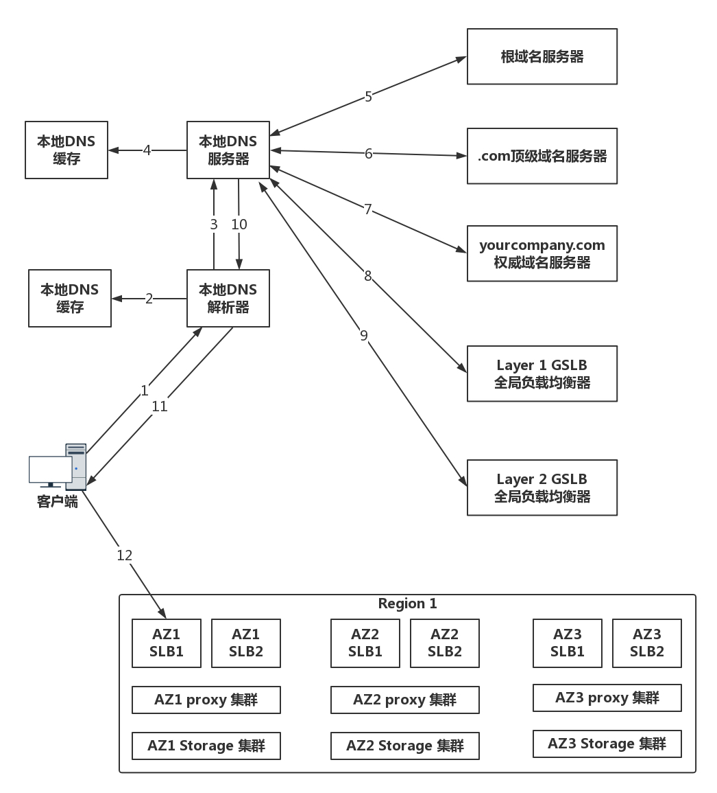
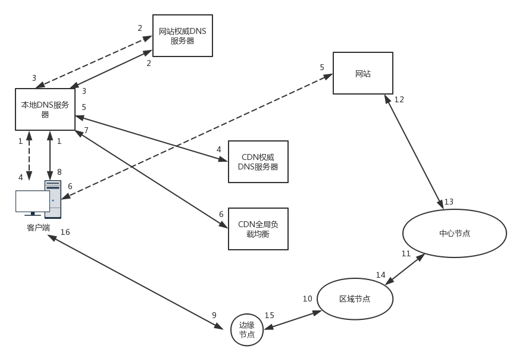
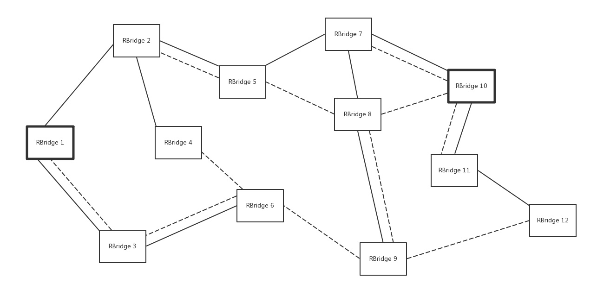
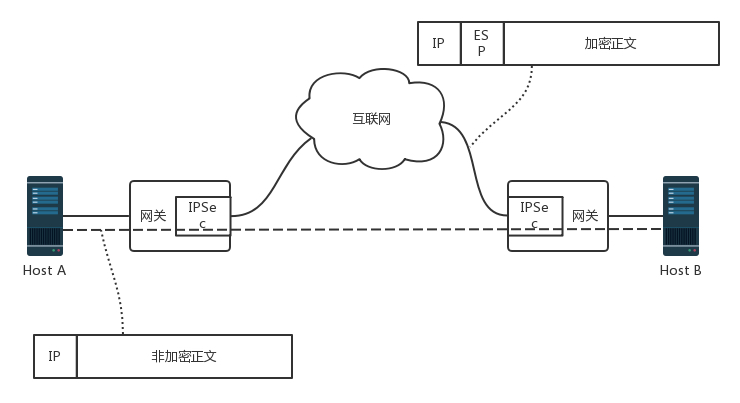
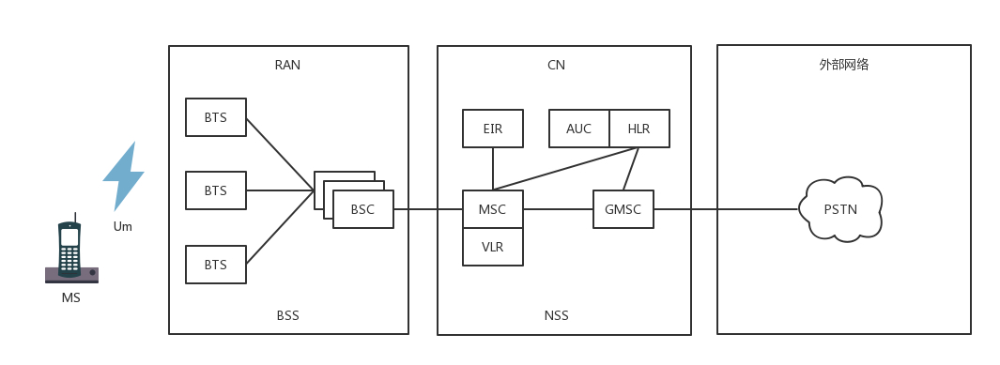

# 應用層

## # 第18講| DNS協議：網絡世界的地址簿

要去"全聯”，這就是名稱，然後通過地址簿，查看到底是哪條路多少號。

在網絡世界，也是這樣的。現在網站的數目非常多，如果全部用IP 地址進行訪問，恐怕很難記住。於是，就需要一個地址簿，根據名稱，就可以查看具體的地址。

### |> DNS服務器

每個人上網，都需要訪問它。

- 一旦它出了故障，整個互聯網都將癱瘓。
- 另外，上網的人分佈在全世界各地，如果大家都去同一個地方訪問某一台服務器，時延將會非常大。

因而，DNS服務器，一定要設置成高可用、高並發和分佈式的。

於是，就有了這樣樹狀的層次結構 

[HttpDns 原理是什麼](http://www.linkedkeeper.com/171.html)


Root 域名：DNS 域名使用時，規定由尾部句號來指定名稱位於根或更高級別的域層次結構

Top Level 頂級域名：用來指示某個國家、地區或組織使用的名稱的類型名稱。如.com

Second Level 域名：個人或組織在Internet 上使用的註冊名稱。如linkedkeeper.com

Third Level 域名：已註冊的二級域名派生的域名。如misc.linkedkeeper.com


- 根DNS服務器：返回頂級域DNS服務器的IP地址
- 頂級域DNS服務器：返回權威DNS服務器的IP地址
- 權威DNS服務器：返回相應主機的IP地址

### |> DNS解析流程

為了提高DNS的解析性能，很多網絡都會就近部署DNS緩存服務器。於是，就有了以下的DNS解析流程。

1. 電腦客戶端會發出一個DNS請求，問`news.google.com`的IP是啥啊，並發給本地域名服務器（本地DNS）。
   - 本地域名服務器（本地DNS）是什麼 ---> 如果是通過DHCP配置，本地DNS由你的網絡服務商（ISP）自動分配，它通常就在你網絡服務商的某個機房。
2. 本地DNS收到來自客戶端的請求。
   - (本地DNS) 這台服務器上緩存了一張域名與之對應IP地址的大表格。
     - 如果能找到`news.google.com`，它直接就返回IP地址。
     - 如果沒有，本地DNS會去問它的 (老大) 根域名服務器`news.google.com`的IP地址”
     - 根域名服務器是最高層次的，全球共有13套。它不直接用於域名解析，但能指明一條道路。
3. 根DNS收到來自本地DNS的請求，發現後綴是.com，說：“`news.google.com`啊，這個域名是由.com區域管理，我給你它的頂級域名服務器 (老二) 的地址，你去問問它吧。”
4. 本地DNS轉向問頂級域名服務器`news.google.com`的IP地址
   -   (老二) 頂級域名服務器就是大名鼎鼎的比如`.com、.net、.org`這些一級域名，它負責管理二級域名，比如 `google.com`，所以它能提供一條更清晰的方向。
5. 頂級域名服務器說："我給你負責`news.google.com`區域的權威DNS服務器的地址，你去問它應該能問到。”
6. 本地DNS轉向問權威DNS服務器，`news.google.com`對應的IP
   - `google.com`的權威DNS服務器，它是域名解析結果的原出處。
   - 權威=我的域名我做主。
7. 權威DNS服務器查詢後將對應的IP地址XXXX告訴本地DNS。
8. 本地DNS再將IP地址返回客戶端，客戶端和目標建立連接。

總結圖


#### **遞歸查詢和迭代查詢**

- 遞歸查詢：如果主機所詢問的本地域名服務器不知道被查詢域名的IP 地址，那麼本地域名服務器就以DNS 客戶的身份，向其他根域名服務器繼續發出查詢請求報文，而不是讓該主機自己進行下一步的查詢。
- 迭代查詢：當根域名服務器收到本地域名服務器發出的迭代查詢請求報文時，要么給出所要查詢的IP 地址，要么告訴本地域名服務器：你下一步應當向哪一個域名服務器進行查詢。然後讓本地域名服務器進行後續的查詢，而不是替本地域名服務器進行後續的查詢。

由此可見，客戶端到Local DNS 服務器，Local DNS 與上級DNS 服務器之間屬於遞歸查詢；DNS 服務器與根DNS 服務器之前屬於迭代查詢。

實際環境中，因為採用遞歸模式會導致DNS 服務器流量很大，所以現在大多數的DNS 都是迭代模式。

### |> 負載均衡

站在客戶端角度，這是一次DNS遞歸查詢過程。因為本地DNS全權為它效勞，它只要坐等結果即可。

在這個過程中，DNS除了可以通過名稱映射為IP地址，它還可以做另外一件事，就是負載均衡。

- 以訪問"全聯”為例，它可能有有很多家＝很多地址。可以就近找一家店，而不用大家都去同一家，這就是負載均衡。

**DNS首先可以做`內部負載均衡`**

- 一個應用要訪問數據庫，在這個應用裡面應該配置 這個數據庫的IP地址，還是應該配置 這個數據庫的域名呢？
  - 顯然應該配置域名，因為一旦這個數據庫，因為某種原因，換到了另外一台機器上，而如果有多個應用都配置了這台數據庫的話，一換IP地址，就需要將這些應用全部修改一遍。
  - 但是如果配置了域名，則只要在DNS服務器裡，將域名映射為新的IP地址，這個工作就完成了，大大簡化了運維。

- 在這個基礎上，可以再進一步。

  某個應用要訪問另外一個應用，如果配置另外一個應用的IP 地址，那麼這個訪問就是一對一的。

  - 但是當被訪問的應用撐不住的時候，可以改為部署多個。
  - 訪問它的應用，如何在多個之間進行負載均衡 ---> 只要配置成為域名就可以了。在域名解析的時候配置策略，這次返回第一個IP，下次返回第二個IP，就可以實現負載均衡了。

**DNS還可以做`全局負載均衡`**

- 為了保證我們的應用高可用，往往會部署在多個機房，每個地方都會有自己的IP地址。
  - 當用戶訪問某個域名的時候，這個IP地址可以輪詢訪問多個數據中心。如果一個數據中心因為某種原因掛了，只要在DNS服務器裡面，將這個數據中心對應的IP地址刪除，就可以實現一定的高可用。

- 另外，我們肯定希望的用戶訪問其區域就近的數據中心，這樣，訪問速度就會比較快，客戶體驗就會非常好。這就是全局負載均衡的概念。

**示例：DNS訪問數據中心中對象存儲上的靜態資源**

- 假設全國有多個數據中心，託管在多個運營商，每個數據中心三個可用區(Available Zone)。
- 對象存儲通過跨可用區部署，實現高可用性。
- 在每個數據中心中，都至少部署兩個內部負載均衡器，內部負載均衡器後面對接多個對象存儲的前置服務器(Proxy-server)。 



1. 當一個客戶端要訪問object.yourcompany.com 的時候，需要將域名轉換為IP地址進行訪問，所以它要請求本地DNS解析器。
2. 本地DNS解析器先查看看本地的緩存是否有這個記錄。如果有則直接使用，因為如果每次都要遞歸解析，就太麻煩了。
3. 如果本地無緩存，則需要請求本地的DNS服務器。
4. 本地的DNS服務器一般部署在你的數據中心或者你所在的運營商的網絡中，本地DNS服務器也需要看本地是否有緩存，如果有則返回，因為它也不想把上面的遞歸過程再走一遍。
5. 至7.如果本地沒有，本地DNS才需要遞歸地從根DNS服務器，查到.com的頂級域名服務器，最終查到yourcompany.com 的權威DNS服務器，給本地DNS服務器，權威DNS服務器按說會返回真實要訪問的IP地址。

對於不需要做全局負載均衡的簡單應用來講，

- yourcompany.com 的權威DNS服務器可以直接將object.yourcompany.com 這個域名解析為一個或者多個IP地址，然後客戶端可以通過多個IP地址，進行簡單的輪詢，實現簡單的負載均衡。

全局負載均衡器

- 但是對於復雜的應用，尤其是跨地域跨運營商的大型應用，則需要更加複雜的全局負載均衡機制，因而需要專門的設備或者服務器來做這件事情，這就是**全局負載均衡器(GSLB，Global Server Load Balance)**。

在yourcompany.com 的DNS服務器中，一般是通過配置CNAME的方式，給object.yourcompany.com 起一個別名，例如object.vip.yourcomany.com，然後告訴本地DNS 服務器，讓它請求GSLB解析這個域名， GSLB就可以在解析這個域名的過程中，通過自己的策略實現負載均衡。

圖中畫了兩層的GSLB，是因為分運營商和地域。我們希望不同運營商的客戶，可以訪問相同運營商機房中的資源，這樣不跨運營商訪問，有利於提高吞吐量，減少時延。

1. 第一層GSLB，通過查看請求它的本地DNS服務器所在的運營商，就知道用戶所在的運營商。假設是移動 (china運營商)，通過CNAME的方式，通過另一個別名object.yd.yourcompany.com，告訴本地DNS服務器去請求第二層的GSLB。
2. 第二層GSLB，通過查看請求它的本地DNS服務器所在的地址，就知道用戶所在的地理位置，然後將距離用戶位置比較近的Region裡面，六個內部負載均衡(SLB，Server Load Balancer)的地址，返回給本地DNS服務器。
3. 本地DNS服務器將結果返回給本地DNS解析器。
4. 本地DNS解析器將結果緩存後，返回給客戶端。
5. 客戶端開始訪問屬於相同運營商的距離較近的Region 1 中的對象存儲，當然客戶端得到了六個IP地址，它可以通過負載均衡的方式，隨機或者輪詢選擇一個可用區進行訪問。對象存儲一般會有三個備份，從而可以實現對存儲讀寫的負載均衡。

### |> 小結

- DNS是網絡世界的地址簿，可以通過域名查地址，因為域名服務器是按照樹狀結構組織的，因而域名查找是使用遞歸的方法，並通過緩存的方式增強性能；
- 在域名和IP的映射過程中，給了應用基於域名做負載均衡的機會，可以是簡單的負載均衡，也可以根據地址和運營商做全局的負載均衡。

> 兩個思考題：

1. 全局負載均衡為什麼要分地址和運營商呢？
2. 全局負載均衡使用過程中，常常遇到失靈的情況，你知道具體有哪些情況嗎？對應應該怎麼來解決呢？

## # 第19講| HTTPDNS：網絡世界的地址簿也會指錯路

[HttpDns 原理是什麼](http://www.linkedkeeper.com/171.html)

> HTTPDNS 利用HTTP 協議與DNS 服務器交互，代替了傳統的基於UDP 協議的DNS 交互，繞開了運營商的Local DNS，有效防止了域名劫持，提高域名解析效率。另外，由於DNS 服務器端獲取的是真實客戶端IP 而非Local DNS 的IP，能夠精確定位客戶端地理位置、運營商信息，從而有效改進調度精確性。
>
> **HttpDns 主要解決的問題**
>
> - Local DNS 劫持：由於HttpDns 是通過IP 直接請求HTTP 獲取服務器A 記錄地址，不存在向本地運營商詢問domain 解析過程，所以從根本避免了劫持問題。
> - 平均訪問延遲下降：由於是IP 直接訪問省掉了一次domain 解析過程，通過智能算法排序後找到最快節點進行訪問。
> - 用戶連接失敗率下降：通過算法降低以往失敗率過高的服務器排序，通過時間近期訪問過的數據提高服務器排序，通過歷史訪問成功記錄提高服務器排序。

DNS的兩項功能，

- 第一是根據名稱查到具體的地址，
- 另外一個是可以針對多個地址做負載均衡，而且可以在多個地址中選擇一個距離你近的地方訪問。

然而有時候這個地址簿也經常給你指錯路，明明距離你500米就有個吃飯的地方，非要把你推薦到5公里外。為什麼會出現這樣的情況呢？

- 當我們發出請求解析DNS的時候，首先，會先連接到運營商本地的DNS服務器，由這個服務器幫我們去整棵DNS樹上進行解析，然後將解析的結果返回給客戶端。但是本地的DNS服務器，作為一個本地導遊，往往有自己的"小心思”。

### |> 傳統DNS存在哪些問題？

#### 1. 域名緩存問題

1. 它可以在本地做一個緩存，也就是說，不是每一個請求，它都會去訪問權威DNS服務器，而是訪問過一次就把結果緩存到自己本地，當其他人來問的時候，直接就返回這個緩存數據。
   - 問題：那個飯店（訪問目的地）明明都已經搬了，已經變成了服裝店，結果作為導遊依舊憑記憶（本地的緩存）回答，他並沒有再去查地址簿（訪問權威DNS服務器）刷新這個緩存。
2. 有的運營商會把一些靜態頁面，緩存到本運營商的服務器內，這樣用戶請求的時候，就不用跨運營商進行訪問，這樣既加快了速度，也減少了運營商之間流量計算的成本。在域名解析的時候，不會將用戶導向真正的網站，而是指向這個緩存的服務器。
   - 問題：當真正的網站頁面更新，用戶仍就訪問到緩存的服務器中的舊頁面。
3. 再就是本地的緩存，往往使得全局負載均衡失敗，因為上次進行緩存的時候，緩存中的地址不一定是這次訪問離客戶最近的地方，
   - 問題：如果把這個地址返回給新客戶，那肯定就會繞遠路。

#### 2. 域名轉發問題

1. 緩存問題 --->  本地域名解析服務，還是會去權威DNS服務器中查找，只不過不是每次都要查找。

   可以說這還是大導遊、大中介。還有一些小導遊、小中介，有了請求之後，直接轉發給其他運營商去做解析，自己只是外包了出去。

   - 問題：如果是A運營商的客戶，訪問自己運營商的DNS服務器，
     - 如果A運營商自己去權威DNS服務器查詢的話，權威DNS服務器知道你是A運營商的，就返回給一個部署在A運營商的網站地址， 這樣針對相同運營商的訪問，速度就會快很多。
     - 但是A運營商偷懶，將解析的請求轉發給B運營商，B運營商去權威DNS服務器查詢的話，權威服務器會誤認為，你是B運營商的，那就返回給你一個在B運營商的網站地址吧，結果客戶的每次訪問都要跨運營商，速度就會很慢。


#### 3. 出口NAT問題

- 前面講述網關的時候  --->  出口的時候，很多機房都會配置NAT，也即網絡地址轉換，使得從這個網關出去的包，都換成新的IP地址，當然請求返回的時候，在這個網關，再將IP地址轉換回去，所以對於訪問來說是沒有任何問題。
  - 但是一旦做了網絡地址的轉換，權威的DNS服務器，就沒辦法通過這個地址，來判斷客戶到底是來自哪個運營商，而且極有可能因為轉換過後的地址，誤判運營商，導致跨運營商的訪問。

#### 4. 域名更新問題

- 本地DNS服務器是由不同地區、不同運營商獨立部署的。對域名解析緩存的處理上，實現策略也有區別，
  - 有的會偷懶，忽略域名解析結果的TTL時間限制，在權威DNS服務器解析變更的時候，解析結果在全網生效的周期非常漫長。 --->  有的導遊懶一些，8年前背的導遊詞就沒換過，問他的時候，指的路往往就是錯的。
  - 但是有的時候，在DNS的切換中，場景對生效時間要求比較高。例如雙機房部署的時候，跨機房的負載均衡和容災多使用DNS來做。當一個機房出問題之後，需要修改權威DNS，將域名指向新的IP地址，但是如果更新太慢，那很多用戶都會出現訪問異常。--->  有的導遊比較勤快、敬業，時時刻刻關注酒店、餐館、交通的變化，問他的時候，往往會得到最新情況。

#### 5. 解析延退問題

- 從上一節的DNS查詢過程來看，DNS的查詢過程需要遞歸遍歷多個DNS服務器，才能獲得最終的解析結果，這會帶來一定的時延，甚至會解析超時。

### |> HTTPDNS的工作模式

既然DNS解析中有這麼多問題，那怎麼辦呢？難不成退回到直接用IP地址？這樣顯然不合適，所以就有了HTTPDNS。

**HTTPNDS其實就是，不走傳統的DNS解析，而是自己搭建基於HTTP協議的DNS服務器集群，分佈在多個地點和多個運營商。當客戶端需要DNS解析的時候，直接通過HTTP協議進行請求這個服務器集群，得到就近的地址**。

- 這就相當於每家基於HTTP協議，自己實現自己的域名解析，自己做一個自己的地址簿，而不使用統一的地址簿。
- 但是默認的域名解析都是走DNS的，因而使用HTTPDNS需要繞過默認的DNS路徑，就不能使用默認的客戶端。使用HTTPDNS的，往往是手機應用，需要在手機端嵌入支持HTTPDNS的客戶端SDK。

- 通過自己的HTTPDNS服務器和自己的SDK，實現了從依賴本地導遊，到自己上網查詢做旅遊攻略，進行自由行，愛怎麼玩怎麼玩。這樣就能夠避免依賴導遊，而導遊又不專業，你還不能把他怎麼樣的尷尬。

**解析一下HTTPDNS的工作模式**

在客戶端的SDK裡動態請求服務端，獲取HTTPDNS服務器的IP列表，緩存到本地。隨著不斷地解析域名，SDK也會在本地緩存DNS域名解析的結果。

當手機應用要訪問一個地址的時候，首先看是否有本地的緩存，如果有就直接返回。這個緩存和本地DNS的緩存不一樣的是，這個是手機應用自己做的，而非整個運營商統一做的。如何更新、何時更新，手機應用的客戶端可以和服務器協調來做這件事情。

如果本地沒有，就需要請求HTTPDNS的服務器，在本地HTTPDNS服務器的IP列表中，選擇一個發出HTTP的請求，會返回一個要訪問的網站的IP列表。

請求的方式是這樣的。

```
curl http://106.2.xxx.xxx/d?dn=c.m.163.com
{"dns":[{"host":"c.m.163.com","ips":["223.252.199.12"],"ttl":300,"http2":0}],"client":{"ip":"106.2.81.50","li
```

手機客戶端自然知道手機在哪個運營商、哪個地址。由於是直接的HTTP通信，HTTPDNS服務器能夠準確知道這些信息，因而可以做精準的全局負載均衡。 


當然，當所有這些都不工作的時候，可以切換到傳統的LocalDNS來解析，慢也比訪問不到好。那HTTPDNS是如何解決上面的問題的呢？

其實歸結起來就是兩大問題。

- 一是解析速度和更新速度的平衡問題，
- 二是智能調度的問題，對應的解決方案是HTTPDNS的緩存設計和調度設計。

#### HTTPDNS的緩存設計

- 解析DNS過程複雜，通信次數多，對解析速度造成很大影響。
- 為了加快解析，因而有了緩存，但是這又會產生緩存更新速度不及時的問題。
- 最要命的是，這兩個方面都掌握在別人手中，也即本地DNS服務器手中，它不會為你定制，你作為客戶端乾著急沒辦法。

而HTTPDNS就是將解析速度和更新速度全部掌控在自己手中。

- 一方面，解析的過程，不需要本地DNS服務遞歸的調用一大圈，一個HTTP的請求直接搞定，要實時更新的時候，馬上就能起作用；
- 另一方面為了提高解析速度，本地也有緩存，緩存是在客戶端SDK維護的，過期時間、更新時間，都可以自己控制。

HTTPDNS的緩存設計策略也是咱們做應用架構中常用的緩存設計模式，也即分為客戶端、緩存、數據源三層。

- 對於應用架構來講，就是應用、緩存、數據庫。常見的是Tomcat、Redis、MySQL。

- 對於HTTPDNS來講，就是手機客戶端、DNS緩存、HTTPDNS服務器。

  

- 只要是緩存模式，就存在緩存的過期、更新、不一致的問題，解決思路也是很像的。

例如DNS緩存在內存中，也可以持久化到存儲上，從而APP重啟之後，能夠盡快從存儲中加載上次累積的經常訪問的網站的解析結果，就不需要每次都全部解析一遍，再變成緩存。這有點像Redis是基於內存的緩存，但是同樣提供持久化的能力，使得重啟或者主備切換的時候，數據不會完全丟失。

SDK中的緩存會嚴格按照緩存過期時間，如果緩存沒有命中，或者已經過期，而且客戶端不允許使用過期的記錄，則會發起一次解析，保障記錄是更新的。

- 解析可以同步進行，也就是直接調用HTTPDNS的接口，返回最新的記錄，更新緩存；
- 也可以異步進行，添加一個解析任務到後台，由後台任務調用HTTPDNS的接口。

> 同步更新

**同步更新**的優點是實時性好，缺點是如果有多個請求都發現過期的時候，同時會請求HTTPDNS多次，其實是一種浪費。

同步更新的方式對應到應用架構中緩存的**Cache-Aside**機制，也即先讀緩存，不命中讀數據庫，同時將結果寫入緩存。 


> 異步更新

**異步更新**的優點是，可以將多個請求都發現過期的情況，合併為一個對於HTTPDNS的請求任務，只執行一次，減少HTTPDNS的壓力。同時可以在即將過期的時候，就創建一個任務進行預加載，防止過期之後再刷新，稱為預加載。

它的缺點是當前請求拿到過期數據的時候，如果客戶端允許使用過期數據，需要冒一次風險。如果過期的數據還能請求，就沒問題；如果不能請求，則失敗一次，等下次緩存更新後，再請求方能成功。


異步更新的機制對應到應用架構中緩存的**Refresh-Ahead**機制，即業務僅僅訪問緩存，當過期的時候定期刷新。

在著名的應用緩存Guava Cache中，有個RefreshAfterWrite機制，對於並發情況下，多個緩存訪問不命中從而引發並發回源的情況，可以採取只有一個請求回源的模式。在應用架構的緩存中， 也常常用數據預熱或者預加載的機制。


#### HTTPDNS的調度設計

> 客戶端

- 由於客戶端嵌入了SDK，因而就不會因為本地DNS的各種緩存、轉發、NAT，讓權威DNS服務器誤會客戶端所在的位置和運營商，而可以拿到第一手資料。

- 在客戶端，可以知道手機是哪個國家、哪個運營商、哪個省，甚至哪個市，HTTPDNS服務端可以根據這些信息，選擇最佳的服務節點返回。

- 如果有多個節點，還會考慮錯誤率、請求時間、服務器壓力、網絡狀況等，進行綜合選擇，而非僅僅考慮地理位置。當有一個節點宕機或者性能下降的時候，可以盡快進行切換。
  - 要做到這一點，需要客戶端使用HTTPDNS返回的IP訪問業務應用。客戶端的SDK會收集網絡請求數據，如錯誤率、請求時間等網絡請求質量數據，並發送到統計後台，進行分析、聚合，以此查看不同的IP的服務質量。

> 服務端

在服務端，應用可以通過調用HTTPDNS的管理接口，配置不同服務質量的優先級、權重。HTTPDNS 會根據這些策略綜合地理位置和線路狀況算出一個排序，優先訪問當前那些優質的、時延低的IP地址。

HTTPDNS通過智能調度之後返回的結果，也會緩存在客戶端。為了不讓緩存使得調度失真，客戶端可以根據不同的移動網絡運營商WIFI的SSID來分維度緩存。不同的運營商或者WIFI解析出來的結果會不同。 


### |> 小結

兩個重點：

- 傳統的DNS有很多問題，例如解析慢、更新不及時。因為緩存、轉發、NAT問題導致客戶端誤會自己所在的位置和運營商，從而影響流量的調度。
- HTTPDNS通過客戶端SDK和服務端，通過HTTP直接調用解析DNS的方式，繞過了傳統DNS的這些缺點，實現了智能的調度。

> 兩個思考題。

1. 使用HTTPDNS，需要向HTTPDNS服務器請求解析域名，可是客戶端怎麼知道HTTPDNS服務器的地址或者域名呢？
2. HTTPDNS的智能調度，主要是讓客戶端選擇最近的服務器，而有另一種機制，使得資源分發到離客戶端更近的位置，從而加快客戶端的訪問，你知道是什麼技術嗎？

## # 第20講| CDN :就近配送

上一節，我們看到了網站的一般訪問模式。

- 當一個用戶想訪問一個網站的時候，指定這個網站的域名，DNS就會將這個域名解析為地址，然後用戶請求這個地址，返回一個網頁。
- 就像你要買個東西，首先要查找商店的位置，然後去商店裡面找到自己想要的東西，最後拿著東西回家。

那這裡面還有沒有可以優化的地方呢？

- 例如你去電商網站下單買個東西，這個東西一定要從電商總部的中心倉庫送過來嗎？原來每一單都是單獨配送，所以可能要很久才能收到你下單買個東西。

- 但是後來電商網站的物流系統學聰明了，他們在全國各地建立了很多倉庫，而不是只有總部的中心倉庫才可以發貨。

  - 就近配送：電商網站根據統計大概知道，各個城市每天能夠賣出去多少書籍、衛生紙、電器等存放期比較長的物品。所以平時就可以將它們分佈在各地城市的倉庫裡，客戶一下單，就近的倉庫發出，第二天就可以收到了。

    這樣，用戶體驗大大提高。

  - 當然，這裡面也有個難點就是，生鮮這類東西保質期太短，如果提前都備好貨，但是沒有人下單，那肯定就壞了。

先說網站訪問可以藉鑑"就近配送”這個思路。

### |> CDN的分發系統架構

全球有這麼多的數據中心，無論在哪裡上網，臨近不遠的地方基本上都有數據中心。

- 可以在這些數據中心裡部署幾台機器，形成一個緩存的集群來緩存部分數據，那麼用戶訪問數據的時候，就可以就近訪問了
  - 這些分佈在各個地方的各個數據中心的節點，就稱為`邊緣節點`。由於邊緣節點數目比較多，但是每個集群規模比較小，不可能緩存下來所有東西，因而可能無法命中，
  - 這樣就會在邊緣節點之上。有`區域節點`，規模就要更大，緩存的數據會更多，命中的概率也就更大。
  - 在區域節點之上是`中心節點`，規模更大，緩存數據更多。如果還不命中，就只好回源網站訪問了。


這就是CDN的分發系統的架構。

- CDN系統的緩存，也是一層一層的，能不訪問後端真正的源，就不打擾它。這也是電商網站物流系統的思路

#### CDN相關概念補充

CDN的全稱是**Content Delivery Network**，即**內容分發網絡**。CDN是構建在現有網絡基礎之上的`智能虛擬網絡`，依靠部署在各地的邊緣服務器，通過中心平台的負載均衡、內容分發、調度等功能模塊，使用戶就近獲取所需內容，降低網絡擁塞，提高用戶訪問響應速度和命中率。CDN的關鍵技術主要有內容存儲和分發技術。

CDN(Content Delivery Network)是指內容分發網絡，也稱為內容傳送網絡，這個概念始於1996年，是美國麻省理工學院的一個研究小組為改善互聯網的服務質量而提出的。為了能在傳統IP網上發布丰富的寬帶媒體內容，他們提出在現有互聯網基礎上建立一個內容分發平台專門為網站提供服務，並於1999年成立了專門的CDN服務公司，為Yahoo提供專業服務。由於CDN是為加快網絡訪問速度而被優化的網絡覆蓋層，因此被形像地稱為“**網絡加速器**”。

CDN網絡的誕生大大地改善了互聯網的服務質量，因此傳統的大型網絡運營商紛紛開始建設自己的CDN網絡，如AT&T、德國電信、中國電信等。隨著市場需求的不斷增加，甚至出現了純粹的CDN網絡運營商，美國的Akamai就是其中最大的一個，擁有分佈在世界各地的1000多個節點。

### |> 負載均衡

有了這個分發系統之後，接下來就是，客戶端如何找到相應的邊緣節點進行訪問呢？

- 基於DNS的全局負載均衡  --->   這個負載均衡主要用來選擇一個就近的同樣運營商的服務器進行訪問。
- CDN分發網絡也是一個分佈在多個區域、多個運營商的分佈式系統，也可以用相同的思路選擇最合適的邊緣節點。 



（虛線）在沒有CDN的情況下，用戶向瀏覽器輸入`www.web.com`這個域名，客戶端訪問本地DNS服務器的時候，

- 如果本地DNS服務器有緩存，則返回網站的地址；
- 如果沒有，遞歸查詢到網站的權威DNS服務器，這個權威DNS服務器是負責web.com的，它會返回網站的IP地址。
- 本地DNS服務器緩存下IP地址，將IP地址返回，然後客戶端直接訪問這個IP地址，就訪問到了這個網站。

（實線）然而有了CDN之後，情況發生了變化。在web.com這個權威DNS服務器上，會設置一個CNAME別名，指向另外一個域名`www.web.cdn.com`，返回給本地DNS服務器。

- 當本地DNS服務器拿到這個新的域名時，需要繼續解析這個新的域名。
- 這個時候，再訪問的就不是web.com 的權威DNS服務器了，而是web.cdn.com的權威DNS服務器，這是CDN自己的權威DNS 服務器。
- 在這個服務器上，還是會設置一個CNAME，指向另外一個域名，也即CDN網絡的全局負載均衡器。

接下來，本地DNS服務器去請求CDN的全局負載均衡器解析域名，全局負載均衡器會為用戶選擇一台合適的緩存服務器提供服務，選擇的依據包括：

- 根據用戶IP地址，判斷哪一台服務器距用戶最近；
- 用戶所處的運營商；
- 根據用戶所請求的URL中攜帶的內容名稱，判斷哪一台服務器上有用戶所需的內容；
- 查詢各個服務器當前的負載情況，判斷哪一台服務器尚有服務能力。

基於以上這些條件，進行綜合分析之後，全局負載均衡器會返回一台緩存服務器的IP地址。

本地DNS服務器緩存這個IP地址，然後將IP返回給客戶端，客戶端去訪問這個邊緣節點，下載資源。緩存服務器響應用戶請求，將用戶所需內容傳送到用戶終端。如果這台緩存服務器上並沒有用戶想要的內容，那麼這台服務器就要向它的上一級緩存服務器請求內容，直至追溯到網站的源服務器將內容拉到本地。

### |> 緩存

CDN可以進行緩存的內容有很多種。

#### 靜態數據緩存

保質期長的日用品比較容易緩存，因為不容易過期，對應到就像電商倉庫系統裡，就是靜態頁面、圖片等，因為這些東西也不怎麼變，所以適合緩存。


在進入數據中心的時候，我們希望通過最外層接入層的緩存，將大部分靜態資源的訪問攔在邊緣。

而CDN則更進一步，將這些靜態資源緩存到離用戶更近的數據中心外。越接近客戶，訪問性能越好，時延越低。

#### 流媒體/串流媒體（Streaming media）緩存

> 串流媒體（Streaming media）是指將一連串的多媒體資料壓縮後，經過網際網路分段傳送資料，在網際網路上即時傳輸影音以供觀賞的一種技術與過程，此技術使得資料封包得以像流水一樣傳送，如果不使用此技術，就必須在使用前下載整個媒體檔案。

但是靜態內容中，有一種特殊的內容，也大量使用了CDN，這個就是前面講過的流媒體。

CDN支持流媒體協議，例如前面講過的RTMP協議。在很多情況下，這相當於一個代理，從上一級緩存讀取內容，轉發給用戶。由於流媒體往往是連續的，因而可以進行預先緩存的策略，也可以預先推送到用戶的客戶端。

- 對於靜態頁面來講，內容的分發往往採取拉取的方式，也即當發現未命中的時候，再去上一級進行拉取。
- 但是，流媒體數據量大，如果出現回源，壓力會比較大，所以往往採取主動推送的模式，將熱點數據主動推送到邊緣節點。

對於流媒體來講，很多CDN還提供預處理服務，也即文件在分發之前，經過一定的處理。

- 例如將視頻轉換為不同的碼流，以適應不同的網絡帶寬的用戶需求；
- 再如對視頻進行分片，降低存儲壓力，也使得客戶端可以選擇使用不同的碼率加載不同的分片。這就是我們常見的，“我要看超清、標清、流暢等”。

對於流媒體CDN來講，有個關鍵的問題是防盜鏈問題。因為視頻是要花大價錢買版權的，為了掙點錢，收點廣告費，如果流媒體被其他的網站盜走，在人家的網站播放，那損失可就大了。

- 最常用也最簡單的方法就是HTTP頭的refer字段，當瀏覽器發送請求的時候，一般會帶上referer，告訴服務器是從哪個頁面鏈接過來的，服務器基於此可以獲得一些信息用於處理。如果refer信息不是來自本站，就阻止訪問或者跳到其它鏈接。

  refer的機制相對比較容易破解，所以還需要配合其他的機制。

- 一種常用的機制是時間戳防盜鏈。使用CDN的管理員可以在配置界面上，和CDN廠商約定一個加密字符串。
  - 客戶端取出當前的時間戳，要訪問的資源及其路徑，連同加密字符串進行簽名算法得到一個字符串，然後生成一個下載鏈接，帶上這個簽名字符串和截止時間戳去訪問CDN。
  - 在CDN服務端，根據取出過期時間，和當前CDN節點時間進行比較，確認請求是否過期。然後CDN服務端有了資源及路徑，時間戳，以及約定的加密字符串，根據相同的簽名算法計算簽名，如果匹配則一致，訪問合法，才會將資源返回給客戶。

#### 動態數據的緩存

然而比如在電商倉庫中，有關生鮮的緩存就是非常麻煩的事情，這對應著就是動態的數據，比較難以緩存。 --->  現在也有動態CDN，主要有兩種模式。

- 一種為生鮮超市模式，也即**邊緣計算的模式**。既然數據是動態生成的，所以數據的邏輯計算和存儲，也相應的放在邊緣的節點。其中定時從源數據那裡同步存儲的數據，然後在邊緣進行計算得到結果。
  - 就像對生鮮的烹飪是動態的，沒辦法事先做好緩存，因而將生鮮超市放在你家旁邊，既能夠送貨上門，也能夠現場烹飪，也是邊緣計算的一種體現。
- 另一種是冷鏈運輸模式，也即**路徑優化的模式**。數據不是在邊緣計算生成的，而是在源站生成的，但是數據的下發則可以通過CDN的網絡，對路徑進行優化。因為CDN節點較多，能夠找到離源站很近的邊緣節點，也能找到離用戶很近的邊緣節點。中間的鏈路完全由CDN來規劃，選擇一個更加可靠的路徑，使用類似專線的方式進行訪問。
  - 對於常用的TCP連接，在公網上傳輸的時候經常會丟數據，導致TCP的窗口始終很小，發送速度上不去。根據前面的TCP流量控制和擁塞控制的原理，在CDN加速網絡中可以調整TCP的參數，使得TCP可以更加激進地傳輸數據。
    - 可以通過多個請求復用一個連接，保證每次動態請求到達時。連接都已經建立了，不必臨時三次握手或者建立過多的連接，增加服務器的壓力。
    - 另外，可以通過對傳輸數據進行壓縮，增加傳輸效率。
  - 所有這些手段就像冷鏈運輸，整個物流優化了，全程冷凍高速運輸。

不管生鮮是從你旁邊的超市送到你家的，還是從產地送的，保證到你家是新鮮的。

### |> 小結

- CDN和電商系統的分佈式倉儲系統一樣，分為中心節點、區域節點、邊緣節點，而數據緩存在離用戶最近的位置。
- CDN最擅長的是緩存靜態數據，除此之外還可以緩存流媒體數據，這時候要注意使用防盜鏈。它也支持動態數據的緩存，一種是邊緣計算的生鮮超市模式，另一種是鏈路優化的冷鏈運輸模式。

> 留兩個思考題：

1. 這一節講了CDN使用DNS進行全局負載均衡的例子，CDN如何使用HTTPDNS呢？
2. 客戶端對DNS、HTTPDNS、CDN訪問了半天，還沒進數據中心，你知道數據中心裡面什麼樣嗎?

## # 第21講| 數據中心：我是開發商，自己拿地蓋別墅

無論你是看新聞、下訂單、看視頻、下載文件，最終訪問的目的地都在數據中心裡面。數據中心究竟長啥樣呢？

### |> 數據中心

數據中心是一個大雜燴，幾乎要用到前面學過的所有知識。

- 前面講辦公室網絡的時候，我們知道辦公室裡面有很多台電腦。如果要訪問外網，需要經過一個叫**網關**的東西，而`網關往往是一個路由器`。
- 數據中心裡面也有一大堆的電腦，但是它和咱們辦公室裡面的筆記本或者台式機不一樣。數據中心裡面是服務器。服務器被放在一個個叫作**機架(Rack)**的架子上面。
- 數據中心的入口和出口也是路由器，由於在數據中心的邊界，就像在一個國家的邊境，稱為`邊界路由器(Border Router)`。為了高可用，邊界路由器會有多個。
- 一般家裡只會連接一個運營商的網絡，而為了高可用，為了當一個運營商出問題的時候，還可以通過另外―個運營商來提供服務，所以數據中心的邊界路由器會連接多個運營商網絡。
- 既然是路由器，就需要跑路由協議，數據中心往往就是路由協議中的`自治區域(AS)`。數據中心裡面的機器要想訪問外面的網站，數據中心裡面也是有對外提供服務的機器，都可以通過`BGP協議`，（Border Gateway Protocol）即邊界網關協議，獲取內外互通的路由信息。這就是我們常聽到的`多線BGP`的概念。
- 如果數據中心非常簡單，沒幾台機器，那就像家里或者宿捨一樣，所有的服務器都直接連到路由器上就可以了。但是數據中心裡面往往有非常多的機器，當塞滿一機架的時候，需要有交換機將這些服務器連接起來，可以互相通信。
- 這些交換機往往是放在機架頂端的，所以經常稱為**TOR (Top Of Rack)交換機**。這一層的交換機常常稱為`接入層(Access Layer)`。注意這個接入層和原來講過的應用的接入層不是一個概念。 


當一個機架放不下的時候，就需要多個機架，還需要有交換機將多個機架連接在一起。這些交換機對性能的要求更高，帶寬也更大。這些交換機稱為`匯聚層交換機(Aggregation Layer)`。

數據中心裡面的每一個連接都是需要考慮高可用的。

#### 網卡高可用保證

- 如果一台機器只有一個網卡，上面連著一個網線，接入到TOR交換機上。如果網卡壞了，或者不小心網線掉了，機器就上不去了。
- 所以，需要至少兩個網卡、兩個網線插到TOR交換機上，但是兩個網卡要工作得像一張網卡一樣，這就是常說的`網卡綁定(bond)`。
- 這就需要`服務器和交換機`都支持一種協議`LACP (Link Aggregation Control Protocol)`。它們互相通信，將多個網卡聚合成為一個網卡，多個網線聚合成一個網線，在網線之間可以進行負載均衡，也可以為了高可用作準備。

#### TOR交換機高可用保證

網卡有了高可用保證，但交換機還有問題。如果一個機架只有一個交換機，它掛了，那整個機架都不能上網了。因而TOR交換機也需要高可用，同理`接入層`和`匯聚層`的連接也需要高可用性，也不能單線連著。

- 最傳統的方法是，部署兩個接入交換機、兩個匯聚交換機。
  - 服務器和兩個接入交換機都連接，接入交換機和兩個匯聚都連接，當然這樣會形成環，所以需要啟用STP協議，去除環，但是這樣兩個匯聚就只能一主一備了。STP協議裡我們學過，只有一條路會起作用。 


- 交換機有一種技術叫作`堆疊`，所以另一種方法是，
  - 將多個交換機形成一個**邏輯的交換機**，
  - 服務器通過多根線分配連到多個`接入層交換機`上，而接入層交換機多根線分別連接到多個交換機上，並且通過堆疊的私有協議，形成`雙活`的連接方式。


- 由於對帶寬要求更大，而且掛了影響也更大，所以兩個堆疊可能就不夠了，可以就會有更多的，比如四個堆疊為一個邏輯的交換機。
  - `匯聚層`將大量的計算節點相互連接在一起，形成一個集群。在這個集群裡面，服務器之間通過二層互通，這個區域常稱為一個`POD(Point Of Delivery)`，有時候也稱為一個`可用區(Available Zone)`。
  - 當節點數目再多的時候，一個可用區放不下，需要將多個可用區連在一起，連接多個可用區的交換機稱為`核心交換機`。


#### 核心和匯聚交換機之間高可用 ---> 三層設備 ---> 等價路由

核心交換機吞吐量更大，高可用要求更高，肯定需要堆疊，但是往往僅僅堆疊，不足以滿足吞吐量，因而還是需要部署多組核心交換機。核心和匯聚交換機之間為了高可用，也是全互連模式的。

這個時候還存在那個問題，出現環路怎麼辦？

- 一種方式是，不同的可用區在不同的二層網絡，需要分配不同的網段，匯聚和核心之間通過三層網絡互通的，二層都不在一個廣播域裡面，不會存在二層環路的問題。三層有環是沒有問題的，只要通過路由協議選擇最佳的路徑就可以了。

  > [二層和三層環路有什麼特點和區別？](https://my.oschina.net/u/4374260/blog/3230568)
  >
  > >二層、三層是按照邏輯拓撲結構進行的分類，並不是ISO七層模型中的數據鏈路層和網絡層，而是指核心層、匯聚層和接入層。
  > >
  > >這三層都部署的就是三層網絡結構，二層網絡結構沒有匯聚層。
  >
  > 環路的原因：
  >
  > - 二層環路是由於物理拓扑出現環路，如3台交換機三角形連接。
  > - 三層環路一般物理拓撲有環路，並且設置之間路由表形成互指。
  >
  > 二層交換機工作行為？
  >
  > - 收到的數據幀查看2層頭部，根據目的Mac地址轉發，目的Mac分廣播、組播、單播。
  >
  > 三層設備的工作行為
  >
  > - 收到數據包查看三層目的IP，根據目的IP地址轉發，分為廣播，組播，單播。
  >
  > 二層環路
  >
  > - 廣播風暴和數據幀複製，MAC地址震盪；假設交換機收到廣播幀或者組播幀或者未知單播幀，會採用泛洪形式處理，數據幀在轉發時產生了拷貝複制，數據幀無休止被轉發，如此往復，最終導致整個網絡帶寬資源被耗盡，設備負載過大，網絡癱瘓不可用。
  >
  > 三層環路
  >
  > - 數據包會在設備之間有限的互相轉發，因為在三層IP頭部存在TTL字段，所以報文不會無休止轉發。
  >
  > 防環機制
  >
  > - 二層防環
  >   STP、SMART-LINK等技術，或使用LACP鏈路捆綁和設備堆疊等技術，使得物理拓撲上沒有環路。
  >
  > - 三層防環
  >   只要依靠路由協議自身的防環機制。

  

  如圖，`核心層`和`匯聚層`之間通過`內部的路由協議OSPF`，找到最佳的路徑進行訪問，而且還可以通過ECMP等價路由，在多個路徑之間進行負載均衡和高可用。

#####  伺服器虛擬化為什麼需要大二層網絡？

[伺服器虛擬化為什麼需要大二層網絡？](https://kknews.cc/zh-tw/code/z8rkgnl.html)

[一文讀懂數據中心為啥需要大二層網絡](https://kknews.cc/zh-tw/code/k6v8z58.html)

> 傳統的三層

傳統的三層數據中心架構結構的設計是為了應付服務客戶端-伺服器應用程式的縱貫式大流量，同時使網絡管理員能夠對流量流進行管理。工程師在這些架構中採用生成樹協議(STP)來優化客戶端到伺服器的路徑和支持連接冗餘。


**Access Layer（接入層）：**也稱為Edge Layer，接入交換機通常位於機架頂部，也被稱為ToR（Top of Rack）交換機，它們物理連接伺服器。

**Aggregation Layer（匯聚層）**：也稱為Distribution Layer。匯聚交換機連接Access交換機，同時提供其他的服務，例如防火牆，SSL offload，入侵檢測，網絡分析等。

**Core Layer（核心層）：**核心交換機為進出數據中心的包提供高速的轉發，通常為整個網絡提供一個彈性的L3路由網絡。

- 通常情況下，匯聚交換機是L2和L3網絡的分界點，匯聚交換機以下的是L2網絡，以上是L3網絡。
- `每組匯聚交換機管理一個POD（Point Of Delivery），每個POD內都是獨立的VLAN網絡`。
- `伺服器在POD內遷移不必修改IP位址和默認網關`，因為一個POD對應一個L2廣播域。

但隨著網絡技術的發展，雲計算已經成為目前企業IT建設的新趨勢，而伺服器虛擬化得到了越來越多的應用，

- 虛擬機VM(Virtual Machine)需要能夠在整個網絡中不受限遷移，這給傳統的「二層+三層」數據中心網絡帶來了新的挑戰。

虛擬化技術的一項伴生技術—虛擬機動態遷移(如VMware的VMotion)在數據中心得到了廣泛的應用，

- 虛擬機遷移技術可以使數據中心的計算資源得到靈活的調配，進一步提高虛擬機資源的利用率。
- 但是`虛擬機遷移要求虛擬機遷移前後的IP和MAC地址不變`，這就需要虛擬機`遷移前後的網絡處於同一個二層域內部`。
- 由於客戶要求虛擬機遷移的範圍越來越大，甚至是跨越不同地域、不同機房之間的遷移，所以使得數據中心二層網絡的範圍越來越大，甚至出現了專業的大二層網絡。

在數據中心網絡中，「區域」對應VLAN的劃分。

- 相同VLAN內的終端屬於同一廣播域，具有一致的VLAN-ID，二層連通;
- 不同VLAN內的終端需要通過網關互相訪問，二層隔離，三層連通。

傳統的數據中心網絡技術，STP是二層網絡中非常重要的一種協議。

- 用戶構建網絡時，為了保證可靠性，通常會採用冗餘設備和冗餘鏈路，這樣就不可避免的形成環路。
- 而二層網絡處於同一個廣播域下，廣播報文在環路中會反覆持續傳送，形成廣播風暴，瞬間即可導致埠阻塞和設備癱瘓。因此，為了防止廣播風暴，就必須防止形成環路。
- 這樣，既要防止形成環路，又要保證可靠性，就只能將冗餘設備和冗餘鏈路變成備份設備和備份鏈路。即冗餘的設備埠和鏈路在正常情況下被阻塞掉，不參與數據報文的轉發。
- 只有當前轉發的設備、埠、鏈路出現故障，導致網絡不通的時候，冗餘的設備埠和鏈路才會被打開，使得網絡能夠恢復正常。實現這些自動控制功能的就是STP(SpanningTreeProtocol，生成樹協議)。


> 大二層網絡架構

大二層網絡架構，L2/L3分界在核心交換機，核心交換機以下，也就是整個數據中心，是L2網絡（當然，可以包含多個VLAN，VLAN之間通過核心交換機做路由進行連通）。

- 整個數據中心網絡都是一個L2廣播域，這樣，伺服器可以在任意地點創建，遷移，而不需要對IP位址或者默認網關做修改。

- **大二層網絡實現虛擬機的大範圍甚至跨地域的動態遷移，**只要把VM遷移可能涉及的所有伺服器都納入同一個二層網絡域，就能實現VM的大範圍無障礙遷移。

大二層網絡都要覆蓋多個接入交換機和核心交換機，主要有以下兩類技術。

1. **虛擬交換機技術**

   虛擬交換機技術的出發點很簡單，屬於工程派。

   - 既然二層網絡的核心是環路問題，而環路問題是隨著冗餘設備和鏈路產生的，那麼如果將相互冗餘的多台設備、多條鏈路合併成一台設備和一條鏈路，就可以回到之前的單設備、單鏈路情況，環路自然也就不存在了。

   - 虛擬交換機技術的代表是H3C公司的IRF、Cisco公司的VSS，其特點是只需要交換機軟體升級即可支持，應用成本低，部署簡單。目前這些技術都是各廠商獨立實現和完成的，只能同一廠商的相同系列產品之間才能實施虛擬化。

2. 隧道技術屬於技術派，出發點是借船出海。

   - 二層網絡不能有環路，冗餘鏈路必須要阻塞掉，但三層網絡顯然不存在這個問題，而且還可以做ECMP(等價鏈路)，通過在二層報文前插入額外的幀頭，並且採用路由計算的方式控制整網數據的轉發，不僅可以在冗餘鏈路下防止廣播風暴，而且可以做ECMP。這樣可以將二層網絡的規模擴展到整張網絡，而不會受核心交換機數量的限制。

   - 隧道技術的代表是TRILL、SPB，都是通過借用IS-IS路由協議的計算和轉發模式，實現二層網絡的大規模擴展。

   

#### 核心交換機高可用保證 ---> 二層設備 ---> TRILL協議

但是隨著數據中心裡面的機器越來越多，尤其是有了雲計算、大數據，集群規模非常大，而且都要求在一個二層網絡裡面。這就需要二層互連從**匯聚層**上升為**核心層**，也即在核心以下，全部是二層互連，全部在一個廣播域裡面，這就是常說的**大二層**。


- 如果大二層橫向流量不大，核心交換機數目不多，可以做堆疊，
- 但是如果橫向流量很大，僅僅堆疊滿足不了，就需要部署多組核心交換機，而且要和匯聚層進行全互連。由於堆疊只解決一個核心交換機組內的無環問題，而組之間全互連，還需要其他機制進行解決。
  - 如果是STP，那部署多組核心無法擴大橫向流量的能力，因為還是只有一組起作用。
  - 於是大二層就引入了`TRILL(Transparent Interconnection of Lots of Link)`，即`多鏈接透明互聯協議`。它的基本思想是，二層環有問題，三層環沒有問題，那就把三層的路由能力模擬在二層實現。
  - 運行TRILL協議的交換機稱為`RBridge`，是`具有路由轉發特性的網橋設備`，只不過這個路由是`根據MAC地址`來的，不是根據IP來的。
  - Rbridage之間通過`鏈路狀態協議 OSPF（Open Shortest Path First）`運作。通過這個路由協議可以學習整個大二層的拓撲，知道訪問哪個MAC應該從哪個網橋走；還可以計算最短的路徑，也可以通過等價的路由進行負載均衡和高可用性。 


- TRILL協議在原來的MAC頭外面加上自己的頭，以及外層的MAC頭。
- TRILL頭里面的`Ingress RBridge`，有點像IP頭里面的源IP地址，`Egress RBridge`是目標IP地址，這兩個地址是端到端的，在中間路由的時候，不會發生改變。
- 而外層的MAC，可以有下一跳的Bridge，就像路由的下一跳，也是通過MAC地址來呈現的一樣。

如圖中所示的過程，有一個包要從主機A發送到主機B, 中間要經過RBridge 1、RBridge 2、RBridge X 等等，直到RBridge 3。

- 在RBridge 2 收到的包裡面，分內外兩層，
  - 內層就是傳統的主機A 和主機B 的MAC地址以及內層的VLAN。
  - 在外層首先加上一個TRILL頭，裡面描述這個包從RBridge 1進來的，要從RBridge 3出去，並且像三層的IP地址一樣有跳數。然後再外面，目的MAC是RBridge 2, 源MAC是RBridge 1, 以及外層的VLAN。

- 當RBridge 2收到這個包之後，
  - 首先看MAC是否是自己的MAC，
    - 如果是，要看自己是不是Egress RBridge,也即是不是最後一跳；
    - 如果不是，查看跳數是不是大於0, 然後通過類似路由查找的方式找到下一跳RBridge X, 然後將包發出去。

- RBridge 2發出去的包，
  - 內層的信息是不變的，
  - 外層的TRILL頭里面。同樣，描述這個包從RBridge 1進來的，要從RBridge 3出去，但是跳數要減1。外層的目標MAC變成RBridge X, 源MAC變成RBridge 2。
- 如此一直轉發，直到RBridge 3, 將外層解出來，發送內層的包給主機B。

這個過程和IP路由很像

對於大二層的廣播包，也需要通過分發樹的技術來實現。

- 我們知道STP是將一個有環的圖，通過去掉邊形成一棵樹，而分發樹是一個有環的圖形成多棵樹，不同的樹有不同的VLAN，有的廣播包從VLAN A廣播，有的從VLAN B廣播，實現負載均衡和高可用。 



#### 邊界路由器

核心交換機之外，就是邊界路由器了。至此從服務器到數據中心邊界的層次情況已經清楚了。

- 在核心交換上面，往往會掛一些安全設備，例如入侵檢測、DDoS防護等等。這是整個數據中心的屏障，防止來自外來的攻擊。
- 核心交換機上往往還有負載均衡器，原理前面的章節已經說過了。

- 在有的數居中心裡面，對於存儲設備，還會有一個存儲網絡，用來連接SAN和NAS。但是對於新的雲計算來講，往往不使用傳統的SAN和NAS, 而使用部署在x86機器上的軟件定義存儲，這樣存儲也是服務器了，而且可以和計算節點融合在一個機架上，從而更加有效率，也就沒有了單獨的存儲網絡了。

於是整個數據中心的網絡如下圖所示。 


這是一個典型的三層網絡結構。這裡的三層不是指IP層，而是指接入層、匯聚層、核心層三層。

- 這種模式非常有利於外部流量請求到內部應用。這個類型的流量，是從外到內或者從內到外，對應到上面那張圖裡，就是從上到下，從下到上，上北下南，所以稱為**南北流量**。

但是隨著雲計算和大數據的發展，節點之間的交互越來越多，例如大數據計算經常要在不同的節點將數據拷貝來拷貝去，這樣需要經過交換機，使得數據從左到右，從右到左，左西右東，所以稱為**東西流量**。

為了解決東西流量的問題，演進出了**葉脊網絡(Spine/Leaf)**。

- **葉子交換機(leaf）**，直接連接物理服務器。L2/L3網絡的分界點在葉子交換機上，葉子交換機之上是三層網絡。

- **脊交換機(spine switch)**，相當於核心交換機。葉脊之間`通過ECMP動態選擇多條路徑`。脊交換機現在只是為葉子交換機提供一個彈性的L3路由網絡。南北流量可以不用直接從脊交換機發出，而是通過與leaf交換機並行的交換機，再接到邊界路由器出去。 

  [OPTICAL INTERCONNECT SOLUTION FOR CLOUD DATA CENTER](https://www.gigalight.com/cloud-data-center-solution.html)

  

  

- 傳統的三層網絡架構是垂直的結構，而葉脊網絡架構是扁平的結構，更易於水平擴展。

### |> 小結

- 數據中心分為三層。服務器連接到接入層，然後是匯聚層，再然後是核心層，最外面是邊界路由器和安全設備。
- 數據中心的所有鏈路都需要高可用性。服務器需要綁定網卡，交換機需要堆疊，三層設備可以通過等價路由，二層設備可以通過TRILL協議。
- 隨著雲和大數居的發展，東西流量相對於南北流量越來越重要，因而演化為葉脊網絡結構。

> 兩個思考題：

1. 對於數據中心來講，高可用是非常重要的，每個設備都要考慮高可用，那跨機房的高可用，你知道應該怎麼做嗎？
2. 前面說的瀏覽新聞、購物、下載、看視頻等行為，都是普通用戶通過公網訪問數據中心裡面的資源。那IT管理員應該通過什麼樣的方式訪問數據中心呢？

## # 第22講 | VPN：

有的公司有多個數據中心，需要將多個數據中心連接起來，或者需要辦公室和數據中心連接起來。這該怎麼辦呢？

- 第一種方式是走公網，但是公網太不安全，你的隱私可能會被別人偷窺。
- 第二種方式是租用專線的方式把它們連起來，這是土豪的做法，需要花很多錢。
- 第三種方式是用 VPN 來連接，這種方法比較折中，安全又不貴。


VPN，全名`Virtual Private Network`，虛擬專用網，就是利用開放的公眾網絡，建立專用數據傳輸通道，將遠程的分支機構、移動辦公人員等連接起來。

### |> VPN 是如何工作的？

VPN 通過隧道技術在公眾網絡上仿真一條點到點的專線，是`通過利用一種協議來傳輸另外一種協議的技術`，這裡面涉及三種協議：乘客協議、隧道協議和承載協議。

我們以 IPsec 協議為例來說明。


隧道協議：你知道如何通過自駕從日本到美國，車子利用輪船渡海，這裡用到輪船，其實這就用到隧道協議。

乘客協議：在美國這邊開車是有“協議”的，例如靠右行駛、紅燈停、綠燈行，這個就相當於“被封裝”的乘客協議。當然在日本那面，開車也是同樣的協議。這就相當於需要連接在一起的一個公司的兩個分部。

承載協議：但是在海上坐船航行，也有它的協議，例如要看燈塔、要按航道航行等。這就是外層的承載協議。

那我的車如何從日本到美國呢？

- 這就需要你遵循開車的協議，將車開上輪渡，所有通過輪渡的車都關在船艙裡面，按照既定的規則排列好，這就是隧道協議。

- 在大海上，你的車是關在船艙裡面的，這個時候內部的乘客協議，也即駕駛協議沒啥用處，只需要船遵從外層的承載協議，到達美國就可以了。

- 到達之後，外部承載協議的任務就結束了，打開船艙，將車開出來，就相當於取下承載協議和隧道協議的頭。接下來，在美國該怎麼開車，就怎麼開車，還是內部的乘客協議起作用。

在最前面的時候說了，直接使用公網太不安全，所以接下來我們來看一種十分安全的 VPN，`IPsec VPN`。這是基於 IP 協議的安全隧道協議，為了保證在公網上面信息的安全，因而採取了一定的機制保證安全性。

- 機制一：私密性，防止信息洩漏給未經授權的個人，通過加密把數據從明文變成無法讀懂的密文，從而確保數據的私密性。
  前面講 HTTPS 的時候，說過加密可以分為對稱加密和非對稱加密。對稱加密速度快一些。而 VPN 一旦建立，需要傳輸大量數據，因而我們採取對稱加密。但是同樣，對稱加密還是存在加密秘鑰如何傳輸的問題，這裡需要用到`因特網密鑰交換（IKE，Internet Key Exchange）協議`。

- 機制二：完整性，數據沒有被非法篡改，通過對數據進行 hash 運算，產生類似於指紋的數據摘要，以保證數據的完整性。

- 機制三：真實性，數據確實是由特定的對端發出，通過身份認證可以保證數據的真實性。

那如何保證對方就是真正的那個人呢？

- 第一種方法就是`預共享密鑰`，也就是雙方事先商量好一個暗號，比如“肉溝湯不要肉羹”，對上了，就說明是對的。

- 另外一種方法就是用數字簽名來驗證。使用私鑰進行簽名，私鑰只有我自己有，所以如果對方能用我的數字證書裡面的公鑰解開，就說明我是我。

基於以上三個特性，組成了IPsec VPN 的協議簇。這個協議簇內容比較豐富。


在這個協議簇裡面，有兩種協議，這兩種協議的區別在於封裝網絡包的格式不一樣。

- 一種協議稱為`AH（Authentication Header）`，只能進行數據摘要 ，不能實現數據加密。

- 還有一種`ESP（Encapsulating Security Payload）`，能夠進行數據加密和數據摘要。

在這個協議簇裡面，還有兩類算法，分別是加密算法和摘要算法。

這個協議簇還包含兩大組件，一個用於 VPN 的雙方要進行對稱密鑰的交換的IKE 組件，另一個是 VPN 的雙方要對連接進行維護的`SA（Security Association）`組件。

### |> IPsec VPN 的建立過程

下面來看 IPsec VPN 的建立過程，這個過程分兩個階段。

> 1, 建立 IKE 自己的 SA

第一個階段，建立 IKE 自己的 SA。這個 SA 用來維護一個通過身份認證和安全保護的通道，為第二個階段提供服務。在這個階段，通過 `DH（Diffie-Hellman）`算法計算出一個`對稱密鑰 K`。

- DH 算法是一個比較巧妙的算法。
  - 客戶端和服務端約定兩個公開的質數p 和q，然後客戶端隨機產生一個數a 作為自己的私鑰，服務端隨機產生一個b 作為自己的私鑰，
  - 客戶端可以根據p、q 和a計算出公鑰A，服務端根據p、q 和b 計算出公鑰B，然後雙方交換公鑰A 和B。
  - 到此客戶端和服務端可以根據已有的信息，各自獨立算出相同的結果 K，就是對稱密鑰。
  - 但是這個過程，對稱密鑰從來沒有在通道上傳輸過，只傳輸了生成密鑰的材料，通過這些材料，截獲的人是無法算出的。


> 2, 建立 IPsec SA

有了這個對稱密鑰 K，接下來是第二個階段，建立 IPsec SA。

- 在這個 SA 裡面，雙方會生成一個隨機的對稱密鑰 M，由 K 加密傳給對方，然後使用 M 進行雙方接下來通信的數據。
- 對稱密鑰 M 是有過期時間的，會過一段時間，重新生成一次，從而防止被破解。

IPsec SA 裡面有以下內容：

- SPI（Security Parameter Index），用於標識不同的連接；
- 雙方商量好的加密算法、哈希算法和封裝模式；
- 生存週期，超過這個週期，就需要重新生成一個 IPsec SA，重新生成對稱密鑰。


### |>  IPsec 打包封裝

當 IPsec 建立好，接下來就可以開始打包封裝傳輸了。


左面：

- 左面是原始的 IP 包，在 IP 頭里面，會指定上一層的協議為 TCP。

右邊：

- ESP 要對 IP 包進行封裝，因而 IP 頭里面的上一層協議為 ESP。在 ESP 的正文裡面，ESP 的頭部有雙方商討好的 SPI，以及這次傳輸的序列號。
- 接下來全部是加密的內容。可以通過對稱密鑰進行解密，解密後在正文的最後，指明了裡面的協議是什麼。如果是 IP，則需要先解析 IP 頭，然後解析 TCP 頭，這是從隧道出來後解封裝的過程。

有了IPsec VPN 之後，客戶端發送的明文的IP 包，都會被加上ESP 頭和IP 頭，在公網上傳輸，由於加密，可以保證不被竊取，到了對端后，去掉ESP 的頭，進行解密。



### |> 傳輸

這種點對點的基於 IP 的 VPN，能滿足互通的要求，但是速度往往比較慢，這是由底層 IP 協議的特性決定的。

- IP 不是面向連接的，是盡力而為的協議，每個IP 包自由選擇路徑，到每一個路由器，都自己去找下一跳，丟了就丟了，是靠上一層TCP 的重發來保證可靠性。


因為 IP 網絡從設計的時候，就認為是不可靠的，所以即使同一個連接，也可能選擇不同的道路，

- 這樣的好處是，一條道路崩潰的時候，總有其他的路可以走。
- 帶來的代價就是，不斷的路由查找，效率比較差。

和 IP 對應的另一種技術稱為 ATM。這種協議和 IP 協議的不同在於，它是面向連接的。你可以說 TCP 也是面向連接的啊。

- 這兩個不同，ATM 和 IP 是一個層次的，和 TCP 不是一個層次的。

另外，TCP 所謂的面向連接，是不停地重試來保證成功，其實下層的 IP 還是不面向連接的，丟了就丟了。 

ATM 是傳輸之前先建立一個連接，形成一個虛擬的通路，一旦連接建立了，所有的包都按照相同的路徑走，不會分頭行事。


- 好處是不需要每次都查路由表的，虛擬路徑已經建立，打上了標籤，後續的都按相同的路徑走，這樣效率會高很多。不用像IP 包一樣，每個包都思考下一步怎麼走，
- 但是一旦虛擬路徑上的某個路由器壞了，則這個連接就斷了，什麼也發不過去了，因為其他的包還會按照原來的路徑走，都掉坑里了，它們不會選擇其他的路徑走。

ATM 技術雖然沒有成功，但其屏棄了繁瑣的路由查找，改為簡單快速的標籤交換，將具有全局意義的路由表改為只有本地意義的標籤表，這些都可以大大提高一台路由器的轉發功力。

#### MPLS，Multi-Protocol Label Switching

 IP : 即使同一個連接，也可能選擇不同的道路，好處是，一條道路崩潰的時候，總有其他的路可以走。

ATM : 好處是不需要每次都查路由表的，虛擬路徑已經建立，打上了標籤，後續的都按相同的路徑走，這樣效率會高很多。

> 標籤

將兩者的優點結合起來 ---> 就是`多協議標籤交換（MPLS，Multi-Protocol Label Switching）`。 MPLS 的格式如圖所示，在原始的 IP 頭之外，多了 MPLS 的頭，裡面可以打標籤。


在二層頭里面，

- 有類型字段，0x0800 表示 IP，0x8847 表示 MPLS Label。

在 MPLS 頭里面，

- 首先是標籤值佔 20 位，接著是 3 位實驗位，再接下來是 1 位棧底標誌位，表示當前標籤是否位於棧底了。這樣就允許多個標籤被編碼到同一個數據包中，形成標籤棧。
- 最後是 8 位 TTL 存活時間字段，如果標籤數據包的出發 TTL 值為 0，那麼該數據包在網絡中的生命期被認為已經過期了。

> 標籤交換路由器

有了標籤，還需要設備認這個標籤，並且能夠根據這個標籤轉發，這種能夠轉發標籤的路由器稱為`標籤交換路由器（LSR，Label Switching Router）`。

- 這種路由器會有兩個表格，

  - 一個就是傳統的 FIB，也即路由表，
  - 另一個就是 LFIB，標籤轉發表。

  有了這兩個表，既可以進行普通的路由轉發，也可以進行基於標籤的轉發。

> 轉發的過程


有了標籤轉發表，轉發的過程如圖所示，就不用每次都進行普通路由的查找了。

這裡我們區分 MPLS 區域和非 MPLS 區域。

- 在 MPLS 區域中間，使用標籤進行轉發，
- 非 MPLS 區域，使用普通路由轉發，

在邊緣節點上，需要有能力將對於普通路由的轉發，變成對於標籤的轉發。

- 例如圖中要訪問114.1.1.1，在邊界上查找普通路由，發現馬上要進入MPLS 區域了，進去了對應標籤1，於是在IP 頭外面加一個標籤1，在區域裡面，標籤1 要變成標籤3，標籤3 到達出口邊緣，將標籤去掉，按照路由發出。
- 這樣一個`通過標籤轉換而建立的路徑稱為 LSP`，`標籤交換路徑（Label Switching Path）`。在一條 LSP 上，沿數據包傳送的方向，相鄰的 LSR 分別叫`上游 LSR（upstream LSR）`和`下游 LSR（downstream LSR）`。

> 如何生成標籤

有了標籤，轉發是很簡單的事，但是如何生成標籤，卻是 MPLS 中最難修煉的部分。在 MPLS 秘笈中，這部分被稱為`LDP（Label Distribution Protocol）`，是一個動態的生成標籤的協議。

其實 LDP 與 IP 幫派中的路由協議十分相像，通過 LSR 的交互，互相告知去哪裡應該打哪個標籤，稱為標籤分發，往往是從下游開始的。


如果有一個邊緣節點發現自己的路由表中出現了新的目的地址，它就要給別人說，我能到達一條新的路徑了。

如果此邊緣節點存在上游 LSR，並且尚有可供分配的標籤，則該節點為新的路徑分配標籤，並向上游發出標籤映射消息，其中包含分配的標籤等信息。

收到標籤映射消息的 LSR 記錄相應的標籤映射信息，在其標籤轉發表中增加相應的條目。此 LSR 為它的上游 LSR 分配標籤，並繼續向上游 LSR 發送標籤映射消息。

當入口 LSR 收到標籤映射消息時，在標籤轉發表中增加相應的條目。這時，就完成了 LSP 的建立。有了標籤，轉發輕鬆多了，但是這個和 VPN 什麼關係呢？

可以想像，如果我們 VPN 通道裡面包的轉發，都是通過標籤的方式進行，效率就會高很多。所以要想個辦法把 MPLS 應用於 VPN。


在 MPLS VPN 中，網絡中的路由器分成以下幾類：

- PE（Provider Edge）：運營商網絡與客戶網絡相連的邊緣網絡設備；
- CE（Customer Edge）：客戶網絡與 PE 相連接的邊緣設備；
- P（Provider）：這里特指運營商網絡中除 PE 之外的其他運營商網絡設備。

為什麼要這樣分呢？

- 因為我們發現，在運營商網絡裡面，也即 P Router 之間，使用標籤是沒有問題的，因為都在運營商的管控之下，對於網段，路由都可以自己控制。但是一旦客戶要接入這個網絡，就複雜得多。


> 客戶地址重複的問題

首先是客戶地址重複的問題。客戶所使用的大多數都是私網的地址 (192.168.X.X;10.X.X.X;172.X.X.X)，而且很多情況下都會與其它的客戶重複。

- 比如，機構 A 和機構 B 都使用了 192.168.101.0/24 網段的地址，這就發生了地址空間重疊（Overlapping Address Spaces）。

1. 首先困惑的是BGP 協議，既然VPN 將兩個數據中心連起來，應該看起來像一個數據中心一樣，那麼如何到達另一端需要通過BGP 將路由廣播過去，傳統BGP 無法正確處理地址空間重疊的VPN 的路由。

   - 假設機構A 和機構B 都使用了192.168.101.0/24 網段的地址，並各自發布了一條去往此網段的路由，BGP 將只會選擇其中一條路由，從而導致去往另一個VPN 的路由丟失。

   所以PE 路由器之間使用特殊的MP-BGP 來發布VPN 路由，在相互溝通的消息中，在一般32 位IPv4 的地址之前加上一個客戶標示的區分符用於客戶地址的區分，這種稱為VPN-IPv4 地址族，這樣PE 路由器會收到如下的消息，機構A 的192.168.101.0/24 應該往這面走，機構B 的192.168.101.0/24 則應該去另外一個方向。

2. 另外困惑的是路由表，當兩個客戶的 IP 包到達 PE 的時候，PE 就困惑了，因為網段是重複的。

   如何區分哪些路由是屬於哪些客戶 VPN 內的？如何保證 VPN 業務路由與普通路由不相互干擾？

   在 PE 上，可以通過 `VRF（VPN Routing&Forwarding Instance）`建立每個客戶一個路由表，與其它 VPN 客戶路由和普通路由相互區分。可以理解為專屬於客戶的小路由器。

> Solution

遠端 PE 通過 MP-BGP 協議把業務路由放到近端 PE，近端 PE 根據不同的客戶選擇出相關客戶的業務路由放到相應的 VRF 路由表中。

VPN 報文轉發採用兩層標籤方式：

- 第一層（外層）標籤在骨幹網內部進行交換，指示從 PE 到對端 PE 的一條 LSP。 VPN 報文利用這層標籤，可以沿 LSP 到達對端 PE；

- 第二層（內層）標籤在從對端 PE 到達 CE 時使用，在 PE 上，通過查找 VRF 表項，指示報文應被送到哪個 VPN 用戶，或者更具體一些，到達哪一個 CE。這樣，對端 PE 根據內層標籤可以找到轉發報文的接口。


我們來舉一個例子，看 MPLS VPN 的包發送過程。

- 機構 A 和機構 B 都發出一個目的地址為 192.168.101.0/24 的 IP 報文，分別由各自的 CE 將報文發送至 PE。
- PE 會根據報文到達的接口及目的地址查找 VPN 實例表項 VRF，匹配後將報文轉發出去，同時打上內層和外層兩個標籤。假設通過 MP-BGP 配置的路由，兩個報文在骨幹網走相同的路徑。
- MPLS 網絡利用報文的外層標籤，將報文傳送到出口 PE，報文在到達出口 PE 2 前一跳時已經被剝離外層標籤，僅含內層標籤。
- 出口 PE 根據內層標籤和目的地址查找 VPN 實例表項 VRF，確定報文的出接口，將報文轉發至各自的 CE。
- CE 根據正常的 IP 轉發過程將報文傳送到目的地。

### |> 小結

- VPN 可以將一個機構的多個數據中心通過隧道的方式連接起來，讓機構感覺在一個數據中心裡面，就像自駕游通過海峽一樣；

- 完全基於軟件的 IPsec VPN 可以保證私密性、完整性、真實性、簡單便宜，但是性能稍微差一些；

- MPLS-VPN 綜合和 IP 轉發模式和 ATM 的標籤轉發模式的優勢，性能較好，但是需要從運營商購買。

> 兩個思考題：

- 當前業務的高可用性和彈性伸縮很重要，所以很多機構都會在自建私有雲之外，採購公有雲，你知道私有雲和公有雲應該如何打通嗎？

- 前面所有的上網行為，都是基於電腦的，但是移動互聯網越來越成為核心，你知道手機上網都需要哪些協議嗎？

## # 第23講| 移動網絡

前面講的都是電腦上網的場景那使用手機上網有什麼不同呢？

### |> 移動網絡的發展歷程

手機上網有2G、3G、4G的說法，這都是什麼意思 ---> 一個通俗的說法就是：用2G看txt，用3G看jpg，用4G看avi。

#### 2G網

手機本來是用來打電話的，不是用來上網的，所以原來在2G時代，上網使用的不是IP網絡，而是電話網絡，走模擬信號，專業名稱為**公共交換電話網(PSTN，Public Switched Telephone Network)**。

那手機不連網線，也不連電話線，它是怎麼上網的呢？

##### 無線接入網(RAN，Radio Access Network)

手機是通過收發無線信號來通信的，專業名稱是**Mobile Station**，簡稱**MS**，**需要嵌ASIM**。手機是客戶端，而無線信號的服務端，就是**基站子系統(BSS，Base Station SubsystemBSS)**。

基站==信號塔。正是這個信號塔，通過無線信號，讓你的手機可以進行通信。

但**無論無線通信如何無線，最終還是要連接到有線的網絡裡**。數據中心中，電商的應用是放在數據中心的，數據中心的電腦都是插著網線的。

- 因而，基站子系統分兩部分，一部分對外提供無線通信，叫作**基站收發信台(BTS，Base Transceiver Station)**，
- 另一部分對內連接有線網絡，叫作**基站控制器(BSC，Base Station Controller)**。

基站收發信台通過無線收到數據後，轉發給基站控制器。這部分屬於無線的部分，統稱為**無線接入網(RAN，Radio Access Network)**。

##### 核心網(CN，Core Network)

基站控制器通過有線網絡，連接到提供手機業務的運營商的數據中心，這部分稱為**核心網(CN，Core Network)**。

- 核心網還沒有真的進入互聯網，這部分還是主要提供手機業務，是手機業務的有線部分。

首先接待基站來的數據的是**移動業務交換中心(MSC，Mobile Service Switching Center)**，它是進入核心網的入口，但是它不會讓你直接連接到互聯網上。

- 因為在讓你的手機真正進入互聯網之前，提供手機業務的運營商，需要認證是不是合法的手機接入。別你自己造了一張手機卡，就連接上來。**鑑權中心(AUC,Authentication Center)**和**設備識別寄存器(EIR，Equipment Identity Register)**主要是負責安全性的。
- （出國）另外，需要看你是本地的號，還是外地的號，這個牽扯到計費的問題，異地收費還是很貴的。**訪問位置寄存器(VLR，Visit Location Register)**是看你目前在的地方，**歸屬位置寄存器(HLR， Home Location Register)**是看你的號碼歸屬地。

當你的手機卡既合法又有錢的時候，才允許你上網，這個時候需要一個網關，連接核心網和真正的互聯網。**網關移動交換中心(GMSC，Gateway Mobile Switching Center)**就是乾這個的，然後是真正的互連網。在2G時代，還是電話網絡PSTN。

數據中心裡面的這些模塊統稱為**網絡子系統(NSS，Network and Switching Subsystem)**。



因而2G時代的上網如圖所示，我們總結一下，有這幾個核心點：

- 手機通過無線信號連接基站；
- 基站一面朝前接無線，一面朝後接核心網；
- 核心網一面朝前接到基站請求，一是判斷你是否合法，二是判斷你是不是本地號，還有沒有錢，一面通過網關連接電話網絡。

#### 2.5G網

後來從2G到了2.5G，也即在原來電路交換的基礎上，加入了分組交換業務，支持Packet的轉發，從而支持IP網絡。

在上述網絡的基礎上，基站一面朝前接無線，一面朝後接核心網。在朝後的組件中，多了一個**分組控制單元(PCU，Packet Control Unit)**，用以提供分組交換通道。

在核心網裡面，有個朝前的接待員( **SGSN，Service GPRS Supported Node** )和朝後連接IP網絡的網關型GPRS支持節點( **GGSN，Gateway GPRS Supported Node** )。


#### 3G網絡

到了3G時代，主要是無線通信技術有了改進，大大增加了無線的帶寬。

以W-CDMA為例，理論最高2M的下行速度，因而基站改變了，一面朝外的是**Node B**，一面朝內連接核心網的是**無線網絡控制器(RNC，Radio Network Controller)**。核心網以及連接的IP網絡沒有什麼變化。 


#### 4G網絡

然後就到了今天的4G網絡，基站為**eNodeB**，**包含了原來Node B和RNC的功能**，下行速度向百兆級別邁進。另外，核心網實現了控制面和數據面的分離，這個怎麼理解呢？

在前面的核心網裡面，有接待員MSC或者SGSN，你會發現檢查是否合法是它負責，轉發數據也是它負責，也即控制面和數據面是合二為一的，這樣靈活性比較差，

- 因為控制面主要是指令，多是小包，往往需要高的及時性；
- 數據面主要是流量，多是大包，往往需要吞吐量。

於是有了下面這個架構。


**HSS**用於**存儲用戶簽約信息的數據庫**，其實就是你這個號碼歸屬地是哪裡的，以及一些認證信息。

**MME**是**核心控製網元，是控制面的核心**，當手機通過eNodeB連上的時候，MME會根據HSS的信息，判斷你是否合法。如果允許連上來，MME不負責具體的數據的流量，而是MME會選擇數據面的**SGW**和**PGW**，然後告訴eNodeB，我允許你連上來了，你連接它們吧。

於是手機直接通過eNodeB連接SGW，連上核心網，**SGW相當於數據面的接待員**，並**通過PGW連到IP網絡**。**PGW就是出口網關**。在出口網關，有一個組件**PCRF**，稱為**策略和計費控制單元**，用來控制上網策略和流量的計費。

### |> 4G網絡協議解析

我們來仔細看一下4G網絡的協議，真的非常複雜。我們將幾個關鍵組件放大來看。


#### 控制面協議

其中虛線部分是控制面的協議。當一個手機想上網的時候，先要連接eNodeB,並通過S1-MME接口，請求MME對這個手機進行認證和鑑權。S1-MME協議棧如下圖所示。


**UE**就是你的手機，**eNodeB**還是兩面派，**朝前對接無線網絡**，**朝後對接核心網絡**，**在控制面對接的是MME**。

##### SCTP 協議 ---> eNodeB和MME之間的連接

**eNodeB和MME之間的連接就是很正常的IP網絡**，但是這裡面在IP層之上，卻既不是TCP，也不是UDP，而是**`SCTP`**。這`也是傳輸層的協議`，也是`面向連接`的，但是更加適合移動網絡。它繼承了TCP較為完善的擁塞控制並改進TCP的一些不足之處。

SCTP的第一個特點是**多宿主**。

- 一台機器可以有多個網卡，而對於TCP連接來講，雖然服務端可以監聽0.0.0.0，也就是從哪個網卡來的連接都能接受，但是一旦建立了連接，就建立了四元組，也就選定了某個網卡。
- SCTP引入了**`聯合(association)`**的概念，將多個接口、多條路徑放到一個聯合中來。當檢測到一條路徑失效時，協議就會通過另外條路徑來發送通信數據。應用程序甚至都不必知道發生了故障、恢復，從而提供更高的可用性和可靠性。

SCTP的第二個特點是**將一個聯合分成多個流**。

- 一個聯合中的所有流都是獨立的，但均與該聯合相關。每個流都給定了一個流編號，它被編碼到SCTP報文中，通過聯合在網絡上傳送。
- 在TCP的機制中，由於強制順序，導致前一個不到達，後一個就得等待，SCTP的多個流不會相互阻塞

SCTP的第三個特點是**四次握手，防止SYN攻擊**。

- 在TCP中是三次握手，當服務端收到客戶的SYN之後，返回一個SYN-ACK之前，就建立數據結構，並記錄下狀態，等待客戶端發送ACK的ACK。
  - 當惡意客戶端使用虛假的源地址來偽造大量SYN報文時，服務端需要分配大量的資源，最終耗盡資源，無法處理新的請求。
- SCTP可以通過四次握手引入**Cookie**的概念，來有效地防止這種攻擊的產生。
  - 在SCTP中，客戶機使用一個INIT報文發起一個連接。服務器使用一個INIT-ACK報文進行響應，其中就包括了Cookie。
  - 然後客戶端就使用一個COOKIE-ECHO報文進行響應，其中包含了服務器所發送的Cookie。
  - 這個時候，服務器為這個連接分配資源，並通過向客戶機發送一個COOKIE-ACK報文對其進行響應。

SCTP的第四個特點是**將消息分幀**。

- TCP是面向流的，也即發送的數據沒頭沒尾，沒有明顯的界限。這對於發送數據沒有問題，但是對於發送一個個消息類型的數據，就不太方便。
  - 有可能客戶端寫入10個字節，然後再寫入20個字節。服務端不是讀出10個字節的一個消息，再讀出20個字節的一個消息，而有可能讀入25個字節，再讀入5個字節，需要業務層去組合成消息。
- SCTP借鑒了UDP的機制，在數據傳輸中提供了消息分幀功能。
  - 當一端對一個套接字執行寫操作時，可確保對等端讀出的數據大小與此相同。

SCTP的第五個特點是**斷開連接是三次揮手**。

- 在TCP裡面，斷開連接是四次揮手，允許另一端處於半關閉的狀態。
- SCTP選擇放棄這種狀態，當一端關閉自己的套接字時，對等的兩端全部需要關閉，將來任何一端都不允許再進行數據的移動了。

##### GTP-C 協議 ---> 建立數據面的數據通路

**當MME通過認證鑑權**，同意這個手機上網的時候，需要**建立一個數據面的數據通路**。建立通路的過程還是控制面的事情，因而使用的是`控制面的協議GTP-C`。

**建設的數據通路分兩段路**，其實是兩個隧道。

- **一段是從eNodeB到SGW**，這個數據通路由MME通過S1-MME協議告訴eNodeB，它是隧道的一端，通過S11告訴SGW,它是隧道的另一端。
- **第二段是從SGW到PGW**，SGW可通過S11協議知道自己是其中一端，並主動通過S5協議，告訴PGW它是隧道的另一端。

`GTP-C協議是基於UDP的`。如果看GTP頭，我們可以看到，這裡面有隧道的ID,還有序列號。 


通過序列號，不用TCP, GTP-C自己就可以實現可靠性，為每個輸出信令消息分配一個依次遞增的序列號，以確保信令消息的按序傳遞，並便於檢測重複包。對於每個輸出信令消息啟動定時器,在定時器超時前未接收到響應消息則進行重發。

#### 數據面協議

當兩個隧道都打通，接在一起的時候，PGW會給手機分配一個IP地址，

- 這個IP地址是隧道內部的IP地址，可以類比為IPsec協議裡面的IP地址。
- 這個IP地址是歸手機運營商管理的。然後，手機可以使用這個IP地址，連接eNodeB,
- **從eNodeB經過S1-U協議，通過第一段隧道到達SGW，再從SGW經過S8協議，通過第二段隧道到達PGW，然後通過PGW連接到互聯網**。

##### GTP-U 協議 ---> 數據面傳輸

數據面的協議都是通過GTP-U，如圖所示。


手機每發出的一個包，都由GTP-U隧道協議封裝起來，格式如下。


和IPsec協議很類似，分為乘客協議、隧道協議、承載協議。

- 其中乘客協議是手機發出來的包，IP是手機的IP，
- 隧道協議裡面有隧道ID，不同的手機上線會建立不同的隧道，因而需要隧道ID來標識。
- 承載協議的IP地址是SGW和PGW的IP地址。

### |> 手機上網流程

接下來，我們來看一個手機開機之後上網的流程，這個過程稱為**`Attach`**。可以看出來，移動網絡還是很複雜的。因為這個過程要建立很多的隧道，分配很多的隧道ID，所以我畫了一個圖來詳細說明這個過程。 


1. 手機開機以後，在附近尋找基站eNodeB, 找到後給eNodeB發送Attach Request，說"我來啦，我要上網”。
2. eNodeB將請求發給MME，說"有個手機要上網”。
3. MME去請求手機，一是認證，二是鑑權，還會請求HSS看看有沒有錢，看看是在哪裡上網。
4. 當MME通過了手機的認證之後，開始分配隧道，
   - 先告訴SGW，說要創建一個會話（Create Session）。
   - 在這裡面，會給**SGW**分配一個**隧道ID t1** ,並且請求SGW給自己也分配一個隧道ID。
5. SGW轉頭向PGW請求建立一個會話，
   - 為**PGW**的**控制面**分配一個**隧道ID t2** ,
   - 也給PGW的**數據面**分配一個**隧道ID t3** ,
   - 並且請求PGW給自己的控制面和數據面分配隧道ID。
6. PGW回复SGW說"創建會話成功"，
   - 使用自己的控制面隧道ID t2,回复裡面攜帶著給**SGW控制面**分配的**隧道ID t4**和控制面的**隧道ID t5** ,至此SGW和PGW直接的隧道建設完成。
   - 雙方請求對方，都要帶著對方給自己分配的隧道ID，從而標誌是這個手機的請求。
7. 接下來SGW回复MME說"創建會話成功”，使用自己的隧道ID t1訪問MME，回复裡面有給**MME**分配**隧道ID t6** ,也有SGW給**eNodeB**分配的**隧道ID t7**。
8. 當MME發現後面的隧道都建設成功之後，就告訴eNodeB, “後面的隧道已經建設完畢，SGW給你分配的隧道ID是t7,你可以開始連上來了，但是你也要給SGW分配一個隧道ID ”。
9. eNodeB告訴MME自己給**SGW**分配一個**隧道ID t8**。
10. MME將eNodeB給SGW分配的隧道ID t8告知SGW, 從而前面的隧道也建設完畢。

這樣，手機就可以通過建立的隧道成功上網了。

#### 異地上網問題

接下來我們考慮異地上網的事情。

- 為什麼要分SGW和PGW呢，一個GW不可以嗎？`SGW是你本地的運營商的設備，而PGW是你所屬的運營商的設備`。

如果你在巴塞羅那，一下飛機，手機開機，周圍搜尋到的肯定是巴塞羅那的eNodeB。

- 通過MME去查尋國內運營商的HSS,看你是否合法，是否還有錢。
- 如果允許上網，你的手機和巴塞羅那的SGW會建立一個隧道，
- 然後巴塞羅那的SGW和國內運營商的PGW建立一個隧道，然後通過國內運營商的PGW上網。


這樣判斷你`是否能上網`的在`國內運營商的HSS`,控制你`上網策略`的是`國內運營商的PCRF`，給手機`分配的IP地址`也是`國內運營商的PGW`負責的，給手機分配的IP地址也是國內運營商裡統計的。運營商由於是在PGW裡面統計的，這樣你的上網流量全部通過國內運營商即可，只不過巴塞羅那運營商也要和國內運營商進行流量結算。

由於你的`上網策略是由國內運營商在PCRF中控制的`，上網情形和國內一樣。

### |> 5G 的原理

[對5G還是不太懂？看完這篇就理解！包含支援頻段、支援手機總整理](https://udn.com/news/story/7086/4797043)

[【5G科普】只要9張圖，看懂什麼是5G｜大和有話說](https://meethub.bnext.com.tw/%E3%80%905g%E7%A7%91%E6%99%AE%E3%80%91%E5%8F%AA%E8%A6%819%E5%BC%B5%E5%9C%96%EF%BC%8C%E7%9C%8B%E6%87%82%E4%BB%80%E9%BA%BC%E6%98%AF5g%EF%BD%9C%E5%A4%A7%E5%92%8C%E6%9C%89%E8%A9%B1%E8%AA%AA/)

現今的無線通信技術，都是利用電磁波來進行各種資訊交換的喔。電磁波有很多種波長和頻段，拿我們最常用到的「4G LTE」來說，台灣使用的是 700MHz～2600MHz、相對來說比較「低頻」的訊號。低頻訊號的特性就是訊號沒有方向性、低功耗、繞射能力比較強，也就是就算在障礙物多、大樓林立的狀況下，你也可以輕鬆收到 4G LTE 的訊號。但是現在這些頻段已經塞滿了用戶，讓網速漸漸慢了下來，於是乎 5G 就是想把相對高頻的頻段拿來用，藉此解決頻段擁擠的問題


5G 會用到的主要高頻頻段大抵可以分成兩種，

- 一種是 sub 6GHz（就是 6GHz 以下），它跟現在的 4G LTE 訊號性質相近，就是把可使用頻寬加大，一個雅房升套房的概念。
- 另一種就是 24GHz 以上，也就是我們越來越常聽到的「毫米波（mmWave）」，它的方向是定向的，繞射能力弱、覆蓋能力低、穿透力卻很強；講白話的意思，就是說它可以讓你的網速更快，但你很容易走個幾步就發現訊號沒了。要解決這個問題，就需要大量建設[**基地台**](https://udn.com/search/tagging/2/基地台)，讓走到哪都有 5G 網路可用，這也是前幾年大家一直說「5G 發展還不成熟」的原因，速度再快收不到訊號也沒用啊！

5G 並不是跟 4G 獨立分開，而是擴大可以使用的頻段，包含 4G 的頻段在內都可以自由使用，藉此實現更快的網速。5G 網路結合了既有的4G LTE 頻段，是一種異質性網路（HetNet）。其透過主打速度的毫米波（mmWave）寬頻技術，及[主打低功耗、覆蓋能力廣的sub 6GHz窄頻技術](https://dahetalk.com/2018/01/28/萬物聯網，淺談iot低功耗廣域網路趨勢：lora、sigfox、nb-iot｜/)，在不同的環境下提供最適的無線網路，以同時滿足短距離及長距離的通訊要求。

例如，當場域要求高頻寬（eMBB）、低延遲（URLLC）等特性時，就適合運用高頻的毫米波頻段，例如自駕車、遠距手術等應用場景；當場域要求低功耗、大範圍覆蓋以及穩定連接等特性（MMTC）時，則較適合sub 6GHz低頻頻段，例如智慧城市的相關應用。

**5G****熱門詞彙之一：微基站**

- 當通訊技術往更高的頻段部署時，電磁波的繞射能力就變得更弱，傳輸距離及覆蓋範圍也會相對縮小。因此，不同於頻段較低的4G採用一個大型基地台 (Macro Cell)即可覆蓋2～40公里，5G時代必須採用多個微型基地台 (Small Cell)才能覆蓋到同樣的區域。

**5G****熱門詞彙之二：Massive MIMO**

- MIMO指的是「多進多出」（Multiple-Input Multiple-Output），即透過多根天線發送，多根天線接收，讓資料傳輸的速度變得更快。又根據電磁波原理，波長越短，天線就可做的愈小的情況下，到了5G時代，隨著天線漸成為毫米級尺寸，我們就可以將更多的天線塞入手機終端及微型基地台裡，讓既有的MIMO強化為Massive MIMO，使速度更上一層樓。


**5G****熱門詞彙之三：波束成型**

- 電磁波的傳輸，就像是發光的燈泡，是向四周發射的方式來傳遞訊號。然而，通常我們只需將訊號朝某個方向傳遞即可，大多數的電磁波能量都是浪費的。那麼，我們有沒有可能將這些四散的電磁波束縛起來呢？答案是有的，它叫做「波束成型」（Beamforming）。
- 波束成型（Beamforming），是一種透過「天線陣列」定向發送和接收訊號的技術，其透過在特定方向上發射或接收訊號的疊加，將既有的全向覆蓋，轉換為精準的指向性傳輸，不僅延長了傳送距離，也大幅減少訊號的干擾。


5G 速度有多快？

過往的 4G、3G 等等的技術，他們都有列下標準（3G：在室內、室外和行車的環境中能夠分別支援至少2Mbps、384kbps 以及 144kbps 的傳輸速度。4G：在高速行動性的環境下達到約 100 Mbit/s 的速率；在低速行動性的環境下高達約 1 Gbit/s 的速率），當網速可以超過這個標準，才配被稱作「4G」、「3G」。5G 並不是全新的技術，而是基於現今無線通信技術加強技術的進化版，因此，為 5G 訂定出的標準是眾說紛紜的，並沒有一個非常明確的說法，只是大略表示 5G 的速度會是 4G 的十倍左右

### |> 小結

- 移動網絡的發展歷程從2G到3G，再到4G，逐漸從打電話的功能為主，向上網的功能為主轉變；
- 請記住4G網絡的結構，有eNodeB、MME、SGW、PGW等，分控制面協議和數據面協議，你可以對照著結構，試著說出手機上網的流程；
- 即便你在國外的運營商下上網，也是要通過國內運營商控制的，因而也上不了臉書。

> 兩個思考題：

1. 咱們上網都有套餐，有交錢多的，有交錢少的，你知道移動網絡是如何控制不同優先級的用戶的上網流量的嗎？
2. 前面講過的所有的網絡都是基於物理機的，隨著雲計算興起，無論是電商，還是移動網絡都要部署在雲中了，你知道云中網絡的設計有哪些要點嗎？