## # 第24講| 雲中網絡：自己拿地成本高，購買公寓更靈活

數據中心裡面堆著一大片一大片的機器，用網絡連接起來，機器數目一旦非常多，就發現，維護這麼一大片機器還挺麻煩的，有好多不靈活的地方。

- 採購不靈活：如果客戶需要一台電腦，那就需要自己採購、上架、插網線、安裝操作系統，週期非常長。一旦採購了一用就N年，不能退貨，哪怕業務不做了，機器還在數據中心裡留著。
- 運維不靈活：一旦需要擴容CPU、內存、硬盤，都需要去機房手動弄，非常麻煩。
- 規格不靈活：採購的機器往往動不動幾百G的內存，而每個應用往往可能只需要4核8G，所以很多應用混合部署在上面，端口各種衝突，容易相互影響。
- 復用不靈活：一台機器，一旦一個用戶不用了，給另外一個用戶，那就需要重裝操作系統。因為原來的操作系統可能遺留很多數據，非常麻煩。

### |> 從物理機到虛擬機

解決這些問題 ---> 虛擬機，並基於它產生了雲計算技術。

- 其實在個人電腦上，就可以使用虛擬機。

在數據中心裡面，也有一種類似的開源技術 `qemu-kvm` ,能讓你在一台巨大的物理機裡面，掏出一台台小的機器。

- 這套軟件就能解決上面的問題：一點就能創建，一點就能銷毀。你想要多大就有多大，每次創建的系統還都是新的。

把物理機比喻為自己拿地蓋房子，而虛擬機則相當於購買公寓，更加靈活方面，隨時可買可賣。那這個軟件為什麼能做到這些事兒呢？

- 它用的是**軟件模擬硬件**的方式。數據中心裡面用的qemu-kvm。從名字上來講，emu就是Emulator （模擬器）的意思，主要會模擬CPU、內存、網絡、硬盤，使得虛擬機感覺自己在使用獨立的設備，但是真正使用的時候，當然還是使用物理的設備。
- 例如，多個虛擬機輪流使用物理CPU，內存也是使用虛擬內存映射的方式，最終映射到物理內存上。硬盤在一塊大的文件系統上創建一個N個G的文件，作為虛擬機的硬盤。

簡單比喻，虛擬化軟件就像一個"騙子"，向上"騙"虛擬機裡面的應用，讓它們感覺獨享資源，其實自己啥都沒有，全部向下從物理機裡面弄。

### |> 虛擬網卡的原理

那網絡是如何"騙”應用的呢？如何將虛擬機的網絡和物理機的網絡連接起來？


首先，虛擬機要有一張網卡。

- 對於qemu-kvm來說，這是通過Linux上的一種**`TUN/TAP`**技術來實現的。
- 虛擬機是物理機上跑著的一個軟件。這個軟件可以像其他應用打開文件一樣，`打開一個稱為TUN/TAP的Char Dev （字符設備文件）`。打開了這個字符設備文件之後，在物理機上`就能看到一張虛擬TAP網卡`。
- 虛擬化軟件作為"騙子”，會將打開的這個文件，在虛擬機裡面虛擬出一張網卡，讓虛擬機裡面的應用覺得它們真有一張網卡。於是所有的網絡包都往這裡發。

虛擬化軟體接收網絡包

- 當然，網絡包會到**虛擬化軟體**這裡。它會**將網絡包轉換成為文件流，寫入字符設備**，就像寫一個文件一樣。
- 內核中**TUN/TAP字符設備驅動會收到這個寫入的文件流**，**交給TUN/TAP的虛擬網卡驅動**。
- **這個驅動將文件流再次轉成網絡包，交給TCP/IP協議棧，最終從虛擬TAP網卡發出來，成為標準的網絡包**。

就這樣，幾經轉手，數據終於從虛擬機裡面，發到了虛擬機外面。

####  TUN/TAP 

[虛擬網卡 TUN/TAP 工作原理](http://chunchaichang.blogspot.com/2013/05/tuntap.html)

**tun** (network TUNnel) 虛擬的是 點對點 設備
-simulates a network layer device
-layer 3 packets, such as **IP packet**
-used with **routing**

**tap** (network TAP) 虛擬的是 乙太網路 設備
-simulates an Ethernet device
-layer 2 packets, such as **Ethernet frames**
-used to create a **network bridge**

[[原创\] 详解云计算网络底层技术——虚拟网络设备 tap/tun 原理解析](https://www.cnblogs.com/bakari/p/10450711.html)

> tap/tun 是什麼

tap/tun 是Linux 內核2.4.x 版本之後實現的虛擬網絡設備，作為網絡設備，tap/tun 也需要配套相應的驅動程序才能工作。 tap/tun 驅動程序包括兩個部分，一個是字符設備驅動，一個是網卡驅動。這兩部分驅動程序分工不太一樣，

- 字符驅動負責數據包在內核空間和用戶空間的傳送，
- 網卡驅動負責數據包在 TCP/IP 網絡協議棧上的傳輸和處理。

> 用戶空間與內核空間的數據傳輸

在 Linux 中，用戶空間和內核空間的數據傳輸有多種方式，字符設備就是其中的一種。 tap/tun 通過驅動程序和一個與之關聯的字符設備，來實現用戶空間和內核空間的通信接口。

在 Linux 內核 2.6.x 之後的版本中，tap/tun 對應的字符設備文件分別為：

- tap：/dev/tap0
- tun：/dev/net/tun

設備文件即充當了用戶空間和內核空間通信的接口。

- 當應用程序`打開設備文件時`，驅動程序就會`創建並註冊相應的虛擬設備接口`，一般以 tunX 或 tapX 命名。
- 當應用程序`關閉文件時`，驅動也會自動`刪除 tunX 和 tapX 設備`，還會刪除已經建立起來的路由等信息。

tap/tun 設備文件就像一個`管道`，一端連接著用戶空間，一端連接著內核空間。

- 當用戶程序向文件 /dev/net/tun 或 /dev/tap0 寫數據時，內核就可以從對應的 tunX 或 tapX 接口讀到數據，
- 反之，內核可以通過相反的方式向用戶程序發送數據。


> tap/tun 和網絡協議棧的數據傳輸

tap/tun 通過實現相應的網卡驅動程序來和網絡協議棧通信。一般的流程和物理網卡和協議棧的交互流程是一樣的，不同的是物理網卡一端是連接物理網絡，而 tap/tun 虛擬網卡一般連接到用戶空間。

如下圖的示意圖，我們有兩個應用程序A、B，

- 物理網卡eth0 分別配置IP：10.1.1.11 
- 虛擬網卡tun0 分別配置IP：192.168.1.11，

程序A 希望構造數據包發往192.168.1.0/24 網段的主機192.168.1.1。


基於上圖，我們看看數據包的流程：

1. 應用程序 A 構造數據包，目的 IP 是 192.168.1.1，通過 socket A 將這個數據包發給協議棧。
2. 協議棧根據數據包的目的 IP 地址，匹配路由規則，發現要從` tun0 `出去。
3. `tun0 `發現自己的另一端被應用程序 B 打開了，於是將數據發給程序 B.
4. 程序B 收到數據後，做一些跟業務相關的操作，然後構造一個新的數據包，源IP 是`eth0` 的IP，目的IP 是10.1.1.0/24 的網關10.1.1.1，封裝原來的數據的數據包，重新發給協議棧。
5. 協議棧再根據本地路由，將這個數據包從 `eth0` 發出。

後續步驟，當 10.1.1.1 收到數據包後，會進行解封裝，讀取裡面的原始數據包，繼而轉發給本地的主機 192.168.1.1。當接收回包時，也遵循同樣的流程。

在這個流程中，應用程序 B 的作用其實是利用 tun0 對數據包做了一層隧道封裝。其實 `tun 設備的最大用途就是用於隧道通信的`。

> tap/tun 的區別

看到這裡，你可能還不大明白 tap/tun 的區別。
tap 和 tun 雖然都是虛擬網絡設備，但它們的工作層次還不太一樣。

- tap 是一個二層設備（或者以太網設備），只能處理二層的以太網幀；
- tun 是一個點對點的三層設備（或網絡層設備），只能處理三層的 IP 數據包。

> tap/tun 的應用#

從上面的數據流程中可以看到，tun 設備充當了一層隧道，所以，tap/tun 最常見的應用也就是用於隧道通信，比如VPN，包括tunnel 和應用層的IPsec 等，其中比較有名的兩個開源項目是openvpn 和VTun。

> 總結

- tun/tap 虛擬網卡，對應於物理網卡，如 eth0。
- tun/tap 驅動包括字符設備驅動和網卡驅動。
- tun/tap 常用於隧道通信。

[虚拟网卡TUN/TAP驱动程序设计原理](https://developer.aliyun.com/article/305086)

### |> 虛擬網卡連接到雲中

我們就這樣有了虛擬TAP網卡。接下來就要看，這個卡怎麼接入龐大的數據中心網絡中。

在接入之前，先來看雲計算中的網絡都需要注意哪些點。

- **共享**：儘管每個虛擬機都會有一個或者多個虛擬網卡，但是物理機上可能只有有限的網卡。那這麼多**虛擬網卡如何共享同一個出口？**
- **隔離**：分兩個方面，
  - 一個是**安全隔離**，兩個虛擬機可能屬於兩個用戶，那怎麼保證一個用戶的數據不被另一個用戶竊聽？
  - 一個是**流量隔離**，兩個虛擬機，如果有一個瘋狂下片會不會導致另外一個上不了網？
- **互通**：分兩個方面，
  - 一個是如果同一台機器上的兩個虛擬機，屬於同一個用戶的話，這兩個如何相互通信？
  - 另一個是如果不同物理機上的兩個虛擬機，屬於同一個用戶的話，這兩個如何相互通信？
- **靈活**：虛擬機和物理不同，會經常創建、刪除，從一個機器漂移到另一台機器，有的互通、有的不通等等，靈活性比物理網絡要好得多，需要能夠靈活配置。

#### 共享與互通問題

這些問題，我們一個個來解決。

首先，一台物理機上有多個虛擬機，有多個虛擬網卡，這些虛擬網卡如何連在一起，進行相互訪問，並且可以訪問外網呢？

##### 虛擬機應該怎麼連接起來呢？

在大學宿舍裡聯網 ---> 想像你的物理機就是你們宿舍，**虛擬機**就是你的個人電腦，這些電腦應該怎麼連接起來呢？當然應該買一個交換機。

- 在物理機上，應該有一個虛擬的交換機，在Linux上有一個命令叫作`brctl` ,可以創建虛擬的網橋`brctl addbr br0`。
- 創建出來以後，將兩個虛擬機的虛擬網卡，都連接到虛擬網橋brctl addif br0 tap0上，這樣將兩個虛擬機配置相同的子網網段，兩台虛擬機就能夠相互通信了。 


##### 虛擬機如何連外網呢？

在桌面虛擬化軟件上面，我們能看到以下選項。


這裡面，host-only 的網絡對應的，其實就是上面兩個虛擬機連到一個br0虛擬網橋上**，而且不考慮訪問外部的場景，只要**虛擬機之間能夠相互訪問就可以了。

> 在某些特殊的網路除錯環境中，要求將真實環境和虛擬環境隔離開，這時你就可採用host-only模式。
>
> - 在host-only模式中，所有的虛擬系統是可以相互通訊的，但虛擬系統和真實的網路是被隔離開的。
>   - 特點：虛擬主機網絡只能和宿主機或其他虛擬主機建立通訊     
>   - 缺點：不能連接外網     
>   - 優點：更加安全
> - 虛擬系統和宿主機器系統是可以相互通訊的，相當於這兩臺機器通過雙絞線互連。
> - 在host-only模式下，虛擬系統的TCP/IP配置資訊(如IP地址、閘道器地址、DNS伺服器等)，都是由VMnet1(host-only)虛擬網路的DHCP伺服器來動態分配的。
>
> 進行某些特殊的網路除錯工作，可以選擇host-only模式。


|                     | NAT  | Bridged Adapter | Host-Only Adapter |
| :-----------------: | :--: | :-------------: | :---------------: |
|   虛擬機 --> 主機   |  o   |        o        |   默認不能設置    |
|   主機 --> 虛擬機   |      |        o        |   默認不能設置    |
| 虛擬機 --> 其他主機 |  o   |        o        |   默認不能設置    |
| 其他主機 --> 虛擬機 |      |        o        |   默認不能設置    |
|     虛擬機之間      |      |        o        |         o         |

如果要訪問外部，往往有兩種方式。

[VMware虛擬機器上網路連線（network type）的三種模式–bridged、host-only、NAT](https://codertw.com/%E7%A8%8B%E5%BC%8F%E8%AA%9E%E8%A8%80/44567/)

###### 橋接

> 橋接模式就是將主機網絡卡與虛擬機器虛擬的網絡卡利用虛擬網橋進行通訊。
>
> - 在橋接的作用下，類似於把物理主機虛擬為一個交換機，
> - 所有橋接設定的虛擬機器連線到這個交換機的一個介面上，物理主機也同樣插在這個交換機當中，所以所有橋接下的網絡卡與網絡卡都是`交換模式`的，相互可以訪問而不干擾。
> - 在橋接模式下，需要手工為虛擬 系統配置IP地址、子網掩碼，而且虛擬機器ip地址需要與宿主主機在同一個網段，這樣虛擬系統才能和宿主機器進行通訊。
>   - 特點：虛擬主機和宿主機網絡信息是一致的  10.0.3.x 10.0.3.x     
>   - 缺點：容易出現局域網中IP地址衝突
>   - 優點：其他宿主機可以直接訪問虛擬主機
> - 由於這個虛擬系統是區域網中的一個獨立的主機 系統，那麼就可以手工配置它的TCP/IP配置資訊。如果需要聯網，則閘道器與DNS需要與主機網絡卡一致。
>
> 　　使用橋接模式的虛擬系統和宿主機器的關係，就像連線在同一個Hub上的兩臺電腦。想讓它們相互通訊，你就需要為虛擬系統配置IP地址和子網掩碼，否則就無法通訊。
>
> 　　如果你想利用VMWare在區域網內新建一個虛擬伺服器，為區域網使用者提供網路服務，就應該選擇橋接模式。

一種方式稱為**橋接**。如果在桌面虛擬化軟件上選擇橋接網絡，則在你的筆記本電腦上，就會形成下面的結構。 

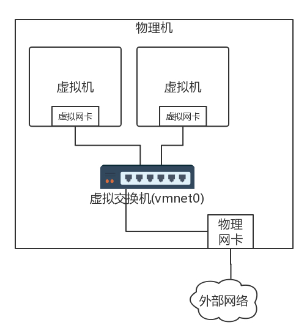

- 每個虛擬機都會有虛擬網卡，在你的筆記本電腦上，會發現多了幾個網卡，其實是虛擬交換機。這個虛擬交換機將虛擬機連接在一起。
- 在橋接模式下，物理網卡也連接到這個虛擬交換機上，物理網卡在桌面虛擬化軟件上，在"**界面名稱**”那裡選定。

如果使用橋接網絡，當你登錄虛擬機裡看IPW的時候會發現，你的虛擬機的地址和你的筆記本電腦的，以及你旁邊的同事的電腦的網段是一個網段。

- 原因：這其實相當於將物理機和虛擬機放在同一個網橋上，相當於這個網橋上有三台機器，是一個網段的，全部打平了。


在數據中心裡面，採取的也是類似的技術，只不過都是Linux，在每台機器上都創建網橋br0，虛擬機的網卡都連到br0上，物理網卡也連到br0上，所有的br0都通過物理網卡出來連接到物理交換機上。 

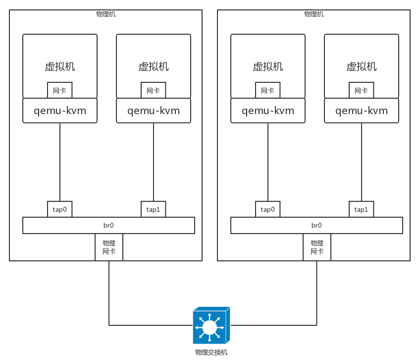

同樣我們換一個角度看待這個拓撲圖。同樣是將網絡打平，`虛擬機會和你的物理網絡具有相同的網段`。

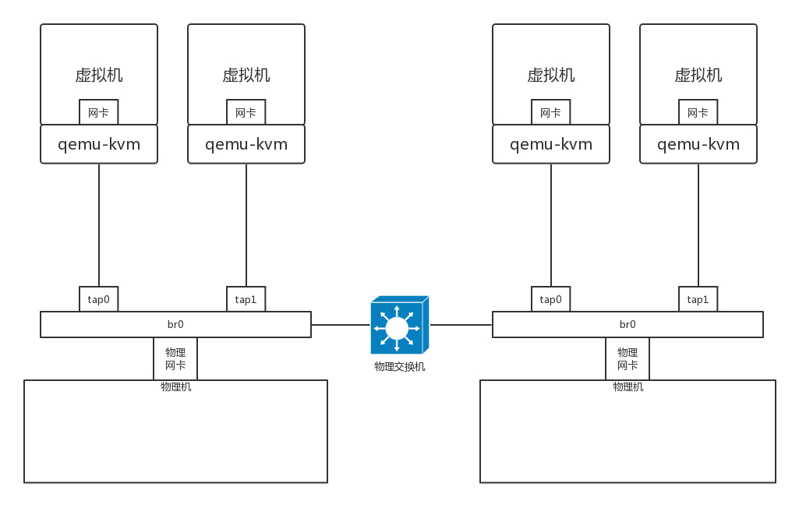

**在這種方式下，不但解決了同一台機器的互通問題，也解決了跨物理機的互通問題**，因為都在一個二層網絡裡面，彼此用相同的網段訪問就可以了。但是**當規模很大的時候，會存在問題**。

- 在一個二層網絡裡面，最大的問題是廣播。一個數據中心的物理機已經很多了，廣播已經非常嚴重，需要通過VLAN進行劃分。
- 如果使用了虛擬機，假設一台物理機裡面創建10台虛擬機，全部在一個二層網絡裡面，那廣播就會很嚴重，所以除非是你的桌面虛擬機或者數據中心規模非常小，才可以使用這種相對簡單的方式。

###### NAT

> NAT(網路地址轉換模式)
>
> - 使用NAT模式，就是讓虛擬系統藉助NAT(網路地址轉換)功能，通過宿主機器所在的網路來訪問公網。也就是說，使用NAT模式可以實現在虛擬系統裡訪問網際網路。
>   - 特點：虛擬主機和宿主機網絡信息可以不一致 10.0.3 10.0.0     
>   - 優點：不容易出現局域網中IP地址衝突     
>   - 缺點：其他宿主機不能直接訪問虛擬主機
> - NAT模式下的虛擬系統的TCP/IP配置資訊是由VMnet8(NAT)虛擬網路的DHCP伺服器提供的，無法進行手工修改，`因此虛擬系統也就無法和本區域網中的其他真實主機進行通訊`。
> - 採用NAT模式最大的優勢是虛擬系統接入網際網路非常簡單，你`不需要進行任何其他的配置，只需要宿主機器能訪問網際網路即可`。
>
> 　　如果你想利用VMWare安裝一個新的虛擬系統，在虛擬系統中不用進行任何手工配置就能直接訪問網際網路，建議你採用NAT模式。
>
> 

另外一種方式稱為NAT。如果在桌面虛擬化軟件中使用NAT模式，在你的筆記本電腦上會出現如下的網絡結構。


在這種方式下，你登錄到虛擬機裡面查IP地址，會發現虛擬機的網絡是虛擬機的，物理機的網絡是物理機的，兩個不相同。

- 虛擬機要想訪問物理機的時候，需要將地址NAT成為物理機的地址。

除此之外，它還會在你的筆記本電腦里內置一個DHCP服務器，為筆記本電腦上的虛擬機動態分配IP地址。

- 因為虛擬機的網絡自成體系，需要進行IP管理。
- 為什麼橋接方式不需要呢？因為橋接將網絡打平了，虛擬機的IP地址應該由物理網絡的DHCP服務器分配。

在數據中心裡面，也是使用類似的方式。這種方式更像是真的將你宿舍裡面的情況，搬到一台物理機上來。


虛擬機是你的電腦，路由器和DHCP Server相當於家用路由器或者寢室長的電腦，物理網卡相當於你們宿舍的外網網口，用於訪問互聯網。

- 所有電腦都通過內網網口連接到一個網橋br0上，虛擬機要想訪問互聯網，需要通過br0連到路由器上，然後通過路由器將請求NAT成為物理網絡的地址，轉發到物理網絡。

如果是你自己登錄到物理機上做個簡單配置，你可以簡化一下。

- 例如將虛擬機所在網絡的網關的地址直接配置到br0上，不用DHCP Server，手動配置每台虛擬機的IP地址，通過命令`iptables -t nat -A POSTROUTING -o ethX -j MASQUERADE`，直接在物理網卡ethX上進行NAT，所有從這個網卡出去的包都NAT成這個網卡的地址。
- 通過設置`net.ipv4.ip_forward = 1`,開啟物理機的轉發功能，直接做路由器，而不用單獨的路由器，這樣虛擬機就能直接上網了。

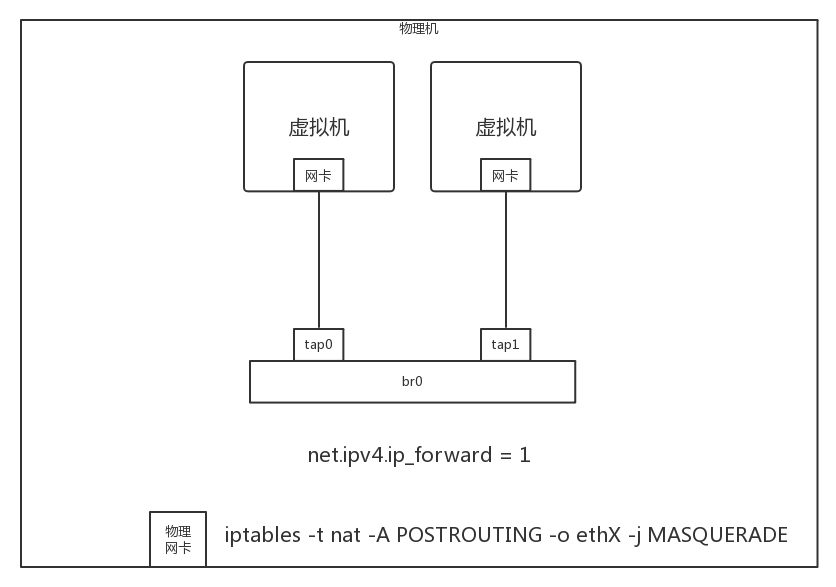


#### 隔離問題

解決了互通的問題，接下來就是隔離的問題。

如果一台機器上的兩個虛擬機不屬於同一個用戶，怎麼辦呢？

- 好在**`brctl`創建的網橋也是支持`VLAN`功能的，可以設置兩個虛擬機的tag，這樣在這個虛擬網橋上，兩個虛擬機是不互通的**。

但是**如何跨物理機互通，並且實現VLAN的隔離呢？**

由於`brctl`創建的網橋上面的tag是沒辦法在網橋之外的範圍內起作用的，於是我們需要尋找其他的方式。

- 有一個命令**`vconfig`**，**可以基於物理網卡eth0創建帶VLAN的虛擬網卡**，所有從這個虛擬網卡出去的包，都帶這個VLAN，如果這樣，跨物理機的互通和隔離就可以通過這個網卡來實現。

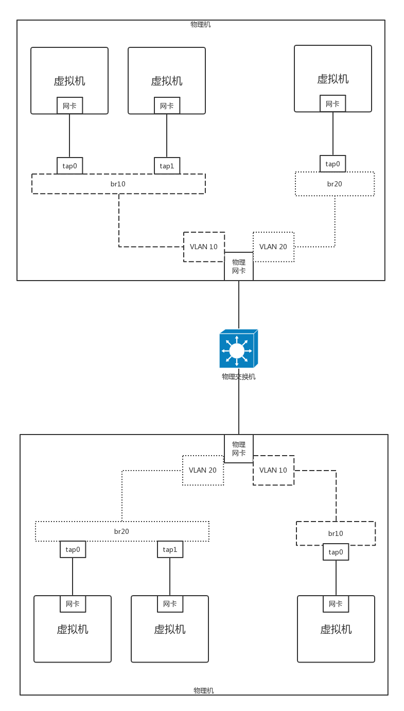

- 首先為每個用戶分配不同的VLAN,例如有一個用戶VLAN 10,一個用戶VLAN 20。在一台物理機上，基於物理網卡，為每個用戶用vconfig創建一個帶VLAN的網卡。不同的用戶使用不同的虛擬網橋，帶VLAN的虛擬網卡也連接到虛擬網橋上。

這樣是否能保證兩個用戶的隔離性呢？

- 不同的用戶由於網橋不通，不能相互通信，一旦出了網橋，由於VLAN不同，也不會將包轉發到另一個網橋上。另外，出了物理機，也是帶著VLAN ID的。
- 只要物理交換機也是支持VLAN的，到達另一台物理機的時候，VLAN ID依然在，它只會將包轉發給相同VLAN的網卡和網橋，所以跨物理機，不同的VLAN也不會相互通信。

使用brctl創建出來的網橋功能是簡單的，**基於VLAN的虛擬網卡**也能實現簡單的隔離。但是這都不是能夠滿足大規模雲平台的，

- 一個是**VLAN的隔離，數目太少**。VLAN ID只有4096個，明顯不夠用。另外
- 一點是這個**配置不夠靈活**。誰和誰通，誰和誰不通，**流量的隔離也沒有實現**，還有大量改進的空間。

### |> 小結

來總結一下：

- 雲計算的關鍵技術是虛擬化，這裡我們重點關注的是，虛擬網卡通過打開TUN/TAP字符設備的方式，將虛擬機內外連接起來；
- 雲中的網絡重點關註四個方面，共享、隔離、互通、靈活。其中共享和互通有兩種常用的方式，分別是橋接和NAT, 隔離可以通過VLAN的方式。

> 兩個思考題。

1. 為了直觀，這一節的內容我們以桌面虛擬化系統舉例。在數據中心裡面，有一款著名的開源軟件OpenStack, 這一節講的網絡連通方式對應OpenStack中的哪些模型呢？
2. 這一節的最後，我們也提到了，本節提到的網絡配置方式比較不靈活，你知道什麼更加靈活的方式嗎？

## # 第25講| 軟件定義網絡：共享基礎設施的小區物業管理辦法

上一節使用原生的VLAN和Linux網橋的方式來進行雲平台的管理，但是這樣在靈活性、隔離性方面都顯得不足，而且整個網絡缺少統一的視圖、統一的管理。

可以這樣比喻，雲計算就像大家一起住公寓，要共享小區裡面的基礎設施，其中網絡就相當於小區裡面的電梯、樓道、路、大門等，大家都走，往往會常出現問題，尤其在上班高峰期，出門的人太多，對小區的物業管理就帶來了挑戰。

物業可以派自己的物業管理人員，到每個單元的樓梯那裡，將電梯的上下行速度調快一點，還可以派人將多個小區出入口，改成出口多、入口少等等。等過了十點半，上班高峰過去，再派人都改回來。

### |> 軟件定義網絡（SDN, software-defined networking）

這種模式就像傳統的網絡設備和普通的Linux網橋的模式，配置整個雲平台的網絡通路，你需要登錄到這台機器上配置這個，再登錄到另外―個設備配置那個，才能成功。

如果物業管理人員有一套智能的控制系統，在物業監控室裡就能看到小區裡每個單元、每個電梯的人流情況，然後在監控室裡面，只要通過遠程控制的方式，撥弄一個手柄，電梯的速度就調整了，柵欄門就打開了，某個入口就改出口了。


這就是`軟件定義網絡（SDN, software-defined networking）`。它主要有以下三個特點。

- **控制與轉發分離**：**轉發平面**就是一個個虛擬或者物理的**網絡設備**，就像小區裡面的一條條路。**控制平面**就是統一的**控制中心**，
  - 就像小區物業的監控室。它們原來是一起的，物業管理員要從監控室出來，到路上去管理設備，現在是分離的，路就是走人的，控制都在監控室。
- **控制平面與轉發平面之間的開放接口**：
  - 控制器`向上`提供接口，`被應用層調用`，就像總控室提供按鈕，讓物業管理員使用。---> 北向接口
  - 控制器`向下`調用接口，`來控製網絡設備`，就像總控室會遠程控制電梯的速度。---> 南向接口
- **邏輯上的集中控制**：邏輯上集中的**控制平面可以控制多個轉發面設備**，也**就是控制整個物理網絡**，因而**可以獲得全局的網絡狀態視圖**，並根據該全局網絡狀態視圖實現對網絡的優化控制，
  - 就像物業管理員在監控室能夠看到整個小區的情況，並根據情況優化出入方案。

### |> OpenFlow和OpenvSwitch

SDN有很多種實現方式，我們來看一種開源的實現方式。

- **OpenFlow**是**SDN控制器和網絡設備之間互通的南向接口協議**，
- **OpenvSwitch**用於**創建軟件的虛擬交換機**。

**OpenvSwitch是支持OpenFlow協議的**，當然也有**一些硬件交換機也支持OpenFlow協議**。它們**都可以被統一的SDN控制器管理，從而實現物理機和虛擬機的網絡連通**。


[OpenvSwitch/OpenFlow 架构解析与实践案例](https://www.cnblogs.com/jmilkfan-fanguiju/p/10589725.html)

> OpenFlow is a open standard managed by Open Networking Foundation. It specifies a protocol by which a remote controller can modify the behavior of networking devices through a well-defined “forwarding instruction set”.

- OpenFlow，一種網上通信協議，屬於`數據鏈路層`，能夠`控製網上交換器或路由器的數據轉發平面（Forwarding Plane），藉此改變網上數據包所經過的網上路徑`。
  - 簡而言之，`OpenFlow 就是 SDN Controller 遠程控製網絡設備的協議`，經由網上交換器，決定網上數據包要由何種路徑通過網絡交換機。
- 雖然 OpenFlow 的功能不如各大網絡廠商的自家協議強大，但正因如此，OpenFlow 成為了一個兼容非常高的功能子集。
- OpenFlow 允許從遠程控製網上交換器的數據包轉送表，透過新增、修改、移除數據包控制規則與行動，來改變數據包轉送的路徑。
  - 比起用訪問控製表（ACLs）和路由協議，允許更加複雜且靈活的流量管理。
- 同時，OpenFlow 允許不同網絡供應商用一個簡單，開源的協議去遠程管理交換機（通常提供專有的接口和描述語言）。 OpenFlow 協議用來描述控制器和交換機之間交互所用信息的標準，以及控制器和交換機的接口標準。


>Open vSwitch is a production quality, multilayer virtual switch licensed under the open source Apache 2.0 license. It is designed to enable massive network automation through programmatic extension, while still supporting standard management interfaces and protocols (e.g. NetFlow, sFlow, IPFIX, RSPAN, CLI, LACP, 802.1ag). In addition, it is designed to support distribution across multiple physical servers similar to VMware’s vNetwork distributed vswitch or Cisco’s Nexus 1000V.
>– [官方网站](http://www.openvswitch.org/)

- Open vSwitch（下文簡稱 OvS）就是一個開源的虛擬交換機實現。廣泛應用在雲計算行業，為網絡管理員`提供虛擬雲主機之間和之內的流量可見性與可控性`。 
- Open vSwitch 旨在用虛擬化方案解決網絡問題，與控制器軟件一起實現分佈式的`虛擬交換技術`。
  - 這意味著，交換機和控制器軟件能夠在多個服務器之間創建集群網絡配置，從而不需要在每一台雲主機和物理主機上單獨配置網絡。
- 這個交換機還支持 VLAN 中繼，通過 NetFlow、sFlow 和 RSPAN 實現可見性，通過 OpenFlow 協議進行管理。它還有其他一些特性：嚴格流量控制，它由 OpenFlow 交換協議實現；遠程管理功能，它能通過網絡策略實現更多控制。

[研究Open vSwitch](https://jeremyxu2010.github.io/2016/09/%E7%A0%94%E7%A9%B6open-vswitch/)

名詞解釋

- Packet （數據包） 網絡轉發的最小數據單元，每個包都來自某個端口，最終會被發往一個或多個目標端口，轉發數據包的過程就是網絡的唯一功能。
- Bridge （網橋） Open vSwitch中的網橋對應物理交換機，其功能是根據一定流規則，把從端口收到的數據包轉發到另一個或多個端口。
- Normal Port: 用戶可以把操作系統中的網卡綁定到Open vSwitch上，Open vSwitch會生成一個普通端口處理這塊網卡進出的數據包。
- Internal Port: 當設置端口類型為internal，Open vSwitch會創建一快虛擬網卡，此端口收到的所有數據包都會交給這塊網卡，網卡發出的包會通過這個端口交給Open vSwitch。當Open vSwitch創建一個新網橋時，默認會創建一個與網橋同名的Internal Port，同時也創建一個與Port同名的Interface。三位一體，所以操作系統裡就多了一塊網卡，但是狀態是down的。
- Patch Port: 當機器中有多個Open vSwitch網橋時，可以使用Patch Port把兩個網橋連起來。 Patch Port總是成對出現，分別連接在兩個網橋上，在兩個網橋之間交換數據。 Patch Port是機房術語，特指用於切換網線連接的接線卡。此卡上面網口成對出現，當需要把兩台設備連接起來時，只需要把兩台設備接入同一對網口即可。
- Tunnel Port: 隧道端口是一種虛擬端口，支持使用gre或vxlan等隧道技術與位於網絡上其他位置的遠程端口通訊。
  Interface （iface/接口） 接口是Open vSwitch與外部交換數據包的組件。一個接口就是操作系統的一塊網卡，這塊網卡可能是Open vSwitch生成的虛擬網卡，也可能是物理網卡掛載在Open vSwitch上，也可能是操作系統的虛擬網卡（TUN/TAP）掛載在Open vSwitch上。
- Flow （流） 流定義了端口之間數據包的交換規則。每條流分為匹配和動作兩部分，匹配部分選擇哪些數據包需要可以通過這條流處理，動作決定這些匹配到的數據包如何轉發。流描述了一個網橋上，端口到端口的轉發規則。比如我可以定義這樣一條流：當數據包來自端口A，則發往端口B, 來自端口A就是匹配部分，發往端口B就是動作部分。流的定義可能非常複雜，比如：當數據包來自端口A，並且其源MAC是aa:aa:aa:aa:aa:aa，並且其擁有vlan tag為a，並且其源IP是aaaa，並且其協議是TCP，其TCP源端口號為a，則修改其源IP為bbbb，發往端口B
- Datapath 由於流可能非常複雜，對每個進來的數據包都去嘗試匹配所有流，效率會非常低，所以有了datapath這個東西。 Datapath是流的一個緩存，會把流的執行結果保存起來，當下次遇到匹配到同一條流的數據包，直接通過datapath處理。考慮到轉發效率，datapath完全是在內核態實現的，並且默認的超時時間非常短，大概只有3秒左右。

[云计算底层技术-使用openvswitch](https://opengers.github.io/openstack/openstack-base-use-openvswitch/)

#### SDN控制器是如何通過OpenFlow協議控製網絡的呢？

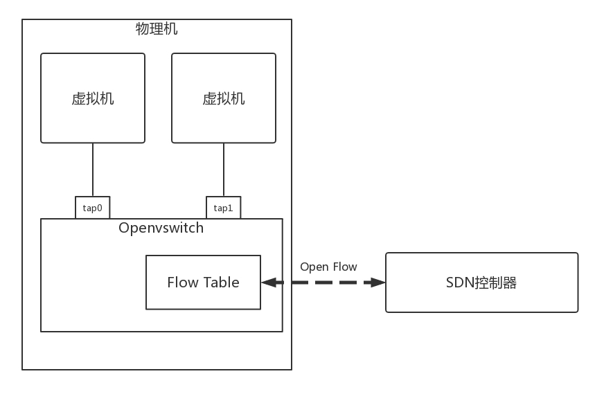

在OpenvSwitch裡面，有一個`流表規則`，任何通過這個交換機的包，都會經過這些規則進行處理，從而接收、轉發、放棄。

那流表長啥樣呢？其實就是一個個表格，每個表格好多行，每行都是一條規則。每條規則都有優先級，先看高優先級的規則，再看低優先級的規則。


1. 對於每一條規則，要看是否滿足**匹配條件**。
   - 這些條件包括，從哪個端口進來的，網絡包頭里面有什麼等等。
2. **滿足**了**條件**的網絡包，就要**執行**一個**動作**，對這個網絡包進行處理。
   - 可以修改包頭里的內容，可以跳到任何一個表格，可以轉發到某個網口出去，也可以丟棄。

通過這些表格，可以對收到的網絡包處理。


具體都能做什麼處理呢？通過上面的表格可以看出，處理可以覆蓋TCP/IP協議棧的四層。

對於**物理層**：

- 匹配規則包括由從哪個口進來；
- 執行動作包括從哪個口出去。

對於**MAC層**：

- 匹配規則包括：**源MAC地址**是多少？( **dl_src** )，**目標MAC**是多少？( **dl_dst** )，**所屬vlan**是多少？( **dl_vlan** )；
- 執行動作包括：**修改源MAC** ( **mod_dl_src** )，**修改目標MAC** ( **mod_dl_dst** )，**修改VLAN** ( **mod_vlan_vid** )，**刪除VLAN** ( **strip_vlan** )，**MAC地址學習**( **learn** )。

對於**網絡層**：

- 匹配規則包括：**源IP地址**是多少？( **nw_src** )，**目標IP**是多少？( **nw_dst** )。
- 執行動作包括：**修改源IP地址**( **mod_nw_src** )，**修改目標IP地址**( **mod_nw_dst** )。

對於**傳輸層**：

- 匹配規則包括：**源端口**是多少？( **tp_src** )，**目標端口**是多少？( **tp_dst** )。
- 執行動作包括：**修改源端口**( **mod_tp_src** )，**修改目標端口**( **mod_tp_dst** )。

總而言之，對於OpenvSwitch來講，網絡包到了我手裡，就是一個Buffer，我想怎麼改怎麼改，想發到哪個端口就發送到哪個端口。

OpenvSwitch有本地的命令行可以進行配置，能夠實驗前面講過的一些功能。我們可以通過OpenvSwitch的命令創建一個虛擬交換機。然後可以將多個虛擬端口port添加到這個虛擬交換機上。

```
ovs-vsctl add-br ubuntu_br
```

[Linux-虛擬網路裝置-OpenvSwitch(持續更新)](https://www.itread01.com/content/1548034955.html)

```
The main components of this distribution are:
• ovs-vswitchd, a daemon that implements the switch, along with a companion Linux kernel module for flow-based switching.
• ovsdb-server, a lightweight database server that ovs-vswitchd queries to obtain its configuration.
• ovs-dpctl, a tool for configuring the switch kernel module.
• Scripts and specs for building RPMs for Citrix XenServer and Red Hat Enterprise Linux. The XenServer RPMs allow Open vSwitch to be installed on a Citrix XenServer host as a drop-in replacement for its switch, with additional functionality.
• ovs-vsctl, a utility for querying and updating the configuration of ovs-vswitchd.
• ovs-appctl, a utility that sends commands to running Open vSwitch daemons.
Open vSwitch also provides some tools:
• ovs-ofctl, a utility for querying and controlling OpenFlow switches and controllers.
ovs-pki, a utility for creating and managing the public-key infrastructure
```


### |> 實驗一：用OpenvSwitch實現VLAN的功能

[世民談雲計算（微信公眾號ID：SammyTalksAboutCloud）](https://www.cnblogs.com/sammyliu/)

下面我們實驗一下通過OpenvSwitch實現VLAN的功能，在**OpenvSwitch中端口port分兩種**。

第一類是**access port**：

- 這個端口配置tag，從這個端口進來的包會被打上這個tag；
- 如果網絡包本身帶有的VLAN ID 等於tag，則會從這個port 發出；(轉發)
- 從access port 發出的包不帶VLAN ID。

- Access port：` 一個access port 只能屬於1個VLAN，一般用於連接計算機的端口`。這種類型的端口允許`接收沒有打標籤的幀，再發出去時將會被打上標籤`。一個access port 往往被分配一個vlan id。根據交換機的不同實現，

  - 有些交換機只能支持發到access port 的數據幀中沒有vlan tag，
  - 而有些則支持數據幀中有vlan id tag 但是需要與端口的vlan id 相同。

  `離開交換機的Access port 然後進入計算機的以太幀中沒有VLAN Tag`，這意味著`連接到access ports 的機器不會覺察到VLAN 的存在`。

  - 如果進來的數據幀沒有vlan tag，它通過access port 後，會被插入vlan id tag。
  - 如果進來的一個數據幀帶有vlan id tag 並且與access port 所分配的vlan id 相同，那麼它會被轉發；如果不同，則會被丟棄。
  - 發送幀處理過程：先剝離幀的PVID Tag，然後再轉發。
  
- 如果端口為access類型，並加入了一個vlan ，那麼這端口的PVID屬性值變成和VID值一樣;缺省VLAN ID 就是當前加入的VLAN ID

第二類是**trunk port**：

- 這個port不配置tag，配置trunks；
- 如果trunks為空，則所有的VLAN都trunk，也就意味著對於所有VLAN 的包，本身帶什麼VLAN ID，就是攜帶著什麼VLAN ID，如果沒有設置VLAN，就屬於VLAN 0，全部允許通過；
- 如果trunks不為空，則僅僅帶著這些VLAN ID 的包通過。
- Trunk port： `一個trunk port 支持多個VLAN`。可以接收和發送多個VLAN的報文，一般用於`交換機之間連接的端口`。在配置trunk 口時，可以指定`允許接收的VLAN 的ID 區間`，還可以配置一個Native VLAN （缺省VID，也稱為PVID）。當設置了PVID 時，沒有打標籤的進來的幀將被打上PVID 的tag再被發出去。
- 有多個交換機時，組A中的部分機器連接到switch 1，另一部分機器連接到switch 2。要使得這些機器能夠相互訪問，你需要連接兩台交換機。要避免使用一根電纜連接每個VLAN 的兩個端口，我們可以在每個交換機上配置一個VLAN trunk port。
- `Trunk port 發出和收到的數據包都帶有VLAN header，該header 表明了該數據包屬於那個VLAN`。因此，只需要分別連接兩個交換機的一個trunk port 就可以轉發所有的數據包了。
- 通常來講，只使用trunk port 連接兩個交換機，而不是用來連接機器和交換機，因為機器不想看到它們收到的數據包帶有VLAN Header。有時候，如果一個機器需要發出帶有不同VLAN ID 的數據包，那麼與它相連的交換機的口也需要被設置為trunk port。
- 


（1）基於端口的VLAN （untagged VLAN - 端口屬於一個VLAN，數據幀中沒有VLAN tag）


- 這種模式中，在交換機上創建若干個VLAN，在將若干端口放在每個VLAN 中。
- 每個端口在某一時刻只能屬於一個VLAN。一個VLAN 可以包含所有端口，或者部分端口。
- 每個端口有個`PVID （port VLAN identifier)`。這種模式下，`一個端口上收到的frame 是 untagged frame`，因此它不包含任何有關VLAN 的信息。`VLAN 的關係只能從端口的PVID 上看出來`。
- 交換機在轉發frame 時，只將它轉發到相同PVID 的端口。

如上圖所示，連接兩個交換機的同一個VLAN 中的兩個計算機需要通信的話，需要在兩個交換機之間連兩根線：

- 一根從Switch A 端口4 到Switch B 端口4 （VLAN 1）
- 一根從Switch A 端口8 到Switch B 端口8 （VLAN 2）

（2）Tagged VLANs （數據幀中帶有VLAN tag）


- 這種模式下，frame的VLAN關係是它自己攜帶的信息中保存的，這種信息叫`a tag or tagged header`。
- 當交換機收到一個帶VLAN tag的幀，`它只將它轉發給具有同樣VID的端口`。
- 一個能夠接收或者轉發tagged frame的端口被稱為a tagged port。所有連接到這種端口的網絡設備必須是802.1Q協議兼容的。這種設備必須能處理tagged frame，以及添加tag到其轉發的frame。

上圖中，兩個交換機上的端口8 支持VLAN 1 和2， 因此一根線就可以了實現跨交換機的同VLAN 內的計算機互相通信了。 

在實際的VLAN 配置中的各種情況：

- 交換機的所有端口，部分是tagged port，部分被添加到VLAN 中。
- 一個untagged port，不管它是一個基於端口的VLAN 的一個成員還是一個tagged VLAN 中的一個成員，一個時刻只能在一個VLAN 中。
- 一個tagged port，可以是多個VLAN 的成員。
- 一個port，可以同時是一個VLAN 的untagged member，以及不同VLAN 中的tagged member。

|             | tagged （進）                                       | untagged （進） | 出（交換機在做交換時，只會把幀發給包含其VID 的端口）        |
| ----------- | --------------------------------------------------- | --------------- | ----------------------------------------------------------- |
| Access port | 丟棄                                                | 打上PVID        | 剝離VID，此時的幀為標準以太網幀                             |
| Trunk port  | 如果在接口允許通過的VLAN ID列表裡，則不變；否則丟棄 | 打上PVID        | 如果VID 與PVID 不同，則透傳；如果VID 與PVID 相同，則剝離VID |

[圖文並茂深入了解VLAN工作原理，不能錯過乾貨](https://network.51cto.com/art/201910/605101.htm)

**VLAN基本通信原理**

為了提高處理效率，交換機內部的數據幀一律都帶有VLAN Tag，已統一方式處理。當一個數據進入交換機接口時，如果沒有帶VLAN Tag標籤，且該接口上配置了PVID，那麼，該數據幀就會被標記上接口的PVID。如果數據幀已經帶有VLAN Tag，那麼，即使接口已經配置了PVID，交換機不會再給數據幀標記VLAN Tag。

[建立VLAN邏輯分割網段 詳解交換器Trunk設定](https://www.netadmin.com.tw/netadmin/zh-tw/technology/096ED545667A46F8A69FAE1659FF2B24?page=2)

一般來說，若在眾多的Switch設備之間架設VLAN，則只有同一個VLAN中的電腦才可以互相傳遞資料，在Switch設備內部，事實上是透過限制資料的轉送來達到這種VLAN的資料傳遞過程。

當Switch設備收到資料之後，會根據學習過的MAC位址對應表，來決定資料要送往哪個埠，如果沒有學習過的話，則預設會Flooding到所有的埠，這是因為預設上所有的埠都是屬於預設的VLAN之中，也就是所有的埠都屬於同一個VLAN。因此，這樣的Flooding動作不會有什麼問題。

但是，如果是有分割VLAN的話，就不能這樣做了，因為會把某個VLAN的資料送往其他的VLAN，所以在這種情況下，Switch設備會了解哪些埠是屬於哪個VLAN，而會限制Flooding時只能送往同一個VLAN。

[基於OVS的VLAN應用及實現](https://www.sdnlab.com/20196.html)

我們通過以下命令創建如下的環境：

```shell
# 創建OVS網橋
ovs-vsctl add-br ubuntu_br
# 可以把操作系統中已有的網卡(物理網卡em1/eth0,或虛擬機的虛擬網卡tapxxx)掛載到ovs上，ovs會生成一個同名Port處理這塊網卡進出的數據包。此時端口類型為Normal
ovs-vsctl add-port ubuntu_br first_br
ovs-vsctl add-port ubuntu_br second_br
ovs-vsctl add-port ubuntu_br third_br
# 設置 vnet0/1/2 端口並配置tag
ovs-vsctl set Port vnet0 tag=101
ovs-vsctl set Port vnet1 tag=102
ovs-vsctl set Port vnet2 tag=103
ovs-vsctl set Port first_br tag=103
ovs-vsctl clear Port second_br tag
# 設置 third_br 端口為trunk類型,並配置可以轉發的vlan
ovs-vsctl set Port third_br trunks=101,102

# 以下命令查詢主機上已有的 OVS bridge，以及其中的 port。
ovs-vsctl show
```

另外要配置禁止MAC地址學習。

```
ovs-vsctl set bridge ubuntu_br flood-vlans=101,102,103 
```


創建好了環境以後，我們來做這個實驗。

1. 從192.168.100.102來ping 192.168.100.103，然後用tcpdump 進行抓包。first_if 收到包了，從first_br 出來的包頭是沒有VLAN ID的。second_if也收到包了，由於second_br 是trunk port，因而出來的包頭是有VLAN ID的，third_if 收不到包。
2. 從192.168.100.100來ping 192.168.100.105, 則second_if 和third_if 可以收到包，當然ping不通，因為third_if 不屬於某個VLAN。first_if 是收不到包的。second_if 能夠收到包，而且包頭里面是VLAN ID=101。third_if 也能收到包，而且包頭里面是VLAN ID=101。
3. 從192.168.100.101來ping 192.168.100.104，則second_if 和third_if 可以收到包。first_if 是收不到包的。second_br 能夠收到包，而且包頭里面是VLAN ID=102。third_if 他能收到包，而且包頭里面是VLAN ID=102。

通過這個例子，我們可以看到，通過OpenvSwitch，不用買一個支持VLAN的交換機，你也能學習VLAN的工作模式了。

#### VLAN

[建立VLAN邏輯分割網段 詳解交換器Trunk設定](https://www.netadmin.com.tw/netadmin/zh-tw/technology/096ED545667A46F8A69FAE1659FF2B24)

[圖文並茂深入了解VLAN工作原理，不能錯過乾貨](https://www.mdeditor.tw/pl/pgNE)

交換機（Switch）上很重要的概念以及知識：虛擬區域網路（Virtual LAN，也就是所謂的VLAN）。

虛擬區域網路（VLAN）是由一群終端機器組合而成，例如一些使用者的PC設備，

- VLAN技術也允許把一台Switch設備的埠分成幾個群組，並可以針對每個不同的群組套用不同的設定。
- 換句話說，VLAN可以在邏輯上區分不同的廣播網域，而這樣的廣播網域能夠延伸到多個實體區域網路區段（網段），因此VLAN技術可增加網路組織的彈性。

Switch設備上的每一個埠，只能被指定到某一個VLAN，也就是說，

- 一個VLAN中的所有的埠都共享整個廣播封包，所以說，一個VLAN事實上可以想成廣播網域（Broadcast Domain），因此不同VLAN之間的埠是無法共享彼此的廣播封包。
- 這是一項很重要的特性，因為這代表VLAN越多，每個VLAN中的終端機用戶數目就越少，因此廣播封包所造成的網路負擔就越小。
- 此外，VLAN可橫跨多個Switch設備，因此VLAN在規劃時甚至能夠跨越不同的建築物，也可以跨越WAN。

VLAN基本通信原理 

- 為了提高處理效率，交換機內部的數據幀一律都帶有VLAN Tag，已統一方式處理。當一個數據進入交換機接口時，如果沒有帶VLAN Tag標籤，且該接口上配置了PVID，那麼，該數據幀就會被標記上接口的PVID。如果數據幀已經帶有VLAN Tag，那麼，即使接口已經配置了PVID，交換機不會再給數據幀標記VLAN Tag。

vlan類型 　　

- 基於port的vlan（數據幀種不包含vlan tag，vlan信息從交換機的端口pvid（Port-base Vlan ID）上得知，交換機轉發包也基於此） 　　
- 基於tagged vlan（數據幀中包含vlan tag，vlan信息從數據幀內包含的vlan信息，交換機需要有對該數據幀拆包/封包的能力，即連接到這種端口的網絡設備必須是8021.Q


##### 同一交換機不同VLAN情況


交換機分別配置了VLAN 10 20，同時把相應的PC加入不同的VLAN中，通過在交換機上GE0/01和GE0/0/3抓包，發現GE0/0/1能抓取數據包，而GE0/0/3沒有數據包經過。這也證實了VLAN的一個特性，隔離廣播風暴。

- Access接口對接收不帶Tag的報文處理：接收該報文，並打上缺省的VLAN ID
- Access接口對接收帶Tag的報文處理：當VLAN ID 與缺省VLAN ID相同時，接收該報文;當VLAN ID與缺省VLAN ID不同時，丟棄該報文;
- 發送幀處理過程：先剝離幀的PVID Tag，然後再轉發。

注意：如果端口為access類型，並加入了一個vlan ，那麼這端口的PVID屬性值變成和VID值一樣;缺省VLAN ID 就是當前加入的VLAN ID

從以上access端口接收發送數據包，可以大致推測出PC1和PC2的通信過程如下：

- 當PC1發送數據包時，數據包是不帶Tag標籤的。進入交換機GE0/0/1端口後，則被帶上VLAN 10 的標籤。
- 當交換機GE0/0/3端口接收到GE0/0/1端口發來的數據包，然後檢查發現是帶上Tag標籤的，進一步比較與自己的缺省VLAN是否一致，結果發現不一致，直接發數據包丟棄了。

##### 同一交換機相同VLAN情況

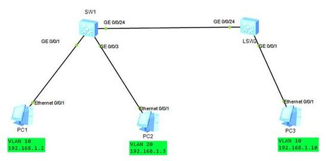

上圖兩台交換機通過GE0/0/24端口互聯，並把GE0/0/24配置成trunk口模式，允許VLAN 10、20通過。

trunk端口對不帶Tag的報文處理：

- 打上缺省的VLAN ID，當缺省VLAN ID在允許通過的VLAN ID列表時，接收該報文。
- 當缺省VLAN ID不在允許通過的VLAN ID列表時，丟棄該報文。

trunk端口對帶Tag的報文處理：

- 當VLAN ID在接口允許通過的VLAN ID列表裡時，接收該報文;
- 當VLAN ID不在接口允許通過的VLAN ID列表時，丟棄報文。

發送幀處理過程：

- 當VLAN ID與缺省VLAN ID相同，且是該接口允許通過的VLAN ID時，去掉Tag，發送該報文;
- 當VLAN ID與缺省VLAN ID不同，且是該接口允許通過的VLAN ID時，保持原有Tag，發送該報文。

從以上Trunk端口收發數據包的處理過程，大致可以推測出PC1和PC3的過程如下：

- 當PC1發送數據包到SW1端口(數據包不帶Tag標籤)，進入SW1交換機的GE0/0/1端口後，被加上該端口VLAN ID 20進行轉發。
- 進行ARP廣播請求PC3端MAC地址，數據包進入SW1的GE0/0/24端口，由於SW1的GE0/0/24端口為trunk模式，允許VLAN 10 和20通過，並根據trunk端口發送幀處理過程。數據包順利到達SW2的G0/0/24端口。
- 由於ARP廣播包攜帶了Tag標籤，只有對應的端口對此廣播進行處理，並相應。
- PC1得到PC3的MAC地址，進行數據包封裝轉發，進行通信。

#### Gateway閘道器,網關:

Gateway主要功能是用來"連接兩個不同的網段"。也就是說,如果系統判定目的端為不同網段,就會將封包丟給Gateway來做轉送,反之,如果判定為相同網段,即直接傳到目的端,不會經由Gateway.

[ping命令整个过程详解](https://blog.csdn.net/guoweimelon/article/details/50859658)

[ping过程详细解读](https://www.cnblogs.com/Jimmy1988/p/8025344.html)

[同vlan不同網段能否ping通？網路中各種互通與不通的總結分析](https://www.mdeditor.tw/pl/2hqC/zh-tw)

#### 同一個vlan不同的網段能不能互通呢?

同一個vlan同一個網段的ip地址能夠直接互通，那麼同一個vlan不同的網段能不能互通呢?

##### 一、同vlan不同網段能否ping通

了同vlan與同網段間如何互訪，不同vlan間如何互訪，而獨獨對於同vlan不同網段互通沒有細說，今天我們來看下。

例項一：

現在有兩臺電腦，他們同處於一個vlan，不同網段

- pcA IP地址：10.1.1.1/8
- pcB ip地址：11.1.1.1/8

1. 無閘道器，A ping B
   - 報出的Destination host unreachable
   - 顯然，A機器發現對方與自己不是同一網段，試圖尋找閘道器，但閘道器不存在，所以報主機不可達，B上的Sniffer未抓到任何包，觀察網絡卡也是隻發不收，顯然資料沒有出去。

2. 閘道器設成對方IP，A ping B
   - 能正常PING通
   - 從A計算機Sniffer上抓到的包可以看出，A在PING對方過程中，A首先進行了ARP廣播，它廣播詢問11.1.1.1的MAC是什麼。
   - 顯然這個ARP廣播是可以被B收到的 (因為他們同處一個vlan)，而11.1.1.1正好就是B的IP地址，理所當然B要回應這個ARP請求。A首先進行了ARP廣播，然後收到了B的應答。
   - 這樣A就有了B的MAC，而B在接到A的ARP廣播時候就學到A的MAC，所以雙方可以PING通。

3. 閘道器設成自己,A ping B
   - 一樣是可以ping的通的
   - 抓到的結果與第2種情況一樣，A依然是先廣播詢問11.1.1.1的MAC，這個ARP廣播被B接到後，B有義務應答，於是雙方知道對方MAC，所以能PING通。
   - 與第2種情況不同的是,這裡可以明確知道ARP中的11.1.1.1指的是PING中所指定的IP地址而不是閘道器(此時A閘道器是10.1.1.1了),那麼第2種情況中的11.1.1.1也指的是PING中所指定的IP ?我們再來看下面。

##### 二、ping三個不存的ip地址，深入瞭解網路通訊原理

閘道器設成自己，PING 3個不存在的IP：

1. PING和自己同一網段的IP，

   - PING返回超時

   - A發出了詢問10.1.1.2的ARP廣播而不是詢問閘道器(10.1.1.1)的廣播,由於這個IP不存在，所以沒有機器做出迴應。

2. PING和網關同一網段的IP。
   - 超時,
   - B上接到的是A發出的關於11.1.1.2的ARP廣播，由於不存在11.1.1.2這個地址,所以沒有機器迴應。

3. PING和誰都不在一個網段的IP
   - 超時,
   - B上接到是A發出的關於100.1.1.1的ARP廣播，由於不存在100.1.1.1這個地址,所以沒有機器迴應。

從上面的3個實驗來看，

- 當閘道器設定成自己的時候，不管PING的地址是什麼，計算機發出的`ARP廣播`都是`直接詢問PING中所指定IP對應的MAC，沒有詢問閘道器的MAC`,
- 其實計算機在廣播詢問PING命令指定的IP之前還是會先問閘道器的MAC的，只是這裡由於閘道器是自己所以這一步就被跳過了。

##### 三、A計算機閘道器設定中B的ip，B的閘道器設定中不存在的ip地址

A計算機閘道器設成B的IP地址，但B的閘道器設定成一個不存在的IP(且與A/B都不在同一網路)，PING三種情況。

1. PING與網關同一網段IP，
   - 在A上抓包，可以看到A首先發出了關於閘道器11.1.1.1的ARP廣播請求(對應B接到這個廣播請求)，B對這個11.1.1.1進行了ARP應答.但這個IP是不存在的所以PING結果超時。

2. PING與誰都不在同一網段，
   - 超時,
   - A發出了關於閘道器11.1.1.1的請求,B做了應答.但PING是超時的.

3. PING計算機B的地址，

   - 結果超時，

   - 為什麼這個也不通呢?按說按照上面的測試,AB計算機都能獲得對方MAC,乙太網下，有MAC應該就有通訊的可能,可這個時候卻不通,

   - 檢視Sniffer抓到的包可以發現:

     A發出了關於11.1.1.1的ARP廣播請求，B對11.1.1.1做出應答，但是下面接到了多個B發來的關於100.1.1.1的ARP廣播請求，且100.1.1.1的請求沒有得到B的應答，看來B是一直在試圖查詢B的閘道器(100.1.1.1)所對應的MAC，在閘道器的MAC沒有獲得應答之前，B不會對PING產生迴應。

從上面的所有實驗看出，`計算機在與非本網段的地址通訊時，計算機首先查詢閘道器的MAC，如果閘道器MAC得不到迴應，是不會對PING作出響應的;`

因此,例項一中1和2的情況是屬於特殊情況，正好利用了閘道器與主機IP相同，騙過了計算機.如果AB的閘道器都設定的與AB ip毫不相干的話，相互肯定不通。

[【計算機網路】（一）OSI, TCP/IP模型 & 網路HTTP、TCP、UDP、Socket 基本知識總結](https://www.itread01.com/content/1545179764.html)


[每天都在用的Ping命令，它到底是什么？](https://zhuanlan.zhihu.com/p/45110873)

#### ping 命令

ping 命令是基於 ICMP 協議來工作的，ICMP是Internet Control Message Protocol的縮寫，這個網路協定運用在網路七層協定中的第三層。該協定的最主要目的，是用來解析網路封包或是分析路由的情況，大多是透過所傳回來的錯誤訊息進行分析

1）假設有兩個主機，主機A（192.168.0.1）和主機B（192.168.0.2），現在我們要監測主機A和主機B之間網絡是否可達，那麼我們在主機A上輸入命令：ping 192.168.0.2；

2）此時，ping命令會在主機A上構建一個ICMP的請求數據包（數據包裡的內容後面再詳述），然後ICMP協議會將這個數據包以及目標IP（192.168.0.2）等信息一同交給IP層協議；

3）IP層協議得到這些信息後，將源地址（即本機IP）、目標地址（即目標IP：192.168.0.2）、再加上一些其它的控制信息，構建成一個IP數據包；

4）IP數據包構建完成後，還不夠，還需要加上MAC地址，因此，還需要通過ARP映射表找出目標IP所對應的MAC地址。當拿到了目標主機的MAC地址和本機MAC後，一併交給數據鏈路層，組裝成一個數據幀，依據以太網的介質訪問規則，將它們傳送出出去； 

5）當主機B收到這個數據幀之後，會首先檢查它的目標MAC地址是不是本機，如果是就接收下來處理，接收之後會檢查這個數據幀，將數據幀中的IP數據包取出來，交給本機的IP層協議，然後IP層協議檢查完之後，再將ICMP數據包取出來交給ICMP協議處理，當這一步也處理完成之後，就會構建一個ICMP應答數據包，回發給主機A； 

6）在一定的時間內，如果主機A收到了應答包，則說明它與主機B之間網絡可達，如果沒有收到，則說明網絡不可達。除了監測是否可達以外，還可以利用應答時間和發起時間之間的差值，計算出數據包的延遲耗時。

### |> 實驗二：用OpenvSwitch模擬網卡綁定，連接交換機

接下來，我們來做另一個實驗。在前面，我們還說過，為了高可用，可以使用網卡綁定，連接到交換機，OpenvSwitch也可以模擬這一點。

在OpenvSwitch裡面，有個**bond_mode**，可以設置為以下三個值：

- **active-backup**：一個連接是active，其他的是backup，當active失效的時候，backup頂上；
- **balance-slb**：流量安裝源MAC和output VLAN進行負載均衡；
- **balance-tcp**：必須在支持LACP協議的情況下才可以，可根據L2, L3, L4進行負載均衡。

我們搭建一個測試環境。 


我們使用下面的命令，建立bond連接。

```
ovs-vsctl add-bond br0 bond0 first_br second_br
ovs-vsctl add-bond br1 bondl first_if second_if
ovs-vsctl set Port bond0 lacp=active
ovs-vsctl set Port bondl lacp=active
```

默認情況下bond_mode 是active-backup 模式，一開始active 的是first_br 和first_if。

這個時候我們從192.168.100.100 ping 192.168.100.102, 以及從192.168.100.101 ping 192.168.100.103的時候，tcpdump 可以看到所有的包都是從first_if 通過。

如果把first_if 設成down, 則包的走向會變，發現second_if 開始有流量，對於192.168.100.100 和192.168.100.101似乎沒有受到影響。

如果我們通過以下命令，把bond_mode 設為balance-slb。然後我們同時在192.168.100.100 ping 192.168.100.102,在192.168.100.101 ping 192.168.100.103, 我們通過tcpdump 發現包已經被分流了。

```
ovs-vsctl set Port bond0 bond_mode=balance-slb
ovs-vsctl set Port bond1 bond_mode=balance-slb
```

通過這個例子，我們可以看到，通過OpenvSwitch，你不用買兩台支持bond的交換機，也能看到bond的效果。

### |> OpenvSwitch架構

那OpenvSwitch是怎麼做到這些的呢？我們來看OpenvSwitch的架構圖。 

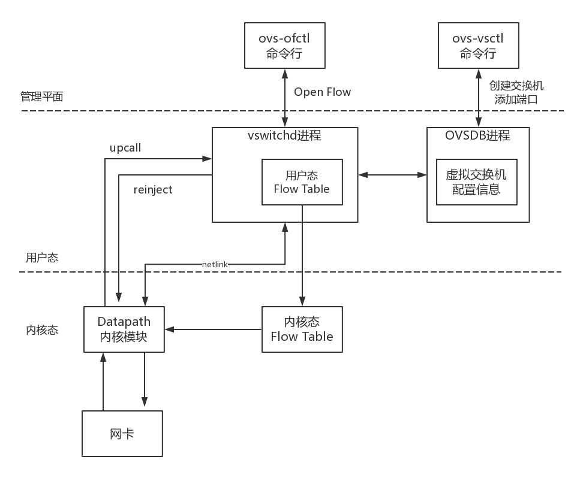

OpenvSwitch包含很多的模塊，在**用戶態**有**兩個重要的進程**，也有**兩個重要的命令行工具**。

- 第一個進程是**OVSDB進程**。**ovs-vsctl命令行**會和這個進程通信，去創建虛擬交換機，創建端口，將端口添加到虛擬交換機上，OVSDB會將這些拓撲信息保存在一個本地的文件中。
- 第二個進程是**vswitchd進程**。**ovs-ofctl命令行**會和這個進程通信，去下發流表規則，規則裡面會規定如何對網絡包進行處理，vswitchd會將流表放在用戶態Flow Table中。

在**內核態**，OpenvSwitch有**內核模塊OpenvSwitch.ko**，對應圖中的**Datapath**部分。在網卡上註冊一個函數，每當有網絡包到達網卡的時候，這個函數就會被調用。

在內核的這個函數里面，會拿到網絡包，將各個層次的重要信息拿出來，例如：

- 在物理層，in_port即包進入的網口的ID；
- 在MAC層，源和目的MAC地址;
- 在IP層，源和目的IP 地址；
- 在傳輸層，源和目的端口號。

在**內核中**，有一個**內核態Flow Table**。接下來內核模塊在這個內核流表中匹配規則，如果匹配上了，則執行操作、修改包，或者轉發或者放棄。如果內核沒有匹配上，則需要進入用戶態，**用戶態和內核態之間通過Linux的一個機制Netlink相互通信**。

**內核通過up call，告知用戶態**進程vswitchd在**用戶態Flow Table**裡面去匹配規則，這裡面的規則是**全量的流表規則**，而**內核Flow Table裡面的只是為了快速處理，保留了部分規則**，內核裡面的規則**過一陣就會過期**。

當在用戶態匹配到了流表規則之後，就在**用戶態**執行操作，同時將這個**匹配成功的流表通過reinject下發到內核**，從而接下來的包都能在內核找到這個規則。

這裡**調用openflow協議的，是本地的命令行工具，也可以是遠程的SDN控制器**，一個重要的SDN控制器是OpenDaylight。

下面這個圖就是OpenDaylight中看到的拓撲圖。是不是有種物業管理員在監控室裡的感覺？


### |> 如何在雲計算中使用OpenvSwitch?

OpenvSwitch這麼牛，如何用在雲計算中呢？


> VLAN的場景。

- **在沒有OpenvSwitch的時候**，如果一個新的用戶要使用一個新的VLAN，還需要創建一個屬於新的VLAN的虛擬網卡，並且為這個租戶創建一個單獨的虛擬網橋，這樣用戶越來越多的時候，虛擬網卡和虛擬網橋會越來越多，**管理非常複雜**。

- 另一個問題是虛擬機的VLAN和物理環境的VLAN是透傳的，也即從一開始規劃的時候，就需要匹配起來，將物理環境和虛擬環境強綁定，本來就**不靈活**。而引入了OpenvSwitch，狀態就得到了改觀。

> OpenvSwitch的場景

首先，由於OpenvSwitch本身就是支持VLAN的，所有的虛擬機都可以放在一個網橋br0上，通過不同的用戶配置不同的tag，就能夠實現隔離。

- 例如上面的圖，用戶A 的虛擬機都在br0 上，用戶B 的虛擬機都在br1 上，有了OpenvSwitch，就可以都放在br0 上，只是設置了不同的tag。

另外，還可以創建一個`虛擬交換機br1`, 將物理網絡和虛擬網絡進行隔離。物理網絡有物理網絡的VLAN規劃，虛擬機在一台物理機上，所有的VLAN都是從1開始的。由於一台機器上的虛擬機不會超過4096個，所以VLAN在一台物理機上如果從1開始，肯定夠用了。

例如在圖中，上面的物理機裡面，用戶A被分配的tag是1, 用戶B被分配的tag是2, 而在下面的物理機裡面，用戶A被分配的tag是7, 用戶B被分配的tag是6。

如果物理機之間的通信和隔離還是通過VLAN的話，需要將虛擬機的VLAN和物理環境的VLAN對應起來，但為了靈活性，不一定一致，這樣`可以實現分別管理物理機的網絡和虛擬機的網絡`。好在OpenvSwitch可以對包的內容進行修改。例如通過匹配dl_vlan，然後執行mod_vlan_vid來改進進出出物理機的網絡包。

儘管租戶多了，物理環境的VLAN還是不夠用，但是有了OpenvSwitch的映射，將物理和虛擬解耦，從而可以讓物理環境使用其他技術，而不影響虛擬機環境，這個我們後面再講。

### |> 小結

總結一下：

- 用SDN控制整個雲裡面的網絡，就像小區保安從總控室管理整個物業是一樣的，將控制面和數據面進行了分離；
- 一種開源的虛擬交換機的實現OpenvSwitch，它能對經過自己的包做任意修改，從而使得云對網絡的控制十分靈活；
- 將OpenvSwitch引入了雲之後，可以使得配置簡單而靈活，並且可以解耦物理網絡和虛擬網絡。

> 兩個思考題：

1. 在這一節中，提到了通過VIP可以通過流表在不同的機器之間實現複雜均衡，你知道怎樣才能做到嗎？
2. 雖然OpenvSwitch可以解耦物理網絡和虛擬網絡，但是在物理網絡裡面使用VLAN，數目還是不夠，你知道該怎麼辦嗎？

## # 第26講| 雲中的網絡安全

做一個小區物業維護一個大家共享的環境，還是挺不容易的，如果遇上不自覺的住戶就會很麻煩。

就像公有云的環境，各懷鬼胎的黑客到處都是掃描你的端口呀，探測一下你啟動的什麼應用啊，看一看是否有各種漏洞啊

假如你創建了一台虛擬機，裡面明明跑了一個電商應用，這是你非常重要的一個應用，你會把它進行安全加固。這台虛擬機的操作系統裡，不小心安裝了另外一個後台應用，監聽著一個端口，而你的警覺性沒有這麼高。

虛擬機的這個端口是對著公網開放的，碰巧這個後台應用本身是有漏洞的，黑客就可以掃描到這個端口，然後通過這個後台應用的端口侵入你的機器，將你加固好的電商網站黑掉。這就像你買了一個五星級的防盜門，卡車都撞不開，但是廁所窗戶的門把手是壞的，小偷從廁所裡面就進來了。

所以**對於公有云上的虛擬機，建議是僅僅開放需要的端口，而將其他的端口一概關閉。這個時候，你只要通過安全措施守護好這個唯一的入口就可以了**。採用的方式常常是用**`ACL （Access Control List，訪問控制列表）`**來控制IP和端口。

設置好了這些規則，只有指定的IP段能夠訪問指定的開放接口，就算有個有漏洞的後台進程在那裡，也會被屏蔽，黑客進不來。在雲平台上，這些規則的集合常稱為**安全組**。那安全組怎麼實現呢？

### |> 當一個網絡包進入一台機器的時候，都會做什麼事情

當一個網絡包進入一台機器的時候，都會做什麼事情。

1. 首先拿下MAC頭看看，是不是我的。如果是，則拿下IP頭來。

2. 得到目標IP之後呢，就開始進行路由判斷。

3. 在路由判斷之前，這個節點我們稱為**PREROUTING**。

   - 如果發現IP是我的，包就應該是我的，就發給上面的傳輸層，這個節點叫作**INPUT**。
     - 如果是我的，上層處理完畢完畢後，一般會返回一個處理結果，這個處理結果會發出去，這個節點稱為**OUTPUT**，
   - 如果發現IP不是我的，就需要轉發出去，這個節點稱為**FORWARD**。

   無論是FORWARD還是OUTPUT，都是路由判斷之後發生的，最後一個節點是**POSTROUTING**。

整個過程如圖所示。 

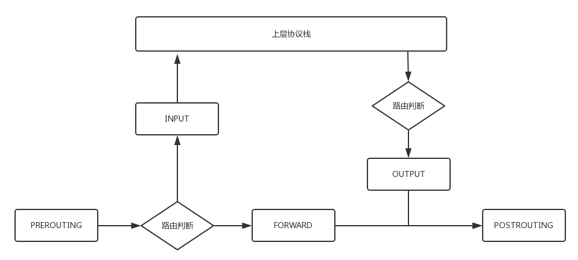

整個包的處理過程還是原來的過程，只不過為什麼要格外關注這**五個節點**呢？

### |> Netfilter框架實現iptables

是因為在Linux內核中，有一個框架叫**Netfilter**。

- `它可以在這些節點插入hook函數。這些函數可以截獲數據包，對數據包進行干預`。
  - 例如做一定的修改，然後決策是否接著交給TCP/IP協議棧處理；
  - 或者可以交回給協議棧，那就是**ACCEPT**；
  - 或者過濾掉，不再傳輸，就是**DROP**；
  - 還有就是**QUEUE**，發送給某個用戶態進程處理。
    - 這個比較難理解，經常用在`內部負載均衡`，就是過來的數據一會兒傳給目標地址1，一會兒傳給目標地址2，而且目標地址的個數和權重都可能變。協議棧往往處理不了這麼複雜的邏輯，需要寫一個函數接管這個數據，實現自己的邏輯。

- 有了這個Netfilter框架，你可以在IP轉發的過程中，隨時干預這個過程，只要你能實現這些hook函數。

一個著名的實現，就是**內核模塊ip_tables**。它在這五個節點上埋下函數，從而可以根據規則進行包的處理。按功能可分為四大類：

1. **連接跟踪（conntrack）**、
2. **數據包的過濾（filter）**、
3. **網絡地址轉換（nat）**和
4. **數據包的修改（mangle）**。

其中`連接跟踪是基礎功能，被其他功能所依賴`。其他三個可以實現包的過濾、修改和網絡地址轉換。

在**用戶態**，還有一個你肯定知道的**客戶端程序iptables**，用命令行來干預內核的規則。**`內核的功能對應iptables的命令行來講，就是表和鏈的概念`**。

> iptables使用table來組織規則，根據**用來做什麼類型的判斷**（the type of decisions they are used to make）標準，將規則分為不同table。例如，如果規則是處理網絡地址轉換的，那會放到`nat`table；如果是判斷是否允許包繼續向前，那可能會放到 `filter`table。

[A Deep Dive into Iptables and Netfilter Architecture](https://www.digitalocean.com/community/tutorials/a-deep-dive-into-iptables-and-netfilter-architecture)

[wikipedia](https://upload.wikimedia.org/wikipedia/commons/3/37/Netfilter-packet-flow.svg)


**iptables的表分為四種：raw -> mangle -> nat -> filter。這四個優先級依次降低**，raw不常用，所以主要功能都在其他三種表裡實現。每個表可以設置多個鏈。

**iptables防火牆是有狀態的**：對每個包進行判斷的時候是**依賴已經判斷過的包**。

- 建立在netfilter之上的連接跟踪（connection tracking）特性**使得iptables將包看作已有的連接或會話的一部分**，而不是一個由獨立、不相關的包組成的流。連接跟踪邏輯在包到達網絡接口之後很快就應用了。

- raw table定義的功能非常有限，其**唯一目的就是提供一個讓包繞過連接跟踪的框架**。

**filter表處理過濾功能**，主要包含三個鏈：

- INPUT鏈：過濾所有目標地址是本機的數據包；
- FORWARD鏈：過濾所有路過本機的數據包；
- OUTPUT鏈：過濾所有由本機產生的數據包。

**nat表主要是處理網絡地址轉換**，可以進行**Snat（改變數據包的源地址）**、**Dnat（改變數據包的目標地址）**，通常用於將包路由到無法直接訪問的網絡。包含三個鏈：

- PREROUTING鏈：可以在數據包到達防火牆時改變目標地址；
- OUTPUT鏈：可以改變本地產生的數據包的目標地址；
- POSTROUTING鏈：在數據包離開防火牆時改變數據包的源地址。

**mangle表主要是修改數據包**，`mangle`（修正）table用於**修改包的IP頭**。例如，可以修改包的TTL（生存時間）值，增加或減少包可以經過的跳數。包含：

- PREROUTING 鏈；
- INPUT 鏈；
- FORWARD 鏈；
- OUTPUT 鏈；
- POSTROUTING 鏈。

security table， `security`table 的作用是給包打上SELinux 標記，以此影響SELinux 或其他可以解讀SELinux 安全上下文的系統處理包的行為。這些標記可以基於單個包，也可以基於連接。

將iptables的表和鏈加入到上面的過程圖中，就形成了下面的圖和過程。


| Tables↓/Chains→               | PREROUTING | INPUT | FORWARD | OUTPUT | POSTROUTING |
| ----------------------------- | :--------: | :---: | :-----: | :----: | :---------: |
| (routing decision)            |            |       |         |   ✓    |             |
| **raw**                       |     ✓      |       |         |   ✓    |             |
| (connection tracking enabled) |     ✓      |       |         |   ✓    |             |
| **mangle**                    |     ✓      |   ✓   |    ✓    |   ✓    |      ✓      |
| **nat** (DNAT)                |     ✓      |       |         |   ✓    |             |
| (routing decision)            |     ✓      |       |         |   ✓    |             |
| **filter**                    |            |   ✓   |    ✓    |   ✓    |             |
| **security**                  |            |   ✓   |    ✓    |   ✓    |             |
| **nat** (SNAT)                |            |   ✓   |         |        |      ✓      |

當一個包觸發netfilter hook時，處理過程將沿著列從上向下執行，（對應table的）chain被調用的順序＝優先級

1. 數據包進入的時候，先進mangle表的PREROUTING鏈。在這裡可以根據需要，改變數據包頭內容之後，進入nat表的PREROUTING鏈，在這裡可以根據需要做Dnat，也就是目標地址轉換。
2. 進入路由判斷，要判斷是進入本地的還是轉發的。
3. 如果是進入本地的，就進入INPUT鏈，之後按條件過濾限制進入。
4. 之後進入本機，再進入OUTPUT鏈，按條件過濾限制出去，離開本地。
5. 如果是轉發就進入FORWARD鏈，根據條件過濾限制轉發。
6. 之後進入POSTROUTING鏈，這裡可以做Snat，離開網絡接口。

有了iptables命令，我們就可以在雲中實現一定的安全策略。例如我們可以處理前面的偷窺事件。首先我們將所有的門都關閉。

> 0.0.0.0/0.0.0.0 => 代表"全部"ipv4 的ip,就是一般代表外部ip .
>
> /0.0.0.0 ＝子遮罩（Subnet Mask）＝劃分每個 ip 為獨立的網段＝所有ip

```
iptables -t filter -A INPUT -s 0.0.0.0/0.0.0.0 -d X.X.X.X -j DROP
```

`-s` 表示源IP地址段,` -d`表示目標地址段，`DROP`表示丟棄，也即`無論從哪裡來的，要想訪問我這台機器，全部拒絕`，誰也黑不進來。

但是你發現壞了，ssh也進不來了，都不能遠程運維了，可以打開一下。

```
iptables -I INPUT -s 0.0.0.0/0.0.0.0 -d X.X.X.X -p tcp --dport 22 -j ACCEPT
```

如果這台機器是提供的是web服務，80端口也應該打開，當然一旦打開，這個80端口就需要很好的防護，但是從規則角度還是要打開。

```
iptables -A INPUT -s 0.0.0.0/0.0.0.0 -d X.X.X.X -p tcp --dport 80 -j ACCEPT
```

這樣就搞定了，其他的賬戶都封死，就一個防盜門可以進出，只要防盜門是五星級的，就比較安全了。

這些規則都可以在虛擬機裡，自己安裝iptables自己配置。但是如果虛擬機數目非常多，都要配置，對於用戶來講就太麻煩了，能不能讓雲平台把這部分工作做掉呢？

### |> iptables實現雲平台過濾訪問，創建安全組

當然可以了。在雲平台上，一般允許一個或者多個虛擬機屬於某個安全組，而屬於不同安全組的虛擬機之間的訪問以及外網訪問虛擬機，都需要通過安全組進行過濾。 


例如圖中，我們會創建一系列的網站，都是前端在Tomcat裡面，對外開放8080端口。數據庫使用MySQL，開放3306端口。

為了方便運維，我們創建兩個安全組，

- 將Tomcat所在的虛擬機放在安全組A裡面。
  - 在安全組A裡面，允許任意IP地址0.0.0.0/0訪問8080端口，
  - 但是對於ssh的22端口，僅僅允許管理員網段203.0.113.0/24訪問。

- 我們將MySQL所在的虛擬機在安全組B裡面。
  - 在安全組B裡面，僅僅允許來自安全組A的機器訪問3306端口，
  - 但是對於ssh的22端口，同樣允許管理員網段203.0.113.0/24訪問。

這些安全組規則都可以自動下發到每個在安全組裡面的虛擬機上，從而控制一大批虛擬機的安全策略。這種批量下發是怎麼做到的呢？你還記得這幅圖嗎？ 

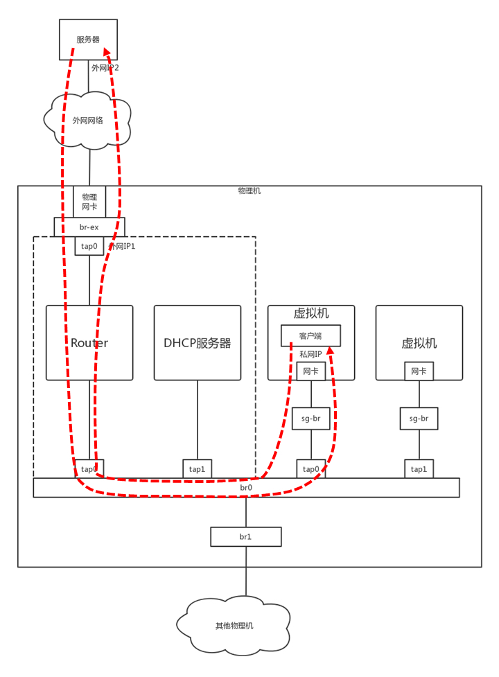

> 二層、三層是按照邏輯拓撲結構進行的分類，並不是ISO七層模型中的數據鏈路層和網絡層，而是指核心層、匯聚層和接入層。
>
> 這三層都部署的就是三層網絡結構，二層網絡結構沒有匯聚層。
>
> 二層交換機工作行為？
>
> - 收到的數據幀查看2層頭部，根據目的Mac地址轉發，目的Mac分廣播、組播、單播。
>
> 三層設備的工作行為
>
> - 收到數據包查看三層目的IP，根據目的IP地址轉發，分為廣播，組播，單播。

兩個VM都通過tap網卡連接到一個網橋上，但是`網橋是二層的`，兩個VM之間是可以隨意互通的，因而需要有一個地方統一配置這些iptables規則。

可以多加一個網橋，在這個網橋上配置iptables規則，將在用戶在界面上配置的規則，放到這個網橋上。然後在每台機器上跑一個Agent，將用戶配置的安全組變成iptables規則，配置在這個網橋上。

安全問題解決了，iptables真強大！別忙，iptables除了filter，還有nat呢，這個功能也非常重要。

### |> iptables實現雲平台網絡地址轉換

前面的章節說過，在設計雲平台的時候，我們想讓`虛擬機之間的網絡和物理網絡進行隔離`，但是虛擬機畢竟還是要通過物理網和外界通信的，因而`需要在出物理網的時候，做一次網絡地址轉換`，也即nat, 這個就可以用iptables來做。

- IP頭里麵包含源IP地址和目標IP地址，這兩種IP地址都可以轉換成其他地址。
  - 轉換源IP地址的，稱為Snat ; 
  - 轉換目標IP地址的，稱為Dnat。

你有沒有思考過這個問題，

- TCP的訪問都是一去一回的，而你在你家裡連接WIFI的IP地址是一個私網IP, 192.168.1.x。
- 當你通過你們家的路由器訪問 google news 網站之後，網站的返回結果如何能夠到達你的筆記本電腦呢？
  - 肯定不能通過192.168.1.x，這是個私網IP，不具有公網上的定位能力，而且用這個網段的人很多，茫茫人海，怎麼能夠找到你呢？

所以當你從你家裡訪問 google news 網站的時候，在你路由器的出口，會做Snat的，運營商的出口也可能做Snat，將你的私網IP地址，最終轉換為公網IP地址，然後 google news 網站就可以通過這個公網IP地址返回結果，然後再nat回來，直到到達你的筆記本電腦。

雲平台裡面的虛擬機也是這樣子的，

- 它只有私網IP地址，到達外網網口要做一次Snat，`轉換成為機房網IP`，
- 然後出數據中心的時候，`再轉換為公網IP`。 


> 虛擬機做客戶端 : 虛擬機訪問 google news 網站

這裡有一個問題是在外網網口上做Snat的時候，是全部轉換成一個機房網IP呢，還是每個虛擬機都對應一個機房網IP，最終對應一個公網IP呢？前面說過了，公網IP非常貴，虛擬機也很多，當然不能每個都有單獨的機房網和公網IP了，於是這種Snat是一種特殊的Snat, **`MASQUERADE(地址偽裝)`**。

- 這種方式下，所有的虛擬機`共享一個機房網和公網的IP地址`，所有從外網網口出去的，都轉換成為這個IP地址。
- 那又一個問題來了，都變成一個公網IP了，當 google news 網站返回結果的時候，給誰呢， 再nat成為哪個私網的IP呢？
  - 這就是Netfilter 的`連接跟踪(conntrack)功能`了。
  - 對於TCP協議來講，肯定是上來先建立一個連接，可以用"源/目的IP+源/目的端口” 唯一標識一條連接，這個連接會放在conntrack表裡面。
  - 當時是這台機器去請求 google news 網站的，雖然源地址已經Snat成公網IP地址了，但是conntrack表裡面還是有這個連接的記錄的。當 google news 網站返回數據的時候，會找到記錄，從而找到正確的私網IP地址。

這是虛擬機做客戶端的情況，如果虛擬機做服務器呢？也就是說，如果虛擬機裡面部署的就是 google news 網站呢？

> 虛擬機做服務器 : 虛擬機裡面部署的就是 google news 網站

這個時候就需要給這個網站配置固定的物理網的IP地址和公網IP地址了。這時候就需要`顯示的配置Snat規則和Dnat規則`了。

- 當外部訪問進來的時候，外網網口會通過Dnat規則將公網IP地址轉換為私網IP地址，到達虛擬機，虛擬機裡面是 google news 網站，
- 返回結果，外網網口會通過Snat規則，將私網IP地址轉換為那個分配給它的固定的公網IP地址。

類似的規則如下：

- 源地址轉換(Snat)  :  `iptables -t nat -A -s 私網IP -j Snat --to-source 外网IP`
- 目的地址轉換(Dnat)  :  `iptables -t nat -A -PREROUTING -d 外網IP -j Dnat --to-destination 私网IP`

到此為止iptables 解決了非法偷窺隱私的問題。

### |> 小結

總結一下。

- 雲中的安全策略的常用方式是，使用iptables的規則，請記住它的五個階段，PREROUTING、INPUT、FORWARD、OUTPUT、POSTROUTING。
- iptables分為四種表，raw、mangle、nat、filter。其中安全策略主要在filter表中實現，而虛擬網絡和物理網絡地址的轉換主要在nat表中實現。

> 兩個思考題。

1. 這一節中重點講iptables的filter和nat功能，iptables還可以通過QUEUE實現負載均衡，你知道怎麼做嗎？
2. 這一節僅僅講述了雲中偷窺的問題，如果是一個合法的用戶，但是不自覺搶占網絡通道，應該採取什麼策略呢？

## # 第27講| 雲中的網絡QoS:流量控制

租房子的時候，有沒有碰到這樣的情況：本來合租共享WIFI，一個人狂下電影從而你網都上不去，是不是很懊惱？

在雲平台上，也有這種現象，好在有一種流量控制的技術，可以實現**QoS(Quality of Service)**，從而保障大多數用戶的服務質量。

對於控制一台機器的網絡的QoS，分兩個方向，一個是入方向，一個是出方向。


其實我們**`能控制的只有出方向`**，通過**`Shaping`**，將出的流量控製成自己想要的模樣。而**`進入的方向是無法控制的`**，**`只能通過Policy將包丟棄`**。

### |> 控製網絡的QoS有哪些方式？

在Linux下，可以通過**TC**控製網絡的QoS，主要就是通過**`隊列`**的方式。

### 1,  無類別排隊規則

#### 無類別排隊規則(Classless Queuing Disciplines)

第一大類稱為**無類別排隊規則(Classless Queuing Disciplines)**。之前講ip addr的時候講過的**pfifo_fast**，這是一種**不把網絡包分類的技術**。


- pfifo_fast分為三個先入先出的隊列，稱為三個**Band**。
- 根據網絡包裡面**TOS**，看這個包到底應該進入哪個隊列。
- TOS總共四位，每T位表示的意思不同，總共十六種類型。

通過命令行`tc qdisc show dev eth0`，可以輸出結果`priomap`，也是十六個數字。

- 在0到2之間，和TOS的十六種類型對應起來，表示不同的TOS對應的不同的隊列。
- 其中Band 0優先級最高，發送完畢後才輪到Band 1發送，最後才是Band 2。

#### 隨機公平隊列(Stochastic Fair Queuing)

另外一種無類別隊列規則叫作**隨機公平隊列(Stochastic Fair Queuing)**。


- 會建立很多的`FIFO的隊列`，TCP Session會算hash值，通過hash值分配到某個隊列。

- 在隊列的另一端，網絡包會通過`輪詢`策略從各個隊列中取出發送。這樣不會有一個Session佔據所有的流量。

當然如果兩個Session的hash是一樣的，會共享一個隊列，也有可能互相影響。hash函數會經常改變，從而session不會總是相互影響。

#### 令牌桶規則(TBF,Token Bucket Filte)

還有一種無類別隊列規則稱為**令牌桶規則(TBF,Token Bucket Filte)**。 

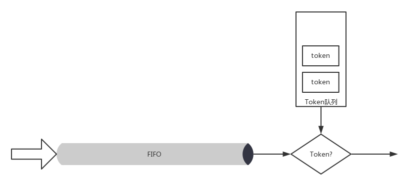

- 所有的網絡包排成隊列進行發送，但不是到了隊頭就能發送，而是需要拿到令牌才能發送。

- 令牌根據設定的速度生成，所以即便隊列很長，也是按照一定的速度進行發送的。

當沒有包在隊列中的時候，令牌還是以既定的速度生成，但是不是無限累積的，而是放滿了桶為止。

- 設置桶的大小為了避免下面的情況：當長時間沒有網絡包發送的時候，積累了大量的令牌，突然來了大量的網絡包，每個都能得到令牌，造成瞬間流量大增。

### 2, 基於類別的隊列規則

另外一大類是**基於類別的隊列規則(Classful Queuing Disciplines)**，其中典型的為**分層令牌桶規則(HTB，Hierarchical Token Bucket)**。

#### 分層令牌桶規則(HTB，Hierarchical Token Bucket)

HTB往往是一棵樹，接下來我舉個具體的例子，通過TC如何構建一棵HTB樹來帶你理解。


使用TC可以為某個網卡eth0創建一個HTB的隊列規則，需要付給它一個句柄為(1:)。

這是整棵樹的根節點，接下來會有分支。例如圖中有三個分支，句柄分別為（:10）、（:11）、（:12）。最後的參數default 12, 表示默認發送給1:12，也即發送給第三個分支。

```
tc qdisc add dev eth0 root handle 1: htb default 12
```

對於這個網卡，需要規定發送的速度。一般有兩個速度可以配置，

- 一個是**rate**，表示一般情況下的速度；
- 一個是**ceil**，表示最高情況下的速度。

對於根節點來講，這兩個速度是一樣的，於是創建一個root class，速度為（rate=100kbps，ceil=100kbps）。

```
tc class add dev eth0 parent 1: classid 1:1 htb rate 100kbps ceil 100kbps	
```

接下來要創建分支，也即創建幾個子class。每個子class統一有兩個速度。三個分支分別為（rate=30kbps，ceil=100kbps）、（rate=10kbps，ceil=100kbps）、（rate=60kbps，ceil=100kbps）。

```
tc class add dev eth0 parent 1:1 classid 1:10 htb rate 30kbps ceil 100kbps
tc class add dev eth0 parent 1:1 classid 1:11 htb rate 10kbps ceil 100kbps
tc class add dev eth0 parent 1:1 classid 1:12 htb rate 60kbps ceil 100kbps
```

你會發現`三個rate加起來，是整個網卡允許的最大速度`。

`HTB有個很好的特性，同一個root class下的子類可以相互借流量`，如果不直接在隊列規則下面創建一個root class，而是直接創建三個class，它們之間是不能相互借流量的。借流量的策略，可以使得當前不使用這個分支的流量的時候，可以藉給另一個分支，從而不浪費帶寬，使帶寬發揮最大的作用。

最後，創建葉子隊列規則，分別為**fifo**和**sfq**。

```
tc qdisc add dev eth0 parent 1:10 handle 20: pfifo	limit	5
tc qdisc add dev eth0 parent 1:11 handle 30: pfifo	limit	5
tc qdisc add dev eth0 parent 1:12 handle 40: sfq perturb 10
```

基於這個隊列規則，我們還可以通過TC設定發送規則：

- 從1.2.3.4來的，發送給port 80的包，從第一個分支1:10走；
- 其他從1.2.3.4發送來的包從第二個分支1:11走；
- 其他的走默認分支。

```
tc filter add dev eth0 protocol ip parent 1:0 prio 1 u32 match ip src 1.2.3.4 match ip dport 80 0xffff flowid 1:10
tc filter add dev eth0 protocol ip parent 1:0 prio 1 u32 match ip src 1.2.3.4 flowid 1:11
```

### |> 如何控制QoS?

[Open vSwitch之QoS的实现](https://www.sdnlab.com/19208.html)

> OVS自身並不實現QoS功能，QoS功能的實現是在linux內核中，OVS只是能夠配置部分OVS支持的QoS類型。如果需要一些OVS不支持的QoS類型，可以通過patch來支持這些配置，也可以通過傳統的TC工具直接進行QoS的策略配置。

我們講過，使用OpenvSwitch將雲中的網卡連通在一起，那如何控制QoS呢？

就像我們上面說的一樣，OpenvSwitch支持兩種：

> Policing管制

Policing用於控制接口上接收分組（ingress）的速率，是一種簡單的QoS的功能，通過簡單的丟包機制實現接口速率的限制，它既可以作用於物理接口，也可以作用於虛擬接口；

對於進入的流量，可以設置策略Ingress policy；

```shell
ovs-vsctl set Interface tap0 ingress_policing_rate=100000
ovs-vsctl set Interface tap0 ingress_policing_burst=10000
# 查看配置
ovs-vsctl list interface eth1
```

policing在OVS中採用ingress_policing_rate和ingress_policing_burst兩個字段完成ingress入口限速功能，該兩個字段放在Interface表中

- ingress_policing_rate：為接口最大收包速率，單位kbps，超過該速度的報文將被丟棄，默認值為0表示關閉該功能； 
- ingress_policing_burst：為最大突發流量大小，單位kb。默認值0表示1000kb，這個參數最小值應不小於接口的MTU，通常設置為ingress_policing_rate的10%更有利於tcp實現全速率；

> Shapping整形

Shaping是作用於接口上的出口流量（egress）策略，使用了隊列queue，可以緩存和調度數據包發送順序，比policing更加精確和有效，在OVS的數據表中主要使用QoS和Queue兩張表。

對於發出的流量，可以設置QoS規則Egress shaping，支持HTB。

```shell
# 設置接口eth1的qos為newqos，通過ovs-vsctl list port查看配置的port表內容
ovs-vsctl set port eth1 qos=@newqos --  
# 創建qos規則newqos，類型為linux-htb，並連接key值為0的隊列q0，通過ovs-vsctl查看配置的Qos表內容如下：
--id=@newqos create qos type=linux-htb queues=0=@q0 -- 
# 創建q0隊列，設置最大速率100M，通過ovs-vsctl查看配置的Queue表內容如下：
--id=@q0 create queue other-config:max-rate=100000000
```

其中”--”用於把命令分割成單獨解析的命令行，這裡主要配置了Queue、QoS和port三個表的內容


我們構建一個拓撲圖，來看看OpenvSwitch的QoS是如何工作的。


 首先，在port上可以創建QoS規則，一個QoS規則可以有多個隊列Queue。 


```
ovs-vsctl set port first_br qos=@newqos -- --id=@newqos create qos type=linux-htb other-config:max-rate=10000000 queues=0=@q0,1=@q1,2=@q2 -- --id=@q0 create queue
other-config:min-rate=3000000 other-config:max-rate=10000000 -- --id=@q1 create queue other-config:min-rate=1000000 other-config:max-rate=10000000 -- --id=@q2
create queue other-config:min-rate=6000000 other-config:max-rate=10000000
```

上面的命令創建了一個QoS規則，對應三個Queue。min-rate就是上面的rate, max-rate就是上面的ceil。通過交換機的網絡包，要通過流表規則，匹配後進入不同的隊列。然後我們就可以添加流表規則Flow(first_br是br0上的port 5)。

```
ovs-ofctl add-flow br0 "in_port=6 nw_src=192.168.100.100 actions=enqueue:5:0"
ovs-ofctl add-flow br0 "in_port=7 nw_src=192.168.100.101 actions=enqueue:5:1"
ovs-ofctl add-flow br0 "in_port=8 nw_src=192.168.100.102 actions=enqueue:5:2"
```

接下來，我們單獨測試從192.168.100.100，192.168.100.101，192.168.100.102 到192.168.100.103的帶寬的時候，每個都是能夠打滿帶寬的。

如果三個一起測試，一起狂發網絡包，會發現是按照3:1:6的比例進行的，正是根據配置的隊列的帶寬比例分配的。

如果192.168.100.100和192.168.100.101一起測試，發現帶寬佔用比例為3:1, 但是佔滿了總的流量，也即沒有發包的192.168.100.102有60%的帶寬被借用了。

如果192.168.100.100和192.168.100.102一起測試，發現帶寬佔用比例為1:2。如果192.168.100.101和192.168.100.102一起測試，發現帶寬佔用比例為1:6。

### |> 小結

總結一下。

- 雲中的流量控制主要通過隊列進行的，隊列分為兩大類：無類別隊列規則和基於類別的隊列規則。
- 在雲中網絡Openvswitch中，主要使用的是分層令牌桶規則（HTB），將總的帶寬在一棵樹上按照配置的比例進行分配，並且在一個分支不用的時候，可以藉給另外的分支，從而增強帶寬利用率。

> 兩個思考題。

1. 這一節中提到，入口流量其實沒有辦法控制，出口流量是可以很好控制的，你能想出一個控制雲中的虛擬機的入口流量的方式嗎？
2. 安全性和流量控制大概解決了，但是不同用戶在物理網絡的隔離還是沒有解決，你知道怎麼解決嗎？

## # 第28講| 雲中網絡的隔離GRE、VXLAN : 保護隱私

對於雲平台中的隔離問題，前面用的策略一直都是VLAN, 但是我們也說過這種策略的問題，VLAN只有12位，共4096個。當時設計的時候，看起來是夠了，但是現在絕對不夠用，怎麼辦呢？

- **一種方式是修改這個協議**。這種方法往往不可行，因為當這個協議形成一定標准後，千千萬萬設備上跑的程序都要按這個規則來。

- **另一種方式就是擴展**，在原來包的格式的基礎上擴展出一個頭，裡麵包含足夠用於區分租戶的ID，外層的包的格式盡量和傳統的一樣，依然兼容原來的格式。一旦遇到需要區分用戶的地方，我們就用這個特殊的程序，來處理這個特殊的包的格式。

這個概念很像咱們第22講講過的**隧道理論**，自駕游通過擺渡輪到日本。在那一節，我們說過，擴展的包頭主要是用於加密的，而我們現在需要的包頭是要能夠區分用戶的。

底層的物理網絡設備組成的網絡我們稱為**Underlay網絡**，而用於虛擬機和雲中的這些技術組成的網絡稱為**Overlay網絡**，**這是一種基於物理網絡的虛擬化網絡實現**。這一節我們重點講兩個Overlay的網絡技術。

### |> GRE 通用路由封裝

第一個技術是**GRE** ,全稱**Generic Routing Encapsulation** ,它**是一種IP-over-IP的隧道技術**。它將IP包封裝在GRE包裡，外面加上IP頭，在隧道的一端封裝數據包，並在通路上進行傳輸，到另外一端的時候解封裝。你可以認為Tunnel是一個虛擬的、點對點的連接。 


[VxLAN The Fundamentals of Virtual Networking Architecture Vol 8 rel 8](http://www.wasabiroll.com/2019/09/vxlan-fundamentals-of-virtual.html)


從這個圖中可以看到，在GRE頭中，前32位是一定會有的，後面的都是可選的。在前4位標識位裡面，有標識後面到底有沒有可選項？這裡面有個很重要的**key**字段，是一個32位的字段，裡面**存放的往往就是用於區分用戶的Tunnel ID**。32位，夠任何云平台喝一壺的了！

下面的格式類型專門用於網絡虛擬化的GRE包頭格式，稱為**NVGRE**，也給網絡ID號24位，也完全夠用了。

除此之外，GRE還需要有一個地方來封裝和解封裝GRE的包，這個地方往往是路由器或者有路由功能的Linux機器。

#### GRE隧道傳輸的過程

使用GRE隧道，傳輸的過程就像下面這張圖。這裡面有兩個網段、兩個路由器，中間要通過GRE隧道進行通信。當隧道建立之後，會多出兩個Tunnel端口，用於封包、解封包。


1. 主機A在左邊的網絡，IP地址為192.168.1.102, 它想要訪問主機B，主機B在右邊的網絡，IP地址為192.168.2.1 15。於是發送一個包，源地址為192.168.1.102，目標地址為192.168.2.115。因為要跨網段訪問，於是根據默認的default路由表規則，要發給默認的網關192.168.1.1, 也即左邊的路由器。
2. 根據路由表，從左邊的路由器，去192.168.2.0/24這個網段，應該走一條GRE的隧道，從隧道一端的網卡Tunnel0進入隧道。
3. 在Tunnel隧道的端點進行包的封裝，在內部的IP頭之外加上GRE頭。對於NVGRE來講，是在MAC頭之外加上GRE頭，然後加上外部的IP地址，也即路由器的外網IP地址。源IP地址為172.17.10.10，目標IP地址為172.16.11.10，然後從E1的物理網卡發送到公共網絡裡。
4. 在公共網絡裡面，沿著路由器一跳一跳走，全部都按照外部的公網IP地址進行。
5. 當網絡包到達對端路由器的時候，也要到達對端的Tunnel0，然後開始解封裝，將外層的IP頭取下來，然後根據裡面的網絡包，根據路由表，從E3口轉發出去到達服務器B 。

### |> GRE技術不足之處

從GRE的原理可以看出，GRE通過隧道的方式，很好地解決了VLAN ID不足的問題。但是, GRE技術本身還是存在一些不足之處。

首先是**Tunnel的數量問題**。GRE是一種點對點隧道，如果有三個網絡，就需要在每兩個網絡之間建立一個隧道。如果網絡數目增多，這樣隧道的數目會呈指數性增長。 


其次，**GRE不支持組播**，因此一個網絡中的一個虛擬機發出一個廣播幀後, GRE會將其廣播到所有與該節點有隧道連接的節點。

另外一個問題是目前還是**有很多防火牆和三層網絡設備無法解析GRE** ,因此它們無法對GRE封裝包做合適地過濾和負載均衡。

### |> VXLAN 虛擬局域網

第二種Overlay的技術稱為**VXLAN**。和三層外面再套三層的GRE不同，VXLAN則是從二層外面就套了一個VXLAN的頭，這裡面包含的VXLAN ID為24位，也夠用了。在VXLAN頭外面還封裝了UDP、IP,以及外層的MAC頭。


VXLAN作為擴展性協議，也需要一個地方對VXLAN的包進行封裝和解封裝，實現這個功能的點稱為**VTEP (VXLAN Tunnel Endpoint)**。

VTEP相當於虛擬機網絡的管家。每台物理機上都可以有一個VTEP。每個虛擬機啟動的時候，都需要向這個VTEP管家註冊，每個VTEP都知道自己上面註冊了多少個虛擬機。當虛擬機要跨VTEP進行通信的時候，需要通過VTEP代理進行，由VTEP進行包的封裝和解封裝。

和GRE端到端的隧道不同，VXLAN不是點對點的，而是`支持通過組播`的來定位目標機器的，而非一定是這一端發出，另一端接收。

當一個VTEP啟動的時候，它們都需要通過**IGMP協議**。

- 加入一個組播組，就像加入一個郵件列表，或者加入一個line群一樣，所有發到這個郵件列表裡面的郵件，或者發送到微信群裡面的消息，大家都能收到。
- 而當每個物理機上的虛擬機啟動之後, VTEP就知道，有一個新的VM上線了，它歸我管。

> Step1 : 同一個用戶的虛擬機，分配相同的VXLAN ID


如圖，虛擬機1、2、3屬於雲中同一個用戶的虛擬機，因而需要分配相同的VXLAN ID=101。在雲的界面上，就可以知道它們的IP地址，於是可以在虛擬機1上ping虛擬機2。

> Step2 :  同一個用戶的虛擬機互ping

虛擬機1不知道虛擬機2的MAC地址，因而包沒辦法發出去 

--> 虛擬機1發送ARP廣播 

--> ARP請求到達VTEP1 

--> VTEP1將ARP請求封裝在VXLAN裡面，組播出去 

--> VTEP2和VTEP3都收到了消息 

--> VTEP2在本地廣播，虛擬機2回了MAC地址 

--> VTEP2也學到了，虛擬機1歸VTEP1管 

--> VTEP2將ARP的回复封裝在VXLAN裡面，直接發回給VTEP1 

--> VTEP1解開VXLAN的包，發現是ARP的回复，於是發給虛擬機1。通VTEP1也學到了，虛擬機2歸VTEP2管 

--> 虛擬機1的ARP得到了回复，知道了虛擬機2的MAC地址，於是就可以發送包了  --> 虛擬機1發給虛擬機2的包到達VTEP1，將包封裝在VXLAN裡面，外層加上VTEP1和VTEP2的IP地址，發送出去。 

--> 網絡包到達VTEP2之後, VTEP2解開VXLAN封裝，將包轉發給虛擬機2。


虛擬機1發現，它不知道虛擬機2的MAC地址，因而包沒辦法發出去，於是要發送ARP廣播。

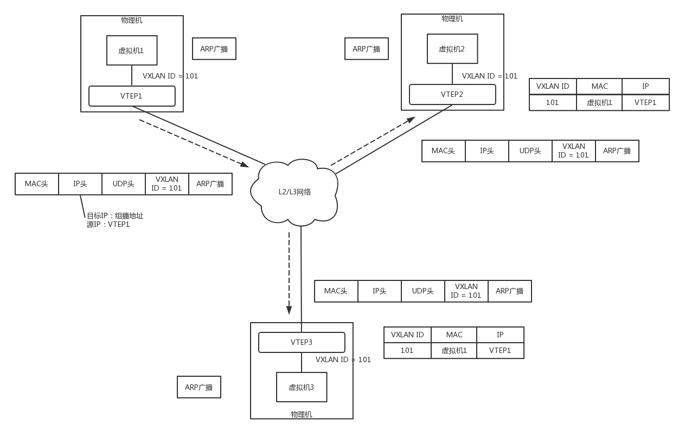

ARP請求到達VTEP1的時候，VTEP1知道，我這裡有一台虛擬機，要訪問一台不歸我管的虛擬機，需要知道MAC地址，可是我不知道啊，這該咋辦呢？

VTEP1想，我不是加入了一個微信群麼？可以在裡面@all 一下，問問虛擬機2歸誰管。於是VTEP1將ARP請求封裝在VXLAN裡面，組播出去。

當然在群裡面，VTEP2和VTEP3都收到了消息，因而都會解開VXLAN包看，裡面是一個ARP。

VTEP3在本地廣播了半天，沒人回，都說虛擬機2不歸自己管。

VTEP2在本地廣播，虛擬機2回了，說虛擬機2歸我管，MAC地址是這個。通過這次通信，VTEP2也學到了，虛擬機1歸VTEP1管，以後要找虛擬機1,去找VTEP1就可以了。 


VTEP2將ARP的回复封裝在VXLAN裡面，這次不用組播了，直接發回給VTEP1。

VTEP1解開VXLAN的包，發現是ARP的回复，於是發給虛擬機1。通過這次通信，VTEP1也學到了，虛擬機2歸VTEP2管，以後找虛擬機2, 去找VTEP2就可以了。

虛擬機1的ARP得到了回复，知道了虛擬機2的MAC地址，於是就可以發送包了。


虛擬機1發給虛擬機2的包到達VTEP1,它當然記得剛才學的東西，要找虛擬機2,就去VTEP2，於是將包封裝在VXLAN裡面，外層加上VTEP1和VTEP2的IP地址，發送出去。

網絡包到達VTEP2之後, VTEP2解開VXLAN封裝，將包轉發給虛擬機2。

虛擬機2回复的包，到達VTEP2的時候，它當然也記得剛才學的東西，要找虛擬機1, 就去VTEP1, 於是將包封裝在VXLAN裡面，外層加上VTEP1和VTEP2的IP地址，也發送出去。

網絡包到達VTEP1之後, VTEP1解開VXLAN封裝，將包轉發給虛擬機1。

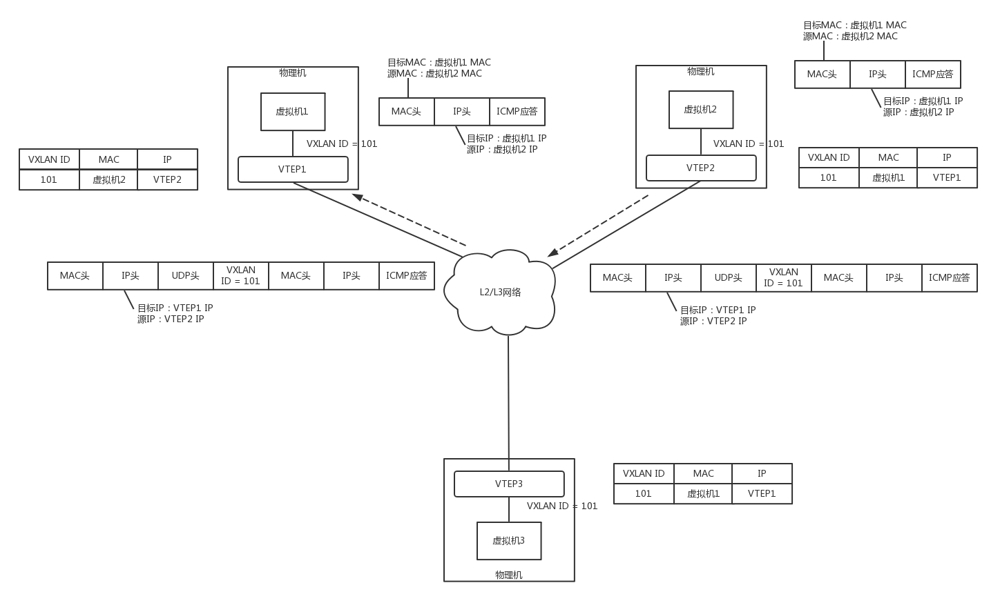

有了GRE和VXLAN技術，我們就可以解決雲計算中VLAN的限制了。那如何將這個技術融入雲平台呢？

### |> 如何將GRE和VXLAN技術融入雲平台呢？


虛擬機是你的電腦，路由器和DHCP Server相當於家用路由器或者寢室長的電腦，外網網口訪問互聯網，所有的電腦都通過內網網口連接到一個交換機br0上，虛擬機要想訪問互聯網，需要通過br0連到路由器上，然後通過路由器將請求NAT後轉發到公網。

接下來的事情就慘了，你們宿舍鬧矛盾了，你們要分成三個宿舍住，對應上面的圖，你們寢室長，也即路由器單獨在一台物理機上，其他的室友也即VM分別在兩台物理機上。這下把一個完整的br0一刀三斷，每個宿舍都是單獨的一段。

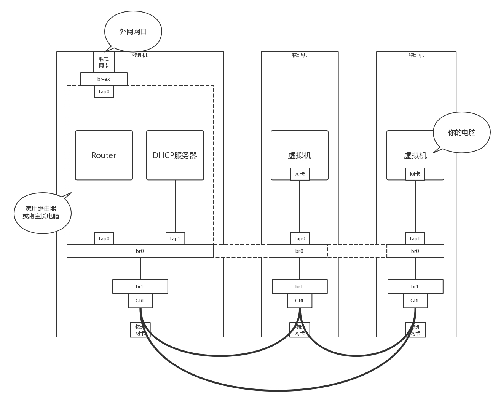

可是只有你的寢室長有公網口可以上網，於是你偷偷在三個宿舍中間打了一個隧道，用網線通過隧道將三個宿舍的兩個br0連接起來，讓其他室友的電腦和你寢室長的電腦，看起來還是連到同一個br0上，其實中間是通過你隧道中的網線做了轉發。

為什麼要多一個br1這個虛擬交換機呢？主要通過br1這一層將虛擬機之間的互聯和物理機機之間的互聯分成兩層來設計，中間隧道可以有各種挖法，GRE、VXLAN都可以。

使用了OpenvSwitch之後，br0可以使用OpenvSwitch的Tunnel功能和Flow功能。

#### Tunnel功能

**OpenvSwitch支持三類隧道: GRE、VXLAN、IPsec_GRE**。在使用OpenvSwitch的時候，虛擬交換機就相當於GRE和VXLAN封裝的端點。

我們模擬創建一個如下的網絡拓撲結構，來看隧道應該如何工作。 

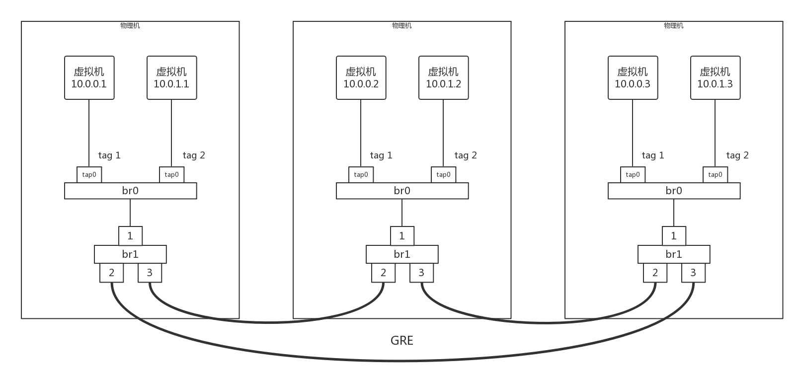

三台物理機，每台上都有兩台虛擬機，分別屬於兩個不同的用戶，因而VLAN tag都得打地不一樣，這樣才不能相互通信。但是不同物理機上的相同用戶，是可以通過隧道相互通信的，因而通過GRE隧道可以連接到一起。

#### Flow功能

接下來，所有的Flow Table規則都設置在br1上，每個br1都有三個網卡，其中網卡1是對內的，網卡2和3是對外的。

下面我們具體來看Flow Table的設計。 


1,  Table 0是所有流量的入口，所有進入br1的流量，分為兩種流量，一個是進入物理機的流量，一個是從物理機發出的流量。
從port 1進來的，都是發出去的流量，全部由Table 1處理。

```
ovs-ofctl add-flow br1 "hard_timeout=0 idle_timeout=0 priority=1 in_port=1 actions=resubmit(,1)"
```

從port 2、3進來的，都是進入物理機的流量，全部由Table 3處理。

```
ovs-ofctl add-flow br1 "hard_timeout=0 idle_timeout=0 priority=1 in_port=2 actions=resubmit(,3)"
ovs-ofctl add-flow br1 "hard_timeout=0 idle_timeout=0 priority=1 in_port=3 actions=resubmit(,3)"
```

如果都沒匹配上，就默認丟棄。

```
ovs-ofctl add-flow br1 "hard_timeout=0 idle_timeout=0 priority=0 actions=drop"
```

2,  Table 1用於處理所有出去的網絡包，分為兩種情況，一種是單播，一種是多播
對於單播，由Table 20處理。

```
ovs-ofctl add-flow br1 "hard_timeout=0 idle_timeout=0 priority=1 table=1 dl_dst=00:00:00:00:00:00/01:00:00:00:00:00 actions=resubmit(,20)"
```

對於多播，由Table 21處理。

```
ovs-ofctl add-flow br1 "hard_timeout=0 idle_timeout=0 priority=1 table=1 dl_dst=01:00:00:00:00:00/01:00:00:00:00:00 actions=resubmit(,21)"
```

3,  Table 2是緊接著Table 1的，如果既不是單播，也不是多播，就默認丟棄。

```
ovs-ofctl add-flow br1 "hard_timeout=0 idle_timeout=0 priority=0 table=2 actions=drop"
```

4,  Table 3用於處理所有進來的網絡包，需要將隧道Tunnel ID轉換為VLAN ID。
如果匹配不上Tunnel ID，就默認丟棄。

```
ovs-ofctl add-flow br1 "hard_timeout=0 idle_timeout=0 priority=0 table=3 actions=drop"
```

如果匹配上了Tunnel ID，就轉換為相應的VLAN ID，然後跳到Table 10。

```
ovs-ofctl add-flow br1 "hard_timeout=0 idle_timeout=0 priority=1 table=3 tun_id=0x1 actions=mod_vlan_vid:1,resubmit(,10)"
ovs-ofctl add-flow br1 "hard_timeout=0 idle_timeout=0 priority=1 table=3 tun_id=0x2 actions=mod_vlan_vid:2,resubmit(,10)"
```

5,  對於進來的包，Table 10會進行MAC地址學習。這是一個二層交換機應該做的事情，學習完了之後，再從port 1發出去。

```
ovs-ofctl add-flow br1 "hard_timeout=0 idle_timeout=0 priority=1 table=10
actions=learn(table=20,priority=1,hard_timeout=300,NXM_OF_VLAN_TCI[0..11],NXM_OF_ETH_DST[]=NXM_OF_ETH_SRC[],load:0->NXM_OF_VLAN_TCI[],load:NXM_NX_TUN_ID[]-
>NXM_NX_TUN_ID[],output:NXM_OF_IN_PORT[]),output:1"
```

Table 10是用來學習MAC地址的，學習的結果放在Table 20裡面。Table 20被稱為MAC learning table。

**NXM_OF_VLAN_TCI**是VLAN tag。在MAC learning table中，每一個entry都僅僅是針對某一個VLAN來說的，不同VLAN的learning table是分開的。在學習結果的entry中，會標出這個entry是針對哪個VLAN的。

**NXM_OF_ETH_DST[] = NXM_OF_ETH_SRC[]**表示，當前包裡面的MAC Source Address會被放在學習結果的entry裡的dl_dst裡。這是因為每個交換機都是通過進入的網絡包來學習的。某個MAC從某個port進來，交換機就應該記住，以後發往這個MAC的包都要從這個port出去，因而源MAC地址就被放在了目標MAC地址裡面，因為這是為了發送才這麼做的。

**load:0->NXM_OF_VLAN_TCI[]**是說，在Table20中，將包從物理機發送出去的時候，VLAN tag設為0，所以學習完了之後, Table 20中會有actions=strip_vlan。

**load:NXM_NX_TUN_ID[]->NXM_NX_TUN_ID[]**的意思是，在Table 20中，將包從物理機發出去的時候，設置Tunnel ID，進來的時候是多少，發送的時候就是多少，所以學習完了之後， Table 20中會有set_tunnel。

**output:NXM_OF_IN_PORT[]**是發送給哪個port。例如是從port 2進來的，那學習完了之後, Table 20中會有output:2。


所以如圖所示，通過左邊的MAC地址學習規則，學習到的結果就像右邊的一樣，這個結果會被放在Table 20裡面。

6,  Table 20是MAC Address Learning Table。如果不為空，就按照規則處理；如果為空，就說明沒有進行過MAC地址學習，只好進行廣播了，因而要交給Table 21處理。

```
ovs-ofctl add-flow br1 "hard_timeout=0 idle_timeout=0 priority=0 table=20 actions=resubmit(,21)"
```

7,  Table 21用於處理多播的包。
如果匹配不上VLAN ID，就默認丟棄。

```
ovs-ofctl add-flow br1 "hard_timeout=0 idle_timeout=0 priority=0 table=21 actions=drop"
```

如果匹配上了VLAN ID，就將VLAN ID轉換為Tunnel ID，從兩個網卡port 2和port 3都發出去，進行多播。

```
ovs-ofctl add-flow br1 "hard_timeout=0 idle_timeout=0 priority=1table=21dl_vlan=1 actions=strip_vlan,set_tunnel:0x1,output:2,output:3"
ovs-ofctl add-flow br1 "hard_timeout=0 idle_timeout=0 priority=1table=21dl_vlan=2 actions=strip_vlan,set_tunnel:0x2,output:2,output:3"
```

### |> 小結

- 要對不同用戶的網絡進行隔離，解決VLAN數目有限的問題，需要通過Overlay的方式，常用的有GRE和VXLAN。
- GRE是一種點對點的隧道模式，VXLAN支持組播的隧道模式，它們都要在某個Tunnel Endpoint進行封裝和解封裝，來實現跨物理機的互通。
- OpenvSwitch可以作為Tunnel Endpoint，通過設置流表的規則，將虛擬機網絡和物理機網絡進行隔離、轉換。

[VLAN,GRE,VXLAN](https://www.jianshu.com/p/8e63ddeb64c4)

**VLAN不足**

1. 4kvlan上限：才12個bits的vlan id，代表最多也只能有4096個隔離的網絡，你單瞅瞅阿里雲也應該明白，只有4096個網絡是遠不夠用的

2. vlan是基於l2的，很難跨越二層的局限（很難跨地域），限制了網絡的靈活性，

3. vlan的操作需要人工介入太多

上述三條在小公司，雲平台規模不大的情況下，反而會是一種優勢，但是在大規模的雲平台下這三點則是缺點

**GRE相對於VLAN的優點：**

1. 突破了二層網絡的限制，基於IP協議，虛擬的二層真實的三層

2. 數據中心網絡在物理級別上支持不了雲計算的規模（大量的mac地址表，arp表..）但是使用GRE就可以突破這個問題，基於IP協議，不基於以太網協議

**GRE不足：**

1. 點對點，所有的計算機節點和網絡節點都會建立GRE Tunnel，規模擴大，效率極其的低下

2. 擴大的廣播域，GRE不支持組播，一個網絡(GRE Tunnel ID一樣)中的一個vm發出廣播幀後，GRE會將其廣播到所有與該節點有隧道連接的節點。

3. GRE封裝的IP包的過濾和負載均衡問題

   目前還是有很多防火牆和三層網絡設備無法解析GRE Header，因此他們無法對GRE封裝包做合適的過濾和負載均衡


當A（192.168.1.1） ping B（192.168.2.1）時，報文是如下形式的：

從A到RA

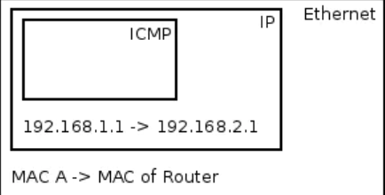

從RA到RB


**VXLAN：**

- vxlan主要用於封裝，轉發2層報文。vxlan全稱Virtual eXtensible Local Area Network,簡單的說就是擴充了LVAN，其使得多個通過三層連接的網絡可以表現的和直接通過一台一台物理交換機連接配置而成的網絡一樣處在一個LAN種
- 它的實現機制是，將二層報文中加上個Vxlan Header，封裝在一個UDP包中進行傳輸。VxLAN header會包括一個24位的ID（稱為VNI），含義類似於VLAN id 或者GRE的tunnel id。
- GRE一般是通過路由器進行GRE協議的封裝和解封的，在VXLAN中這類封裝和解封的組件有個專有的名字叫做VTEP。相比起VLAN來說，好處在於其突破了VLAN自由4000+子網的限制，同時架設在UDP協議上後其擴展行提高了不少（因為UDP是高層協議，屏蔽了底層的差異，換句話說屏蔽了二層的差異）

**關於gre和vxlan二次封裝數據包的MTU問題**

- VXLAN 模式下虛擬機中的mtu 最大值為1450，也就是只能小於1450，大於這個值會導致openvswitch 傳輸分片，進而導致虛擬機中數據包數據重傳，從而導致網絡性能下降。GRE 模式下虛擬機mtu 最大為1462。
- 計算方法如下：
  - vxlan mtu = 1450 = 1500 – 20(ip頭) – 8(udp頭) – 8(vxlan頭) – 14(以太網頭)
  - gre mtu = 1462 = 1500 – 20(ip頭) – 4(gre頭) – 14(以太網頭)


> 兩個思考題。

1. 雖然VXLAN可以支持組播但是如果虛擬機數目比較多，在Overlay網絡裡面，廣播風暴問題依然會很嚴重，你能想到什麼辦法解決這個問題嗎？
2. 基於虛擬機的雲比較複雜，而且虛擬機裡面的網卡，到物理網絡轉換層次比較多，有一種比虛擬機更加輕量級的雲的模式，你知道是什麼嗎？