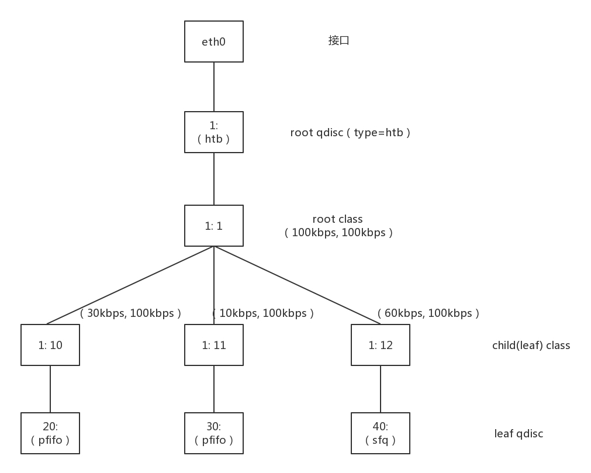

## # 第29講| 容器網絡：來去自由的日子，不買公寓去合租

如果說虛擬機是買公寓，容器則相當於合租，有一定的隔離，但是隔離性沒有那麼好。

- 雲計算解決了基礎資源層的彈性伸縮，卻沒有解決PaaS層應用隨基礎資源層彈性伸縮而帶來的批量、快速部署問題。於是，容器應運而生。

容器就是Container，而Container的另一個意思是集裝箱。其實**容器的思想就是要變成軟件交付的集裝箱**。集裝箱的特點，`一是打包，二是標準`。


在沒有集裝箱的時代，假設要將貨物從A運到B，中間要經過三個碼頭、換三次船。每次都要將貨物卸下船來，弄的亂七八糟，然後還要再搬上船重新整齊擺好。因此在沒有集裝箱的時候，每次換船，船員們都要在岸上待幾天才能幹完活。

有了尺寸全部都一樣的集裝箱以後，可以把所有的貨物都打包在一起，所以每次換船的時候，一個箱子整體搬過去就行了，小時級別就能完成，船員再也不用耗費很長時間了這是集裝箱的"打包"、"標準"兩大特點在生活中的應用。


### |> 那麼容器如何對應用打包呢？

學習集裝箱，首先要有個封閉的環境，將貨物封裝起來，讓貨物之間互不干擾，互相隔離，這樣裝貨卸貨才方便。

封閉的環境主要使用了兩種技術，

- 一種是**看起來是隔離的技術**，稱為**namespace**，也即每個namespace中的應用看到的是不同的IP地址、用戶空間、程號等。
- 另一種是**用起來是隔離的技術**，稱為**cgroup**，也即明明整台機器有很多的CPU、內存，而一個應用只能用其中的一部分。

有了這兩項技術，就相當於我們焊好了集裝箱。接下來的問題就是如何"將這個集裝箱標準化”，並在哪艘船上都能運輸。這裡的標準首先就是**鏡像**。

所謂鏡像，就是將你焊好集裝箱的那一刻，將集裝箱的狀態保存下來，集裝箱裡的狀態就被定在了那一刻，然後將這一刻的狀態保存成一系列文件。無論從哪裡運行這個鏡像，都能完整地還原當時的情況。


接下來我們就具體來看看，這兩種網絡方面的打包技術。

[Docker与Kubernetes的前世今生（上）](https://mp.weixin.qq.com/s?__biz=MzIzNzU0ODEwOA==&mid=2247486079&idx=1&sn=f6f2ff5c7d0fd3c046594ff8774cf850&chksm=e8c7ad5cdfb0244a21250aea5ab05f96512943ddd6ee317d6b22b8228a5a62661ff05f0011de&scene=21#wechat_redirect)

[Docker和Kubernetes的前世今生（下）](https://mp.weixin.qq.com/s?__biz=MzIzNzU0ODEwOA==&mid=2247486294&idx=1&sn=ad01a81146ebeb835ba46f572e476a93&chksm=e8c7ac75dfb025634abc7207817a8c16eb574675b873689afcf85778e41fb7b1994e00b45c6d&scene=21#wechat_redirect)

#### LXC（ Linux Containers）

對於一個完整獨立運行環境來說，需要包含三個關鍵：環境隔離、資源控制和文件系統。在LXC中則分別通過Namespace、Cgroups、rootfs來實現相應的能力。 

1. 環境隔離——Namespace：LXC將內核全局資源封裝，每個Namespace都有一份獨立的資源，使得不同的進程在各自Namespace內對同一種資源的使用互不干擾，不會影響其他Namespace下的資源，實現了進程隔離。
2. 資源控制——Cgroups：LXC通過Cgroups對資源進行控制，限制和隔離一組進程對系統資源的使用。在Cgroups出現之前OS只能對一個進程做資源限制，而 Cgroups可以對進程進行任意分組，如何分組由用戶自定義，藉此實現對於一個Namespace的資源調度管理。 
3. 文件系統——rootfs：rootfs掛載在容器根目錄上，用來為容器進程提供隔離後執行環境的文件系統。 rootfs包含一個操作系統所涉及的文件、配置和目錄，在Linux 操作系統內核啟動時，內核會先掛載一個只讀的rootfs，當系統檢測其完整性之後，決定是否將其切換到讀寫模式。

早期Docker是基於LXC開發，但不同於LXC，Docker除了容器運行，還是一個打包、分發和運行應用程序的平台。 Docker允許將應用和其依賴的運行環境打包在一起，打包好的“集裝箱“（鏡像）能夠被分發到任何節點上執行，無需再進行配置環境的部署。

這樣使得Docker解決了開發和部署應用時環境配置的問題，規範化了應用交付和部署，降低了部署測試的複雜度以及開發運維的耦合度，極大提升了容器移植的便利性，便於構建自動化的部署交付流程。

#### Docker與虛擬機架構對比

Docker和虛擬機都是資源虛擬化發展的產物，但二者在架構上又有區別。

- 虛擬機通過Hypervisor虛擬化主機硬件資源，然後構建客戶機操作系統，由宿主機的管理程序管理；
- Docker直接運行於主機內核，應用在主操作系統的用戶空間上執行獨立任務，不需要從操作系統開始構建環境，賦予了應用從交付到部署再到運維的獨立性。


#### Docker容器

[Visualizing Docker Containers and Images](http://merrigrove.blogspot.com/2015/10/visualizing-docker-containers-and-images.html)


##### Image Definition 鏡像


- （Image）就是一堆只讀層（read-only layer）的統一視角。
- 除了最下面一層，其它層都會有一個指針指向下一層。這些層是Docker內部的實現細節，並且能夠在主機（運行Docker的機器）的文件系統上訪問到。
- 統一文件系統（union file system）技術能夠將不同的層整合成一個文件系統，為這些層提供了一個統一的視角，這樣就隱藏了多層的存在，在用戶的角度看來，只存在一個文件系統。
- 你可以在你的主機文件系統上找到有關這些層的文件。需要注意的是，在一個運行中的容器內部，這些層是不可見的。在我的主機上，我發現它們存在於/var/lib/docker/aufs目錄下

##### Container Definition 


- 容器（container）的定義和鏡像（image）幾乎一模一樣，也是一堆層的統一視角，唯一區別在於容器的最上面那一層是可讀可寫的

- 容器的定義並沒有提及容器是否在運行，沒錯，這是故意的。
- 要點：容器 = 鏡像 + 讀寫層。並且容器的定義並沒有提及是否要運行容器。

##### Running Container Definition 

- 一個運行態容器（running container）被定義為一個可讀寫的統一文件系統加上隔離的進程空間和包含其中的進程。下面這張圖片展示了一個運行中的容器。

  

- 正是文件系統隔離技術使得Docker成為了一個前途無量的技術。一個容器中的進程可能會對文件進行修改、刪除、創建，這些改變都將作用於可讀寫層（read-write layer）。下面這張圖展示了這個行為。

  


### |> 命名空間(namespace)

首先來看網絡namespace。

namespace翻譯過來就是命名空間。其實很多面向對象的程序設計語言裡面，都有命名空間這個東西。大家一起寫代碼，難免類會起相同的名詞，編譯就會衝突。而每個功能都有自己的命名空間，在不同的空間裡面，類名相同，不會衝突。

在Linux下也是這樣的，很多的資源都是全局的。比如進程有全局的進程ID，網絡也有全局的路由表。但是，當一台Linux上跑多個進程的時候，如果我們覺得使用不同的路由策略，這些進程可能會衝突，那就需要將這個進程放在一個獨立的namespace裡面，這樣就可以獨立配置網絡了。

網絡的namespace由ip netns命令操作。它可以創建、刪除、查詢namespace。

我們再來看將你們宿舍放進一台物理機的那個圖。你們宿舍長的電腦是一台路由器，你現在應該知道怎麼實現這個路由器吧？可以創建一個Router虛擬機來做這件事情，但是還有一個更加簡單的辦法，就是我在圖裡畫的這條虛線，這個就是通過namespace實現的。 


我們創建一個routerns，於是一個獨立的網絡空間就產生了。你可以在裡面盡情設置自己的規則。

```
ip netns add routerns
```

既然是路由器，肯定要能轉發嘛，因而forward開關要打開。

```
ip netns exec routerns sysctl -w net.ipv4.ip_forward=1
```

exec的意思就是進入這個網絡空間做點事情。初始化一下iptables，因為這裡面要配置NAT規則。

```
ip netns exec routerns iptables-save -c
ip netns exec routerns iptables-restore -c
```

路由器需要有一張網卡連到br0上，因而要創建一個網卡。

```
ovs-vsctl -- add-port br0 taprouter -- set Interface taprouter type=internal -- set Interface taprouter external-ids:iface-status=active -- set Interface
taprouter external-ids:attached-mac=fa:16:3e:84:6e:cc
```

這個網絡創建完了，但是是在namespace外面的，如何進去呢？可以通過這個命令:

```
ip link set taprouter netns routerns
```

要給這個網卡配置一個IP地址，當然應該是虛擬機網絡的網關地址。例如虛擬機私網網段為192.168.1.0/24，網關的地址往往為192.168.1.1。

```
ip netns exec routerns ip -4 addr add 192.168.1.1/24 brd 192.168.1.255 scope global dev taprouter
```

為了訪問外網，還需要另一個網卡連在外網網橋br-ex上，並且塞在namespace裡面。

```
ovs-vsctl -- add-port br-ex taprouterex -- set Interface taprouterex type=internal -- set Interface taprouterex external-ids:iface-status=active -- set Interface taprouterex external-ids:attached-mac=fa:16:3e:68:12:c0

ip link set taprouterex netns routerns
```

我們還需要為這個網卡分配一個地址，這個地址應該和物理外網網絡在一個網段。假設物理外網為16.158.1.0/24，可以分配一個外網地址16.158.1.100/24。

```
ip netns exec routerns ip -4 addr add 16.158.1.100/24 brd 16.158.1.255 scope global dev taprouterex
```

接下來，既然是路由器，就需要配置路由表，路由表是這樣的：

```
ip netns exec routerns route -n
Kernel IP routing table
Destination Gateway Genmask Flags Metric Ref Use Iface
0.0.0.0 16.158.1.1 0.0.0.0 UG 0 0 0 taprouterex
192.168.1.0 0.0.0.0 255.255.255.0 U 0 0 0 taprouter
16.158.1.0 0.0.0.0 255.255.255.0 U 0 0 0 taprouterex
```

路由表中的默認路由是去物理外網的，去192.168.1.0/24也即虛擬機私網，走下面的網卡，去16.158.1.0/24也即物理外網，走上面的網卡。

我們在前面的章節講過，如果要在虛擬機裡面提供服務，提供給外網的客戶端訪問，客戶端需要訪問外網IP3，會在外網網口NAT稱為虛擬機私網IP。這個NAT規則要在這個namespace裡面配置。

```
ip netns exec routerns iptables -t nat -nvL
Chain PREROUTING
target prot opt in out source destination
DNAT all -- * * 0.0.0.0/0 16.158.1.103 to:192.168.1.3
Chain POSTROUTING
target prot opt in out source destination
SNAT all -- * * 192.168.1.3 0.0.0.0/0 to:16.158.1.103
```

這裡面有兩個規則，一個是SNAT，將虛擬機的私網IP 192.168.1.3 NAT成物理外網IP 16.158.1.103。一個是DNAT，將物理外網IP 16.158.1.103 NAT成虛擬機私網IP 192.168.1.3。

至此為止，基於網絡namespace的路由器實現完畢。

### |> 機製網絡（cgroup）

再來看打包的另一個機製網絡cgroup。

cgroup全稱**control groups**，是Linux內核提供的一種可以限制、隔離進程使用的資源機制。

cgroup能控制哪些資源呢？它有很多子系統：

- **CPU子系統** 使用調度程序為 **進程控制CPU的訪問**；
- **cpuset**，如果是多核心的CPU，這個子系統會**為進程分配單獨的CPU和內存**；
- **memory子系統**，**設置進程的內存限制以及產生內存資源報告**；
- **blkio子系統**，**設置限制每個塊設備的輸入輸出控制**；
- **net_cls**，這個子系統**使用等級識別符（classid）標記網絡數據包**，可允許Linux流量控製程序（tc)識別從具體cgroup中生成的數據包。

我們這裡最關心的是net_cls，它可以和前面講過的TC關聯起來。

cgroup提供了一個虛擬文件系統，作為進行分組管理和各子系統設置的用戶接口。要使用cgroup，必須掛載cgroup文件系統，一般情況下都是掛載到/sys/fs/cgroup 目錄下。

所以首先我們要掛載一個net_cls 的文件系統。

```
mkdir /sys/fs/cgroup/net_cls
mount -t cgroup -onet_cls net_cls /sys/fs/cgroup/net_cls
```

接下來我們要配置TC了。還記得咱們實驗TC的時候那個樹嗎？




當時我們通過這個命令設定了規則：從1.2.3.4來的，發送給port 80的包，從1:10走；其他從1.2.3.4發送來的包從1:11走；其他的走默認。

```
tc filter add dev eth0 protocol ip parent 1:0 prio 1 u32 match ip src 1.2.3.4 match ip dport 80 0xffff flowid 1:10
tc filter add dev eth0 protocol ip parent 1:0 prio 1 u32 match ip src 1.2.3.4 flowid 1:11
```

這裡是根據源IP來設定的，現在有了cgroup，我們按照cgroup再來設定規則。

```
tc filter add dev eth0 protocol ip parent 1:0 prio 1 handle 1: cgroup
```

假設我們有兩個用戶a和b，要對它們進行帶寬限制。

首先，我們要創建兩個net_cls。

```
mkdir /sys/fs/cgroup/net_cls/a
mkdir /sys/fs/cgroup/net_cls/b
```

假設用戶a啟動的進程ID為12345，把它放在net_cls/a/tasks 文件中。同樣假設用戶b啟動的進程ID為12346, 把它放在net_cls/b/tasks 文件中。

net_cls/a 目錄下面，還有一文件net_cls.classid，我們放flowid 1:10。net_cls/b目錄下面，也創建一文件net_cls.classid，我們放flowid 1:11。

這個數字怎麼放呢？要轉換成一個0XAAAABBBB的值，AAAA對應class中冒號前面的數字，而BBBB對應後面的數字。

```
echo 0x00010010 > /sys/fs/cgroup/net_cls/a/net_cls.classid
echo 0x00010011 > /sys/fs/cgroup/net_cls/b/net_cls.classid
```

這樣用戶a的進程發的包，會打上1:10這個標籤；用戶b的進程發的包，會打上1:11這個標籤。然後TC根據這兩個標籤，讓用戶a的進程的包走左邊的分支，用戶b的進程的包走右邊的分支。

### |> 容器網絡中如何融入物理網絡？

[一文讀懂容器網絡發展](http://dockone.io/article/9022)


#### 端口映射

> 1、Bridge模式，即Linux的網橋模式， Docker在安裝完成後，便會在系統上默認創建一個Linux網橋，名稱為docker0 並為其分配一個子網，針對有Docker創建的每一個容器，均為其創建一個虛擬的以太網設備（veth peer）。其中一端關聯到網橋上，另一端映射到容器類的網絡空間中。然後從這個虛擬網段中分配一個IP地址給這個接口。其網絡模型如下：
>
> 2、Host模式，即共用主機的網絡，它的網絡命名空間和主機是同一個，使用宿主機Namespace、IP和端口。
>
> 3、Container模式，使用已經存在容器的網絡的Namespace，相當於多個容器使用同一個網絡協議棧，Kubernetes中的Pod中多個容器之間的網絡和存儲的貢獻就是使用這種模式。
>
> 4、None模式，在容器創建時，不指定任何網絡模式。由用戶自己在適當的時候去指定。

了解了容器背後的技術，接下來我們來看，容器網絡究竟是如何融入物理網絡的？

如果你使用docker run運行一個容器，你應該能看到這樣一個拓撲結構。


是不是和虛擬機很像？容器裡面有張網卡，容器外有張網卡，容器外的網卡連到docker0網橋，通過這個網橋，容器直接實現相互訪問。

如果你用brctl查看docker0網橋，你會發現它上面連著一些網卡。其實這個網橋和第24講，咱們自己用brctl創建的網橋沒什麼兩樣。

那連接容器和網橋的那個網卡和虛擬機一樣嗎？在虛擬機場景下，有一個虛擬化軟件，通過TUN/TAP設備虛擬一個網卡給虛擬機，但是容器場景下並沒有虛擬化軟件，這該怎麼辦呢？在Linux下，可以創建一對veth pair的網卡，從一邊發送包，另一邊就能收到。

我們首先通過這個命令創建這麼一對。

```
ip link add name veth1 mtu 1500 type veth peer name veth2 mtu 1500
```

其中一邊可以打到docker 0網橋上。

```
ip link set veth1 master testbr
ip link set veth1 up
```

那另一端如何放到容器裡呢？

一個容器的啟動會對應一個namespace，我們要先找到這個namespace。對於docker來講，pid就是namespace的名字，可以通過這個命令獲取。

```
docker inspect '--format={{ .State.Pid }}' test
```

假設結果為12065，這個就是namespace名字。

默認Docker創建的網絡namespace不在默認路徑下，ip netns看不到，所以需要ln 軟鏈接一下。鏈接完畢以後，我們就可以通過ip netns 命令操作了。

```
rm -f /var/run/netns/12065
ln -s /proc/12065/ns/net /var/run/netns/12065 
```

然後，我們就可以將另一端veth2塞到namespace裡面。

```
ip link set veth2 netns 12065
```

然後，將容器內的網卡重命名。

```
ip netns exec 12065 ip link set veth2 name eth0
```

然後，給容器內網卡設置ip地址。

```
ip netns exec 12065 ip addr add 172.17.0.2/24 dev eth0
ip netns exec 12065 ip link set eth0 up
```

#### 一台機器內部容器的互相訪問沒有問題了，那如何訪問外網呢？

就是虛擬機裡面的橋接模式和NAT模式。Docker默認使用NAT模式。NAT模式分為SNAT和DNAT，如果是容器內部訪問外陪，就需要通過SNAT。

從容器內部的客戶端訪問外部網絡中的服務器。在虛擬機那一節，也有一張類似的圖。


在宿主機上，有這麼一條iptables規則：

```
-A POSTROUTING -s 172.17.0.0/16 ! -o dockerO -j MASQUERADE
```

所有從容器內部發出來的包，都要做地址偽裝，將源IP地址，轉換為物理網卡的IP地址。如果有多個容器，所有的容器共享一個外網的IP地址，但是在conntrack表中，記錄下這個出去的連接。

當服務器返回結果的時候，到達物理機，會根據conntrack表中的規則，取出原來的私網IP，通過DNAT將地址轉換為私網IP地址，通過網橋docker0實現對內的訪問。

如果在容器內部屬於一個服務，例如部署一個網站，提供給外部進行訪問，需要通過Docker的端口映射技術，將容器內部的端口映射到物理機上來。

例如容器內部監聽80端口，可以通Docker run命令中的參數-p 10080:80，將物理機上的10080端口和容器的80端口映射起來，當外部的客戶端訪問這個網站的時候，通過訪問物理機的10080端口，就能訪問到容器內的80端口了。


Docker有兩種方式，一種是通過一個進程**docker-proxy**的方式，監聽10080,轉換為80端口。

```
/usr/bin/docker-proxy -proto tcp -host-ip 0.0.0.0 -host-port 10080 -container-ip 172.17.0.2 -container-port 80
```

另外一種方式是通過**DNAT**方式，在-A PREROUTING階段加一個規則，將到端口10080的DNAT稱為容器的私有網絡

```
-A DOCKER -p tcp -m tcp --dport 10080 -j DNAT --to-destination 172.17.0.2:80
```

如此就可以實現容器和物理網絡之間的互通了。

### |> 小結

總結一下。

- 容器是一種比虛擬機更加輕量級的隔離方式，主要通過namespace 和cgroup 技術進行資源的隔離，namespace用於負責看起來隔離，cgroup用於負責用起來隔離。
- 容器網絡連接到物理網絡的方式和虛擬機很像，通過橋接的方式實現一台物理機上的容器進行相互訪問，如果要訪問外網，最簡單的方式還是通過NAT。

容器主要是對軟件和其依賴環境的標準化打包，將應用之間相互隔離，並能運行在很多主流操作系統上。這樣看來容器和虛擬機技術很類似`，容器是APP層面的隔離，而虛擬化是物理資源層面的隔離`，容器解決了虛擬技術的不少痛點問題，很多時候容器可以和虛擬機結合在一起使用，這也是目前數據中心主流的做法。


> 兩個思考題：

1. 容器內的網絡和物理機網絡可以使用NAT的方式相互訪問，如果這種方式用於部署應用，有什麼問題呢？
2. 和虛擬機一樣，不同物理機上的容器需要相互通信，你知道容器是怎麼做到這一點嗎？

## #  第30講| 容器網絡: 每人一畝三分地

上一節我們講了容器網絡的模型，以及如何通過NAT的方式與物理網絡進行互通。

每一台物理機上面安裝好了Docker以後，都會默認分配一個172.17.0.0/16的網段。一台機器上新創建的第一個容器，一般都會給172.17.0.2這個地址，當然一台機器這樣玩玩倒也沒啥問題。但是容器裡面是要部署應用的，它既然是集裝箱，裡面就需要裝載貨物。

如果這個應用是比較傳統的單體應用，自己就一個進程，所有的代碼邏輯都在這個進程裡面，上面的模式沒有任何問題，只要通過NAT就能訪問進來。

但是單體應用無法解決快速迭代和高並發的問題，無論是各種網絡直播平台，還是共享單車，都是很短時間內就要積累大量用戶，否則就會錯過風口。所以應用需要在很短的時間內快速迭代，不斷調整，滿足用戶體驗； 還要在很短的時間內，具有支撐高並發請求的能力。

單體應用作為個人英雄主義的時代已經過去了。如果所有的代碼都在一個工程裡面，開發的時候必然存在大量衝突，上線的時候，需要開大會進行協調，一個月上線一次就很不錯了。而且所有的流量都讓一個進程扛，怎麼也扛不住。

拆開了，每個子模塊獨自變化，減少相互影響。原來一個進程扛流量，現在多個進程一起扛。所以，微服務就是從個人英雄主義，變成集團軍作戰。

容器作為集裝箱，可以保證應用在不同的環境中快速遷移，提高迭代的效率。但是如果要形成容器集團軍，還需要一個集團軍作戰的調度平台，這就是**Kubernetes**。它可以靈活地將一個容器調度到任何一台機器上，並且當某個應用扛不住的時候，只要在Kubernetes上修改容器的副本數，一個應用馬上就能變八個，而且都能提供服務。

### |> 基於NAT的容器網絡模型

然而集團軍作戰有個重要的問題，就是通信。這裡麵包含兩個問題，

- 第一個是集團軍的A部隊如何實時地知道B部隊的位置變化，
- 第二個是兩個部隊之間如何相互通信。

第一個問題**位置變化**，往往是通過一個稱為**註冊中心**的地方統一管理的，這個是應用自己做的。當一個應用啟動的時候，將自己所在環境的IP地址和端口，註冊到註冊中心指揮部，這樣其他的應用請求它的時候，到指揮部問一下它在哪裡就好了。當某個應用發生了變化，例如一台機器掛了，容器要遷移到另一台機器，這個時候IP改變了，應用會重新註冊，則其他的應用請求它的時候，還是能夠從指揮部得到最新的位置。


接下來是如何**相互通信**的問題。**NAT**這種模式，在多個主機的場景下，是存在很大問題的。在物理機A上的應用A看到的IP地址是容器A的，是172.17.0.2,在物理機B上的應用B看到的IP地址是容器B的，不巧也是172.17.0.2,當它們都註冊到註冊中心的時候，註冊中心就是這個圖裡這樣子。


> [十分钟漫谈容器网络方案01—Flannel](https://www.infoq.cn/article/rnbqhui1wipzj6bjiwet)
>
> 為了不影響隔離性並實現容器間的網絡通信，Docker 通過虛擬網橋“連接”容器，使容器得以像物理節點一樣經過“交換機”通訊。 
>
> Docker 在宿主機上創建名為docker0 的虛擬網橋，對於每一個創建的容器均創建一對虛擬網卡設備，其中一端在docker0，另一端映射到容器內的eth0，並對容器內網卡分配一個容器網絡IP。
>
> 通過這一對虛擬網卡，容器就相當於“連接”到網橋上，虛擬網卡接在網橋上時只負責接受數據包，不再調用網絡協議棧進行處理，因此只具有類似端口的作用。
>
> 當容器 A 要訪問容器 B 時，只需要廣播 ARP 協議，通過 docker0 轉發請求到對應”端口”，就實現了數據的轉發。
>
>  然而，雖然虛擬網橋解決了同一宿主機下的容器間通信問題，以及容器與外部世界之間的通信，但是跨節點的容器通信依然存在問題。集群中每個節點的docker0 都是獨立的，不同節點分配的容器IP 之間存在衝突的可能，因此需要有一個具有全局視角的上層網絡以實現跨節點的容器網絡，這便是Overlay Network 解決方案的由來。
>
> Flannel 容器集群網絡方案的出現
>
> Flannel 是由 CoreOS 提出的跨主通信容器網絡解決方案，
>
> - 通過分配和管理全局唯一容器 IP 以及實現跨組網絡轉發的方式，構建基於 Overlay Network 的容器通信網絡。
>
> Flannel 的框架包含以下組件：
>
> - 每個節點上的代理服務flanneld，負責為每個主機分配和管理子網；
> - 全局的網絡配f 置存儲etcd（或K8S API）負責存儲主機和容器子網的映射關係；
> - 多種網絡轉發功能的後端實現。
> - 三種最常見的模式：UDP、VXLAN 和 Host-gateway（以下簡稱 host-gw）。


#### IP重疊

這個時候，應用A要訪問應用B，當應用A從註冊中心將應用B的IP地址讀出來的時候，就徹底困惑了，這不是自己訪問自己嗎？

怎麼解決這個問題呢？一種辦法是不去註冊容器內的IP地址，而是註冊所在物理機的IP地址，端口也要是物理機上映射的端口。


#### 端口衝突

這樣存在的問題是，應用是在容器裡面的，它怎麼知道物理機上的IP地址和端口呢？這明明是運維人員配置的，除非應用配合，讀取容器平台的接口獲得這個IP和端口。

- 一方面，大部分分佈式框架都是容器誕生之前就有了, 它們不會適配這種場景；

- 另一方面，讓容器內的應用意識到容器外的環境，本來就是非常不好的設計。

說好的集裝箱，說好的隨意遷移呢？難道要讓集裝箱內的貨物意識到自己傳的信息？

而且本來Tomcat都是監聽8080端口的，結果到了物理機上，就不能大家都用這個端口了，否則端口就衝突了，因而就需要隨機分配端口，於是在註冊中心就出現了各種各樣奇怪的端口。無論是註冊中心，還是調用方都會覺得很奇怪，而且不是默認的端口，很多情況下也容易出錯。

### |> 跨節點容器網絡方案之一F lannel

Kubernetes作為集團軍作戰管理平台，提出指導意見，說網絡模型要變平，但是沒說怎麼實現。於是業界就湧現了大量的方案，**Flannel**就是其中之一。

對於IP衝突的問題，如果每一個物理機都是網段172.17.0.0/16，肯定會衝突啊，但是這個網段實在太大了，一台物理機上根本啟動不了這麼多的容器，所以能不能每台物理機在這個大網段裡面，摳出一個小的網段每個物理機網段都不同，自己看好自己的一畝三分地，誰也不和誰衝突。

例如物理機A是網段172.17.8.0/24，物理機B是網段172.17.9.0/24，這樣兩台機器上啟動的容器IP肯定不一樣，而且就看IP地址，我們就一下子識別出，這個容器是本機的，還是遠程的，如果是遠程的，也能從網段一下子就識別出它歸哪台物理機管，太方便了。

接下來的問題，就是**物理機A上的容器如何訪問到物理機B上的容器呢**？

#### UDP在用戶態封裝，實現Overlay

你是不是想到了熟悉的場景？虛擬機也需要跨物理機互通，往往通過Overlay的方式，容器是不是也可以這樣做呢？
這裡我要說**Flannel使用UDP實現Overlay網絡的方案**。


在物理機A上的容器A裡面，能看到的容器的IP地址是172.17.8.2/24，裡面設置了默認的路由規則`default via 172.17.8.1 dev eth0`。

- 如果容器A要訪問172.17.9.2, 就會發往這個默認的網關172.17.8.1。
- 172.17.8.1就是物理機上面docker0網橋的IP地址，這台物理機上的所有容器都是連接到這個網橋的。

在物理機上面，查看路由策略，會有這樣一條`172.17.0.0/24 via 172.17.0.0 dev flannel.1`,也就是說發往172.17.9.2的網絡包會被轉發到flannel.1這個網卡。

- 這個網卡是怎麼出來的呢？在每台物理機上，都會跑一個flanneld進程，這個進程打開一個/dev/net/tun 字符設備的時候，就出現了這個網卡。

- 你有沒有想起qemu-kvm, 打開這個字符設備的時候，物理機上也會出現一個網卡，所有發到這個網卡上的網絡包會被qemu-kvm 接收進來，變成二進制串。
- 只不過接下來qemu-kvm會模擬一個虛擬機裡面的網卡，將二進制的串變成網絡包，發給虛擬機裡面的網卡。但是flanneld不用這樣做，所有發到flannel.1 這個網卡的包都會被flanneld 進程讀進去，接下來flanneld 要對網絡包進行處理。

物理機A上的flanneld 會將網絡包封裝在UDP包裡面，然後外層加上物理機A和物理機B的IP地址，發送給物理機B上的flanneld。

- 為什麼是UDP呢？因為不想在flanneld之間建立兩兩連接，而UDP沒有連接的概念，任何一台機器都能發給另一台。

物理機B上的flanneld收到包之後，解開UDP的包，將裡面的網絡包拿出來，從物理機B的flannel.1 網卡發出去。

- 在物理機B上，有路由規則`172.17.9.0/24 dev docker0 proto kernel scope link src 172.17.9.1`。

將包發給docker0, docker0將包轉給容器B。通信成功。

##### Flannel 數據轉發模式之UDP

UDP 是與Docker 網橋模式最相似的實現模式。不同的是，UDP 模式在虛擬網橋基礎上引入了TUN 設備（flannel0）。

- TUN 設備的特殊性在於它可以把數據包轉給創建它的用戶空間進程，從而實現內核到用戶空間的拷貝。
- 在Flannel 中，flannel0 由flanneld 進程創建，因此會把容器的數據包轉到flanneld，然後由flanneld 封包轉給宿主機發向外部網絡。

UDP 轉發的過程為：

1. Node1 的container-1 發起的IP 包（目的地址為Node2 的container-2）
2. 通過容器網關發到docker0，宿主機根據本地路由表將該包轉到flannel0，接著發給flanneld。
3. Flanneld 根據目的容器容器子網與宿主機地址的關係（由etcd 維護）獲得目的宿主機地址，然後進行UDP 封包，轉給宿主機網卡通過物理網絡傳送到目標節點。
4. 在UDP 數據包到達目標節點後，根據對稱過程進行解包，將數據傳遞給目標容器。


UDP 模式使用了Flannel 自定義的一種包頭協議，實現三層網絡Overlay 網絡處理跨主通信的問題。但是由於數據在內核和用戶態經過了多次拷貝：

- 容器是用戶態，
- docker0 和flannel0 是內核態，
- flanneld 是用戶態，
- 最終又要通過內核將數據發到外部網絡，

因此性能損耗較大，對於有數據傳輸有要求的在線業務並不適用。


#### VXLAN在內核態封裝，實現Overlay

上面的過程連通性沒有問題，但是由於全部在用戶態，所以性能差了一些。

跨物理機的連通性問題，在虛擬機那裡有成熟的方案，就是VXLAN,那**能不能Flannel也用VXLAN呢**？

當然可以了。如果使用VXLAN, 就不需要打開一個TUN設備了，而是要建立一個VXLAN的VTEP。

- 如何建立呢？可以通過netlink通知內核建立一個VTEP的網卡flannel.1。在講OpenvSwitch 的時候提過，netlink是一種用戶態和內核態通信的機制。

當網絡包從物理機A上的容器A發送給物理機B上的容器B, 在容器A裡面通過默認路由到達物理機A上的docker0網卡，然後根據路由規則，在物理機A上，將包轉發給flannel.1。

- 這個時候flannel.1就是一個VXLAN的VTEP了，它將網絡包進行封裝。
  - 內部的MAC地址這樣寫：源為物理機A的flannel.1 的MAC地址，目標為物理機B的flannel.1的MAC地址，在外面加上VXLAN的頭。
  - 外層的IP地址這樣寫：源為物理機A的IP地址，目標為物理機B的IP地址，外面加上物理機的MAC地址。

這樣就能通過VXLAN將包轉發到另一台機器，從物理機B的flannel.1 上解包，變成內部的網絡包，通過物理機B上的路由轉發到docker0, 然後轉發到容器B裡面。通信成功。


##### Flannel 數據轉發模式之VXLAN

如果要進行性能優化，就需要`減少用戶態與內核態之間的數據拷貝`，這就是VXLAN 模式解決的問題。

- VXLAN 的核心在於在三層網絡的基礎上構建了二層網絡，使分佈在不同節點上的所有容器在這個虛擬二層網絡下自由通信。二層虛擬網絡通過VXLAN 在宿主機上創建的VTEP 設備（flannel.1）實現，
- flannel.1 和flanneld 一樣負責封包解包工作，不同的是flannel.1 的封解包對像是二層數據幀，在內核中完成。

VXLAN 的轉發過程為：

1. Node1 的容器container-1 發出的數據包經過docker0，路由給VTEP 設備。
2. 每個在flannel 網絡中的節點，都會由flanneld 維護一張路由表，指明發往目標容器網段的包應該經過的VTEP 設備IP 地址。
3. Node1 的VTEP 會獲得數據包應該發向Node2 的VTEP 設備的IP，並通過本地的ARP 表知道目的VTEP 設備的MAC 地址，然後封裝在數據包頭部構成二層數據幀並再加上VXLAN 頭，標識是由VTEP 設備處理的數據幀。
4. 另外，flannel 會維護轉發數據庫FDB，記錄目標VTEP 的MAC 地址應該發往的宿主機（也就是Node2），宿主機網卡將封裝為外部網絡傳輸的包轉發到Node2。數據幀在Node2 上解封後，宿主機會識別VXLAN 頭部，直接在內核拆包，然後轉發到目標VTEP 設備並轉到對應容器。


作為Flannel 中最被普遍採用的方案，VXLAN 採用的是內置在Linux 內核裡的標準協議，因此雖然封包結構比UDP 模式複雜，但裝包和解包過程均在內核中完成，實際的傳輸速度要比UDP 模式快許多。較快的傳輸速度和對底層網絡的可兼容性也使得VXLAN 適用性較其他模式更高，成為業務環境下的主流選擇。

####  Flannel 數據轉發模式之Host-gw

除去上述兩種模式外，Flannel 還提供了一種純三層網絡模式host-gw。顧名思義，host-gw 是一種主機網關模式，每個主機會維護一張路由表，記錄發往某目標容器子網的數據包的下一跳IP 地址（也就是子網所在宿主機的IP） 。

宿主機將下一跳目的主機的MAC 地址作為目的地址，通過二層網絡把包發往目的主機。目的主機收到後，會直接轉發給對應容器。所以host-gw 模式下，數據包直接以容器IP 包的形式在網絡中傳遞，每個宿主機就是通信鏈路中的網關。


和其他兩種模式相比，host-gw 模式少了額外的封包和拆包過程，效率與虛擬機直接的通信相差無幾。但是，該模式要求所有節點都在物理二層網絡中聯通，且每個主機都需要維護路由表，節點規模較大時有較大的維護壓力，因此不適用複雜網絡。

### |> 小結

總結一下。

- 基於NAT的容器網絡模型在微服務架構下有兩個問題，一個是IP重疊，一個是端口衝突，需要通過Overlay網絡的機制保持跨節點的連通性。
- Flannel是跨節點容器網絡方案之一，它提供的Overlay方案主要有兩種方式，一種是UDP在用戶態封裝，一種是VXLAN在內核態封裝，而VXLAN的性能更好些。

1、在TCP 數據接收窗口相同的情況下，host-gw 平均傳輸速度更快，比VXLAN 快約20%，實驗環境下最終趨於相近的速率；

2、 host-gw 的平均吞吐量較VXLAN 模式高出約5%。由此可見，對於小規模集群、二層網絡下的通信，可以優先選擇host-gw；而大規模集群、三層網絡下的通信更適合走VXLAN 模式。

> 兩個問題：

1. 通過Flannel的網絡模型可以實現容器與容器直接跨主機的互相訪問，那你知道如果容器內部訪問外部的服務應該怎麼融合到這個網絡模型中嗎？
2. 基於Overlay的網絡畢竟做了一次網絡虛擬化，有沒有更加高性能的方案呢？

## # 第31講| 容器網絡之Calico：為高效說出善意的謊言

上一節我們講了Flannel如何解決容器跨主機互通的問題，這個解決方式其實和虛擬機的網絡互通模式是差不多的，都是通過隧道。

但是Flannel有一個非常好的模式，就是給不同的物理機設置不同網段，這一點和虛擬機的Overlay的模式完全不一樣。

在虛擬機的場景下，整個網段在所有的物理機之間都是可以"飄來飄去” 的。網段不同，就給了我們做路由策略的可能。

### |> Calico網絡模型的設計思路

[docker 容器网络方案：calico 网络模型](https://cizixs.com/2017/10/19/docker-calico-network/)

calico 是容器網絡的又一種解決方案，和其他虛擬網絡最大的不同是，它沒有採用 overlay 網絡做報文的轉發，提供了純 3 層的網絡模型。

- 三層通信模型表示每個容器都通過 IP 直接通信，中間通過路由轉發找到對方。
- 在這個過程中，容器所在的節點類似於傳統的路由器，提供了路由查找的功能。 
  - 要想路由工作能夠正常，每個虛擬路由器（容器所在的主機節點）必須有某種方法知道整個集群的路由信息，calico 採用的是 BGP 路由協議，全稱是 Border Gateway Protocol。 
- 除了能用於 docker 這樣的容器外，它還能集成到容器集群平台 kubernetes、共有云平台 AWS、GCE 等， 而且也能很容易地集成到 openstack 等 Iaas 平台。


我們看圖中的兩台物理機。它們的物理網卡是同一個二層網絡裡面的。由於兩台物理機的容器網段不同，我們完全可以將兩台物理機配置成為路由器，並按照容器的網段配置路由表。 


例如，在物理機A中，我們可以這樣配置：要想訪問網段172.17.9.0/24，下一跳是192.168.100.101，也即到物理機B上去。

- 這樣在容器A中訪問容器B, 當包到達物理機A的時候，就能夠匹配到這條路由規則，並將包發給下一跳的路由器，也即發給物理機B。
- 在物理機B上也有路由規則，要訪問172.17.9.0/24，從docker0的網卡進去即可。

當容器B返回結果的時候，在物理機B上，可以做類似的配置：要想訪問網段172.17.8.0/24，下一跳是192.168.100.100，也即到物理機A上去。

- 當包到達物理機B的時候，能夠匹配到這條路由規則，將包發給下一跳的路由器，也即發給物理機A。在物理機A上也有路由規則，要訪問172.17.8.0/24, 從docker0的網卡進去即可。

這就是**Calico網絡的大概思路，即不走Overlay網絡，不引入另外的網絡性能損耗，而是`將轉發全部用三層網絡的路由轉發來實現`**，只不過具體的實現和上面的過程稍有區別。

- 首先，如果全部走三層的路由規則，沒必要每台機器都用一個docker0, 從而浪費了一個IP地址，而是可以直接用路由轉發到veth pair 在物理機這一端的網卡。
- 同樣，在容器內路由規則也可以這樣設定：把容器外面的veth pair網卡算作默認網關，下一跳就是外面的物理機。

於是，整個拓撲結構就變成了這個圖中的樣子。


### |> Calico網絡的轉發細節

我們來看其中的一些細節。

容器A1的舊地址為172.17.8.2/32, 這裡註意，不是/24, 而是/32, 將容器A1作為一個單點的局域網了。

容器A1裡面的默認路由，Calico配置得比較有技巧。

```
default via 169.254.1.1 dev eth0
169.254.1.1 dev eth0 scope link
```

這個IP地址169.254.1.1是默認的網關，但是整個拓撲圖中沒有一張網卡是這個地址。那如何到達這個地址呢？

- 前面講網關的原理的時候說過，當一台機器要訪問網關的時候，首先會通過ARP獲得網關的MAC地址，然後將目標MAC變為網關的MAC，而網關的IP地址不會在任何網絡包頭里面出現，也就是說，沒有人在乎這個地址具體是什麼，只要能找到對應的MAC，響應ARP就可以了。

ARP本地有緩存，通過ip neigh命令可以查看。

```
169.254.1.1 dev eth0 lladdr ee:ee:ee:ee:ee:ee STALE
```

這個MAC地址是Calico硬塞進去的，但是沒有關係，它能響應ARP，於是發出的包的目標MAC就是這個MAC地址。

在物理機A上查看所有網卡的MAC地址的時候，我們會發現veth 1就是這個MAC地址。所以容器A1裡發出的網絡包，第一跳就是這個veth 1這個網卡，也就到達了物理機A這個路由器。

在物理機A上有三條路由規則，分別是去兩個本機的容器的路由，以及去172.17.9.0/24，下一跳為物理機B。

```
172.17.8.2	dev veth1 scope link
172.17.8.3	dev veth2 scope link
172.17.9.0/24 via 192.168.100.101 dev eth0 proto bird onlink
```

同理，物理機B上也有三條路由規則，分別是去兩個本機的容器的路由，以及去172.17.8.0/24，下一跳為物理機A。

```
172.17.9.2 dev veth1 scope link
172.17.9.3 dev veth2 scope link
172.17.8.0/24 via 192.168.100.100 dev eth0 proto bird onlink
```

如果你覺得這些規則過於復雜，我將剛才的拓撲圖轉換為這個更加容易理解的圖。


- 在這裡，物理機化身為路由器，通過路由器上的路由規則，將包轉發到目的地。

- 在這個過程中，沒有隧道封裝解封裝，僅僅是單純的路由轉發，性能會好很多。但是，這種模式也有很多問題。

### |> Calico的架構

#### 路由配置組件Felix

如果只有兩台機器，每台機器只有兩個容器，而且保持不變。我手動配置一下，倒也沒啥問題。但是如果容器不斷地創建、刪除，節點不斷地加入、退出，情況就會變得非常複雜。


就像圖中，有三台物理機，兩兩之間都需要配置路由，每台物理機上對外的路由就有兩條。如果有六台物理機，則每台物理機上對外的路由就有五條。新加入一個節點，需要通知每一台物理機添加一條路由。

這還是在物理機之間，一台物理機上，每創建一個容器，也需要多配置一條指向這個容器的路由。如此復雜，肯定不能手動配置，需要每台物理機上有一個agent，當創建和刪除容器的時候，自動做這件事情。這個agent在Calico中稱為Felix。

#### 路由廣播組件BGP Speaker

當Felix配置了路由之後，接下來的問題就是，如何將路由信息，也即將“如何到達我這個節點，訪問我這個節點上的容器” 這些信息，廣播出去。

這其實就是路由協議啊！路由協議就是將“我能到哪裡，如何能到我” 的信息廣播給全網傳出去，從而客戶端可以一跳一跳地訪問目標地址的。路由協議有很多種，Calico使用的是BGP協議。

在Calico中，每個Node上運行一個軟件BIRD, 作為BGP的客戶端，或者叫作BGP Speaker, 將“如何到達我這個Node，訪問我這個Node上的容器” 的路由信息廣播出去。所有Node上的BGP Speaker都互相建立連接，就形成了全互連的情況，這樣每當路由有所變化的時候，所有節點就都能夠收到了。

#### 安全策略組件

Calico中還實現了靈活配置網絡策略Network Policy，可以靈活配置兩個容器通或者不通。這個怎麼實現呢？ 


虛擬機中的安全組，是用iptables實現的。Calico中也是用iptables實現的。這個圖裡的內容是iptables在內核處理網絡包的過程中可以嵌入的處理點。Calico也是在這些點上設置相應的規則。


- 當網絡包進入物理機上的時候，進入PREOUTING規則，這裡面有一個規則是cali-fip-dnat，這是實現浮動IP(Floating IP)的場景，主要將外網的IP地址dnat為容器內的IP地址。在虛擬機場景下，路由器的網絡namespace裡面有一個外網網卡上，也設置過這樣一個DNAT規則。

- 接下來可以根據路由判斷，是到本地的，還是要轉發出去的。

  - 如果是本地的，走INPUT規則，

    - 裡面有個規則是cali-wl-to-host，wl 的意思是workload, 也即容器，也即這是用來判斷`從容器發到物理機`的網絡包是否符合規則的。
    - 這裡面內站個規則cali- from-wl-dispatch，也是匹配`從容器來的包`。
    - 如果有兩個容器，則會有兩個容器網卡，這裡面內嵌有詳細的規則"cali-fw-cali網卡1” 和"cali-fw-cali網卡2”，fw就是from workload，也就是匹配從容器1來的網絡包和從容器2來的網絡包。

  - 如果是轉發出去的，走FORWARD規則，

    - 裡面有個規則cali-FORWARD。這裡面分兩種情況，

      - 一種是從容器裡面發出來，轉發到外面的；
      - 另一種是從外面發進來，轉發到容器裡面的。

      第一種情況匹配的規則仍然是cali-from-wl-dispatch, 也即from workload。

      第二種情況匹配的規則是cali-to-wl-dispatch，也即to workload。

    - 如果有兩個容器，則會有兩個容器網卡，在這裡面內嵌有詳細的規則"cali-tw-cali網卡1”和"cali-tw-cali網卡2”，tw就是比to workload, 也就是匹配發往容器1的網絡包和發送到容器2的網絡包。

接下來是匹配OUTPUT規則，裡面有cali-OUTPUT。

接下來是POSTROUTING規則，裡面有一個規則是cali-fip-snat, 也即發出去的時候，將容器網絡IP轉換為浮動IP地址。

在虛擬機場景下，路由器的網絡namespace裡面有一個外網網卡上，也設置過這樣一個SNAT規則。

至此為止，Calico的所有組件基本湊齊。來看看我匯總的圖。 


### |> 全連接複雜性與規模問題

這裡面還存在問題，就是BGP全連接的複雜性問題。

你看剛才的例子裡只有六個節點，BGP的互連已經如此復雜，如果節點數據再多，這種全互連的模式肯定不行，到時候都成蜘蛛網了。

- 於是多出了一個組件BGP Route Reflector，它也是用BIRD實現的。有了它，BGP Speaker就不用全互連了，而是都直連它，它負責將全網的路由信息廣播出去。

可是問題來了，規模大了，大家都連它，它受得了嗎？這個BGP Router Reflector會不會成為瓶頸呢？

- 所以不能讓一個BGP Router Reflector管理所有的路由分發，而是應該有多個BGP Router Reflector，每個BGP Router Reflector管一部分。

多大算一部分呢？

- 講述數據中心的時候，服務器都是放在機架上的，每個機架上最頂端有個TOR交換機。將機架上的機器連在一起，這樣一個機架是不是可以作為一個單元，讓一個BGP Router Reflector來管理呢？
- 如果要跨機架，如何進行通信呢？這就需要BGP Router Reflector也直接進行路由交換。它們之間的交換和一個機架之間的交換有什麼關係嗎？

有沒有覺得在這個場景下，

- 一個機架就像一個數據中心，可以把它設置為一個AS（網絡自治系統，通過BGP協議與其它AS網絡交換路由信息），
- 而BGP Router Reflector有點兒像數據中心的邊界路由器。
- 在一個AS內部，也即服務器和BGP Router Reflector之間使用的是數據中心內部的路由協議iBGP，BGP Router Reflector之間使用的是數據中心之間的路由協議eBGP。


這個圖中，一個機架上有多台機器，每台機器上面啟動多個容器，每台機器上都有可以到達這些容器的路由。

每台機器上都啟動一個BGP Speaker，然後將這些路由規則上報到這個Rack上接入交換機的BGP Route Reflector，將這些路由通過iBGP協議告知到接入交換機的三層路由功能。

在接入交換機之間也建立BGP連接，相互告知路由，因而一個Rack裡面的路由可以告知另一個Rack。有多個核心或者匯聚交換機將接入交換機連接起來，

- 如果核心和匯聚起二層互通的作用，則接入和接入之間之間交換路由即可。
- 如果核心和匯聚交換機起三層路由的作用，則路由需要通過核心或者匯聚交換機進行告知。

### |> 跨網段訪問問題

上面的Calico模式還有一個問題，就是跨網段問題，這裡的跨網段是指物理機跨網段。

前面我們說的那些邏輯成立的條件，是我們`假設物理機可以作為路由器進行使用`。

- 例如物理機A要告訴物理機B, 你要訪問172.17.8.0/24，下一跳是我192.168.100.100; 
- 同理，物理機B要告訴物理機A，你要訪問172.17.9.0/24，下一跳是我192.168.100.101。

之所以能夠這樣，是因為物理機A和物理機B是同一個網段的，是連接在同一個交換機上的。那如果物理機A和物理機B不是在同一個網段呢？


例如，物理機A的網段是192.168.100.100/24，物理機B的網段是192.168.200.101/24，這樣兩台機器就不能通過二層交換機連接起來了，需要在中間放一台路由器，做一次路由轉發，才能跨網段訪問。

- 本來物理機A要告訴物理機B，你要訪問172.17.8.0/24，下一跳是我192.168.100.100的，但是中間多了一台路由器，下一跳不是我了，而是中間的這台路由器了，這台路由器的再下一跳，才是我。這樣之前的邏輯就不成立了

看剛才那張圖的下半部分。物理機B上的容器要訪問物理機A上的容器，第一跳就是物理機B，IP為192.168.200.101, 第二跳是中間的物理路由器右面的網口，IP為192.168.200.1, 第三跳才是物理機A，IP為192.168.100.100。這是通過拓撲圖看到的，

- 關鍵問題是，在系統中物理機A如何告訴物理機B，怎麼讓它才能到我這裡？物理機A根本不可能知道從物理機B出來之後的下一跳是誰，況且現在只是中間隔著一個路由器這種簡單的情況，如果隔著多個路由器呢？誰能把這一串的路徑告訴物理機B呢？
  - 第一種方式是，讓中間所有的路由器都來適配Calico。本來它們互相告知路由，只互相告知物理機的，現在還要告知容器的網段。這在大部分情況下，是不可能的。
  - 第二種方式，還是在物理機A和物理機B之間打一個隧道，這個隧道有兩個端點，在端點上進行封裝，將容器的IP作為乘客協議放在隧道裡面，而物理主機的IP放在外面作為承載協議。這樣不管外層的IP通過傳統的物理網絡，走多少跳倒達目標物理機，從隧道兩端看起來，物理機A的下一跳就是物理機B，這樣前面的邏輯才能成立。

這就是Calico的**IPIP模式**。使用IPIP模式之後，在物理機A上，我們能看到這樣的路由表：

```
172.17.8.2 dev veth1 scope link
172.17.8.3 dev veth2 scope link
172.17.9.0/24 via 192.168.200.101 dev tun0 proto bird onlink
```

這和原來模式的區別在於，下一跳不再是同一個網段的物理機B了，IP為192.168.200.101, 並且不是從eth0跳，而是建立一個隧道的端點tun0，從這裡才是下一跳。

如果我們在容器A1裡面的172.17.8.2，去ping容器B1裡面的172.17.9.2, 首先會到物理機A。在物理機A根據上面的規則，會轉發給tun0，並在這裡對包做封裝：

- 內層源IP為172.17.8.2；
- 內層目標IP為172.17.9.2；
- 外層源IP為192.168.100.100；
- 外層目標IP為192.168.200.101。

將這個包從eth0發出去，在物理網絡上會使用外層的IP進行路由，最終到達物理機B。

在物理機B上，thu0會解封裝，將內層的源IP和目標IP拿出來，轉發給相應的容器。

### |> 小結

總結一下。

- Calico推薦使用物理機作為路由器的模式，這種模式沒有虛擬化開銷，性能比較高。
- Calico的主要組件包括路由、iptables的配置組件Felix、路由廣播組件BGP Speaker, 以及大規模場景下的BGP Route Reflector。
- 為解決跨網段的問題，Calico還有一種IPIP模式，也即通過打隧道的方式，從隧道端點來看，將本來不是鄰居的兩台機器，變成相鄰的機器。

> 兩個思考題：

1. 將Calico部署在公有云上的時候，經常會選擇使用IPIP模式，你知道這是為什麼嗎？
2. 容器是用來部署微服務的，微服務之間的通信，除了網絡要互通，還需要高效的傳輸信息，例如下單的商品、價格、數量、支付的錢等等，這些要通過什麼樣的協議呢？