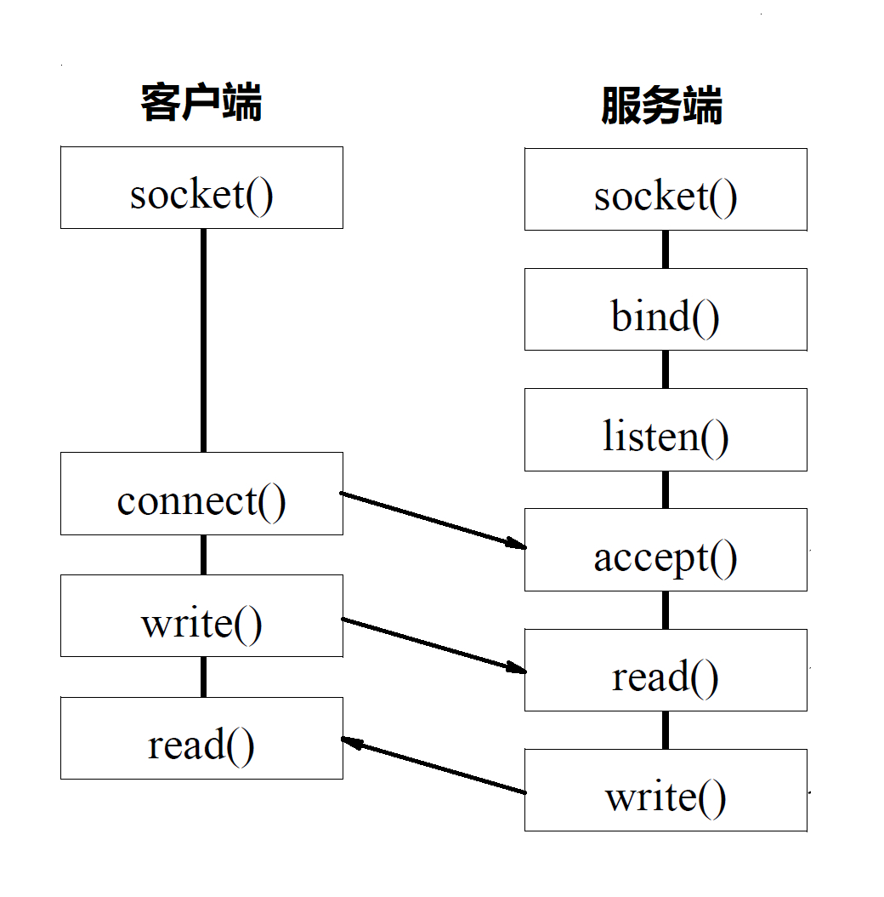
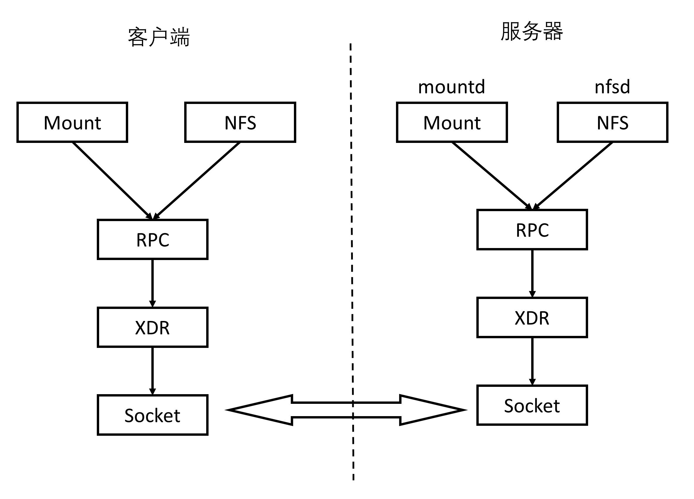
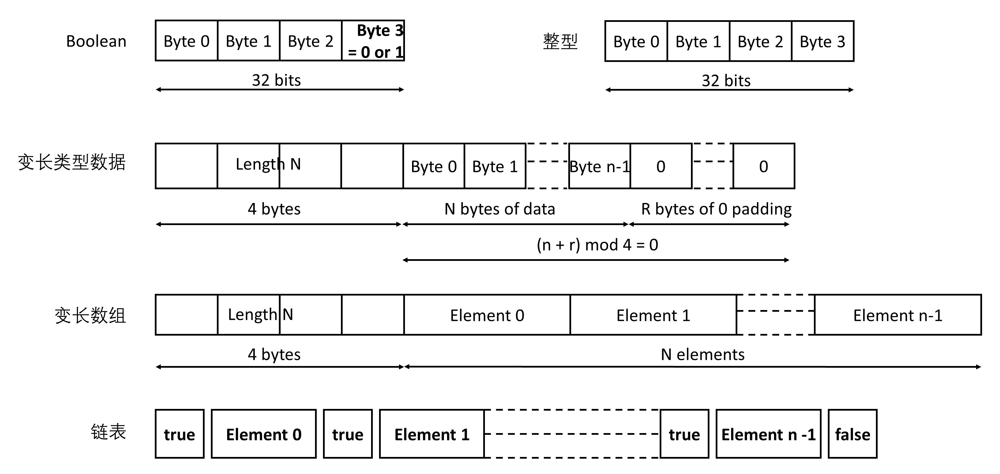
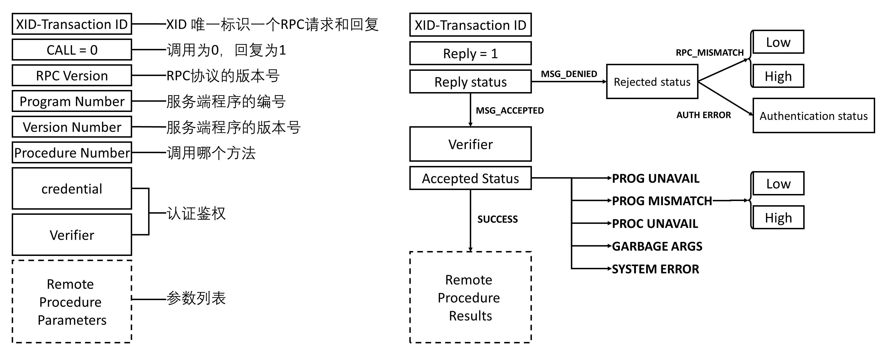
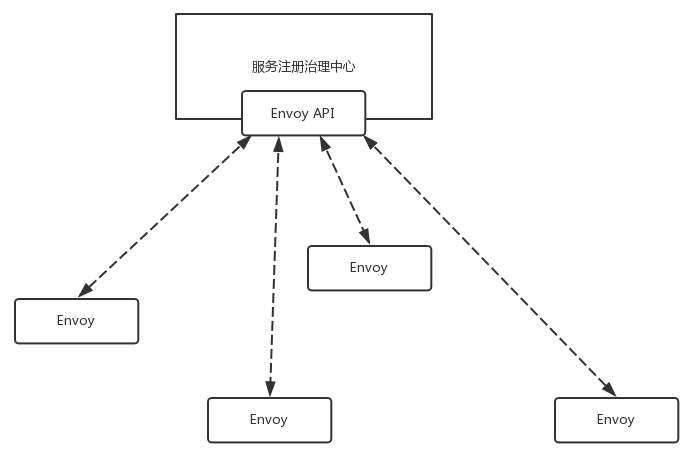
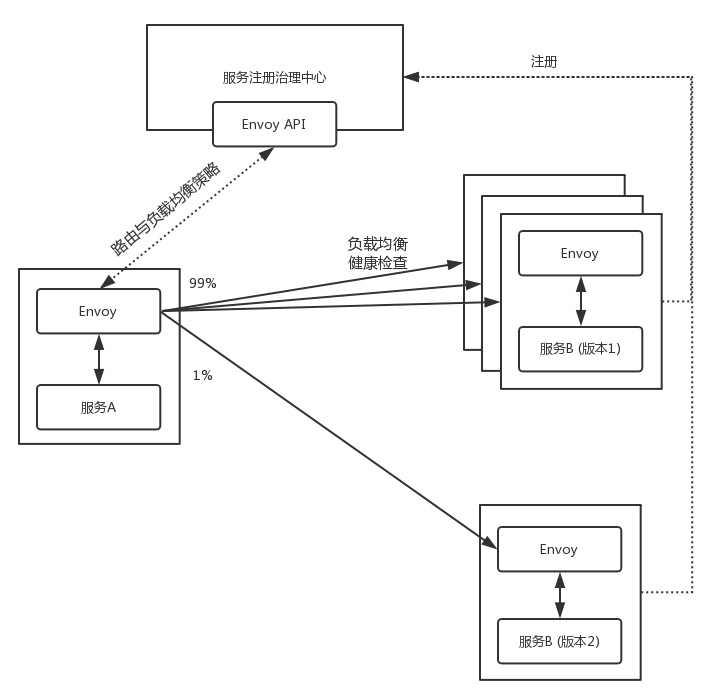

## # 第32講| RPC協議綜述

前面講了容器網絡如何實現跨主機互通，以及微服務之間的相互調用。


網絡是打通了，那服務之間的互相調用，該怎麼實現呢？你可能說，咱不是學過Socket。服務之間分調用方和被調用方，我們就建立一個TCP或者UDP的連接，不就可以通信了？



這事沒這麼簡單。就拿最簡單的場景，客戶端調用一個加法函數，將兩個整數加起來，返回它們的和。

如果放在本地調用，只要稍微學過一種編程語言，三下五除二就搞定了。但是一旦變成了遠程調用，門檻一下子就上去了。

首先你要會Socket編程，網絡協議課，然後再看N本磚頭厚的Socket程序設計的書，而且，搞定了Socket程序設計，才是萬里長征的第一步。後面還有很多問題

### |> 如何解決這五個問題？

**問題一：如何規定遠程調用的語法？**

- 客戶端如何告訴服務端，我是一個加法，而另一個是乘法。我是用字符串"add”傳給你，還是傳給你一個整數，比如1表示加法，2表示乘法？

- 服務端該如何告訴客戶端，我的這個加法，目前只能加整數，不能加小數，不能加字符串；而另一個加法"add1”，它能實現小數和整數的混合加法。那返回值是什麼？正確的時候返回什麼，錯誤的時候又返回什麼？

**問題二：如果傳遞參數？**

- 我是先傳兩個整數，後傳一個操作符"add”，還是先傳操作符，再傳兩個整數？是不是像咱們數據結構裡一樣，
  - 如果都是UDP，想要實現一個逆波蘭表達式，放在一個報文裡面還好，
  - 如果是TCP，是一個流，在這個流裡面，如何將兩次調用進行分界？什麼時候是頭，什麼時候是尾？別這次的參數和上次的參數混了起來，TCP一端發送出去的數據，另外b一端不一定能一下子全部讀取出來。所以，怎麼才算讀完呢？

**問題三：如何表示數據？**

- 在這個簡單的例子中，傳遞的就是一個固定長度的int值，這種情況還好，如果是變長的類型，是一個結構體，甚至是一個類，應該怎麼辦呢？如果是int，不同的平台上長度也不同，該怎麼辦呢？

- 在網絡上傳輸超過一個Byte的類型，還有大端Big Endian和小端Little Endian的問題。
- 假設我們要在32位四個Byte的一個空間存放整數1,很顯然只要一個Byte放1，其他三個Byte放0就可以了。那問題是，最後一個Byte放1呢，還是第一個Byte放1呢？或者說1作為最低位，應該是放在32位的最後一個位置呢，還是放在第一個位置呢？
  - 最低位放在最後一個位置，叫作Little Endian, 
  - 最低位放在第一個位置，叫作Big Endian。
  - TCP/IP協議棧是按照Big Endian來設計的，而X86機器多按照Little Endian來設計的，因而發出去的時候需要做一個轉換。

**問題四：如何知道一個服務端都實現了哪些遠程調用？從哪個端口可以訪問這個遠程調用？**

- 假設服務端實現了多個遠程調用，每個可能實現在不同的進程中，監聽的端口也不一樣，而且由於服務端都是自己實現的，不可能使用一個大家都公認的端口，而且有可能多個進程部署在一台機器上，大家需要搶占端口，為了防止衝突，往往使用隨機端口，那客戶端如何找到這些監聽的端口呢？

**問題五：發生了錯誤、重傳、丟包、性能等問題怎麼辦？**

- 本地調用沒有這個問題，但是一旦到網絡上，這些問題都需要處理，因為網絡是不可靠的，雖然在同一個連接中，我們還可通過TCP協議保證丟包、重傳的問題，但是如果服務器崩潰了又重啟，當前連接斷開了，TCP就保證不了了，需要應用自己進行重新調用，重新傳輸會不會同樣的操作做兩遍，遠程調用性能會不會受影響呢？

### |> 協議約定問題

看到這麼多問題，你是不是想起了第一節講過的這張圖。


本地調用函數里有很多問題，比如詞法分析、語法分析、語義分析等等，這些編譯器本來都能幫你做了。但是在遠程調用中，這些問題你都需要重新操心。

很多公司的解決方法是，弄一個核心通信組，裡面都是Socket編程的大牛，實現一個統一的庫，讓其他業務組的人來調用，業務的人不需要知道中間傳輸的細節。通信雙方的語法、語義、格式、端口、錯誤處理等，都需要調用方和被調用方開會商量，雙方達成一致。一旦有一方改變，要及時通知對方，否則通信就會有問題。

可是不是每一個公司都有這種大牛團隊，往往只有大公司才配得起，那有沒有已經實現好的框架可以使用呢？

[第十三章、檔案伺服器之一：NFS 伺服器](http://linux.vbird.org/linux_server/0330nfs.php)

[認識 NFS 文件共享協議](https://zhuanlan.zhihu.com/p/31626338)

#### RPC(Remote Procedure Calls)框架

- RPC（Remote Procedure Call，遠程過程調用）是一種網絡程序的編程方法，它定義了一種進程間通過網絡進行交互通信的機制。 
- 正常情況下，如果客戶端要和服務器相互通信，那麼客戶端和服務器就必須利用系統的套接口函數，編寫出一套完整的網絡通信協議才能實現。 而如果使用了 RPC，那麼服務器和客戶端之間只需要相互調用對方提供的 RPC 接口函數（俗稱客戶樁）即可實現相互通信。
- 函數的參數和返回值就是要傳遞的信息。 而 RPC 將全權負責網絡通信。這樣一來，網絡程序的設計就變得簡單許多，跟編寫本地程序一樣簡單，通信效率也會有所提高。

當然有。一個大牛Bruce Jay Nelson寫了一篇論文[Implementing Remote Procedure Calls](http://www.cs.cmu.edu/~dga/15-712/F07/papers/birrell842.pdf)，定義`了RPC(Remote Procedure Calls)`的調用標準。後面所有RPC框架，都是按照這個標準模式來的。


當客戶端的應用想發起一個遠程調用時，它實際是通過本地調用本地調用方的Stub。（本地調用方的Stub）它負責將調用的接口、方法和參數，通過約定的協議規范進行編碼，並通過本地的RPCRuntime進行傳輸，將調用網絡包發送到服務器。

服務器端的RPCRuntime收到請求後，交給提供方Stub進行解碼，然後調用服務端的方法，服務端執行方法，返回結果，提供方Stub將返回結果編碼後，發送給客戶端，客戶端的RPCRuntime收到結果，發給調用方Stub解碼得到結果，返回給客戶端。

這裡面分了三個層次，

- 對於用戶層和服務端，都像是本地調用一樣，專注於業務邏輯的處理就可以了。
- 對於Stub層，處理雙方約定好的語法、語義、封裝、解封裝。
- 對於RPCRuntime,主要處理高性能的傳輸，以及網絡的錯誤和異常。

最早的RPC的一種實現方式稱為Sun RPC或ONC RPC。Sun公司是第一個提供商業化RPC庫和RPC編譯器的公司。這個`RPC框架是在NFS協議中使用的`。

#### NFS (Network File System) 協議

- 最大的功能就是可以透過網路，讓不同的機器、不同的作業系統、可以彼此分享個別的檔案 (share files)。所以，你也可以簡單的將他看做是一個檔案伺服器 (file server) 
- 這個 NFS 伺服器可以讓你的 PC 來將網路遠端的 NFS 伺服器分享的目錄，掛載到本地端的機器當中， 在本地端的機器看起來，那個遠端主機的目錄就好像是自己的一個磁碟分割槽一樣 (partition)！
- 基本上 NFS 這個服務的埠口開在 2049 ，但是由於檔案系統非常複雜，因此 NFS 還有其他的程序去啟動額外的埠口，但這些額外的埠口啟動的號碼無法知道！因為預設 NFS 用來傳輸的埠口是隨機選擇小於 1024 以下的埠口來使用的。用戶端怎麼知道你伺服器端使用那個埠口 ===> 得要 遠端程序呼叫 (Remote Procedure Call, RPC) 的協定來輔助啦！
  - RPC 最主要的功能就是在指定每個 NFS 功能所對應的 port number ，並且回報給用戶端，讓用戶端可以連結到正確的埠口上去。
  - RPC 又是如何知道每個 NFS 的埠口呢？這是因為當伺服器在啟動 NFS 時會隨機取用數個埠口，並主動的向 RPC 註冊，因此 RPC 可以知道每個埠口對應的 NFS 功能，然後 RPC 又是固定使用 port 111 來監聽用戶端的需求並回報用戶端正確的埠口
  - 要啟動 NFS 之前，RPC 就要先啟動了，否則 NFS 會無法向 RPC 註冊。 另外，RPC 若重新啟動時，原本註冊的資料會不見，因此 RPC 重新啟動後，它管理的所有服務都需要重新啟動來重新向 RPC 註冊。


當用戶端有 NFS 檔案存取需求時，他會如何向伺服器端要求資料呢？

1. 用戶端會向伺服器端的 RPC (port 111) 發出 NFS 檔案存取功能的詢問要求；
2. 伺服器端找到對應的已註冊的 NFS daemon 埠口後，會回報給用戶端；
3. 用戶端瞭解正確的埠口後，就可以直接與 NFS daemon 來連線。

`NFS(Network File System)`就是網絡文件系統。要使NFS成功運行，要啟動兩個服務端，

- 一個是mountd,用來掛載文件路徑；
- 一個是nfsd，用來讀寫文件。

NFS可以在本地mount一個遠程的目錄到本地的一個目錄，從而本地的用戶在這個目錄裡面寫入、讀出任何文件的時候，其實操作的是遠程另一台機器上的文件。

操作遠程和遠程調用的思路是一樣的，就像操作本地一樣。所以NFS協議就是基於RPC實現的。當然無論是什麼RPC，底層都是Socket編程。



> XDR(External Data Representation，外部數據表示法)

**`XDR(External Data Representation，外部數據表示法)`**是一個標準的`數據壓縮格式`，可以表示基本的數據類型，也可以表示結構體。

這裡是幾種基本的數據類型。



#### RPC的調用結果返回格式

在RPC的調用過程中，所有的數據類型都要封裝成類似的格式。而且RPC的調用和結果返回，也有嚴格的格式。

- XID唯一標識一對請求和回复。請求為0，回復為1。

- RPC有版本號，兩端要匹配RPC協議的版本號。如果不匹配，就會返回Deny，原因就是RPC_MISMATCH。

- 程序有編號。如果服務端找不到這個程序，就會返回PROG_UNAVAIL。

- 程序有版本號。如果程序的版本號不匹配，就會返回PROG_MISMATCH。

- 一個程序可以有多個方法，方法也有編號，如果找不到方法，就會返回PROC_UNAVAIL。

- 調用需要認證鑑權，如果不通過，則Deny。

- 最後是參數列表，如果參數無法解析，則返回GABAGE_ARGS。

  

- 為了可以成功調用RPC，在客戶端和服務端實現RPC的時候，首先要定義一個雙方都認可的程序、版本、方法、參數等。 

  

  如果還是上面的加法，則雙方約定為一個協議定義文件，同理如果是NFS、mount和讀寫，也會有類似的定義。

有了協議定義文件，ONC RPC會提供一個工具，根據這個文件生成客戶端和服務器端的Stub程序。


最下層的是XDR文件，用於編碼和解碼參數。這個文件是客戶端和服務端共享的，因為只有雙方一致才能成功通信。

在客戶端，會調用clnt_create創建一個連接，然後調用add_1，這是一個Stub函數，感覺是在調用本地一樣。其實是這個函數發起了一個RPC調用，通過調用clnt_call來調用ONC RPC的類庫， 來真正發送請求。調用的過程非常複雜，一會兒我詳細說這個。

當然服務端也有一個Stub程序，監聽客戶端的請求，當調用到達的時候，判斷如果是add，則調用真正的服務端邏輯，也即將兩個數加起來。

服務端將結果返回服務端的Stub，這個Stub程序發送結果給客戶端，客戶端的Stub程序正在等待結果，當結果到達客戶端Stub，就將結果返回給客戶端的應用程序，從而完成整個調用過程。

有了這個RPC的框架，前面五個問題中的前三個"如何規定遠程調用的語法？” "如何傳遞參數？” 以及"如何表示數據？” 基本解決了，這三個問題我們統稱為協議約定問題

### |> 傳輸問題

但是錯誤、重傳、丟包、性能等問題還沒有解決，這些問題我們統稱為**傳輸問題**。這個就不用Stub操心了，而是由`ONC RPC`的類庫來實現。這是大牛們實現的，我們只要調用就可以了。


在這個類庫中，為了解決傳輸問題，對於每一個客戶端，都會創建一個傳輸管理層，而每一次RPC調用，都會是一個任務，在傳輸管理層，你可以看到熟悉的隊列機制、擁塞窗口機制等。

由於在網絡傳輸的時候，經常需要等待，因而同步的方式往往效率比較低，因而也就有Socket的異步模型。為了能夠異步處理，對於遠程調用的處理，往往是通過狀態機來實現的。只有當滿足某個狀態的時候，才進行下一步，如果不滿足狀態，不是在那裡等，而是將資源留出來，用來處理其他的RPC調用。


從這個圖可以看出，這個狀態轉換圖還是很複雜的。

首先，進入起始狀態，查看RPC的傳輸層隊列中有沒有空閒的位置，可以處理新的RPC任務。如果沒有，說明太忙了，或直接結束或重試。如果申請成功，就可以分配內存，獲取服務的端口號， 然後連接服務器。

連接的過程要有一段時間，因而要等待連接的結果，會有連接失敗，或直接結束或重試。如果連接成功，則開始發送RPC請求，然後等待獲取RPC結果，這個過程也需要一定的時間；如果發送出錯，可以重新發送；如果連接斷了，可以重新連接；如果超時，可以重新傳輸；如果獲取到結果，就可以解碼，正常結束。

這里處理了連接失敗、重試、發送失敗、超時、重試等場景。不是大牛真寫不出來，因而實現一個RPC的框架，其實很有難度。

### |> 服務發現問題

傳輸問題解決了我們還遺留一個問題，就是問題四“如何找到RPC服務端的那個隨機端口”。這個問題我們稱為**服務發現問題**。在ONC RPC中，服務發現是通過portmapper實現的。


portmapper會啟動在一個眾所周知的端口上，RPC程序由於是用戶自己寫的，會監聽在一個隨機端口上，但是RPC程序啟動的時候，會向portmapper註冊。

- 客戶端要訪問RPC服務端這個程序的時候，首先查詢portmapper，獲取RPC服務端程序的隨機端口，然後向這個隨機端口建立連接，開始RPC調用。
- 從圖中可以看出，mount命令的RPC調用，就是這樣實現的。

### |> 小結

總結一下。

- 遠程調用看起來用Socket編程就可以了，其實是很複雜的，要解決協議約定問題、傳輸問題和服務發現問題。
- 大牛Bruce Jay Nelson的論文、早期ONC RPC框架，以及NFS的實現，給出了解決這三大問題的示範性實現，也即協議約定要公用協議描述文件，並通過這個文件生成Stub程序; RPC的傳輸一般需要一個狀態機，需要另外一個進程專門做服務發現。

> 兩個思考題。

1. 在這篇文章中，mount的過程是通過系統調用，最終調用到RPC層。一旦mount完畢之後，客戶端就像寫入本地文件一樣寫入NFST, 這個過程是如何觸發RPC層的呢？
2. ONC RPC是早期的RPC框架，你覺得它有哪些問題呢？

## # 第33講| 基於XML的SOAP協議

上一節我們講了RPC的經典模型和設計要點，並用最早期的ONC RPC為例子，詳述了具體的實現。

### |> ONC RPC存在哪些問題？

ONC RPC將客戶端要發送的參數，以及服務端要發送的回复，都壓縮為一個二進制串，這樣固然能夠解決雙方的協議約定問題，但是存在一定的不方便。

- 首先，**需要雙方的壓縮格式完全一致**，一點都不能差。一旦有少許的差錯，多一位少一位或者錯一位，都可能造成無法解壓縮。
  - 可以用傳輸層的可靠性以及加入校驗值等方式，來減少傳輸過程中的差錯。
- 其次，**協議修改不靈活**。如果不是傳輸過程中造成的差錯，而是客戶端因為業務邏輯的改變，添加或者刪除了字段，或者服務端添加或者刪除了字段，而雙方沒有及時通知，或者線上系統沒有及時升級，就會造成解壓縮不成功。
  - 因而，當業務發生改變，都需要及時通知對方，並且根據約定好的協議文件重新生成雙方的Stub程序。這樣靈活性自然比較差。（溝通的問題）
  - 更難弄的還有**版本的問題**。比如在服務端提供一個服務，參數的格式是版本一的，已經有50個客戶端在線上調用了。現在有一個客戶端有個需求，要加一個字段，怎麼辦呢？這可是一個大工程，所有的客戶端都要適配這個，需要重新寫程序，加上這個字段，但是傳輸值是0，不需要這個字段的客戶端很"冤”，本來沒我啥事兒，為啥讓我也忙活？

- 最後，**ONC RPC的設計明顯是面向函數的，而非面向對象**。而當前面向對象的業務邏輯設計與實現方式已經成為主流。

這一切的根源就在於`壓縮`。這就像平時我們愛用縮略語。如果是籃球愛好者，你直接說NBA，他馬上就知道什麼意思，但是如果你給一個大媽說NBA，她可能就不知所云。

所以，這種RPC框架只能用於客戶端和服務端全由一撥人開發的場景，或者至少客戶端和服務端的開發人員要密切溝通，相互合作，有大量的共同語言，才能按照既定的協議順暢地進行工作。

### |> XML給定的SOAP

但是，一般情況下，我們做一個服務，都是要提供給陌生人用的，你和客戶不會經常溝通，也沒有什麼共同語言。就像你給別人介紹NBA，你要說美國職業籃球賽，這樣不管他是乾啥的，都能聽得懂。

放到我們的場景中，對應的就是用**文本類**的方式進行傳輸。無論哪個客戶端獲得這個文本，都能夠知道它的意義。

一種常見的文本類格式是XML。我們這裡舉個例子來看。

```javascript
<?xml version="1.0" encoding="UTF-8"?>
<geek:purchaseOrder xmlns:xsi="http://www.w3.org/2001/XMLSchema-instance" xmlns:geek="http://www.example.com/geek">
<order>
<date>2018-07-01</date>
<className> Learning: Funny Talk about Networking Protocal </className>
<Author> 劉超 </Author>
<price>68</price>
</order>
</geek:purchaseOrder>
```

有了這個，剛才我們說的那幾個問題就都不是問題了。

首先，**格式沒必要完全一致**。比如如果我們把price和author換個位置，並不影響客戶端和服務端解析這個文本，也根本不會誤會，說這個作者的名字叫68。

如果有的客戶端想增加一個字段，例如添加一個推薦人字段，只需要在上面的文件中加一行：

```javascript
<recommended> Gary </recommended>
```

對於不需要這個字段的客戶端，只要不解析這一行就是了。只要用簡單的處理，就不會出現錯誤。

另外，這種表述方式顯然是描述一個訂單對象的，是一種面向對象的、更加接近用戶場景的表示方式。

既然XML這麼好，接下來我們來看看怎麼把它用在RPC中。

### |> 傳輸協議問題

我們先解決第一個，傳輸協議的問題。

基於XML的最著名的通信協議就是SOAP了，全稱**簡單對象訪問協議(Simple Object Access Protocol)**。它使用XML編寫簡單的請求和回复消息，並用HTTP協議進行傳輸。

SOAP將請求和回复放在一個信封裡面，就像傳遞一個郵件一樣。信封裡面的信分**抬頭**和**正文**。

```javascript
POST /purchaseOrder HTTP/1.1
Host: www.geektime.com
Content-Type: application/soap+xml; charset=utf-8
Content-Length: nnn

<?xml version="1.0"?>
<soap:Envelope xmlns:soap="http://www.w3.org/2001/12/soap-envelope"
soap:encodingStyle="http://www.w3.org/2001/12/soap-encoding">
<soap:Header>
<m:Trans xmlns:m="http://www.w3schools.com/transaction/"
soap:mustUnderstand="1">1234
</m:Trans>
</soap:Header>
<soap:Body xmlns:m="http://www.geektime.com/perchaseOrder">
<m:purchaseOrder">
<order>
<date>2018-07-01</date>
<className> Learning: Funny Talk about Networking Protocal </className>
<Author> 劉超 </Author>
<price>68</price>
</order>
</m:purchaseOrder>
</soap:Body>
</soap:Envelope>
```

HTTP協議我們學過，這個請求使用POST方法，發送一個格式為`application/soap + xml`的XML正文給`www.geektime.com`，從而下一個單，這個訂單封裝在SOAP的信封裡面，並且表明這是一筆交易(transaction)，而且訂單的詳情都已經寫明了。

### |> 協議約定問題

接下來我們解決第二個問題，就是雙方的協議約定是什麼樣的？

因為服務開發出來是給陌生人用的，就像上面下單的那個XML文件，對於客戶端來說，它如何知道應該拼裝成上面的格式呢？這就需要對於服務進行描述，因為調用的人不認識你，所以沒辦法找到你，問你的服務應該如何調用。

當然你可以寫文檔，然後放在官方網站上，但是你的文檔不一定更新得那麼及時，而且你也寫的文檔也不一定那麼嚴謹，所以常常會有調試不成功的情況。因而，我們需要一種相對比較嚴謹的**Web服務描述語言**，**WSDL(Web Service Description Languages)**。它也**是一個XML文件**。

在這個文件中，要定義一個類型order，與上面的XML對應起來。

```javascript
<wsdl:types>
<xsd:schema targetNamespace="httP：//www.example.org/geektime">
<xsd:complexType name="order">
<xsd:element name="date" type="xsd:string"></xsd:element>
<xsd:element name="className" type="xsd:string"></xsd:element>
<xsd:element name="Author" type="xsd:string"></xsd:element>
<xsd:element name="price" type="xsd:int"></xsd:element>
</xsd:complexType>
</xsd:schema>
</wsdl:types>
```

接下來，需要定義一個message的結構。

```javascript
<wsdl:message name="purchase">
<wsdl:part name="purchaseOrder" element="tns:order"></wsdl:part>
</wsdl:message>
```

接下來，應該暴露一個端口。

```javascript
<wsdl:portType name="PurchaseOrderService">
<wsdl:operation name="purchase">
<wsdl:input message="tns:purchase"></wsdl:input>
<wsdl:output message="	"></wsdl:output>
</wsdl:operation>
</wsdl:portType>
```

然後，我們來編寫一個binding，將上面定義的信息綁定到SOAP請求的body裡面。

```javascript
<wsdl:binding name="purchaseOrderServiceSOAP" type="tns:PurchaseOrderService">
<soap:binding style="rpc"
transport="http://schemas.xmlsoap.org/soap/http" />
<wsdl:operation name="purchase">
<wsdl:input>
<soap:body use="literal" />
</wsdl:input>
<wsdl:output>
<soap:body use="literal" />
</wsdl:output>
</wsdl:operation>
</wsdl:binding>
```

最後，我們需要編寫service。

```javascript
<wsdl:service name="PurchaseOrderServiceImplService">
<wsdl:port binding="tns:purchaseOrderServiceSOAP" name="PurchaseOrderServiceImplPort">
<soap:address location="http://www.geektime.com:8080/purchaseOrder" />
</wsdl:port>
</wsdl:service>
```

WSDL還是有些複雜的，不過好在有工具可以生成。

對於某個服務，哪怕是一個陌生人，都可以通過在服務地址後面加上“?wsdl” 來獲取到這個文件，但是這個文件還是比較複雜，比較難以看懂。不過好在也有工具可以根據WSDL生成客戶端Stub，讓客戶端通過Stub進行遠程調用，就跟調用本地的方法一樣。

### |> 服務發現問題

最後解決第三個問題，服務發現問題。

這裡有一個**UDDI(Universal Description, Discovery, and Integration)**，也即**統一描述、發現和集成協議**。它其實是一個註冊中心，服務提供方可以將上面的WSDL描述文件，發佈到這個註冊中心，註冊完畢後，服務使用方可以查找到服務的描述，封裝為本地的客戶端進行調用。

### |> 小結

總結一下。

- 原來的二進制RPC有很多缺點，格式要求嚴格，修改過於復雜，不面向對象，於是產生了基於文本的調用方式一一基於XML的SOAP。
- SOAP有三大要素：協議約定用WSDL、傳輸協議用HTTP、服務發現用UDDL。

> 兩個思考題：

1. 對於HTTP協議來講，有多種方法，但是SOAP只用了POST，這樣會有什麼問題嗎？
2. 基於文本的RPC雖然解決了二進制的問題，但是SOAP還是有點複雜，還有一種更便捷的接口規則，你知道是什麼嗎？

## # 第34講| 基於JSON的RESTful接口協議

[比較SOAP與REST API](http://restful.p2hp.com/resources/soap-vs-rest-apis)

上一節我們講了基於XML的SOAP協議，SOAP的S是啥意思來看？是Simple，但是好像一點兒都不簡單啊

你會發現，對於SOAP來講，無論XML中調用的是什麼函數，多是通過HTTP的POST方法發送的。但是HTTP除了POST，還有PUT、DELETE、GET等方法，這些也可以代表一個個動作，比如增是POST，刪是DELETE，查是GET，改是PUT。

### |> 傳輸協議問題

對於SOAP來講，比如我創建一個訂單，用POST，在XML裡面寫明動作是CreateOrder ；刪除一個訂單，還是用POST，在XML裡面寫明了動作是DeleteOrder。

其實創建訂單完全可以使用POST動作，然後在XML裡面放一個訂單的信息就可以了，而刪除用DELETE動作，然後在XML裡面放一個訂單的ID就可以了。

於是上面的那個SOAP就變成下面這個簡單的模樣。

```javascript
POST /purchaseOrder HTTP/1.1
Host: www.geektime.com
Content-Type: application/xml; charset=utf-8
Content-Length: nnn
<?xml version="1.0"?>
<order>
<date>2018-07-01</date>
<className> Learning: Funny Talk about Networking Protocal </className>
<Author> 劉超 </Author>
<price>68</price>
</order>
```

而且XML的格式也可以改成另外一種簡單的文本化的對象表示格式JSON。

```javascript
POST /purchaseOrder HTTP/1.1
Host: www.geektime.com
Content-Type: application/json; charset=utf-8
Content-Length: nnn
{
"order": {
"date": "2018-07-01",
"className":"趣谈网络协议"，
"Author":"刘超"，
"price": "68"
}
}
```

經常寫Web應用的應該已經發現，這就是RESTful格式的API的樣子。

### |> 協議約定問題

然而RESTful可不僅僅是指API，而是一種架構風格，全稱**Representational State Transfer** ,**表述性狀態轉移**，來自一篇重要的論文《架構風格與基於網絡的軟件架構設計》(Architectural Styles and the Design of Network -based Software Architectures)。

- 這篇文章從深層次，更加抽像地論證了一個互聯網應用應該有的設計要點，而這些設計要點，成為後來我們能看到的所有高並發應用設計都必須要考慮的問題，再加上REST API比較簡單直接， 所以後來幾乎成為互聯網應用的標準接口。

因此，和SOAP不一樣，REST不是一種嚴格規定的標準，它其實是一種設計風格。如果按這種風格進行設計，RESTful接口和SOAP接口都能做到，只不過後面的架構是REST倡導的，而SOAP相對比較關注前面的接口。

#### RPC場景下，由服務端來維護狀態

而且由於SOAP能夠通過WSDL生成客戶端的Stub，因而`SOAP常常被用於類似傳統的RPC方式`，也即調用遠端和調用本地是一樣的。

然而本地調用和遠程跨網絡調用畢竟不一樣，這裡的不一樣還不僅僅是因為有網絡而導致的客戶端和服務端的分離，從而帶來的網絡性能問題。

更重要的問題是，客戶端和服務端誰來維護狀態。所謂的狀態就是對某個數據當前處理到什麼程度了。

- 例如，我瀏覽到哪個目錄了，我看到第幾頁了，我要買個東西，需要扣減一下庫存，這些都是狀態。
- 本地調用其實沒有人糾結這個問題，因為數據都在本地，誰處理都一樣，而且一邊處理了，另一邊馬上就能看到。

當有了RPC之後，我們本來期望對上層透明，就像上一節說的“遠在天邊，盡在眼前”。於是使用RPC的時候，對於狀態的問題也沒有太多的考慮。

- 就像NFS一樣，客戶端會告訴服務端，我要進入哪個目錄，服務端必須要為某個客戶端維護一個狀態，就是當前這個客戶端瀏覽到哪個目錄了。
- 例如，客戶端輸入cd hello, 服務端要在某個地方記住，上次瀏覽到/root/liuchao了, 因而客戶的這次輸入，應該給它顯示/root/liuchao/hello下面的文件列表。而如果有另一個客戶端，同樣輸入cd hello, 服務端也在某個地方記住，上次瀏覽到/var/lib, 因而要給客戶顯示的是/var/lib/hello。

不光NFS, 如果瀏覽翻頁，我們經常要實現函數next()，在一個列表中取下一頁，但是這就需要服務端記住，客戶端A上次瀏覽到20〜30頁了，那它調用next()，應該顯示30〜40頁，而客戶端B上次瀏覽到100〜110頁了，調用next()應該顯示110〜120頁。

上面的例子都是在RPC場景下，由服務端來維護狀態，很多SOAP接口設計的時候，也常常按這種模式。這種模式原來沒有問題，是因為客戶端和服務端之間的比例沒有失衡。因為一般不會同時有太多的客戶端同時連上來，所以NFS還能把每個客戶端的狀態都記住。

公司內部使用的ERP系統，如果使用SOAP的方式實現，並且服務端為每個登錄的用戶維護瀏覽到報表那一頁的狀態，由於一個公司內部的人也不會太多，把ERP放在一個強大的物理機上，也能記得過來。

但是互聯網場景下，客戶端和服務端就徹底失衡了。你可以想像"雙十一"，多少人同時來購物，作為服務端，不可能記得過來，只好多個服務端同時提供服務，大家分擔一下。但是這就存在一個問題，服務端怎麼把自己記住的客戶端狀態告訴另一個服務端呢？或者說，你讓我給你分擔工作，你也要把工作的前因後果給我說清楚啊！

#### 服務端的無狀態化 = 客戶端維護會話的狀態

那服務端索性就要想了，既然這麼多客戶端，那大家就分分工吧。服務端就只記錄資源的狀態，例如文件的狀態，報表的狀態，庫存的狀態，而客戶端自己維護自己的狀態。比如，你訪問到哪個目錄了啊，報表的哪一頁了啊，等等。

這樣對於API也有影響，也就是說，當客戶端維護了自己的狀態，就不能這樣調用服務端了。

- 例如客戶端說，我想訪問當前目錄下的hello路徑。服務端說，我怎麼知道你的當前路徑。所以客戶端要先看看自己當前路徑是/root/liuchao, 然後告訴服務端說，我想訪問/root/liuchao/hello路徑。
- 再比如，客戶端說我想訪問下一頁，服務端說，我怎麼知道你當前訪問到哪一頁了。所以客戶端要先看看自己訪問到了100〜110頁，然後告訴服務器說，我想訪問110〜120頁。

這就是**服務端的無狀態化**。這樣服務端就可以橫向擴展了，一百個人一起服務，不用交接，每個人都能處理。

所謂的無狀態，其實是`服務端維護資源的狀態，客戶端維護會話的狀態`。

- 對於服務端來講，只有資源的狀態改變了，客戶端才調用POST、PUT、DELETE方法來找我；
- 如果資源的狀態沒變，只是客戶端的狀態變了，就不用告訴我了，對於我來說都是統一的GET。

雖然這只改進了GET，但是已經帶來了很大的進步。因為對於互聯網應用，大多數是讀多寫少的。而且只要服務端的資源狀態不變，就給了我們緩存的可能。例如可以將狀態緩存到接入層，甚至緩存到CDN的邊緣節點，這都是資源狀態不變的好處。

按照這種思路，對於API的設計，就慢慢變成了`以資源為核心`，而非以過程為核心。也就是說，`客戶端只要告訴服務端你想讓資源狀態最終變成什麼樣就可以了`，而不用告訴我過程，不用告訴我動作。

- 還是文件目錄的例子。客戶端應該訪問哪個絕對路徑，而非一個動作，我就要進入某個路徑。
- 再如，庫存的調用，應該查看當前的庫存數目，然後減去購買的數量，得到結果的庫存數。這個時候應該設置為目標庫存數（但是當前庫存數要匹配），而非告知減去多少庫存。

#### API的設計需要實現冪等

這種API的設計需要實現**`冪等`**，因為網絡不穩定，就會經常出錯，因而需要重試，但是一旦重試，就會存在幕等的問題，

- 也就是`同一個調用，多次調用的結果應該一樣`，不能一次支付調用，因為調用三次變成了支付三次。
- 不能進入cd a,做了三次，就變成了cd a/a/a。也不能扣減庫存，調用了三次，就扣減三次庫存。

當然按照這種設計模式，無論RESTful API還是SOAP API都可以將架構實現成無狀態的，面向資源的、冪等的、橫向擴展的、可緩存的。

但是SOAP的XML正文中，是可以放任何動作的。

- 例如XML裡面可以寫＜ ADD ＞，＜ MINUS ＞等。這就方便使用SOAP的人，將大量的動作放在API裡面。

RESTful沒這麼複雜，也沒給客戶提供這麼多的可能性，

- 正文裡的JSON基本描述的就是資源的狀態，沒辦法描述動作，而且能夠出發的動作只有CRUD，也即POST、GET、PUT、DELETE ，也就是對於狀態的改變。

所以，從接口角度，就讓你死了這條心。當然也有很多技巧的方法，在使用RESTful API的情況下，依然提供基於動作的有狀態請求，這屬於反模式了。

### |> 服務發現問題

對於RESTful API來講，我們已經解決了

- 傳輸協議的問題——基於HTTP, 
- 協議約定問題——基於JSON，
- 最後要解決的是服務發現問題。

有個著名的基於RESTful API的跨系統調用框架叫Spring Cloud。在Spring Cloud中有一個組件叫Eureka。傳說，阿基米德在洗澡時發現浮力原理，高興得來不及穿上褲子，跑到街上大喊：“Eureka （我找到了）！” 所以Eureka是用來實現註冊中心的，負責維護註冊的服務列表。

- 服務分服務提供方，它向Eureka做服務註冊、續約和下線等操作，註冊的主要數據包括服務名、機器IP、端口號、域名等等。

- 另外一方是服務消費方，向Eureka獲取服務提供方的註冊信息。為了實現負載均衡和容錯，服務提供方可以註冊多個。

當消費方要調用服務的時候，會從註冊中心讀出多個服務來，那怎麼調用呢？當然是RESTful方式了。

Spring Cloud提供一個RestTemplate工具，用於將請求對象轉換為JSON，並發起Rest調用，RestTemplate的調用也是分POST、PUT、GET、DELETE的，當結果返回的時候，根據返回的JSON解析成對象。

通過這樣封裝，調用起來也很方便。

### |> 小結

> 總結一下。

- SOAP過於復雜，而且設計是面向動作的，因而往往因為架構問題導致並發量上不去。
- RESTful不僅僅是一個API, 而且是一種架構模式，主要面向資源，提供無狀態服務，有利於橫向擴展應對高並發。

最後，給你留兩個思考題：

1. 在討論RESTful模型的時候，舉了一個庫存的例子，但是這種方法有很大問題，那你知道為什麼要這樣設計嗎？
2. 基於文本的RPC雖然解決了二進制的問題，但是它本身也有問題，你能舉出一些例子嗎？

## # 第35講| 二進制類RPC協議

前面我們講了兩個常用文本類的RPC協議，對於陌生人之間的溝通，用NBA、CBA這樣的縮略語，會使得協議約定非常不方便。

在講CDN和DNS的時候, 我們講過接入層的設計，對於靜態資源或者動態資源靜態化的部分都可以做緩存。但是對於下單、支付等交易場景，還是需要調用API。

對於微服務的架構，API需要一個API網關統一的管理。API網關有多種實現方式，用Nginx或者OpenResty結合Lua腳本是常用的方式。在上一節講過的Spring Cloud體系中，有個組件Zuul也是乾這個的。

### |> 數據中心內部是如何相互調用的？

API網關用來管理API，但是API的實現一般在一個叫作Controller層的地方。這一層對外提供API。由於是讓陌生人訪問的，我們能看到目前業界主流的，基本都是RESTful的API，是面向大規模互聯網應用的。


> Controller 業務邏輯實現

在Controller之內，就是咱們互聯網應用的業務邏輯實現。

- 上節講RESTful的時候，說過業務邏輯的實現最好是無狀態的，從而可以橫向擴展，但是資源的狀態還需要服務端去維護。
- 資源的狀態不應該維護在業務邏輯層，而是在最底層的持久化層，一般會使用分佈式數據庫和ElasticSearch 。

這些服務端的狀態，例如訂單、庫存、商品等，都是重中之重，都需要持久化到硬盤上，數據不能丟，但是由於硬盤讀寫性能差，因而持久化層往往吞吐量不能達到互聯網應用要求的吞吐量，因而前面要有一層緩存層，使用Redis或者memcached將請求攔截一道，不能讓所有的請求都進入數據庫''中軍大營”。

> 緩存和持久化層

緩存和持久化層之上一般是基礎服務層，這裡面提供一些原子化的接口。例如，對於用戶、商品、訂單、庫存的增刪查改，將緩存和數據庫對再上層的業務邏輯屏蔽一道。有了這一層，上層業務邏輯看到的都是接口，而不會調用數據庫和緩存。因而對於緩存層的擴容，數據庫的分庫分錶，所有的改變，都截止到這一層，這樣有利於將來對於緩存和數據庫的運維。

> 組合層

再往上就是組合層。因為基礎服務層只是提供簡單的接口，實現簡單的業務邏輯，而復雜的業務邏輯，比如下單，要扣優惠券，扣減庫存等，就要在組合服務層實現。

> 註冊中心

這樣，Controller層、組合服務層、基礎服務層就會相互調用，這個調用是在數據中心內部的，量也會比較大，`還是使用RPC的機制實現的`。

由於服務比較多, 需要一個單獨的註冊中心來做服務發現。服務提供方會將自己提供哪些服務註冊到註冊中心中去, 同時服務消費方訂閱這個服務，從而可以對這個服務迸行調用。

調用的時候有一個問題，這裡的RPC調用，應該用二進制還是文本類？

- 其實文本的最大問題是，佔用字節數目比較多。比如數字123，其實本來二進制8位就夠了，但是如果變成文本，就成了字符串123。
- 如果是UTF-8編碼的話，就是三個字節；如果是UTF-16, 就是六個字節。
- 同樣的信息，要多費好多的空間，傳輸起來也更加佔帶寬，時延也高。

因而對於數據中心內部的相互調用, 很多公司選型的時候，還是希望採用更加省空間和帶寬的二進制的方案。

這裡一個著名的例子就是Dubbo服務化框架二進制的RPC方式。


- Dubbo會在客戶端的本地啟動一個Proxy，其實就是客戶端的Stub，對於遠程的調用都通過這個Stub進行封裝。

- 接下來， Dubbo會從註冊中心獲取服務端的列表，根據路由規則和負載均衡規則，在多個服務端中選擇一個最合適的服務端迸行調用。

- 調用服務端的時候，首先要進行編碼和序列化，形成Dubbo頭和序列化的方法和參數。
- 將編碼好的數據，交給網絡客戶端進行發送，網絡服務端收到消息後，進行解碼。然後將任務分發給某個線程進行處理，在線程中會調用服務端的代碼邏輯，然後返回結果。

這個過程和經典的RPC模式何其相似啊！

### |> 如何解決協議約定問題？Dubbo服務化框架

接下來我們還是來看RPC的三大問題, 其中`註冊發現問題已經通過註冊中心解決`了。我們下面就來看協議約定問題。

- Dubbo中默認的RPC協議是`Hessian2`。

- 為了保證傳輸的效率，Hessian2將遠程調用序列化為`二進制進行傳輸`，並且可以進行一定的壓縮。這個時候你可能會疑惑，同為二進制的序列化協議，Hessian2和前面的二進制的RPC有什麼區別呢

- Hessian2是解決了一些問題的。例如，原來要定義一個協議文件，然後通過這個文件生成客戶端和服務端的Stub，才能進行相互調用，這樣使得修改就會不方便。

  Hessian2不需要定義這個協議文件，而是自描述的。什麼是自描述呢？

  - 所謂**自描述**就是，關於調用哪個函數，參數是什麼，另一方不需要拿到某個協議文件、拿到二進制，靠它本身根據Hessian2的規則，就能解析出來。
    - 原來有協議文件的場景，有點兒像兩個人`事先約定好，0表示方法add，然後後面會傳兩個數`。服務端把兩個數加起來，這樣一方發送012，另一方知道是將1和2加起來，但是不知道協議文件的，當它收到012的時候，完全不知道代表什麼意思。
    - 而自描述的場景，就像兩個人說的每句話都帶前因後果。例如，傳遞的是`"函數：add，第一個參數1，第二個參數2”`。這樣無論誰拿到這個表述，都知道是什麼意思。但是只不過都是以二進制的形式編碼的。這其實相當於`綜合了XML和二進制共同優勢的一個協議`。

Hessian2是如何做到這一點的呢？這就需要去看Hessian2的序列化的[語法描述文件](http://hessian.caucho.com/doc/hessian-serialization.html)。


看起來很複雜，編譯原理裡面是有這樣的語法規則的。

我們從TOP看起，下一層是value， 直到形成—棵樹。

- 這裡面的有個思想，為了防止歧義，每一個類型的起始數字都設置成為獨一無二的。這樣，解析的時候，看到這個數字，就知道後面跟的是什麼了。

這裡還是以加法為例子，''add(2,3)" 被序列化之後是什麼樣的呢？

```shell
H x02 X00	# Hessian 2.0
C	# RPC call
x03 add # method "add"
x92	#	two	arguments
x92	#	2 -	argument 1
x93	#	3 -	argument 2
```

- H開頭，表示使用的協議是Hession, H的二進制是0x48。
- C開頭，表示這是一個RPC調用。
- 0x03，表示方法名是三個字符。
- 0x92，表示有兩個參數。其實這裡存的應該是2，之所以加上0x90，就是為了防止歧義，表示這裡一定是一個int。
- 第一個參數是2，編碼為0x92，第二個參數是3，編碼為0x93。

這個就叫作自描述。

另外，Hessian2是面向對象的，可以傳輸一個對象。

```shell
class Car {
  String color;
  String model;
}
out.writeObject(new Car("red", "corvette"));
out.writeObject(new Car("green", "civic"));
----------------------------------------------------------------
C # object defnition (#0)
x0b example.Car # type is example.Car
x92 # two felds
x05 color # color feld name
x05 model # model feld name
O # object def (long form)
x90 # object defnition #0
x03 red # color feld value
x08 corvette # model feld value
x60 # object def #0 (short form)
x05 green # color feld value
x05 civic # model feld value
```

首先，定義這個類。對於類型的定義也傳過去，因而也是自描述的。

- 類名為example.Car，字符長11位，因而前面長度為0x0b。
- 有兩個成員變量，一個是color，一個是model，字符長5位，因而前面長度0x05。

然後，傳輸的對象引用這個類。由於類定義在位置0，因而對象會指向這個位置0，編碼為0x90。後面red和corvette是兩個成員變量的值，字符長分別為3和8。

接著又傳輸一個屬於相同類的對象。這時候就不保存對於類的引用了，只保存一個0x60，表示同上就可以了。

可以看出，Hessian2真的是能壓縮盡量壓縮，多一個Byte都不傳。

### |> 如何解決RPC傳輸問題？Netty非阻塞的基於事件的網絡傳輸框架

接下來，我們再來看Dubbo的RPC傳輸問題。前面我們也說了，基於Socket實現一個高性能的服務端，是很複雜的一件事情，在Dubbo裡面，使用了Netty的網絡傳輸框架。

`Netty是一個非阻塞的基於事件的網絡傳輸框架`，在服務端啟動的時候，會監聽一個端口，並註冊以下的事件。

- 連接事件：當收到客戶端的連接事件時，會調用void connected(Channel channel)方法。
- 當可寫事件觸發時，會調用void sent(Channel channel, Object message)，服務端向客戶端返迴響應數據。
- 當可讀事件觸發時，會調用void received(Channel channel, Object message)，服務端在收到客戶端的請求數據。
- 當發生異常時，會調用void caught(Channel channel, Throwable exception)。

當事件觸發之後，服務端在這些函數中的邏輯，可以選擇直接在這個函數里面進行操作，還是將請求分發到線程池去處理。一般異步的數據讀寫都需要另外的線程池參與，在線程池中會調用真正的服務端業務代碼邏輯，返回結果。

Hessian2是Dubbo默認的RPC序列化方式，當然還有其他選擇。例如，Dubbox從Spark那裡借鑒Kryo，實現高性能的序列化。

到這裡，我們說了數據中心裡面的相互調用。為了高性能，大家都願意用二進制，但是為什麼後期Spring Cloud又興起了呢？這是因為，並發量越來越大，已經到了微服務的階段。同原來的SOA不同，微服務粒度更細，模塊之間的關係更加複雜。

在上面的架構中，如果使用二進制的方式進行序列化，雖然不用協議文件來生成Stub，但是對於接口的定義，以及傳的對象DTO，還是需要共享JAR。因為只有客戶端和服務端都有這個JAR，才能成功地序列化和反序列化。

但當關係複雜的時候，JAR的依賴也變得異常複雜，難以維護，而且如果在DTO裡加一個字段，雙方的JAR沒有匹配好，也會導致序列化不成功，而且還有可能循環依賴。這個時候，一般有兩種選擇。

第一種，建立嚴格的項目管理流程。

- 不允許循環調用，不允許跨層調用，只准上層調用下層，不允許下層調用上層。
- 接口要保持兼容性，不兼容的接口新添加而非改原來的，當接口通過監控，發現不用的時候，再下掉。
- 升級的時候，先升級服務提供端，再升級服務消費端。

第二種，改用RESTful的方式。

- 使用Spring Cloud，消費端和提供端不用共享JAR，各聲明各的，只要能變成JSON就行，而且JSON也是比較靈活的。
- 使用RESTful的方式，性能會降低，所以需要通過橫向擴展來抵消單機的性能損耗。

這個時候，就看架構師的選擇嘍！

### |> 小結

總結一下。

- RESTful API對於接入層和Controller層之外的調用，已基本形成事實標準，但是隨著內部服務之間的調用越來越多，性能也越來越重要，於是Dubbo的RPC框架有了用武之地。
- Dubbo通過註冊中心解決服務發現問題，通過Hessian2序列化解決協議約定的問題，通過Netty解決網絡傳輸的問題。
- 在更加複雜的微服務場景下，Spring Cloud的RESTful方式在內部調用也會被考慮，主要是JAR包的依賴和管理問題。

> 兩個思考題。

1. 對於微服務模式下的RPC框架的選擇，Dubbo和Spring Cloud各有優缺點，你能做個詳細的對比嗎？
2. 到目前為止，我們講過的RPC，還沒有跨語言調用的場景，你知道如果跨語言應該怎麼辦嗎？

## # 第36講| 跨語言類RPC協議：交流之前，雙方先來個專業術語表

到目前為止，咱們講了四種RPC，分別是ONC RPC、基於XML的SOAP、基於JSON的RESTful 和Hessian2。

通過學習，我們知道，

- 二進制的傳輸性能好，文本類的傳輸性能差一些；
- 二進制的難以跨語言，文本類的可以跨語言；
- 要寫協議文件的嚴謹一些，不寫協議文件的靈活一些。
- 雖然都有服務發現機制，有的可以進行服務治理，有的則沒有。

我們也看到了RPC從最初的客戶端服務器模式，最終演進到微服務。對於RPC框架的要求越來越多了，具體有哪些要求呢？

- 首先，傳輸性能很重要。因為服務之間的調用如此頻繁了，還是二進制的越快越好。
- 其次，跨語言很重要。因為服務多了，什麼語言寫成的都有，而且不同的場景適宜用不同的語言，不能一個語言走到底。
- 最好既嚴謹又靈活，添加個字段不用重新編譯和發布程序。
- 最好既有服務發現，也有服務治理，就像Dubbo和Spring Cloud—樣。

### |> 協議緩衝區

這是要多快好省的建設社會主義啊。理想還是要有的嘛, 這裡我就來介紹一個向''理想” 邁進的GRPC。

**GRPC**首先滿足二進制和跨語言這兩條，二進制說明壓縮效率高，跨語言說明更靈活。但是又是二進制，又是跨語言，這就相當於兩個人溝通，你不但說方言，還說縮略語，人家怎麼聽懂呢？所以，最好雙方弄一個協議約定文件，裡面規定好雙方溝通的專業術語，這樣溝通就順暢多了。

對於GRPC來講，二進制序列化協議是**Protocol Buffers**。首先，需要定義一個協議文件.proto。

我們還看買極客時間專欄的這個例子。

```java
syntax = “proto3”;
package com.geektime.grpc
option java_package = “com.geektime.grpc”;
message Order {
	required sring date = 1;
	required sring classname = 2;
	required sring author = 3;
	required int price = 4;
}
message OrderResponse {
	required sring message = 1;
}
service PurchaseOrder {
	rpc Purchase (Order) returns (OrderResponse) {}
}
```

在這個協議文件中，我們首先指定使用Proto3的語法，然後我們使用Protocol Buffers的語法，定義兩個消息的類型，一個是發出去的參數，一個是返回的結果。裡面的每一個字段，例如date、classname、author、price都有唯一的一個數字標識，這樣在壓縮的時候，就不用傳輸字段名稱了，只傳輸這個數字標識就行了，能節省很多空間。

最後定義一個Service，裡面會有一個RPC調用的聲明。

無論使用什麼語言，都有相應的工俱生成客戶端和服務端的Stub程序，這樣客戶端就可以像調用本地一樣，調用遠程的服務了。

### |> 協議約定問題

> 壓縮效率 (序列化效率) 極高

Protocol Buffers是一款壓縮效率極高的序列化協議，有很多設計精巧的序列化方法。

對於`int類型`32位的，一般都需要4個Byte進行存儲。在Protocol Buffers中，使用的是`變長整數`的形式。對於每一個Byte的8位，最高位都有特殊的含義。

- 如果該位為1，表示這個數字沒完，後續的Byte也屬於這個數字；如果該位為0，則這個數字到此結束。其他的7個Bit才是用來表示數字的內容。
- 因此，小於128的數字都可以用一個Byte表示；大於128的數字，比如130，會用兩個字節來表示。

對於每一個`字段`，使用的是`TLV (Tag, Length, Value)`的存儲辦法。

- 其中`Tag = (feld_num << 3) | wire_type` 。feld_num就是在proto文件中，給每個字段指定唯一的數字標識，而wire_type用於標識後面的數據類型。


- 例如，對於string author = 3，在這裡field_num為3，string的wire_type為2，於是(field_num << 3) | wire_type = (11000) | 10 = 11010 = 26；

- 接下來是Length，最後是Value為“ liuchao”，如果使用UTF-8編碼，長度為7個字符，因而Length為7。

可見，在序列化效率方面，Protocol Buffers簡直做到了極致。

> 靈活性

在靈活性方面，這種基於協議文件的二進制壓縮協議往往存在更新不方便的問題。

- 例如，客戶端和服務器因為需求的改變需要添加或者刪除字段。

這一點上，Protocol Buffers考慮了兼容性。在上面的協議文件中，每一個字段都有修飾符。比如：

- required: 這個值不能為空，一定要有這麼一個字段出現；
- optional: 可選字段，可以設置，也可以不設置，如果不設置，則使用默認值；
- repeated: 可以重複0到多次。

如果我們想修改協議文件，

- 對於賦給某個標籤的數字，例如string author=3，這個就不要改變了，改變了就不認了；
- 也不要添加或者刪除required字段，因為解析的時候，發現沒有這個字段就會報錯。
- 對於optional和repeated字段，可以刪除，也可以添加。這就給了客戶端和服務端升級的可能性。
  - 例如，我們在協議裡面新增一個string recommended字段，表示這個課程是誰推薦的，就將這個字段設置為optional。
    - 我們可以先升級服務端，當客戶端發過來消息的時候，是沒有這個值的，將它設置為一個默認值。
    - 我們也可以先升級客戶端，當客戶端發過來消息的時候，是有這個值的，那它將被服務端忽略。

至此，我們解決了協議約定的問題。

### |> 網絡傳輸問題

接下來，我們來看網絡傳輸的問題。

如果是Java技術棧，**GRPC**的客戶端和服務器之間通過Netty Channel作為數據通道，每個請求都被封裝成HTTP 2.0的Stream。

- `Netty是一個高效的基於異步IO的網絡傳輸框架`，這個上一節介紹過了。

- HTTP 2.0協議將一個TCP的連接，切分成多個流，每個流都有自己的ID，而且流是有優先級的。流可以是客戶端發往服務端，也可以是服務端發往客戶端。它其實只是一個虛擬的通道。
- HTTP 2.0還將所有的傳輸信息分割為更小的消息和幀，並對它們採用二進制格式編碼。

通過這兩種機制，HTTP 2.0的客戶端可以將多個請求分到不同的流中，然後將請求內容拆成幀，進行二進制傳輸。這些幀可以打散亂序發送，然後根據每個幀首部的流標識符重新組裝，並且可以根據優先級，決定優先處理哪個流的數據。


由於基於HTTP 2.0，GRPC和其他的RPC不同，可以定義四種服務方法。

- 第一種，也是最常用的方式是`單向RPC`，即客戶端發送一個請求給服務端，從服務端獲取一個應答，就像一次普通的函數調用。

  ```javascript
  rpc SayHello(HelloReques) returns (HelloResponse){}
  ```

- 第二種方式是`服務端流式RPC`，即服務端返回的不是一個結果，而是一批。客戶端發送一個請求給服務端，可獲取一個數據流用來讀取一系列消息。客戶端從返回的數據流裡一直讀取，直到沒有更多消息為止。

  ```js
  rpc LotsOfReplies(HelloReques) returns (sream HelloResponse){}
  ```

- 第三種方式為`客戶端流式RPC`，也即客戶端的請求不是一個，而是一批。客戶端用提供的一個數據流寫入並發送一系列消息給服務端。一旦客戶端完成消息寫入，就等待服務端讀取這些消息並返回應答。

  ```js
  rpc LotsOfGreetings(sream HelloReques) returns (HelloResponse) {}
  ```

- 第四種方式為`雙向流式RPC`，即兩邊都可以分別通過一個讀寫數據流來發送一系列消息。這兩個數據流操作是相互獨立的，所以客戶端和服務端能按其希望的任意順序讀寫，服務端可以在寫應答前等待所有的客戶端消息，或者它可以先讀一個消息再寫一個消息，或者讀寫相結合的其他方式。每個數據流裡消息的順序會被保持。

  ```js
  rpc BidiHello(sream HelloReques) returns (sream HelloResponse){}
  ```

  

如果基於HTTP 2.0，客戶端和服務器之間的交互方式要豐富得多，不僅可以單方向遠程調用，還可以實現當服務端狀態改變的時候，主動通知客戶端。

至此，傳輸問題得到了解決。

### |> 服務發現與治理問題

最後是服務發現與服務治理的問題。

`GRPC本身沒有提供服務發現的機制`，需要藉助其他的組件，發現要訪問的服務端，在多個服務端之間迸行容錯和負載均衡。

其實負載均衡本身比較簡單，LVS、HAProxy、Nginx都可以做，關鍵問題是如何發現服務端，並根據服務端的變化，動態修改負載均衡器的配置。

在這裡我們介紹一種**對於GRPC支持比較好的負載均衡器Envoy**。

- 其實Envoy不僅僅是負載均衡器，它還是一個高性能的C++寫的Proxy轉發器，可以配置非常靈活的轉發規則。
- 這些規則可以是靜態的，放在配置文件中的，在啟動的時候加載。要想重新加載，一般需要重新啟動，但是Envoy支持熱加載和熱重啟，這在一定程度上緩解了這個問題。
- 當然，最好的方式是將規則設置為動態的，放在統一的地方維護。這個統一的地方在Envoy眼中被稱為**服務發現(Discovery Service)**，過一段時間去這裡拿一下配置，就修改了轉發策略。

無論是靜態的，還是動態的，在配置裡面往往會配置四個東西。

- 第一個是**listener**。Envoy既然是Proxy，專門做轉發，就得監聽一個端口，接入請求，然後才能夠根據策略轉發，這個監聽的端口就稱為listener。
- 第二個是**endpoint**，是目標的IP地址和端口。這個是Proxy最終將請求轉發到的地方。
- 第三個是**cluster**。一個cluster是具有完全相同行為的多個endpoint，也即如果有三個服務端在運行，就會有三個IP和端口，但是部署的是完全相同的三個服務，它們組成一個cluster，從cluster到endpoint的過程稱為負載均衡，可以輪詢。
- 第四個是**route**。有時候多個cluster具有類似的功能，但是是不同的版本號，可以通過route規則，選擇將請求路由到某一個版本號，也即某一個cluster。

如果是靜態的，則將後端的服務端的IP地址拿到，然後放在配置文件裡面就可以了。

如果是動態的，就需要配置一個服務發現中心，這個服務發現中心要實現Envoy的API，Envoy可以主動去服務發現中心拉取轉發策略。



看來，Envoy進程和服務發現中心之間要經常相互通信，互相推送數據，所以Envoy在控制面和服務發現中心溝通的時候，就可以使用GRPC，也就天然具備在用戶面支撐GRPC的能力。

#### Envoy如果復雜的配置，都能幹什麼事呢？

—種常見的規則是**配置路由策略**。例如後端的服務有兩個版本，可以通過配置Envoy的route，來設置兩個版本之間，也即兩個cluster之間的route規則，一個佔99%的流量，一個佔1%的流量。

另一種常見的規則就是**負載均衡策略**，對於一個cluster下的多個endpoint，可以配置負載均衡機制和健康檢查機制，當服務端新增了一個，或者掛了一個，都能夠及時配置Envoy，進行負載均衡。



所有這些節點的變化都會上傳到註冊中心，所有這些策略都可以通過註冊中心進行下發，所以，更嚴格的意義上講，註冊中心可以稱為註冊治理中心。

Envoy這麼牛，是不是能夠將服務之間的相互調用全部由它代理？如果這樣，服務也不用像Dubbo，或者Spring Cloud —樣，自己感知到註冊中心，自己註冊，自己治理，對應用乾預比較大。

如果我們的應用能夠意識不到服務治理的存在，就是直接進行GRPC的調用就可以了。

這就是未來服務治理的趨勢**Serivce Mesh**，也即應用之間的相互調用全部由Envoy進行代理，服務之間的治理也被Envoy進行代理，完全將服務治理抽像出來，到平台層解決。


至此RPC框架中有治理功能的Dubbo、Spring Cloud、Service Mesh就聚齊了。

### |> 小結

總結一下。

- GRPC是一種二進制，性能好，跨語言，還靈活，同時可以進行服務治理的多快好省的RPC框架，唯一不足就是還是要寫協議文件。
- GRPC序列化使用Protocol Buffers，網絡傳輸使用HTTP 2.0，服務治理可以使用基於Envoy的Service Mesh。

> 一個思考題吧。
> 在講述Service Mesh的時候，我們說了，希望Envoy能夠在服務不感知的情況下，將服務之間的調用全部代理了，你知道怎麼做到這一點嗎？