## # 第37講| 知識串講：用雙十一的故事串起碎片的網絡協議（上）

基本的網絡知識我們都講完了，還記得最初舉的那個''雙十一”下單的例子嗎？這一節開始，我們詳細地講解這個過程，用這個過程串起我們講過的網絡協議。

把'雙十一”下單的例子這個過程分為十個階段，從雲平台中搭建一個電商開始，到BGP路由廣播，再到DNS域名解析，從客戶看商品圖片，到最終下單的整個過程，先來看前三個階段。

### |> 1.部署一個高可用高並發的電商平台

> 平台部署在公有云

首先要有個電商平台。假設我們已經有了一個特別大的電商平台，這個平台應該部署在哪裡呢？假設我們用公有云，一般公有云會有多個位置，比如在美國、歐洲、日本都有。畢竟電商是要服務全球的，當然到處都要部署了。我們把主站點放在新加坡。

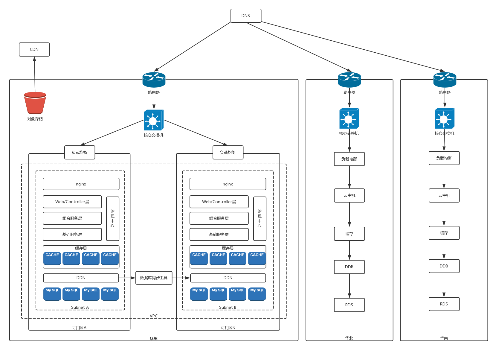

為了每個點都能''雨露均霑" ，也為了高可用性，往往需要有多個機房，形成多個**可用區(Available Zone)**。由於我們的應用是分佈在兩個可用區的，所以假如任何一個可用區掛了，都不會受影響。

我們來回想數據中心那一節，每個可用區裡有一片一片的機櫃，每個機櫃上有一排一排的服務器，每個機櫃都有一個接入交換機，有一個匯聚交換機將多個機櫃連在一起。

這些服務器裡面部署的都是計算節點，每台上面都有OpenvSwitch創建的虛擬交換機，將來在這台機器上創建的虛擬機，都會連到OpenvSwitch上。

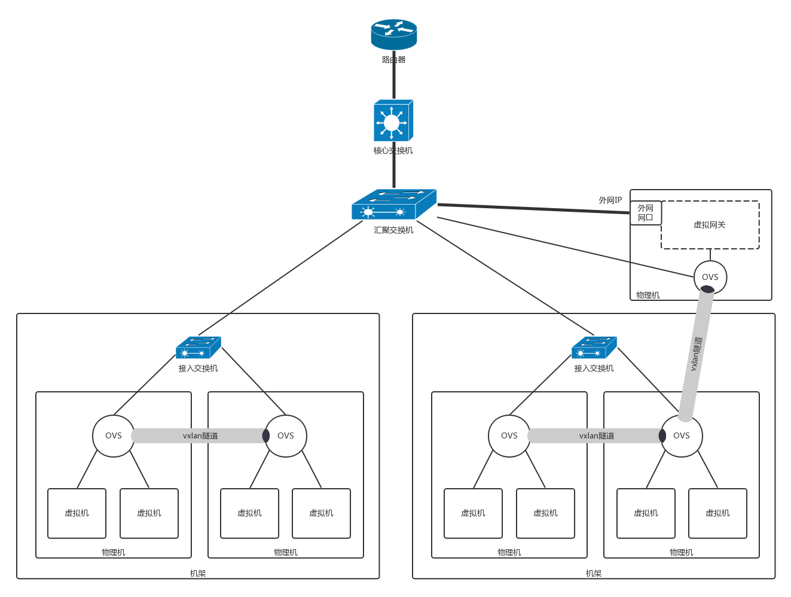

> 雲平台的界面上創建一個VPC

接下來，你在雲計算的界面上創建一個**VPC （Virtual Private Cloud，虛擬私有網絡）**，指定一個IP段，這樣以後你部署的所有應用都會在這個虛擬網絡裡，使用你分配的這個IP段。

- 為了不同的VPC相互隔離，每個VPC都會被分配一個VXLAN的ID。儘管不同用戶的虛擬機有可能在同一個物理機上，但是不同的VPC二層壓根兒是不通的。

由於有兩個可用區，在這個VPC裡面，要為每一個可用區分配一個**Subnet**，也就是在大的網段里分配兩個小的網段。當兩個可用區裡面網段不同的時候，就可以配置路由策略，訪問另外一個可用區，走某一條路由了。

> 雲平台PaaS服務, 數據庫持久化層

接下來，應該創建數據庫持久化層。大部分雲平台都會提供PaaS服務，也就是說，不需要你自己搭建數據庫，而是採用直接提供數據庫的服務，並且單機房的主備切換都是默認做好的，數據庫也是部署在虛擬機裡面的，只不過從界面上，你看不到數據庫所在的虛擬機而已。

雲平台會給每個Subnet的數據庫實例分配一個域名。創建數據庫實例的時候，需要你指定可用區和Subnet，這樣創建出來的數據庫實例可以通過這個Subnet的私網IP進行訪問。

為了分庫分錶實現高並發的讀寫，在創建的多個數據庫實例之上，會創建一個分佈式數據庫的實例，也需要指定可用區和Subnet，還會為分佈式數據庫分配一個私網IP和域名。

對於數據庫這種高可用性比較高的，需要進行跨機房高可用，因而兩個可用區都要部署一套，但是只有一個是主，另外一個是備，雲平台往往會提供數據庫同步工具，將應用寫入主的數據同步給備數據庫集群。

>雲平台PaaS服務, 緩存集群

接下來是創建緩存集群，雲平台也會提供PaaS服務，也需要每個可用區和Subnet創建一套，緩存的數據在內存中，由於讀寫性能要求高，一般不要求跨可用區讀寫。

>部署自己寫的程序

再往上層就是部署咱們自己寫的程序了。基礎服務層、組合服務層、Controller層，以及Nginx層、API網關等等，這些都是部署在虛擬機裡面的。它們之間通過RPC相互調用，需要到註冊中心進行註冊。

它們之間的網絡通信是虛擬機和虛擬機之間的。

- 如果是同一台物理機，則那台物理機上的OVS就能轉發過去；
- 如果是不同的物理機，這台物理機的OVS和另一台物理機的OVS中間有一個VXLAN的隧道，將請求轉發過去。

>雲平台提供的PaaS服務, 負載均衡

再往外就是負載均衡了，負載均衡也是雲平台提供的PaaS服務，也是屬於某個VPC的，部署在虛擬機裡面的，但是負載均衡有個外網的IP，這個外網的IP地址就是在網關節點的外網網口上的。

- 在網關節點上，會有NAT規則，將外網IP地址轉換為VPC裡面的私網IP地址，通過這些私網IP地址訪問到虛擬機上的負載均衡節點，然後通過負載均衡節點轉發到API網關的節點。

- 網關節點的外網網口是帶公網IP地址的，裡面有一個虛擬網關轉發模塊，還會有一個OVS，將私網IP地址放到VXLAN隧道裡面，轉發到虛擬機上，從而實現外網和虛擬機網絡之間的互通。

>雲平台一般會提VPC互連的方式，VPN網關

不同的可用區之間，通過核心交換機連在一起，核心交換機之外是邊界路由器。

在美國、歐洲、日本同樣也部署了一整套，每個地區都創建了VPC，這就需要有一種機制將VPC連接到一起。雲平台一般會提供硬件的VPC互連的方式，當然也可以使用軟件互連的方式，也就是使用VPN網關，通過IPsecVPN將不同地區的不同VPC通過VPN連接起來。

> 智能DNS

對於不同地區和不同運營商的用戶，我們希望他能夠就近訪問到網站，而且當一個點出了故障之後，我們希望能夠在不同的地區之間切換，這就需要有智能DNS，這個也是雲平台提供的。

對於一些靜態資源，可以保持在對象存儲裡面，通過CDN下發到邊緣節點，這樣客戶端就能盡快加載出來。

### |> 2.大聲告訴全世界，可以到我這裡買東西

當電商應用搭建完畢之後，接下來需要將如何訪問到這個電商網站廣播給全網。

剛才那張圖畫的是一個可用區的情況，對於多個可用區的情況，我們可以隱去計算節點的情況，將外網訪問區域放大。

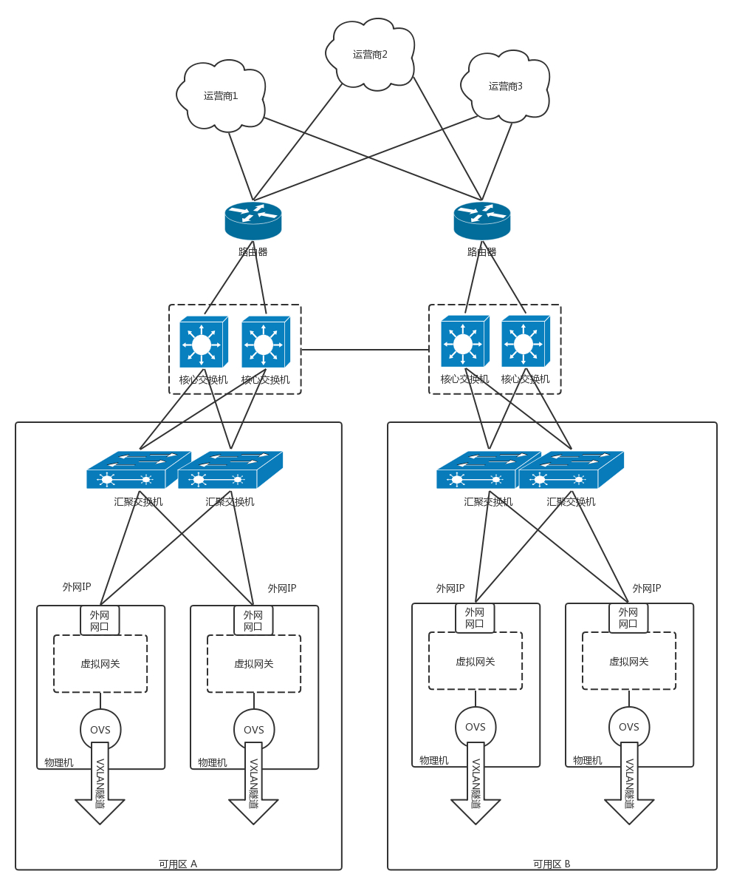

> BGP路由協議、邊界路由器

外網IP是放在虛擬網關的外網網口上的，這個IP如何讓全世界知道呢？當然是通過BGP路由協議了。

每個可用區都有自己的匯聚交換機，如果機器數目比較多，可以直接用核心交換機，每個Region也有自己的核心交換區域。

在核心交換外面是安全設備，然後就是邊界路由器。邊界路由器會和多個運營商連接，從而每個運營商都能夠訪問到這個網站。邊界路由器可以通過BGP協議，將自己數據中心裡面的外網IP向外廣播，也就是告訴全世界，如果要訪問這些外網IP，都來我這裡。

每個運營商也有很多的路由器、很多的點，於是就可以將如何到達這些IP地址的路由信息，廣播到全國乃至全世界。

### |> 3.打開手機來上網，域名解析得地址

這個時候，不但你的這個網站的IP地址全世界都知道了，你打的廣告可能大家也都看到了，於是有客戶下載APP來買東西了。

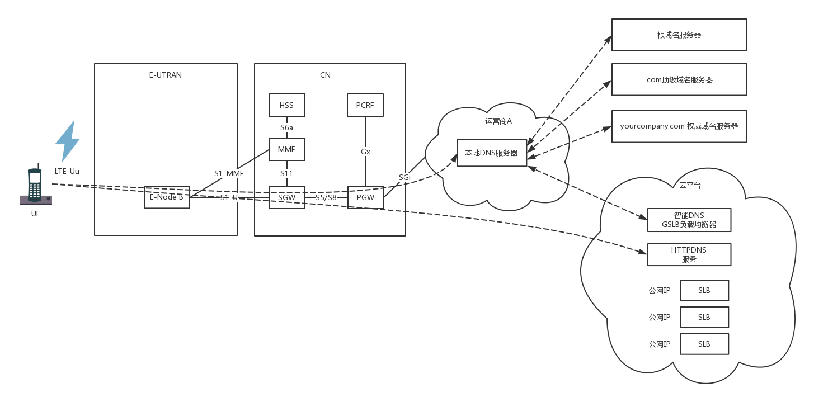

客戶的手機開機以後，在附近尋找基站eNodeB，發送請求，申請上網。基站將請求發給MME，MME對手機進行認證和鑑權，還會請求HSS看有沒有錢，看看是在哪裡上網。

當MME通過了手機的認證之後，開始建立隧道，建設的數據通路分兩段路，其實是兩個隧道。一段是從eNodeB到SGW，第二段是從SGW到PGW，在PGW之外，就是互聯網。

PGW會為手機分配一個IP地址，手機上網都是帶著這個IP地址的。

當在手機上面打個App的時候，首先要做的事情就是解析這個網站的域名。

在手機運宜商所在的互聯網區域裡，有一個本地的DNS，手機會向這個DNS請求解析DNS。

- 當這個DNS本地有緩存，則直接返回；
- 如果沒有緩存，本地DNS才需要遞歸地從根DNS服務器，查到.com的頂級域名服務器，最終查到權威DNS服務器。

如果你使用雲平台的時候，配置了智能DNS和全局負載均衡，在權威DNS服務中，一般是通過配置CNAME的方式，我們可以起一個別名，例如vip.yourcomany.com，然後告訴本地DNS服務器，讓它請求GSLB解析這個域名，GSLB就可以在解析這個域名的過程中，通過自己的策略實現負載均衡。

- GSLB通過查看請求它的本地DNS服務器所在的運營商和地址，就知道用戶所在的運營商和地址，然後將距離用戶位置比較近的Region裡面，三個負載均衡SLB的公網IP地址，返回給本地DNS服務器。本地DNS解析器將結果緩存後，返回給客戶端。

對於手機App來說，可以繞過剛才的傳統DNS解析機制，只要HTTPDNS服務通過，直接調用HTTPDNS服務器，得到這三個SLB的公網IP地址。

看，經過瞭如此復雜的過程，咱們的萬里長征還沒邁出第一步，剛剛得到IP地址，包還沒發呢？話說手機App拿到了公網IP地址，接下來應該做什麼呢？

## # 第38講| 知識串講：用雙十一的故事串起碎片的網絡協議（中）

上一節我們講到，手機APP經過了一個複雜的過程，終於拿到了電商網站的SLB的IP地址，是不是該下單了？

俗話說的好，買東西要貨比三家。大部分客戶在購物之前要看很多商品圖片，比來比去，最後好不容易才下決心，點了下單按鈕。下單按鈕一按，就要開始建立連接。建立連接這個過程也挺複雜的，最終還要經過層層封裝，才構建出一個完整的網絡包。今天我們就來看這個過程。

### |> 4.購物之前看圖片，靜態資源CDN

客戶想要在購物網站買一件東西的時候，一般是先去詳情頁看看圖片，是不是想買的那一款。

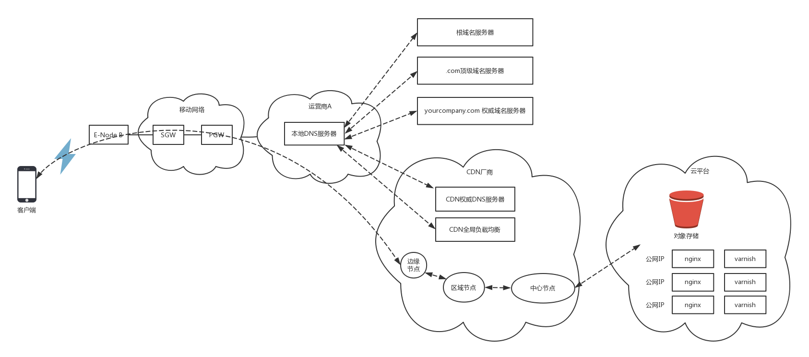

我們部署電商應用的時候，一般會把靜態資源保存在兩個地方，

- 一個是接入層nginx後面的varnish緩存裡面，一般是靜態頁面；
- 對於比較大的、不經常更新的靜態圖片，會保存在對象存儲裡面。

這兩個地方的靜態資源都會配置CDN，將資源下發到邊緣節點。

配置了CDN之後，權威DNS服務器上，會為靜態資源設置一個CNAME別名，指向另外一個域名cdn.com，返回給本地DNS服務器。

當本地DNS服務器拿到這個新的域名時，需要繼續解析這個新的域名。這個時候，再訪問的時候就不是原來的權威DNS服務器了，而是cdn.com的權威DNS服務器。這是CDN自己的權威DNS服務器。

在這個服務器上，還是會設置一個CNAME，指向另外一個域名，也即CDN網絡的全局負載均衡器。

本地DNS服務器去請求CDN的全局負載均衡器解析域名，全局負載均衡器會為用戶選擇一台合適的緩存服務器提供服務，將IP返回給客戶端，客戶端去訪問這個邊緣節點，下載資源。緩存服務器響應用戶請求，將用戶所需內容傳送到用戶終端。

如果這台緩存服務器上並沒有用戶想要的內容，那麼這台服務器就要向它的上一級緩存服務器請求內容，直至追溯到網站的源服務器，將內容拉到本地。

### |> 5.看上寶貝點下單，雙方開始建連接

當你瀏覽了很多圖片，發現實在喜歡某個商品，於是決定下單購買。

電商網站會對下單的情況提供RESTful的下單接口，而對於下單這種需要保密的操作，需要通過HTTPS協議進行請求。

在所有這些操作之前，首先要做的事情是建立連接。

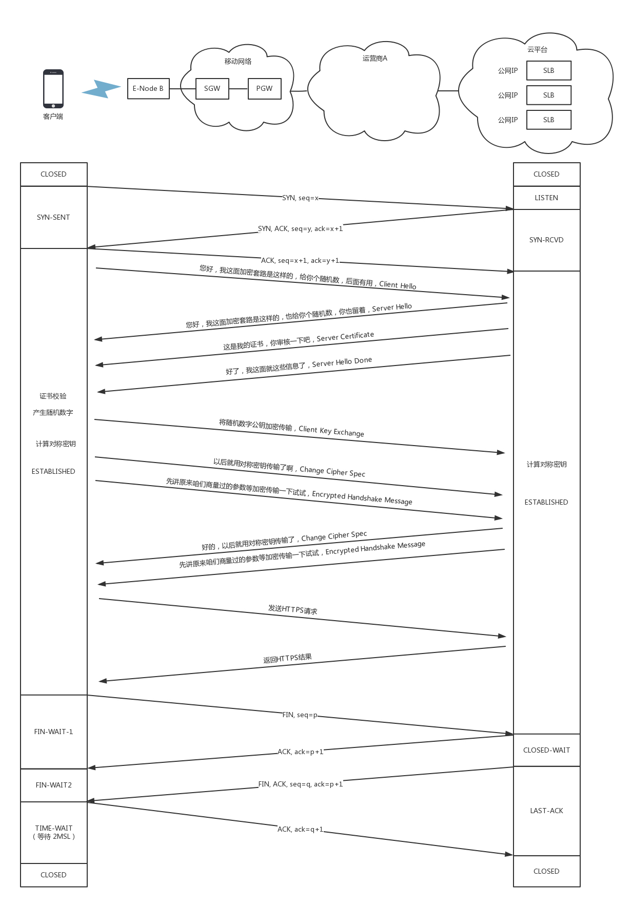

HTTPS協議是基於TCP協議的，因而要先建立TCP的連接。在這個例子中，TCP的連接是從手機上的App和負載均衡器SLB之間的。

儘管中間要經過很多的路由器和交換機，但是TCP 的連接是端到端的。TCP這一層和更上層的HTTPS 無法看到中間的包的過程。儘管建立連接的時候，所有的包都逃不過在這些路由器和交換機之間的轉發，轉發的細節我們放到那個下單請求的發送過程中詳細解讀，這裡只看端到端的行為。

對於TCP連接來講，需要通過三次握手建立連接，為了維護這個連接，雙方都需要在TCP層維護一個連接的狀態機。

- —開始，客戶端和服務端都處於CLOSED狀態。服務端先是主動監聽某個端口，處於LISTEN狀態。然後客戶端主動發起連接SYN，之後處於SYN-SENT狀態。服務端收到發起的連接，返回SYN，並且ACK客戶端的SYN，之後處於SYN-RCVD狀態。

- 客戶端收到服務端發送的SYN和ACK之後，發送ACK的ACK，之後處於ESTABLISHED狀態。這是因為，它一發一收成功了。服務端收到ACK的ACK之後，處於ESTABLISHED狀態，因為它的一發一收也成功了。

當TCP層的連接建立完畢之後，接下來輪到HTTPS層建立連接了，在HTTPS的交換過程中，TCP層始終處於ESTABLISHED。

- 對於HTTPS，客戶端會發送Client Hello消息到服務器，用明文傳輸TLS版本信息、加密套件候選列表、壓縮算法候選列表等信息。另外，還會有一個隨機數，在協商對稱密鑰的時候使用。

- 然後，服務器會返回Server Hello消息，告訴客戶端，服務器選擇使用的協議版本、加密套件、壓縮算法等。這也有一個隨機數，用於後續的密鑰協商。

- 然後，服務器會給你一個服務器端的證書，然後說：''Server Hello Done，我這裡就這些信息了。”

- 客戶端當然不相信這個證書，於是從自己信任的CA 倉庫中，拿CA 的證書裡面的公鑰去解密電商網站的證書。如果能夠成功，則說明電商網站是可信的。這個過程中，你可能會不斷往上追溯CA 、CA的CA 、CA的CA的CA ，反正直到一個授信的CA ，就可以了。

- 證書驗證完畢之後，覺得這個服務端是可信的，於是客戶端計算產生隨機數字Pre-master，發送Client Key Exchange，用證書中的公鑰加密，再發送給服務器，服務器可以通過私鑰解密出來。

- 接下來，無論是客戶端還是服務器，都有了三個隨機數，分別是：自己的、對端的，以及剛生成的Pre-Master隨機數。通過這三個隨機數，可以在客戶端和服務器產生相同的對稱密鑰。

- 有了對稱密鑰，客戶端就可以說：''Change Cipher Spec，咱們以後都採用協商的通信密鑰和加密算法進行加密通信了。”

- 然後客戶端發送一個Encrypted Handshake Message，將已經商定好的參數等，採用協商密鑰進行加密，發送給服務器用於數據與握手驗證。

- 同樣，服務器也可以發送Change Cipher Spec，說： ''沒問題，咱們以後都採用協商的通信密鑰和加密算法進行加密通信了” ，並且也發送Encrypted Handshake Message的消息試試。

當雙方握手結束之後，就可以通過對稱密鑰進行加密傳輸了。

真正的下單請求封裝成網絡包的發送過程，我們先放一放，我們來接著講這個網絡包的故事。

### |> 6.發送下單請求網絡包，西行需要出網關

當客戶端和服務端之間建立了連接後，接下來就要發送下單請求的網絡包了。

在用戶層發送的是HTTP的網絡包，因為服務端提供的是RESTful API，因而HTTP層發送的就是一個請求。

```javascript
POST /purchaseOrder HTTP/1.1
Hos: www.geektime.com
Content-Type: application/json; charset=utf-8
Content-Length: nnn
{
"order": {
"date": "2018-07-01",
"className": "趣談網絡協議", 
"Author": "劉超",
"price": "68"
}
}
```

HTTP的報文大概分為三大部分。第一部分是請求行，第二部分是請求的首部，第三部分才是請求的正文實體。

> 請求行

在請求行中，URL就是`www.qeektime.com/purchaseOrder`，版本為HTTP 1.1。

請求的類型叫作POST，它需要主動告訴服務端一些信息，而非獲取。需要告訴服務端什麼呢？一般會放在正文裡面。正文可以有各種各樣的格式，常見的格式是JSON。

> 請求的首部

請求行下面就是我們的首部字段。首部是key value，通過冒號分隔。

Content-Type是指正文的格式。例如，我們進行POST的請求，如果正文是JSON，那麼我們就應該將這個值設置為JSON。

> 請求的正文實體

接下來是正文，這裡是一個JSON字符串，裡面通過文本的形式描述了，要買一個課程，作者是誰，多少錢。

>交給下一層傳輸層

這樣，HTTP請求的報文格式就拼湊好了。接下來瀏覽器或者移動App會把它交給下一層傳輸層。

怎麼交給傳輸層呢？也是用Socket進行程序設計。如果用的是瀏覽器，這些程序不需要你自己寫，有人已經幫你寫好了；如果在移動APP裡面，一般會用一個HTTP的客戶端工具來發送，並且幫你封裝好。

> 傳輸層封裝

HTTP協議是基於TCP協議的，所以它使用面向連接的方式發送請求，通過Stream二進制流的方式傳給對方。當然，到了TCP層，它會把二進制流變成一個的報文段發送給服務器。

在TCP頭里面，會有源端口號和目標端口號，

- 目標端口號一般是服務端監聽的端口號，
- 源端口號在手機端，往往是隨機分配一個端口號。
- 這個端口號在客戶端和服務端用於區分請求和返回，發給那個應用。

在IP頭里面，都需要加上自己的地址（即源地址）和它想要去的地方（即目標地址）。

- 當一個手機上線的時候，PGW會給這個手機分配一個IP地址，這就是源地址，
- 而目標地址則是雲平台的負載均衡器的外網IP地址。

在IP層，客戶端需要查看目標地址和自己是否是在同一個局域網，計算是否是同一個網段，往往需要通過CIDR子網掩碼來計算。

對於這個下單場景，目標IP和源IP不會在同一個網段，因而需要發送到默認的網關。一般通過DHCP分配IP地址的時候，同時配置默認網關的IP地址。

但是客戶端不會直接使用默認網關的IP地址，而是發送ARP協議，來獲取網關的MAC地址，然後將網關MAC作為目標MAC，自己的MAC作為源MAC，放入MAC頭，發送出去。

—個完整的網絡包的格式是這樣的。

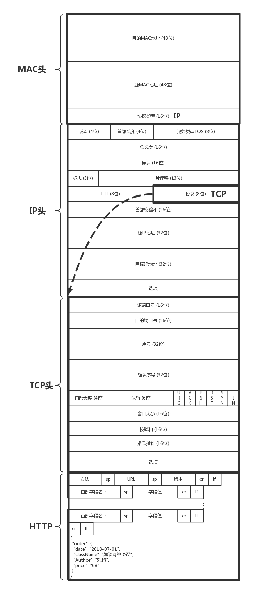

真不容易啊，本來以為上篇就發送下單包了，結果到中篇這個包還沒發送出去，只是封裝了一個如此長的網絡包。

## # 第39講| 知識串講：用雙十一的故事串起碎片的網絡協議（下）

上一節，我們封裝了一個長長的網絡包，開始發送。

發送的時候可以說是重重關隘，從手機到移動網絡、互聯網，還要經過多個運莒商才能到達數據中心，到了數據中心就進入第二個複雜的過程，從網關到VXLAN隧道，到負載均衡，到Controller層、組合服務層、基礎服務層，最終才下單入庫。今天，我們就來看這最後一段過程。

### |> 7. 一座座城池一道道關，流控擁塞與重傳

網絡包已經組合完畢，接下來我們來看，如何經過一道道城關，到達目標公網IP。

對於手機來講，默認的網關在 PGW 上。在移動網絡裡面，從手機到 SGW，到 PGW 是有一條隧道的。在這條隧道裡面，會將上面的這個包作為隧道的乘客協議放在裡面，外面 SGW 和 PGW 在核心網機房的 IP 地址。網絡包直到 PGW（PGW 是隧道的另一端）才將裡面的包解出來，轉發到外部網絡。

所以，從手機發送出來的時候，網絡包的結構為：

- 源MAC：手機也即UE的MAC;
- 目標MAC：網關PGW上面的隧道端點的MAC;
- 源IP：UE的IP地址；
- 目標IP：SLB的公網IP地址。

進入隧道之後，要封裝外層的網絡地址，因而網絡包的格式為：

- 外層源MAC：E-NodeB的MAC;
- 外層目標MAC：SGW的MAC;
- 外層源IP：E-NodeB的IP;
- 外層目標IP：SGW的IP;
- 內層源MAC：手機也即UE的MAC;
- 內層目標MAC：網關PGW上面的隧道端點的MAC;
- 內層源IP：UE的IP地址；
- 內層目標IP：SLB的公網IP地址。

當隧道在SGW的時候，切換了一個隧道，會從SGW到PGW的隧道，因而網絡包的格式為：

- 外層源MAC：SGW的MAC;
- 外層目標MAC：PGW的MAC;
- 外層源IP：SGW的IP;
- 外層目標IP：PGW的IP;
- 內層源MAC：手機也即UE的MAC;
- 內層目標MAC：網關PGW上面的隧道端點的MAC;
- 內層源IP：UE的IP地址；
- 內層目標IP：SLB的公網IP地址。

在PGW的隧道端點將包解出來，轉發出去的時候，一般在PGW出外部網絡的路由器上，會部署NAT服務，將手機的IP地址轉換為公網IP地址，當請求返回的時候，再NAT回來。

因而在PGW之後，相當於做了一次歐洲十國遊型（轉發網關 ---> IP地址在局域網之間不會衝突）的轉發，網絡包的格式為：

- 源MAC：PGW出口的MAC;
- 目標MAC：NAT網關的MAC;
- 源IP：UE的IP地址；
- 目標IP：SLB的公網IP地址。

在NAT網關，相當於做了一次玄奘西遊型（NAT網關 ---> IP段衝突了）的轉發，網絡包的格式變成：

- 源MAC：NAT網關的MAC;

- 目標MAC：A2路由器的MAC;

- 源IP：UE的公網IP地址;

- 目標IP：SLB的公網IP地址。

  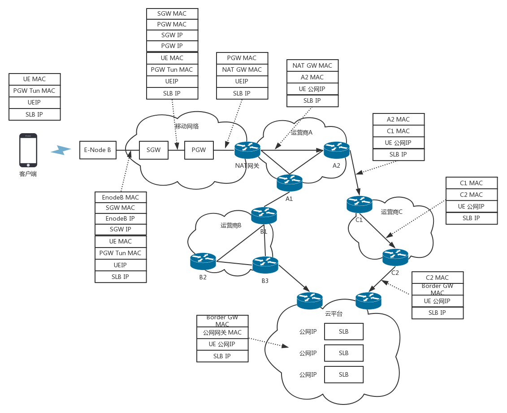

- 出了NAT網關，就從核心網到達了互聯網。在網絡世界，每一個運營商的網絡成為自治系統AS。每個自治系統都有邊界路由器，通過它和外面的世界建立聯繫。

對於雲平台來講，它可以被稱為**Multihomed AS**，有多個連接連到其他的AS，但是大多拒絕幫其他的AS傳輸包。例如一些大公司的網絡。

對於運營商來說，它可以被稱為**Transit AS**，有多個連接連到其他的AS，並且可以幫助其他的AS傳輸包，比如主幹網。

如何從出口的運營商到達雲平台的邊界路由器？在路由器之間需要通過BGP協議實現，BGP又分為兩類，eBGP和iBGP。

- EBGP連接了互聯網上一個個相對獨立的AS（Autonomous system）。自治系統之間、邊界路由器之間使用eBGP廣播路由。內部網絡也需要訪問其他的自治系統。

- IBGP應用在AS內部，作為IGP的一種。一般的IGP，例如OSPF，EIGRP，用來在鄰接路由器之間傳遞路由。

  邊界路由器如何將BGP學習到的路由導入到內部網絡呢？通過運行iBGP，使內部的路由器能夠找到到達外網目的地最好的邊界路由器。

> 外部網絡

SLB概念 負載均衡（Server Load Balancer）是將訪問流量根據轉發策略分發到後端多台雲服務器（Elastic Compute Service，簡稱 ECS）的流量分發控制服務。

網站的SLB的公網IP地址早已經通過雲平台的邊界路由器，讓全網都知道了。於是這個下單的網絡包選擇的下一跳是A2，也即將A2的MAC地址放在目標MAC地址中。

到達A2之後，從路由表中找到下一跳是路由器C1，於是將目標MAC換成C1的MAC地址。到達C1之後，找到下一跳是C2，將目標MAC地址設置為C2的MAC。到達C2後，找到下一跳是雲平台的邊界路由器，於是將目標MAC設置為邊界路由器的MAC地址。

你會發現，這一路，都是只換MAC，不換目標IP地址。這就是所謂下一跳的概念。

在雲平台的邊界路由器，會將下單的包轉發進來，經過核心交換，匯聚交換，到達外網網關節點上的SLB的公網IP地址。

我們可以看到，手機到SLB的公網IP，是一個端到端的連接，連接的過程發送了很多包。所有這些包，無論是TCP三次握手，還是HTTPS的密鑰交換，都是要走如此復雜的過程到達SLB的，當然每個包走的路徑不一定一致。

網絡包走在這個複雜的道路上，很可能一不小心就丟了，怎麼辦？這就需要藉助TCP的機制重新發送。

既然TCP要對包進行重傳，就需要維護Sequence Number，看哪些包到了，哪些沒到，哪些需要重傳，傳輸的速度應該控製到多少，這就是TCP的滑動窗口協議。

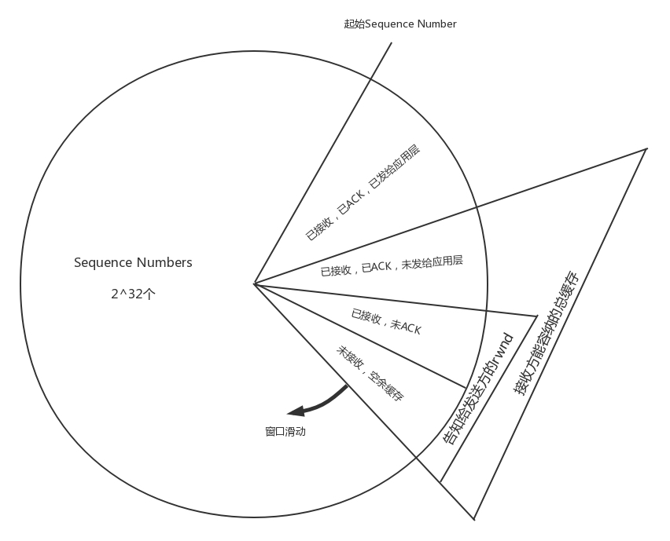

整個TCP的發送，一開始會協商一個Sequence Number，從這個Sequence Number開始，每個包都有編號。滑動窗口將接收方的網絡包分成四個部分：

- 已經接收，已經ACK，已經交給應用層的包；
- 已經接收，已經ACK，未發送給應用層；
- 已經接收，尚未發送ACK;
- 未接收，尚有空閒的緩存區域。

對於TCP層來講，每一個包都有ACK。ACK需要從SLB回復到手機端，將上面的那個過程反向來一遍，當然路徑不一定一致，可見ACK也不是那麼輕鬆的事情。

如果發送方超過一定的時間沒有收到ACK，就會重新發送。只有TCP層ACK過的包，才會發給應用層，並且只會發送一份，對於下單的場景，應用層是HTTP層。

- 你可能會問了，TCP老是重複發送，會不會導致一個單下了兩遍？是否要求服務端實現冪等？從TCP的機制來看，是不會的。只有收不到ACK 的包才會重複發，發到接收端，在窗口裡面只保存一份，所以在同一個TCP 連接中，不用擔心重傳導致二次下單。

- 但是TCP連接會因為某種原因斷了，例如手機信號不好，這個時候手機把所有的動作重新做一遍，建立一個新的TCP連接，在HTTP層調用兩次RESTful API。這個時候可能會導致兩遍下單的情況，因`而RESTful API需要實現冪等`。

當ACK過的包發給應用層之後，TCP層的緩存就空了出來，

- 這會導致上面圖中的大三角，也即接收方能夠容納的總緩存，整體順時針滑動。
- 小的三角形，也即接收方告知發送方的窗口總大小，也即還沒有完全確認收到的緩存大小，如果把這些填滿了，就不能再發了，因為沒確認收到，所以一個都不能扔。

### |> 8. 從數據中心迸網關，公網NAT成私網

包從手機端經歷千難萬險，終於到了SLB的公網IP所在的公網網口。由於匹配上了MAC地址和IP地址，因而將網絡包收了迸來。

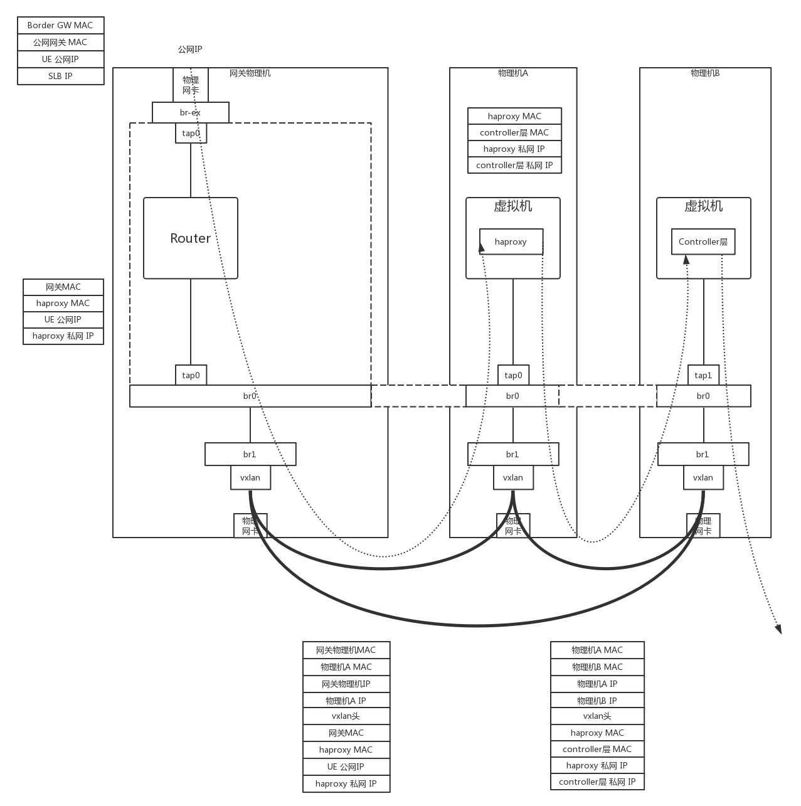

在虛擬網關節點的外網網口上，會有一個NAT規則，將公網IP地址轉換為VPC裡面的私網IP地址，這個私網IP地址就是SLB的HAProxy所在的虛擬機的私網IP地址。

當然為了承載比較大的吞吐量，虛擬網關節點會有多個，物理網絡會將流量分發到不同的虛擬網關節點。同樣HAProxy也會是一個大的集群，虛擬網關會選擇某個負載均衡節點，將某個請求分發給它，負載均衡之後是Controller層，也是部署在虛擬機裡面的。

當網絡包裡面的目標IP變成私有IP地址之後，虛擬路由會查找路由規則，將網絡包從下方的私網網口發出來。這個時候包的格式為：

- 源MAC：網關MAC;
- 目標MAC：HAProxy虛擬機的MAC;
- 源IP：UE的公網IP;
- 目標IP：HAProxy虛擬機的私網IP。

### |> 9. 進入隧道打標籤，RPC遠程調用下單

在虛擬路由節點上，也會有OVS，將網絡包封裝在VXLAN隧道裡面，VXLAN ID就是給你的租戶創建VPC的時候分配的。包的格式為：

- 外層源MAC：網關物理機MAC;
- 外層目標MAC：物理機A的MAC;
- 外層源IP：網關物理機IP；
- 外層目標IP：物理機A的IP;
- 內層源MAC：網關MAC;
- 內層目標MAC：HAProxy虛擬機的MAC;
- 內層源IP：UE的公網IP;
- 內層目標IP：HAProxy虛擬機的私網IP。

在物理機A上，OVS會將包從VXLAN隧道裡面解出來，發給HAProxy所在的虛擬機。HAProxy所在的虛擬機發現MAC地址匹配，目標IP地址匹配，就根據TCP端口，將包發給HAProxy迸程，因為HAProxy是在監聽這個TCP端口的。因而HAProxy就是這個TCP連接的服務端，客戶端是手機。對於TCP的連接狀態、滑動窗口等，都是在HAProxy上維護的。

在這裡HAProxy是一個四層負載均衡，也即它只解析到TCP層，裡面的HTTP協議它不關心，就將請求轉發給後端的多個Controller 層的一個。

HAProxy發出去的網絡包就認為HAProxy是客戶端了，看不到手機端了。網絡包格式如下：

- 源MAC：HAProxy所在虛擬機的MAC;
- 目標MAC：Controller層所在虛擬機的MAC;
- 源IP：HAProxy所在虛擬機的私網IP;
- 目標IP：Controller層所在虛擬機的私網IP。

當然這個包發出去之後，還是會被物理機上的OVS 放入VXLAN 隧道裡面，網絡包格式為：

- 外層源MAC：物理機A的MAC;
- 外層目標MAC：物理機B的MAC;
- 外層源IP：物理機A的IP;
- 外層目標IP：物理機B的IP;
- 內層源MAC：HAProxy所在虛擬機的MAC;
- 內層目標MAC：Controller層所在虛擬機的MAC;
- 內層源IP：HAProxy所在虛擬機的私網IP;
- 內層目標IP：Controller層所在虛擬機的私網IP。

在物理機B上，OVS會將包從VXLAN隧道裡面解出來，發給Controller層所在的虛擬機。Controller層所在的虛擬機發現MAC地址匹配，目標IP地址匹配，就根據TCP端口，將包發給Controller層的進程，因為它在監聽這個TCP端口。

在HAProxy和Controller層之間，維護一個TCP的連接。

Controller層收到包之後，它是關心HTTP裡面是什麼的，於是解開HTTP的包，發現是一個POST請求，內容是下單購買一個課程。

### |> 10.下單扣減庫存優惠券，數據入庫返回成功

下單是一個複雜的過程，因而往往在組合服務層會有一個專門管理下單的服務，Controller層會通過RPC調用這個組合服務層。

假設我們使用的是Dubbo，則Controller層需要讀取註冊中心，將下單服務的進程列表拿出來，選出一個來調用。

Dubbo中默認的RPC協議是Hessian2。Hessian2將下單的遠程調用序列化為二進制迸行傳輸。

Netty是一個非阻塞的基於事件的網絡傳輸框架。Controller層和下單服務之間，使用了Netty的網絡傳輸框架。有了Netty，就不用自己編寫複雜的異步Socket程序了。Netty使用的方式，就是咱們講[Socket編程](https://blog.csdn.net/aha_jasper/article/details/105549435)的時候，一個項目組支撐多個項目（IO多路復用，從派人盯著到有事通知）這種方式。

Netty還是工作在Socket這一層的，發送的網絡包還是基於TCP的。在TCP的下層，還是需要封裝上IP頭和MAC頭。如果跨物理機通信，還是需要封裝在外層的VXLAN隧道裡面。當然底層的這些封裝，Netty都不感知，它只要做好它的異步通信即可。

在Netty的服務端，也即下單服務中，收到請求後，先用Hessian2的格式進行解壓縮。然後將請求分發到線程中進行處理，在線程中，會調用下單的業務邏輯。

下單的業務邏輯比較複雜，往往要調用基礎服務層裡面的庫存服務、優惠券服務等，將多個服務調用完畢，才算下單成功。下單服務調用庫存服務和優惠券服務，也是通過Dubbo的框架，通過註冊中心拿到庫存服務和優惠券服務的列表，然後選一個調用。

調用的時候，統一使用Hessian2進行序列化，使用Netty進行傳輸，底層如果跨物理機，仍然需要通過VXLAN的封裝和解封裝。

咱們以庫存為例子的時候，講述過冪等的接口實現的問題。因為如果扣減庫存，僅僅是誰調用誰減一。這樣存在的問題是，如果扣減庫存因為一次調用失敗，而多次調用，這裡指的不是TCP 多次重試，而是應用層調用的多次重試，就會存在庫存扣減多次的情況。

這裡常用的方法是，使用樂觀鎖（Compare and Set，簡稱CAS）。CAS要考慮三個方面，當前的庫存數、預期原來的庫存數和版本，以及新的庫存數。在操作之前，查詢出原來的庫存數和版本，真正扣減庫存的時候，判斷如果當前庫存的值與預期原值和版本相匹配，則將庫存值更新為新值，否則不做任何操作。

這是一種基於狀態而非基於動作的設計，符合RESTful的架構設計原則。這樣的設計有利於高並發場景。當多個線程嘗試使用CAS同時更新同一個變量時，只有其中一個線程能更新變量的值，而其它線程都失敗，失敗的線程並不會被掛起，而是被告知這次竟爭中失敗，並可以再次嘗試。

最終，當下單更新到分佈式數據庫中之後，整個下單過程才算真正告一段落。

好了，經過了十個過程，下單終於成功了，你是否對這個過程瞭如指掌了呢？如果發現對哪些細節比較模糊，可以回去看一下相應的章節，相信會有更加深入的理解。

到此，我帶著你用下單過程把網絡協議的知識都複習了一遍。授人以魚不如授人以漁。下一節，我將會帶你來搭建一個網絡實驗環境，配合實驗來說明理論。

## # 第40講| 搭建一個網絡實驗環境：授人以魚不如授人以漁

因為這門課是基礎課程，而且配合音頻的形式發布，所以我多以理論為主來進行講解。在專欄更新的過程中，不斷有同學讓我建議一些網絡方面的書籍，還有同學說能不能配合一些實驗來說明理論。

的確，網絡是一門實驗性很強的學科，就像我在開篇詞裡面說的一樣：一看覺得懂，一問就打鼓，一用就糊塗。在寫專欄的過程中，我自己也深深體會到了。這個時候，我常常會享一個現實的環境，上手操作一下，抓個包看看，這樣心裡就會有定論。

### |> 《TCP/IP詳解》實驗環境搭建

對於網絡方面的書籍，我當然建議Rechard Stevens的《[TCP/IP illustrated](https://book.douban.com/subject/1741925/)》（《TCP/IP詳解》）。這本書把理論講得深入淺出，還配有大量的上手實踐和抓包，看到這些抓包，原來不理解的很多理論，一下子就能懂了。

這本書裡有個拓撲圖，書上的很多實驗都是基於這個圖的，但是這個拓撲圖還是挺複雜的。我這裡先不說，一會兒詳細講。

Rechard Stevens，因為工作中有這麼一個環境，很方便做實驗，最終才寫出了這樣一本書，而我們一般人學習網絡，沒有這個環境應該怎麼辦呢？

時代不同了，咱們現在有更加強大的工具了。例如，這裡這麼多的機器，我們可以用Docker來實現，多個網絡可以用OpenvSwitch來實現。你甚至不需要一台物理機，只要一台1核2G的虛擬機，就能將這個環境搭建起來。

搭建這個環境的時候，需要一些腳本。我把腳本都放在了[Github](https://github.com/popsuper1982/tcpipillustrated)裡面，你可以自己取用。

#### 1. 創建一個Ubuntu虛擬機

在你的筆記本電腦上，用Virtual Box創建就行。1核2G，隨便一台電腦都能搭建起來。

首先，我們先下載一個Ubuntu的鏡像。我是從[Ubuntu官方網站](https://ubuntu.com/download/alternative-downloads)下載的。

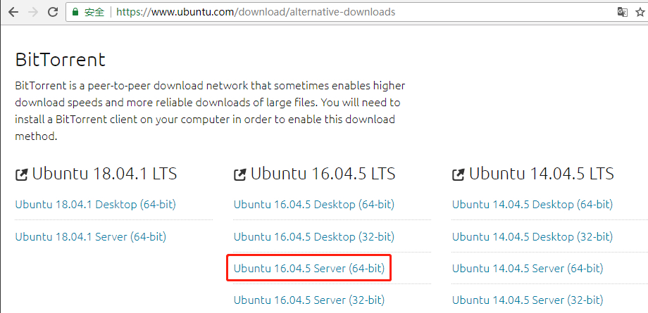

這裡需要說明的是網絡的配置。

對於這個虛擬機，我們創建兩個網卡，一個是Host-only，只有你的筆記本電腦上能夠登錄進去。這個網卡上的IP地址也只有在你的筆記本電腦上管用。這個網卡的配置比較穩定，用於在SSH上做操作。這樣你的筆記本電腦就可以搬來搬去，在公司里安裝一半，回家接著安裝另一半都沒問題。

[MAC環境搭建篇之VirtualBox中CentOS網絡配置](https://kknews.cc/zh-tw/code/yga6bbb.html)

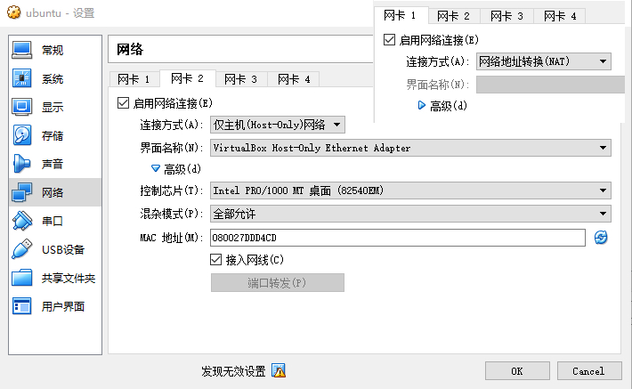

這裡有一個虛擬的網橋，這個網絡可以在管理>主機網絡管理裡面進行配置。

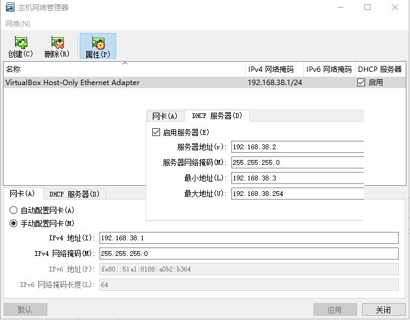

在這裡可以虛擬網橋的的IP地址，同時啟用一個DHCP服務器，為新創建的虛擬機配置IP地址。

另一個網卡配置為NAT網絡，用於訪問互聯網。配置了NAT網絡之後，只要你的筆記本電腦能上網，虛擬機就能上網。由於咱們在Ubuntu裡面要安裝一些東西，因而需要聯網。

你可能會問了，這個配置複雜嗎？一點兒都不復雜。咱們講[虛擬機網絡](https://blog.csdn.net/aha_jasper/article/details/105575603)的時候，講過這個。

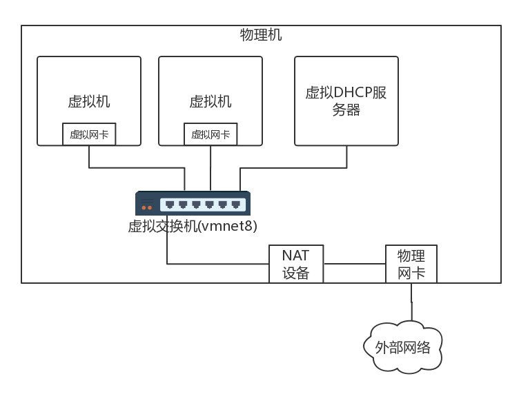

安裝完了Ubuntu之後，需要對Ubuntu裡面的網卡進行配置。對於Ubuntu來講，網卡的配置在/etc/network/interfaces這個文件裡面。在我的環境裡， NAT的網卡名稱為enp0s3 ， Host-only的網卡的名稱為enp0s8 ，都可以配置為自動配置。

```
auto lo
iface lo inet loopback

auto enp0s3
iface enp0s3 inet dhcp

auto enp0s8
iface enp0s8 inet dhcp
```

這樣，重啟之後，IP就配置好了。

#### 2. 安裝Docker 和OpenvSwitch

接下來，在Ubuntu裡面，以root用戶，安裝Docker和OpenvSwitch。

你可以按照Docker的[官方安裝文檔](https://docs.docker.com/engine/install/ubuntu/)來做。我這裡也貼一下我的安裝過程。

```
apt-get remove docker docker-engine docker.io
apt-get -y update
apt-get -y insall apt-transport-https ca-certifcates curl software-properties-common
curl -fsSL https://download.docker.com/linux/ubuntu/gpg > gpg
apt-key add gpg
apt-key fngerprint 0EBFCD88
add-apt-repository "deb [arch=amd64] https://download.docker.com/linux/ubuntu $(lsb_release -cs) sable"
apt-get -y update
apt-cache madison docker-ce
apt-get -y insall docker-ce=18.06.0~ce~3-0~ubuntu
```

之後，還需要安裝OpenvSwitch 和Bridge 。

```
apt-get -y insall openvswitch-common openvswitch-dbg openvswitch-switch python-openvswitch openvswitch-ipsec openvswitch-pki openvswitch-vtep

apt-get -y insall bridge-utils

apt-get -y insall arping
```

#### 3. 準備一個Docker的鏡像

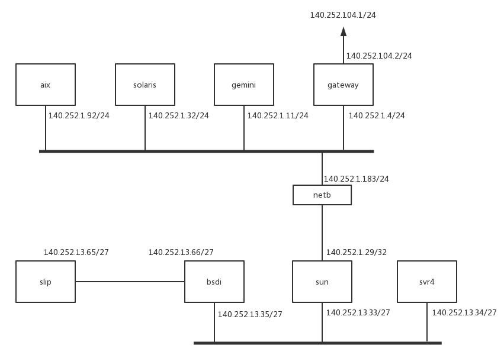

每個節點都是一個Docker ，對應要有一個Docker 鏡像。這個鏡像我已經打好了，你可以直接使用。

```
docker pull hub.c.163.com/liuchao110119163/ubuntu:tcpip
```

當然你也可以自己打這個鏡像。Dockerfle 就像這樣：

```
FROM hub.c.163.com/public/ubuntu:14.04
RUN apt-get -y update && apt-get insall -y iproute2 iputils-arping net-tools tcpdump curl telnet iputils-tracepath traceroute
RUN mv /usr/sbin/tcpdump /usr/bin/tcpdump
ENTRYPOINT /usr/sbin/sshd -D
```

#### 4.啟動整個環境

啟動這個環境還是比較複雜的，我寫成了一個腳本。在Git倉庫裡面，有一個文件[setupenv.sh](https://github.com/popsuper1982/tcpipillustrated/blob//mastersetupenv.sh)，可以執行這個腳本，裡面有兩個參數，一個參數是NAT網卡的名字，一個是鏡像的名稱。

```
git clone https://github.com/popsuper1982/tcpipillusrated.git
cd tcpipillusrated
docker pull hub.c.163.com/liuchao110119163/ubuntu:tcpip
chmod +x setupenv.sh
./setupenv.sh enp0s3 hub.c.163.com/liuchao110119163/ubuntu:tcpip
```

這樣，整個環境就搭建起來了，所有的容器之間都可以ping通，而且都可以上網。

不過，我寫的這個腳本對一些人來說可能會有點兒複雜，我這裡也解釋一下。

首先每一個節點，都啟動一個容器。使用–privileged=true方式，網絡先不配置–net none。有兩個二層網絡，使用ovs-vsctl的add-br命令，創建兩個網橋。

pipework 是一個很好的命令行工具，可以將容器連接到兩個二層網絡上。

但是我們上面那個圖裡有兩個比較特殊的網絡，一個是從slip 到bsdi 的P2P 網絡，需要創建一個peer 的兩個網卡，然後兩個Docker 的網絡namespace 裡面各塞進去一個。

有關操作Docker的網絡namespace的方式，咱們在[容器網絡](https://blog.csdn.net/aha_jasper/article/details/105575812)那一節講過ip netns命令。

這裡需要注意的是， P2P網絡和下面的二層網絡不是同一個網絡。P2P網絡的CIDR是140.252.13.64/27 ，而下面的二層網絡的CIDR是140.252.13.32/27 。如果按照/24 ，看起來是一個網絡，但是/27就不是了。至於[CIDR的計算方法](https://blog.csdn.net/aha_jasper/article/details/105525992)，你可以回去複習一下。

另外需要配置從sun到netb的點對點網絡，方法還是通過peer網卡和ip netns的方式。

這裡有個特殊的地方，對於netb 來講，不是一個普通的路由器，因為netb 兩邊是同一個二層網絡，所以需要配置arp proxy 。

為了所有的節點之間互通，要配置一下路由策略，這裡需要通過ip route 命令。

- 對於slip來講，bsdi左面13.66這個網口是網關。
- 對於bsdi和svr4來講，如果去外網，sun下面的網口13.33是網關。
- 對於sun來講，上面的網口1.29屬於上面的二層網絡了，它如果去外網，gateway下面的網口1.4就是外網網關。
- 對於aix，solaris，gemini來講，如果去外網，網關也是gateway下面的網口1.4。如果去下面的二層網口，網關是sun上面的網口1.29。

配置完了這些，圖中的所有的節點都能相互訪問了，最後還要解決如何訪問外網的問題。

我們還是需要創建一個peer 網卡對。一個放在gateway 裡面，一個放在gateway 外面。外面的網卡去外網的網關。

在虛擬機上面，還需要配置一個iptables 的地址偽裝規則MASQUERADE ，其實就是一個SNAT 。因為容器裡面要訪問外網，因為外網是不認的，所以源地址不能用容器的地址，需要SNAT 成為虛擬機的地址出去，回來的時候再NAT 回來。

配置這個環境還是挺複雜的，要用到咱們學到的很多知識。如果沒有學習前面那些知識，直接就做這個實驗，你肯定會很暈。但是只學理論也不行，要把理論都學過一遍，再做一遍實驗，這才是一個不斷迭代、更新知識庫的過程。

有了這個環境，《 TCP/IP 詳解》裡面的所有實驗都能做了，而且我打的這個Docker 鏡像裡面， tcpdump 等網絡工具都安裝了，你可以“ 為所欲為” 了。

### |> OpenvSwitch 的實驗

做了TCP/IP 詳解的實驗之後，網絡程序設計這部分，你就有了堅實的基礎。但是涉及到數據中心內部的一些網絡技術，什麼VLAN 、 VXLAN 、 STP 等偏運維方向的，學習還是會比較困難。好在我們有OpenvSwitch ，也可以做大量的實驗。

OpenvSwitch門檻比較高，裡面的概念也非常多，可謂千頭萬緒。不過，通過我這麼多年研究的經驗，可以告訴你，這裡面有一個很好的線索，那就是OpenvSwitch會將自己對於網絡的配置保存在一個本地庫裡面。這個庫的表結構之間的關係就像這樣：

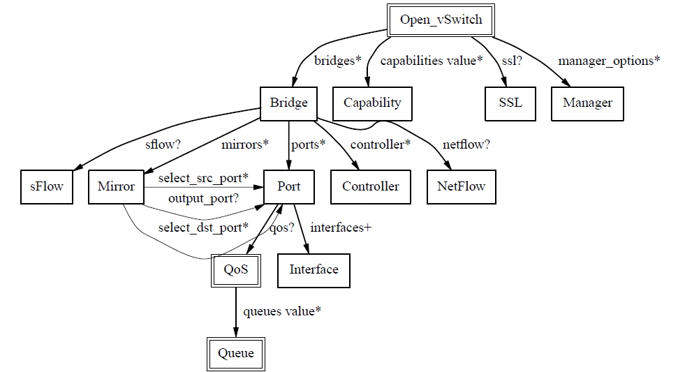

這個庫其實是一個JSON ，如果把這個JSON打印出來，能夠看到更加詳細的特性。按照這些特性一一實驗，可以逐漸把Open vSwitch各個特性都掌握。

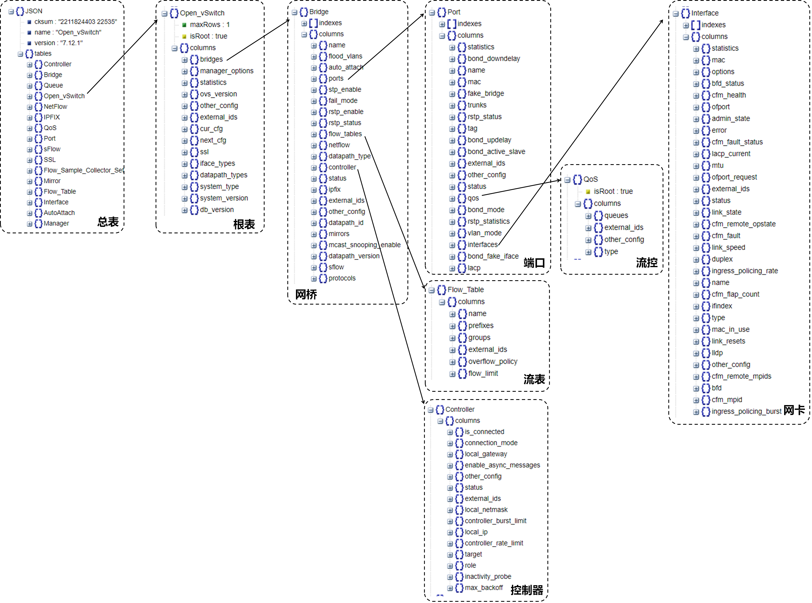


這裡面最重要的概念就是網橋。一個網橋會有流表控製網絡包的處理過程，會有控制器下發流表，一個網橋上會有多個端口，可以對端口進行流控，一個端口可以設置VLAN，一個端口可以包含多個網卡，可以做綁定，網卡可以設置成為GRE和VXLAN 。

我寫過一個OpenvSwitch 的實驗教程，也放在了Github 裡面。這裡面有這麼幾個比較重要的實驗，你可以看一看。

- 實驗一：查看OpenvSwitch的架構。我們在講Open vSwitch的時候，提過OpenvSwitch的架構，在這個實驗中，我們可以查看Open vSwitch的各個模塊以及啟動的參數。
- 實驗五：配置使用OpenFlow Controller，體驗一把作為小區物業在監控室裡面管控整個小區道路的樣子。
- 實驗八：測試Port的VLAN功能。看一下VLAN隔離究竟是什麼樣的。
- 實驗十：QoS功能。體驗一把如果使用HTB進行網卡限流。
- 實驗十一：GRE和VXLAN隧道功能，看虛擬網絡如何進行租戶隔離。
- 實驗十五：對Flow Table的操作，體驗流表對網絡包隨心所欲的處理。

好了，關於整個環境的搭建我就講到這裡了。

其實到這裡，對於網絡世界的探索才剛剛開始，只有經過你自己動手和思考產生的內容，才是真正屬於你的知識！打開你的電腦，上手去實驗吧！